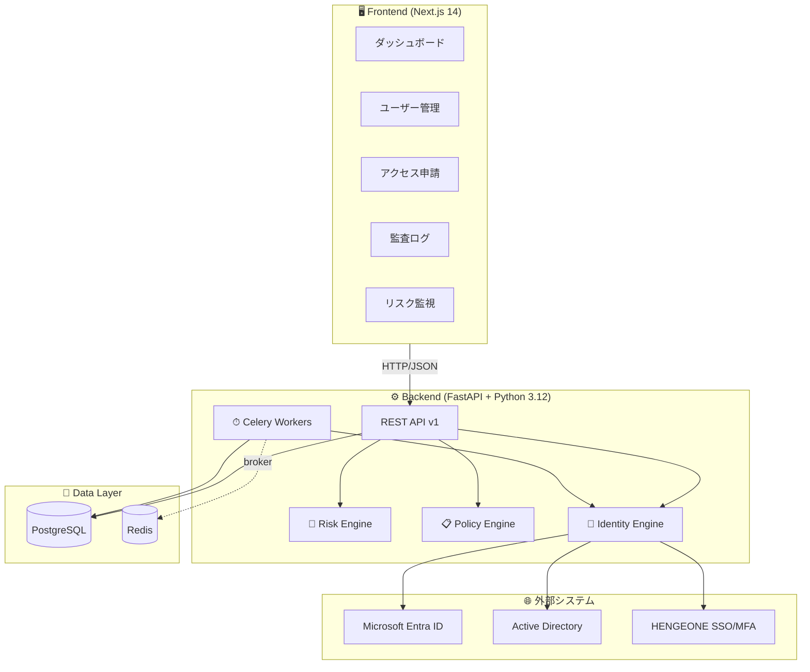
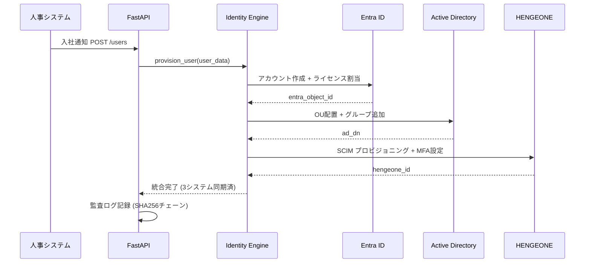
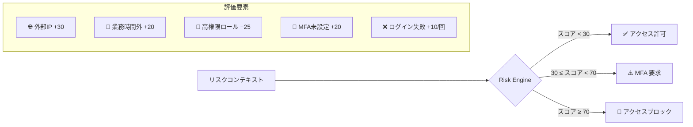
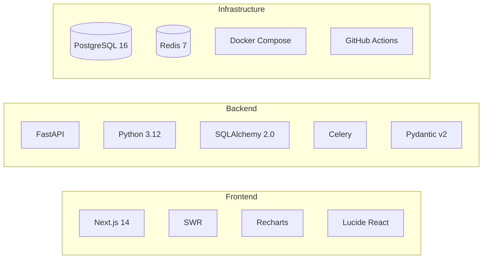
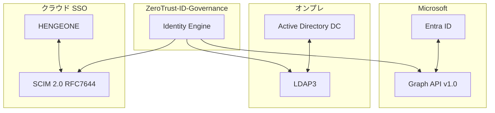

# 🔐 ZeroTrust-ID-Governance

> **EntraID Connect × HENGEONE × AD 統合アイデンティティ管理プラットフォーム**
> 建設業600名のユーザーライフサイクルをゼロトラスト原則で完全自動管理

[](https://github.com/Kensan196948G/ZeroTrust-ID-Governance/actions)
[](LICENSE)
[](docs/)
[](backend/)
[](frontend/)

---

## 🎯 概要

| 課題 | 解決策 |
|------|--------|
| 🔴 3システム（EntraID/AD/HENGEONE）でユーザー情報が乖離 | ✅ Identity Engine による統合プロビジョニング |
| 🔴 入社・異動・退職の手動対応（IT7名で月〜週単位の遅延） | ✅ Celery 非同期タスクで即時自動化 |
| 🔴 現場作業員・協力会社の一時アクセス制御が困難 | ✅ PIM 時限付き特権昇格 + リスクベースアクセス制御 |
| 🔴 監査証跡が分散・改ざんリスクあり | ✅ SHA256 チェーンハッシュ付き統合監査ログ |
| 🔴 MFA未設定ユーザーへの対応が後手 | ✅ リスクスコアエンジンによる自動ブロック/MFA強制 |

**準拠規格:** ISO27001 A.5.15〜A.8.2 ／ NIST CSF PROTECT PR.AA ／ ISO20000 アクセス管理

---

## 🏗 システムアーキテクチャ



---

## 🔄 3システム統合フロー



---

## ✨ 機能一覧

### 🔑 Identity Lifecycle Management (ILM)

| ID | 機能 | 説明 | 準拠 |
|----|------|------|------|
| ILM-001 | 入社プロビジョニング | 3システム同時アカウント作成・ライセンス割当 | ISO27001 A.5.18 |
| ILM-002 | 異動転換処理 | 所属・権限の自動変更 + 旧権限剥奪 | ISO27001 A.5.15 |
| ILM-003 | 退職デプロビジョニング | 即時全システムアクセス無効化 | ISO27001 A.5.19 |
| ILM-004 | 一時アクセス (PIM) | 協力会社・現場作業員の時限付き特権昇格 | NIST PR.AA-02 |
| ILM-005 | 四半期棚卸 | 全ユーザー権限整合性チェック + SoD違反検出 | ISO27001 A.5.15 |

### 🛡 MFA・認証強化

| ID | 機能 | 説明 |
|----|------|------|
| MFA-001 | リスクベース MFA 強制 | スコア30-70: MFA要求、70+: ブロック |
| MFA-002 | HENGEONE MFA 連携 | TOTP/プッシュ通知対応 |
| MFA-003 | 未設定ユーザー検出 | ダッシュボードでリアルタイム警告 |

### 📊 ガバナンス・監査

| ID | 機能 | 説明 |
|----|------|------|
| GOV-001 | SoD (職務分離) チェック | 申請者=承認者 禁止、競合ロール検出 |
| GOV-002 | 条件付きアクセスポリシー | GlobalAdmin: MFA + 準拠デバイス必須 |
| GOV-003 | アクセス申請ワークフロー | 申請→承認→自動プロビジョニング |
| AUD-001 | 改ざん防止監査ログ | SHA256チェーンハッシュ (ISO27001 A.5.28) |
| AUD-002 | リアルタイム監視 | 不審アクセス・異常ログイン検知 |

---

## 🎯 リスクスコアエンジン



---

## 🛠 技術スタック



| レイヤー | 技術 | バージョン | 用途 |
|----------|------|-----------|------|
| **Frontend** | Next.js | 14.2 | App Router, Server Components |
| | SWR | 2.2 | リアルタイムポーリング（15〜30秒） |
| | Recharts | 2.12 | リスクスコアグラフ |
| | Tailwind CSS | 3.4 | ダークテーマUI |
| **Backend** | FastAPI | 0.115 | 非同期REST API |
| | SQLAlchemy | 2.0 | 非同期ORM (FastAPI) + 同期 (Celery) |
| | Celery | 5.4 | 非同期プロビジョニングタスク |
| | Pydantic | 2.x | 型安全な設定管理 |
| **Protocol** | SCIM 2.0 | RFC 7644 | HENGEONE連携 |
| | MS Graph API | v1.0 | Entra ID管理 |
| | LDAP3 | 2.9 | Active Directory操作 |
| **Infrastructure** | PostgreSQL | 16 | メインDB |
| | Redis | 7 | Celeryブローカー + キャッシュ |
| | Docker Compose | 2.x | 開発環境 |
| | GitHub Actions | - | CI/CDパイプライン |

---

## 🚀 クイックスタート

### 前提条件

- Docker Desktop / Docker Engine 24+
- Docker Compose v2+
- Git

### 1. リポジトリクローン

```bash
git clone https://github.com/Kensan196948G/ZeroTrust-ID-Governance.git
cd ZeroTrust-ID-Governance
```

### 2. 環境変数設定

```bash
cp .env.example .env
# .env を編集して各システムの接続情報を設定
```

### 3. 起動

```bash
docker compose -f infrastructure/docker-compose.yml up -d
```

### 4. アクセス確認

| サービス | URL |
|----------|-----|
| 🖥 フロントエンド | http://localhost:3000 |
| ⚙ バックエンド API | http://localhost:8000 |
| 📚 API ドキュメント | http://localhost:8000/docs |
| 🌸 Flower (Celery) | http://localhost:5555 |
| 🗄 pgAdmin | http://localhost:5050 |

---

## 📚 API ドキュメント

### ユーザー管理

| メソッド | エンドポイント | 説明 |
|----------|---------------|------|
| `GET` | `/api/v1/users` | ユーザー一覧 |
| `POST` | `/api/v1/users` | ユーザー作成 (3システム同期) |
| `GET` | `/api/v1/users/{id}` | ユーザー詳細 |
| `PATCH` | `/api/v1/users/{id}` | ユーザー更新 |
| `DELETE` | `/api/v1/users/{id}` | ユーザー無効化 |

### アクセス申請

| メソッド | エンドポイント | 説明 |
|----------|---------------|------|
| `GET` | `/api/v1/access-requests` | 申請一覧 |
| `POST` | `/api/v1/access-requests` | 新規申請 |
| `GET` | `/api/v1/access-requests/pending` | 承認待ち一覧 |
| `PATCH` | `/api/v1/access-requests/{id}` | 承認/却下 |

### 監査・リスク

| メソッド | エンドポイント | 説明 |
|----------|---------------|------|
| `GET` | `/api/v1/audit-logs` | 監査ログ一覧 |
| `POST` | `/api/v1/risk/evaluate` | リスクスコア評価 |
| `GET` | `/api/v1/health` | システムヘルスチェック |

---

## 🔗 外部システム連携



| システム | プロトコル | 主な操作 |
|----------|----------|---------|
| **Microsoft Entra ID** | MS Graph API v1.0 | アカウント作成/削除、ライセンス割当、グループ管理、条件付きアクセス |
| **Active Directory** | LDAP3 | OU配置、グループ追加、パスワードリセット、アカウント有効化/無効化 |
| **HENGEONE** | SCIM 2.0 (RFC 7644) | ユーザープロビジョニング、MFA設定、SSO設定 |

---

## 🔒 セキュリティ・コンプライアンス

### ISO27001 対応マッピング

| 管理策 | 説明 | 実装 |
|--------|------|------|
| A.5.15 | アクセス制御 | RBAC/ABAC ポリシーエンジン |
| A.5.16 | アイデンティティ管理 | 3システム統合 Identity Engine |
| A.5.18 | アクセス権のプロビジョニング | 自動プロビジョニング (Celery) |
| A.5.19 | 供給者のアクセス管理 | 協力会社 PIM 時限アクセス |
| A.5.28 | 証拠の収集 | SHA256 チェーンハッシュ監査ログ |
| A.8.2 | 特権アクセス権 | PIM + SoD チェック |

### NIST CSF 対応

| カテゴリ | ID | 実装 |
|----------|-----|------|
| PROTECT | PR.AA-01 | 認証 (MFA強制) |
| PROTECT | PR.AA-02 | 認可 (RBAC/ABAC) |
| PROTECT | PR.AA-03 | アイデンティティプルーフィング |
| PROTECT | PR.AA-05 | 最小権限・職務分離 |
| DETECT | DE.AE-02 | 異常アクティビティ検知 |

---

## 🧪 テスト

```bash
cd backend
pip install -r requirements-dev.txt
pytest --cov=. --cov-report=term-missing
```

| テストスイート | カバレッジ目標 | 内容 |
|---------------|-------------|------|
| Risk Engine | ≥90% | 境界値テスト、スコアクランプ |
| Policy Engine | ≥85% | SoD違反、条件付きアクセス |
| Identity Engine | ≥80% | プロビジョニング統合テスト |
| API endpoints | ≥75% | CRUD、承認ワークフロー |

---

## 📁 ディレクトリ構成

```
ZeroTrust-ID-Governance/
├── 📂 backend/              # FastAPI バックエンド
│   ├── api/v1/             # REST API エンドポイント
│   ├── core/               # 設定・DB・ミドルウェア
│   ├── engine/             # コアエンジン
│   │   ├── risk_engine.py   # リスクスコア評価
│   │   ├── identity_engine.py # 3システム統合
│   │   └── policy_engine.py # RBAC/ABAC/SoD
│   ├── models/             # SQLAlchemy モデル
│   ├── tasks/              # Celery 非同期タスク
│   └── tests/              # pytest テストスイート
├── 📂 frontend/             # Next.js 14 フロントエンド
│   └── src/
│       ├── app/            # App Router ページ
│       │   └── (dashboard)/ # ダッシュボードレイアウト
│       ├── components/     # 再利用可能コンポーネント
│       └── lib/            # API クライアント・型定義
├── 📂 infrastructure/       # Docker/DB 設定
│   ├── docker-compose.yml  # 開発環境定義
│   └── init.sql            # DB初期化スクリプト
├── 📂 scripts/              # 自動化スクリプト
│   ├── project-sync.sh     # GitHub Projects 同期
│   ├── create-issue.sh     # Issue 自動生成
│   └── create-pr.sh        # PR 自動生成
├── 📂 .github/workflows/    # GitHub Actions CI/CD
│   └── claudeos-ci.yml     # STABLE評価ゲート
└── 📂 docs/                 # ドキュメント・要件定義
```

---

## 👥 Agent Teams (ClaudeOS v4)

本プロジェクトは ClaudeOS v4 Kernel による自律開発で構築されています。

| ロール | 責務 |
|--------|------|
| 🧑‍💼 CTO | 優先順位判断・8時間終了時の最終判断 |
| 🏗 Architect | アーキテクチャ設計・責務分離・構造改善 |
| 💻 Developer | 実装・修正・修復 |
| 🔍 Reviewer | コード品質・保守性・差分確認 |
| 🧪 QA | テスト・回帰確認・品質評価 |
| 🔒 Security | secrets・権限・脆弱性確認 |
| ⚙ DevOps | CI/CD・PR・Projects・Deploy Gate 制御 |

---

## 📄 ライセンス

MIT License - [LICENSE](LICENSE)

---

*🤖 Built with [ClaudeOS v4](https://claude.ai/claude-code) × GitHub Actions*
