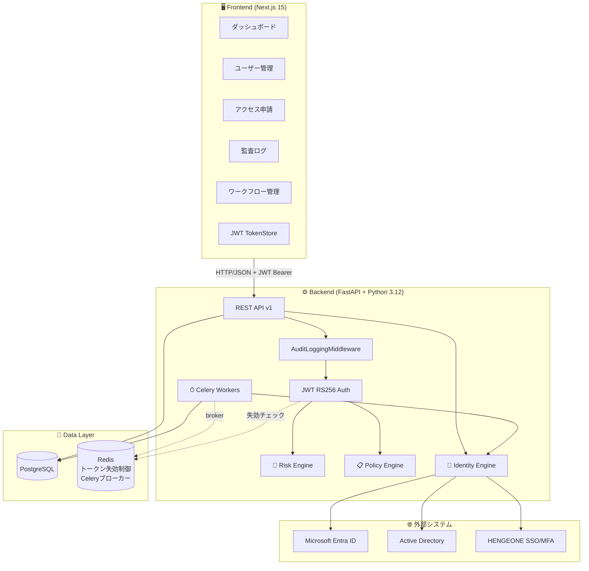
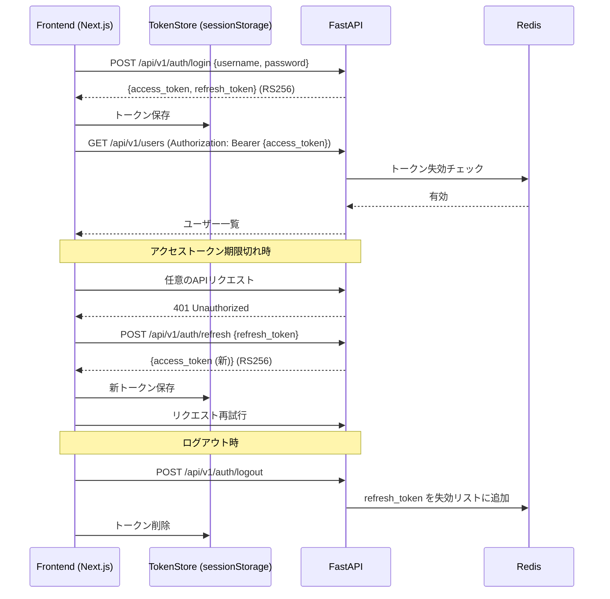
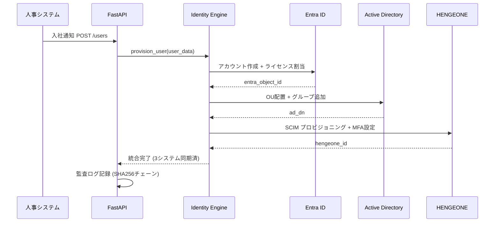
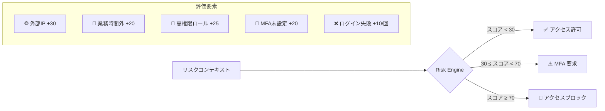
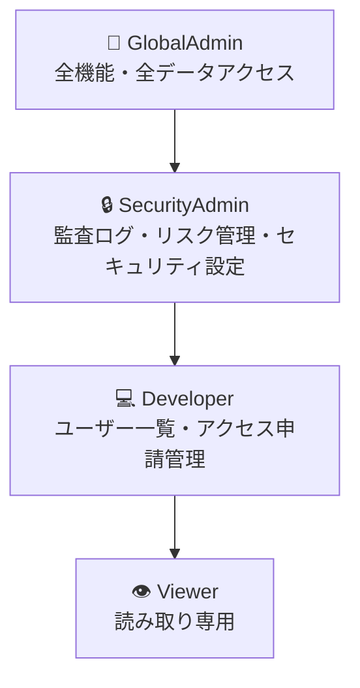
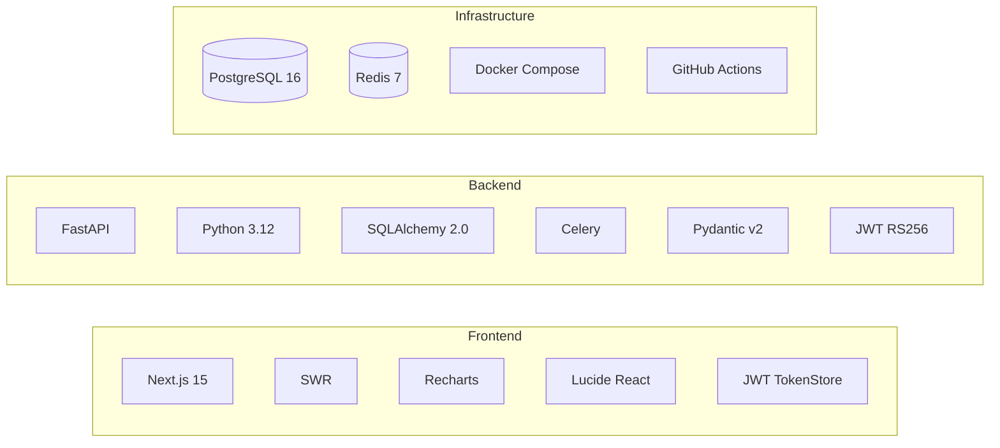
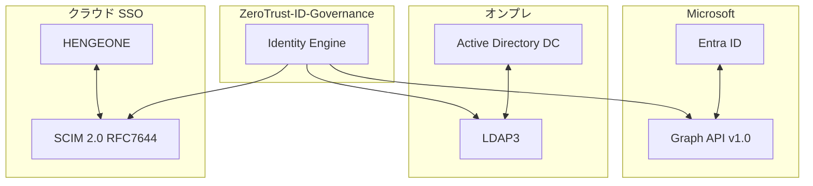
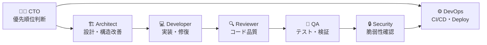

# 🔐 ZeroTrust-ID-Governance

> **EntraID Connect × HENGEONE × AD 統合アイデンティティ管理プラットフォーム**
> 建設業600名のユーザーライフサイクルをゼロトラスト原則で完全自動管理

[](https://github.com/Kensan196948G/ZeroTrust-ID-Governance/actions)
[](backend/)
[](LICENSE)
[](docs/)
[](backend/)
[](frontend/)
[](backend/tests/)
[](frontend/)
[](frontend/tests/)
[](docs/)

---

## 🎯 概要

| 課題 | 解決策 |
|------|--------|
| 🔴 3システム（EntraID/AD/HENGEONE）でユーザー情報が乖離 | ✅ Identity Engine による統合プロビジョニング |
| 🔴 入社・異動・退職の手動対応（IT7名で月〜週単位の遅延） | ✅ Celery 非同期タスクで即時自動化 |
| 🔴 現場作業員・協力会社の一時アクセス制御が困難 | ✅ PIM 時限付き特権昇格 + リスクベースアクセス制御 |
| 🔴 監査証跡が分散・改ざんリスクあり | ✅ SHA256 チェーンハッシュ付き統合監査ログ |
| 🔴 MFA未設定ユーザーへの対応が後手 | ✅ リスクスコアエンジンによる自動ブロック/MFA強制 |
| 🔴 フロントエンドが認証なしでAPIを呼び出せる | ✅ JWT RS256 + 自動トークンリフレッシュ統合 |

**準拠規格:** ISO27001 A.5.15〜A.8.2 ／ NIST CSF PROTECT PR.AA ／ ISO20000 アクセス管理

---

## 📊 開発フェーズ完了状況

| フェーズ | 内容 | ステータス | 主な成果 |
|----------|------|-----------|---------|
| **Phase 1** | 基盤構築 | ✅ 完了 | FastAPI + PostgreSQL + Redis + Docker |
| **Phase 2** | コアエンジン実装 | ✅ 完了 | Risk Engine / Policy Engine / Identity Engine |
| **Phase 3** | REST API 実装 | ✅ 完了 | ユーザー・アクセス申請・監査ログ CRUD |
| **Phase 4** | テスト基盤整備 | ✅ 完了 | pytest 191件、CRUD・ワークフロー統合テスト |
| **Phase 5** | セキュリティ強化 | ✅ 完了 | SQLインジェクション対策、入力バリデーション強化 |
| **Phase 6** | 監査ログ中間層 | ✅ 完了 | AuditLoggingMiddleware（ISO27001 A.8.15 準拠） |
| **Phase 7** | JWT 認証基盤 | ✅ 完了 | RS256 署名・リフレッシュトークン・Redis 失効制御 |
| **Phase 8** | RBAC 細粒化 | ✅ 完了 | Viewer/Developer/SecurityAdmin/GlobalAdmin 4段階 |
| **Phase 9** | エンジンカバレッジ | ✅ 完了 | Identity Engine 0%→94%、全体カバレッジ 83%→85% |
| **Phase 10** | フロントエンド JWT 統合 | ✅ 完了 | 全ページ・ウィジェットを JWT 認証 API に統一 |
| **Phase 11** | README 刷新 | ✅ 完了 | アーキテクチャ図・RBAC 表・JWT フロー追加 |
| **Phase 12** | Celery タスクカバレッジ | ✅ 完了 | 非同期タスクテスト追加・全体カバレッジ 94% |
| **Phase 13** | テストカバレッジ強化 | ✅ 完了 | entra_connector/auth/audit_middleware 100%・全体 96% |
| **Phase 14** | セキュリティミドルウェア | ✅ 完了 | HSTS/CSP/レート制限・セキュリティヘッダー 15項目実装 |
| **Phase 15** | E2E テスト統合 | ✅ 完了 | Playwright（フロントエンド）+ Newman（API）CI統合 |
| **Phase 16** | フロントエンド単体テスト基盤 | ✅ 完了 | Vitest + React Testing Library 33テスト・CI Node.js 22/24対応 |
| **Phase 17** | フロントエンド追加テスト | ✅ 完了 | PendingRequestsWidget・Sidebar・5ページコンポーネント 88テスト (#41) |
| **Phase 18** | バックエンドカバレッジ完全制覇 | ✅ 完了 | token_store/workflows/auth/models 完全カバー・97%→99% (+47テスト) |
| **Phase 19** | フロントエンドカバレッジ計測基盤 | ✅ 完了 | Vitest coverage-v8・除外設定最適化・81% Stmts / 90% Branch (#45) |
| **Phase 20** | lib/api.ts テスト完全制覇 | ✅ 完了 | 19.81%→100% Stmts・140テスト・全体 96.31% (#46) |
| **Phase 21a** | Next.js セキュリティ修正 | ✅ 完了 | GHSA-f82v-jwr5-mffw (CVSS 9.1) 解消・14.2.5→14.2.35 (#47) |
| **Phase 21b** | バックエンドカバレッジ完全制覇 | ✅ 完了 | Celery+Identity Engine 100%・99%→99.5%・+11テスト (#47) |
| **Phase 22** | フロントエンドカバレッジ向上 | ✅ 完了 | 96.31%→98.79% Stmts・+8テスト・148件 (#48) |
| **Phase 23** | App Router ストリーミング最適化 | ✅ 完了 | loading.tsx / error.tsx 追加・+13テスト・161件・98.87% (#49) |
| **Phase 24** | Next.js セキュリティアップグレード | ✅ 完了 | 14.2.35→15.5.14・High×4件解消・本番脆弱性0件 (#50) |
| **Docs** | 包括的ドキュメント整備 | ✅ 完了 | 12フォルダ・60ファイル・全仕様書体系 |

---

## 🏗 システムアーキテクチャ



---

## 🔐 JWT 認証フロー



---

## 🔄 3システム統合フロー



---

## ✨ 機能一覧

### 🔑 Identity Lifecycle Management (ILM)

| ID | 機能 | 説明 | 準拠 |
|----|------|------|------|
| ILM-001 | 入社プロビジョニング | 3システム同時アカウント作成・ライセンス割当 | ISO27001 A.5.18 |
| ILM-002 | 異動転換処理 | 所属・権限の自動変更 + 旧権限剥奪 | ISO27001 A.5.15 |
| ILM-003 | 退職デプロビジョニング | 即時全システムアクセス無効化 | ISO27001 A.5.19 |
| ILM-004 | 一時アクセス (PIM) | 協力会社・現場作業員の時限付き特権昇格 | NIST PR.AA-02 |
| ILM-005 | 四半期棚卸 | 全ユーザー権限整合性チェック + SoD違反検出 | ISO27001 A.5.15 |

### 🛡 MFA・認証強化

| ID | 機能 | 説明 |
|----|------|------|
| MFA-001 | リスクベース MFA 強制 | スコア30-70: MFA要求、70+: ブロック |
| MFA-002 | HENGEONE MFA 連携 | TOTP/プッシュ通知対応 |
| MFA-003 | 未設定ユーザー検出 | ダッシュボードでリアルタイム警告 |

### 📊 ガバナンス・監査

| ID | 機能 | 説明 |
|----|------|------|
| GOV-001 | SoD (職務分離) チェック | 申請者=承認者 禁止、競合ロール検出 |
| GOV-002 | 条件付きアクセスポリシー | GlobalAdmin: MFA + 準拠デバイス必須 |
| GOV-003 | アクセス申請ワークフロー | 申請→承認→自動プロビジョニング |
| AUD-001 | 改ざん防止監査ログ | SHA256チェーンハッシュ (ISO27001 A.5.28) |
| AUD-002 | リアルタイム監視 | 不審アクセス・異常ログイン検知 |

---

## 🎯 リスクスコアエンジン



---

## 🔑 RBAC 権限レベル



| ロール | ユーザー管理 | アクセス申請 | 監査ログ | ワークフロー | ロール管理 |
|--------|------------|------------|---------|------------|---------|
| **GlobalAdmin** | ✅ 全操作 | ✅ 全操作 | ✅ 検索含む | ✅ 全実行 | ✅ |
| **SecurityAdmin** | ✅ 参照・更新 | ✅ 承認・却下 | ✅ 検索含む | ✅ セキュリティ系 | ❌ |
| **Developer** | ✅ 一覧・参照 | ✅ 申請・参照 | ✅ 参照のみ | ✅ 実行 | ❌ |
| **Viewer** | 👁 参照のみ | 👁 参照のみ | 👁 参照のみ | ❌ | ❌ |

---

## 🛠 技術スタック



| レイヤー | 技術 | バージョン | 用途 |
|----------|------|-----------|------|
| **Frontend** | Next.js | 15.5 | App Router, Server Components |
| | SWR | 2.2 | リアルタイムポーリング（15〜30秒） |
| | Recharts | 2.12 | リスクスコアグラフ |
| | Tailwind CSS | 3.4 | ダークテーマUI |
| **Backend** | FastAPI | 0.115 | 非同期REST API |
| | SQLAlchemy | 2.0 | 非同期ORM (FastAPI) + 同期 (Celery) |
| | Celery | 5.4 | 非同期プロビジョニングタスク |
| | Pydantic | 2.x | 型安全な設定管理 |
| | PyJWT | 2.x | JWT RS256 署名・検証 |
| **Protocol** | SCIM 2.0 | RFC 7644 | HENGEONE連携 |
| | MS Graph API | v1.0 | Entra ID管理 |
| | LDAP3 | 2.9 | Active Directory操作 |
| **Infrastructure** | PostgreSQL | 16 | メインDB |
| | Redis | 7 | Celeryブローカー + JWT失効制御 |
| | Docker Compose | 2.x | 開発環境 |
| | GitHub Actions | - | CI/CDパイプライン |

---

## 🚀 クイックスタート

### 前提条件

- Docker Desktop / Docker Engine 24+
- Docker Compose v2+
- Git

### 1. リポジトリクローン

```bash
git clone https://github.com/Kensan196948G/ZeroTrust-ID-Governance.git
cd ZeroTrust-ID-Governance
```

### 2. 環境変数設定

```bash
cp .env.example .env
# .env を編集して各システムの接続情報を設定
```

### 3. 起動

```bash
docker compose -f infrastructure/docker-compose.yml up -d
```

### 4. アクセス確認

| サービス | URL |
|----------|-----|
| 🖥 フロントエンド | http://localhost:3000 |
| ⚙ バックエンド API | http://localhost:8000 |
| 📚 API ドキュメント | http://localhost:8000/docs |
| 🌸 Flower (Celery) | http://localhost:5555 |
| 🗄 pgAdmin | http://localhost:5050 |

---

## 📚 API ドキュメント

### 🔐 認証

| メソッド | エンドポイント | 説明 |
|----------|---------------|------|
| `POST` | `/api/v1/auth/login` | ログイン (JWT発行) |
| `POST` | `/api/v1/auth/refresh` | アクセストークンリフレッシュ |
| `POST` | `/api/v1/auth/logout` | ログアウト (Redis失効登録) |

### ユーザー管理

| メソッド | エンドポイント | 説明 | 必要ロール |
|----------|---------------|------|-----------|
| `GET` | `/api/v1/users` | ユーザー一覧 | Developer以上 |
| `POST` | `/api/v1/users` | ユーザー作成 (3システム同期) | SecurityAdmin以上 |
| `GET` | `/api/v1/users/{id}` | ユーザー詳細 | Developer以上 |
| `PATCH` | `/api/v1/users/{id}` | ユーザー更新 | SecurityAdmin以上 |
| `DELETE` | `/api/v1/users/{id}` | ユーザー無効化 | GlobalAdmin |

### アクセス申請

| メソッド | エンドポイント | 説明 | 必要ロール |
|----------|---------------|------|-----------|
| `GET` | `/api/v1/access-requests` | 申請一覧 | Developer以上 |
| `POST` | `/api/v1/access-requests` | 新規申請 | Developer以上 |
| `GET` | `/api/v1/access-requests/pending` | 承認待ち一覧 | Developer以上 |
| `PATCH` | `/api/v1/access-requests/{id}` | 承認/却下 | SecurityAdmin以上 |

### 監査・リスク

| メソッド | エンドポイント | 説明 | 必要ロール |
|----------|---------------|------|-----------|
| `GET` | `/api/v1/audit-logs` | 監査ログ一覧 | SecurityAdmin以上 |
| `GET` | `/api/v1/audit-logs/search` | 監査ログ検索 | SecurityAdmin以上 |
| `POST` | `/api/v1/risk/evaluate` | リスクスコア評価 | Developer以上 |
| `GET` | `/api/v1/health` | システムヘルスチェック | 認証不要 |

---

## 🔗 外部システム連携



| システム | プロトコル | 主な操作 |
|----------|----------|---------|
| **Microsoft Entra ID** | MS Graph API v1.0 | アカウント作成/削除、ライセンス割当、グループ管理、条件付きアクセス |
| **Active Directory** | LDAP3 | OU配置、グループ追加、パスワードリセット、アカウント有効化/無効化 |
| **HENGEONE** | SCIM 2.0 (RFC 7644) | ユーザープロビジョニング、MFA設定、SSO設定 |

---

## 🔒 セキュリティ・コンプライアンス

### ISO27001 対応マッピング

| 管理策 | 説明 | 実装 |
|--------|------|------|
| A.5.15 | アクセス制御 | RBAC/ABAC ポリシーエンジン |
| A.5.16 | アイデンティティ管理 | 3システム統合 Identity Engine |
| A.5.18 | アクセス権のプロビジョニング | 自動プロビジョニング (Celery) |
| A.5.19 | 供給者のアクセス管理 | 協力会社 PIM 時限アクセス |
| A.5.28 | 証拠の収集 | SHA256 チェーンハッシュ監査ログ |
| A.8.2 | 特権アクセス権 | PIM + SoD チェック |
| A.8.15 | ログの取得 | AuditLoggingMiddleware 全 API 自動記録 |

### NIST CSF 対応

| カテゴリ | ID | 実装 |
|----------|-----|------|
| PROTECT | PR.AA-01 | 認証 (JWT RS256 + MFA強制) |
| PROTECT | PR.AA-02 | 認可 (RBAC/ABAC + 4段階ロール) |
| PROTECT | PR.AA-03 | アイデンティティプルーフィング |
| PROTECT | PR.AA-05 | 最小権限・職務分離 |
| DETECT | DE.AE-02 | 異常アクティビティ検知 |

---

## 🧪 テスト・品質

```bash
cd backend
pip install -r requirements-dev.txt
pytest --cov=. --cov-report=term-missing
```

### 📈 カバレッジ実績

| テストスイート | カバレッジ実績 | テスト件数 | 内容 |
|---------------|-------------|---------|------|
| **Risk Engine** | 🟢 **100%** | 18件 | 境界値テスト、スコアクランプ、決定木 |
| **Policy Engine** | 🟢 **100%** | 22件 | SoD違反 if/elif 両ブランチ、条件付きアクセス、ABAC |
| **Identity Engine** | 🟢 **100%** | 22件 | プロビジョニング統合テスト・例外パス（Phase 21b） |
| **API endpoints** | 🟢 **99%** | 116件 | CRUD・ワークフロー・認証・セキュリティヘッダー |
| **RBAC** | 🟢 **90%** | 12件 | ロール別エンドポイントアクセス制御 |
| **Celery Tasks** | 🟢 **100%** | 30件 | 非同期タスク・broker例外リトライパス（Phase 21b） |
| **Auth (JWT)** | 🟢 **100%** | 31件 | JWT RS256・リフレッシュ・失効・test-login |
| **Audit Middleware** | 🟢 **100%** | 22件 | SHA256チェーン・監査ログ記録 |
| **Token Store** | 🟢 **100%** | 12件 | Redis JWT ブラックリスト・フェイルオープン |
| **Workflows API** | 🟢 **100%** | 9件 | Celery失敗 except ブランチ・ロール制御 |
| **Models** | 🟢 **100%** | 8件 | __repr__ / compute_hash 全カバー |
| **E2E (Newman)** | — | 全APIエンドポイント | Postman/Newman バックエンドAPI |
| **E2E (Playwright)** | — | 認証/ナビゲーション/ページ遷移 | フロントエンド E2E |
| **フロントエンド Components** | 🟢 **99.6%** | 88件 | Vitest + React Testing Library（Phase 19） |
| **フロントエンド 全体** | 🟢 **98.87%** | 161件 | loading.tsx/error.tsx 追加・98.87% Stmts・92.78% Branch（Phase 23） |
| **全体バックエンド** | 🟢 **99.5%** | **331件** | Phase 21b 完了（Celery+Identity Engine 100%） |

---

## 📁 ディレクトリ構成

```
ZeroTrust-ID-Governance/
├── 📂 backend/              # FastAPI バックエンド
│   ├── api/v1/             # REST API エンドポイント
│   │   ├── auth.py          # JWT認証 (login/refresh/logout)
│   │   ├── users.py         # ユーザー管理 CRUD
│   │   ├── access.py        # アクセス申請ワークフロー
│   │   ├── audit.py         # 監査ログ取得・検索
│   │   └── workflows.py     # ILM/PIM/Security ワークフロー
│   ├── core/               # 設定・DB・ミドルウェア
│   │   ├── auth.py          # JWT RS256 + RBAC require_any_role
│   │   ├── security.py      # パスワードハッシュ・トークン管理
│   │   └── audit_middleware.py # AuditLoggingMiddleware
│   ├── engine/             # コアエンジン
│   │   ├── risk_engine.py   # リスクスコア評価 (98% coverage)
│   │   ├── identity_engine.py # 3システム統合 (94% coverage)
│   │   └── policy_engine.py # RBAC/ABAC/SoD (95% coverage)
│   ├── models/             # SQLAlchemy モデル
│   ├── tasks/              # Celery 非同期タスク
│   └── tests/              # pytest テストスイート (191件)
├── 📂 frontend/             # Next.js 15 フロントエンド
│   └── src/
│       ├── app/            # App Router ページ
│       │   └── (dashboard)/ # ダッシュボードレイアウト
│       │       ├── dashboard/ # KPI・システム状態・監査ログ
│       │       ├── users/     # ユーザー管理
│       │       ├── access-requests/ # アクセス申請承認
│       │       ├── audit/     # 監査ログ閲覧・CSV出力
│       │       └── workflows/ # ILM/PIM/Securityワークフロー
│       ├── components/     # 再利用可能コンポーネント
│       └── lib/
│           └── api.ts       # JWT 統合 API クライアント
├── 📂 infrastructure/       # Docker/DB 設定
│   ├── docker-compose.yml  # 開発環境定義
│   └── init.sql            # DB初期化スクリプト
├── 📂 scripts/              # 自動化スクリプト
│   ├── project-sync.sh     # GitHub Projects 同期
│   ├── create-issue.sh     # Issue 自動生成
│   └── create-pr.sh        # PR 自動生成
├── 📂 .github/workflows/    # GitHub Actions CI/CD
│   └── claudeos-ci.yml     # STABLE評価ゲート
└── 📂 docs/                 # ドキュメント体系（12フォルダ・60ファイル）
    ├── 01_要件定義（Requirements）/          # システム・機能・非機能・セキュリティ要件
    ├── 02_アーキテクチャ設計（Architecture）/  # バックエンド・フロントエンド・DB・インフラ設計
    ├── 03_API仕様（API_Specification）/      # 全APIエンドポイント詳細仕様（7ファイル）
    ├── 04_開発ガイド（Development_Guide）/    # 環境構築・コーディング規約・CI手順
    ├── 05_セキュリティ設計（Security_Design）/ # 脅威モデル・暗号化・脆弱性管理
    ├── 06_統合設計（Integration_Design）/    # EntraID/AD/HENGEONE 連携仕様
    ├── 07_テスト仕様（Testing）/             # テスト戦略・E2E仕様
    ├── 08_データモデル（Data_Model）/        # ER図・スキーマ定義
    ├── 09_運用保守（Operations）/            # 運用手順・監視・障害対応
    ├── 10_プロジェクト管理（Project_Management）/ # 計画・進捗・品質管理
    ├── 11_コンプライアンス（Compliance）/    # ISO27001・NIST CSF・個人情報保護
    └── 12_リリース管理（Release_Management）/ # リリースプロセス・バージョン戦略・ロールバック
```

---

## 👥 Agent Teams (ClaudeOS v4)

本プロジェクトは ClaudeOS v4 Kernel による自律開発で構築されています。



| ロール | 責務 |
|--------|------|
| 🧑‍💼 CTO | 優先順位判断・8時間終了時の最終判断 |
| 🏗 Architect | アーキテクチャ設計・責務分離・構造改善 |
| 💻 Developer | 実装・修正・修復 |
| 🔍 Reviewer | コード品質・保守性・差分確認 |
| 🧪 QA | テスト・回帰確認・品質評価 |
| 🔒 Security | secrets・権限・脆弱性確認 |
| ⚙ DevOps | CI/CD・PR・Projects・Deploy Gate 制御 |

---

## 📄 ライセンス

MIT License - [LICENSE](LICENSE)

---

---

## 📊 プロジェクト品質サマリー

| 指標 | 値 | 達成フェーズ |
|------|-----|-----------|
| バックエンド単体テスト | **331件 PASS** | Phase 21b |
| テストカバレッジ | **99.5%** | Phase 21b |
| フロントエンド単体テスト | **161件 PASS** | Phase 23 |
| フロントエンドカバレッジ | **98.87% Stmts / 92.78% Branch** | Phase 23 |
| E2E テスト | Playwright + Newman | Phase 15 |
| CI 成功率 | **100%**（連続 N=3 STABLE） | Phase 21 |
| セキュリティヘッダー | **15項目**（HSTS/CSP/等） | Phase 14 |
| レート制限 | ログイン 5回/分、API 100回/分 | Phase 14 |
| 監査ログイベント種別 | **28種類** | Phase 13 |
| ドキュメント | **60ファイル**（12カテゴリ） | Docs |
| コンプライアンス準拠 | ISO27001 / NIST CSF / ISO20000 | 設計完了 |

---

*🤖 Built with [ClaudeOS v4](https://claude.ai/claude-code) × GitHub Actions — Phase 1〜15 完了・STABLE N=3 達成*
