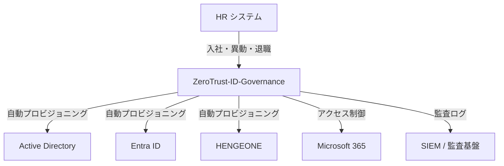

# システム要件定義書（System Requirements）

| 項目 | 内容 |
|------|------|
| **文書番号** | REQ-SYS-001 |
| **バージョン** | 1.0.0 |
| **作成日** | 2026-03-25 |
| **対象システム** | ZeroTrust-ID-Governance |
| **準拠規格** | ISO27001 A.5.15〜A.8.2 / NIST CSF 2.0 PR.AA |

---

## 1. システム概要

### 1.1 プロジェクト背景

みらい建設工業（従業員600名、IT部門7名）では、以下の既存システムが混在したハイブリッドID管理環境が構築されている。

| システム | 種別 | 役割 |
|---------|------|------|
| Active Directory (AD) | オンプレミス | ファイルサーバ・業務システム認証 |
| Microsoft Entra ID Connect | クラウド | オンプレミスADとクラウドのハイブリッド同期 |
| HENGEONE | クラウド SSO/MFA | シングルサインオン・多要素認証 |
| Microsoft 365 / Exchange Online | クラウド | メール・コラボレーション |

### 1.2 解決すべき課題

- ✗ アカウントの増減（入退社・異動）に対する対応が手動・属人的
- ✗ 特権アカウントの管理が不十分（棚卸頻度・承認フロー未整備）
- ✗ ゼロトラスト原則に基づくアクセス可視化ができていない
- ✗ ISO27001・NIST CSF 2.0への準拠証跡が整備されていない

---

## 2. システム目的

ゼロトラスト原則（Never Trust, Always Verify）に基づき、EntraID・HENGEONE・AD を統合した **単一のアイデンティティガバナンス基盤** を構築する。

---

## 3. 対象スコープ

### 3.1 対象システム

| 対象 | 種別 | 優先度 |
|------|------|--------|
| Active Directory | オンプレミス | 必須 |
| Microsoft Entra ID | クラウド (Azure) | 必須 |
| HENGEONE | クラウド SSO/MFA | 必須 |
| Microsoft 365 | クラウド | 必須 |
| ファイルサーバ | オンプレミス | 推奨 |
| DeskNet's NEO / AppSuite | オンプレミス | 将来対応 |

### 3.2 対象ユーザー

| 種別 | 人数 | 備考 |
|------|------|------|
| 正社員・嘱託社員（本社・現場） | 約500名 | 全員対象 |
| 協力会社・パートナー（外部アカウント） | 約100名 | 有効期限付き |
| ITシステム管理者（特権アカウント） | 7名 | PIM 対象 |

### 3.3 スコープ外

- 建設現場IoTデバイス（Construction-SIEM-Platformで対応）
- 財務システム（既存ベンダー管理）

---

## 4. システム要件一覧

### 4.1 アイデンティティライフサイクル管理

| 要件ID | 要件名 | 優先度 |
|--------|--------|--------|
| ILM-001 | 入社時自動プロビジョニング | 必須 |
| ILM-002 | 異動時ロール自動更新 | 必須 |
| ILM-003 | 退職時自動デプロビジョニング | 必須 |
| ILM-004 | 外部委託先アカウント管理 | 必須 |
| ILM-005 | アカウント棚卸ワークフロー | 必須 |

### 4.2 認証・アクセス制御

| 要件ID | 要件名 | 優先度 |
|--------|--------|--------|
| AUTH-001 | JWT ベース認証（アクセス/リフレッシュトークン） | 必須 |
| AUTH-002 | トークンリボケーション（Redis ブラックリスト） | 必須 |
| AUTH-003 | RBAC（ロールベースアクセス制御） | 必須 |
| AUTH-004 | 多要素認証（HENGEONE 経由） | 必須 |
| AUTH-005 | セッションタイムアウト管理 | 必須 |

### 4.3 監査・コンプライアンス

| 要件ID | 要件名 | 優先度 |
|--------|--------|--------|
| AUD-001 | 全操作の監査ログ記録 | 必須 |
| AUD-002 | ログの改ざん防止（ハッシュチェーン） | 必須 |
| AUD-003 | ISO27001 準拠レポート出力 | 必須 |
| AUD-004 | NIST CSF 対応マッピング | 推奨 |
| AUD-005 | リアルタイムアラート | 推奨 |

---

## 5. 品質要件

| 品質属性 | 要件値 |
|---------|--------|
| 可用性 | 99.9%（月間ダウンタイム 43分以内） |
| レスポンスタイム | API 95th パーセンタイル 500ms 以内 |
| スループット | 100 req/sec |
| セキュリティ | OWASP Top 10 対策必須 |
| テストカバレッジ | 90% 以上 |

---

## 6. 制約条件

- Python 3.11 / FastAPI / PostgreSQL / Redis 使用
- Next.js 14 フロントエンド
- Docker コンテナ化必須
- CI/CD は GitHub Actions
- main ブランチへの直接 push 禁止
