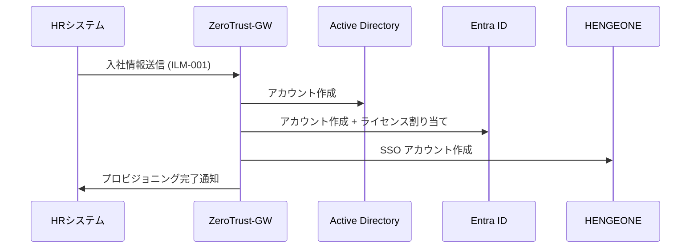
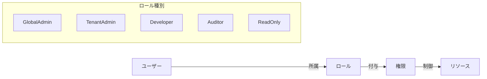
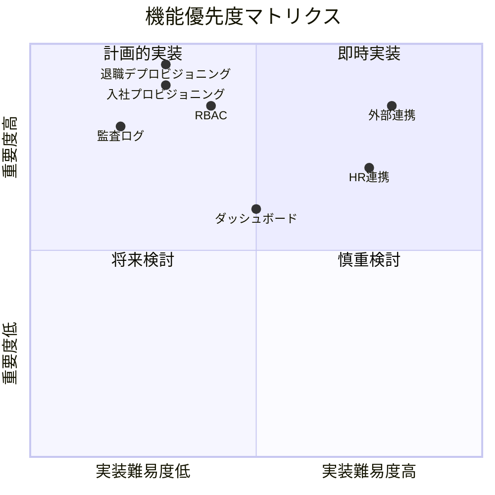

# 機能要件書（Functional Requirements）

| 項目 | 内容 |
|------|------|
| **文書番号** | REQ-FUNC-001 |
| **バージョン** | 1.0.0 |
| **作成日** | 2026-03-25 |
| **準拠** | ISO27001 A.5.15 / NIST CSF PR.AA-01〜06 |

---

## 1. アイデンティティライフサイクル管理（ILM）

### 1.1 プロビジョニング

| 機能ID | 機能名 | 詳細 | 受け入れ基準 |
|--------|--------|------|------------|
| F-ILM-001 | 入社プロビジョニング | HR 連携で AD/EntraID/HENGEONE にアカウント自動作成 | 入社日当日 09:00 までに全サービス有効化 |
| F-ILM-002 | 異動ロール更新 | 組織変更に伴うアクセス権の自動再計算・変更 | 異動日 00:00 に適用完了 |
| F-ILM-003 | 退職デプロビジョニング | 退職日当日の全サービスアカウント無効化 | 退職日 23:59 までに全無効化 |
| F-ILM-004 | 外部委託先管理 | 有効期限付き外部アカウント・アクセス範囲制限 | 期限切れ後 1 時間以内に自動無効化 |
| F-ILM-005 | アカウント棚卸 | 四半期ごとの全アカウント棚卸・承認ワークフロー | 90 日以内に全アカウント棚卸完了 |

### 1.2 ユーザー管理 API

| エンドポイント | メソッド | 説明 |
|--------------|---------|------|
| `/api/v1/users` | GET | ユーザー一覧取得（フィルター・ページング） |
| `/api/v1/users` | POST | ユーザー新規作成 |
| `/api/v1/users/{id}` | GET | ユーザー詳細取得 |
| `/api/v1/users/{id}` | PUT | ユーザー情報更新 |
| `/api/v1/users/{id}` | DELETE | ユーザー削除（論理削除） |

---

## 2. アクセス権管理

### 2.1 ロールベースアクセス制御（RBAC）

| 機能ID | 機能名 | 詳細 |
|--------|--------|------|
| F-RBAC-001 | ロール定義管理 | ロール作成・編集・削除 |
| F-RBAC-002 | ロール割り当て | ユーザーへのロール割り当て・取消 |
| F-RBAC-003 | 権限継承 | 階層ロールによる権限継承 |
| F-RBAC-004 | 最小権限原則 | デフォルト最小権限での運用 |

### 2.2 アクセス申請ワークフロー

| 機能ID | 機能名 | 詳細 |
|--------|--------|------|
| F-WF-001 | アクセス申請 | ユーザーによるアクセス権申請 |
| F-WF-002 | 承認フロー | マネージャー → セキュリティチーム の多段承認 |
| F-WF-003 | 自動承認 | リスクスコアが低い申請の自動承認 |
| F-WF-004 | 期限付きアクセス | 有効期限付きの一時アクセス付与 |
| F-WF-005 | 申請履歴管理 | 全申請の履歴保持・検索 |

---

## 3. 監査・可視化

| 機能ID | 機能名 | 詳細 |
|--------|--------|------|
| F-AUD-001 | 操作ログ記録 | 全 API 操作の自動ログ記録 |
| F-AUD-002 | ログ検索・フィルター | 日付・ユーザー・操作種別での絞り込み |
| F-AUD-003 | CSV エクスポート | 監査ログの CSV 出力 |
| F-AUD-004 | ダッシュボード | リスクスコア・アカウント状況の可視化 |
| F-AUD-005 | レポート生成 | ISO27001 準拠レポートの自動生成 |

---

## 4. 外部連携機能

| 機能ID | 機能名 | 連携先 | プロトコル |
|--------|--------|--------|-----------|
| F-INT-001 | AD 連携 | Active Directory | LDAP/LDAPS |
| F-INT-002 | Entra ID 連携 | Microsoft Entra ID | Microsoft Graph API |
| F-INT-003 | HENGEONE 連携 | HENGEONE | REST API |
| F-INT-004 | HR 連携 | HR システム | REST API / CSV |

---

## 5. 機能優先度マトリクス

