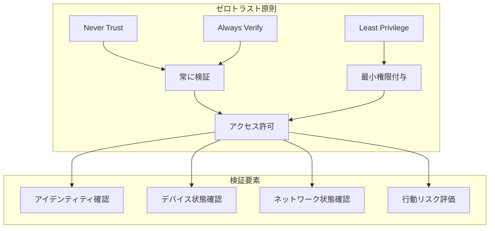

# セキュリティ要件書（Security Requirements）

| 項目 | 内容 |
|------|------|
| **文書番号** | REQ-SEC-001 |
| **バージョン** | 1.0.0 |
| **作成日** | 2026-03-25 |
| **準拠** | ISO27001 A.8 / NIST CSF PR.AA / OWASP Top 10 |

---

## 1. ゼロトラストセキュリティ原則



---

## 2. 認証要件

| 要件ID | 要件 | 実装方法 |
|--------|------|---------|
| SEC-AUTH-001 | JWT 認証必須 | アクセストークン (30分) + リフレッシュトークン (7日) |
| SEC-AUTH-002 | トークン改ざん検出 | HMAC-SHA256 署名検証 |
| SEC-AUTH-003 | トークンリボケーション | Redis ブラックリスト (jti ベース) |
| SEC-AUTH-004 | 多要素認証 | HENGEONE TOTP/FIDO2 |
| SEC-AUTH-005 | パスワードハッシュ | bcrypt (cost=12) |
| SEC-AUTH-006 | ブルートフォース防止 | 5回失敗でアカウントロック (30分) |

---

## 3. 認可・アクセス制御要件

| 要件ID | 要件 | 詳細 |
|--------|------|------|
| SEC-AUTHZ-001 | RBAC 強制 | 全エンドポイントにロールチェック |
| SEC-AUTHZ-002 | 最小権限の原則 | デフォルト権限なし、明示的付与のみ |
| SEC-AUTHZ-003 | 特権アカウント管理 | PIM (Privileged Identity Management) |
| SEC-AUTHZ-004 | テナント分離 | マルチテナント環境でのデータ分離 |
| SEC-AUTHZ-005 | API キー管理 | ローテーション・有効期限設定 |

---

## 4. 通信セキュリティ要件

| 要件ID | 要件 | 設定値 |
|--------|------|--------|
| SEC-COMM-001 | TLS 暗号化 | TLS 1.2 以上必須 |
| SEC-COMM-002 | HSTS | max-age=31536000; includeSubDomains |
| SEC-COMM-003 | CSP | default-src 'self'; script-src 'self' |
| SEC-COMM-004 | X-Frame-Options | DENY |
| SEC-COMM-005 | X-Content-Type-Options | nosniff |
| SEC-COMM-006 | Referrer-Policy | strict-origin-when-cross-origin |
| SEC-COMM-007 | CORS | 許可オリジンの明示的指定 |

---

## 5. データセキュリティ要件

| 要件ID | 要件 | 実装 |
|--------|------|------|
| SEC-DATA-001 | 個人情報暗号化 | DB 保存時 AES-256 暗号化 |
| SEC-DATA-002 | ログ改ざん防止 | SHA-256 ハッシュチェーン |
| SEC-DATA-003 | バックアップ暗号化 | バックアップデータの暗号化保存 |
| SEC-DATA-004 | 秘匿情報管理 | 環境変数 / Vault による秘密管理 |
| SEC-DATA-005 | データ最小化 | 不要な個人情報の収集禁止 |

---

## 6. 監査・インシデント対応要件

| 要件ID | 要件 | 詳細 |
|--------|------|------|
| SEC-AUD-001 | 全操作の監査ログ | 認証・認可・データ操作の全記録 |
| SEC-AUD-002 | 不審アクセス検知 | リスクスコア閾値超過でアラート |
| SEC-AUD-003 | インシデント対応 | 2時間以内の初期対応完了 |
| SEC-AUD-004 | 証跡保全 | 監査ログ 7年保存 |
| SEC-AUD-005 | SIEM 連携 | Construction-SIEM-Platform との連携 |

---

## 7. 脆弱性管理要件

| 要件ID | 要件 | 頻度 |
|--------|------|------|
| SEC-VULN-001 | 依存関係脆弱性スキャン | CI/CD 毎回 (Trivy/Safety) |
| SEC-VULN-002 | SAST（静的解析） | PR 作成時 (Bandit/Semgrep) |
| SEC-VULN-003 | DAST（動的解析） | 月次 (OWASP ZAP) |
| SEC-VULN-004 | ペネトレーションテスト | 四半期 |
| SEC-VULN-005 | CVE 緊急対応 | Critical: 24時間、High: 7日 |

---

## 8. セキュリティテスト要件

```
テストレベル別セキュリティ検証：

Unit Test
  ├── パスワードハッシュ検証
  ├── JWT 生成・検証・改ざん検出
  └── RBAC 権限チェック

Integration Test
  ├── 認証フロー E2E
  ├── トークンリフレッシュ・リボケーション
  └── レート制限動作確認

Security Scan (CI/CD)
  ├── Trivy: コンテナ・依存関係スキャン
  ├── Safety: Python パッケージ CVE チェック
  └── Bandit: Python SAST
```
