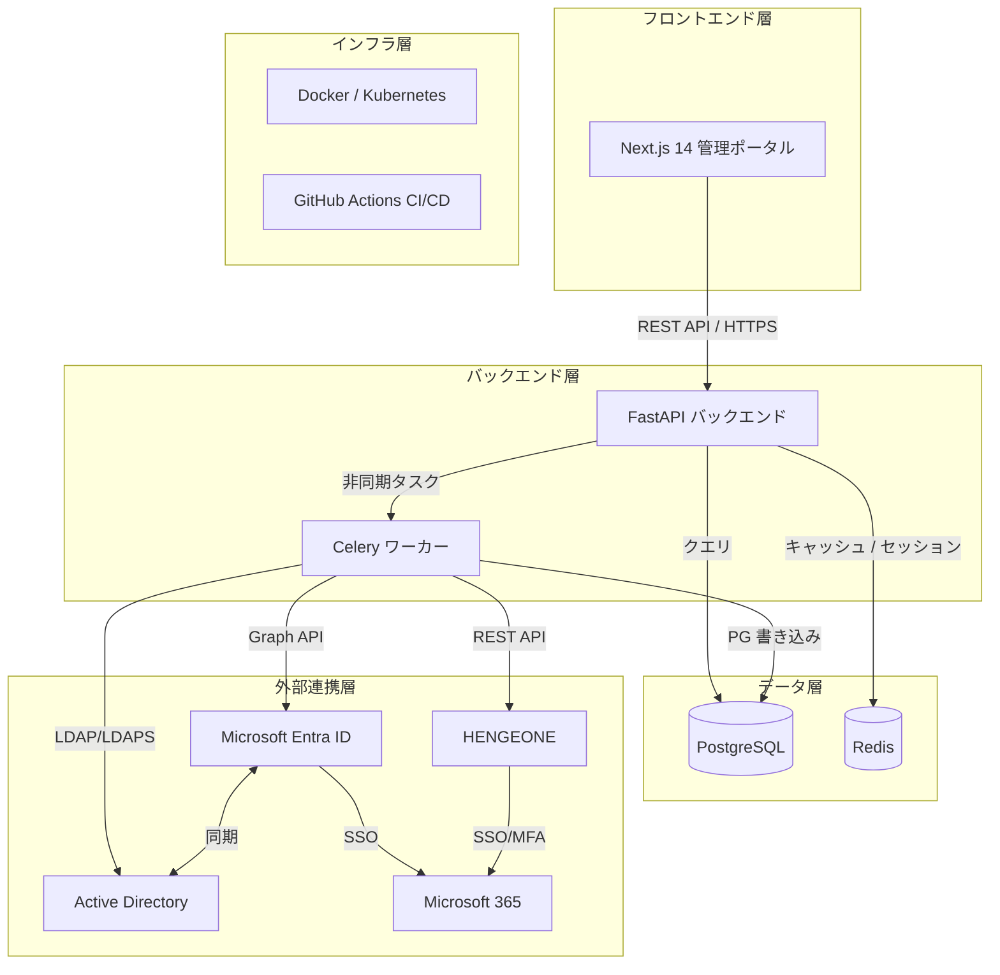
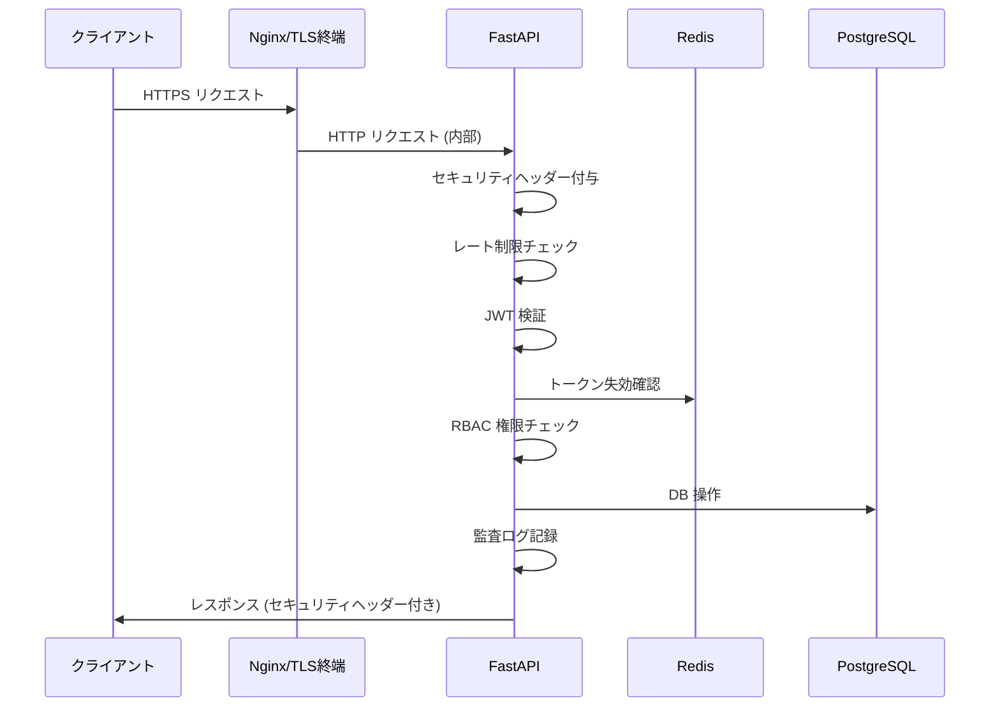

# システムアーキテクチャ概要（System Architecture Overview）

| 項目 | 内容 |
|------|------|
| **文書番号** | ARC-SYS-001 |
| **バージョン** | 1.0.0 |
| **作成日** | 2026-03-25 |

---

## 1. 全体アーキテクチャ図



---

## 2. 技術スタック

| レイヤー | 技術 | バージョン | 役割 |
|---------|------|-----------|------|
| フロントエンド | Next.js | 14.2.x | 管理ポータル UI |
| フロントエンド | TypeScript | 5.x | 型安全な開発 |
| フロントエンド | Tailwind CSS | 3.x | スタイリング |
| フロントエンド | SWR | 2.x | データフェッチング |
| バックエンド | Python | 3.11 | アプリケーション言語 |
| バックエンド | FastAPI | 0.100+ | REST API フレームワーク |
| バックエンド | SQLAlchemy | 2.x | ORM |
| バックエンド | Alembic | 1.x | DB マイグレーション |
| バックエンド | Celery | 5.x | 非同期タスクキュー |
| データベース | PostgreSQL | 16 | プライマリ DB |
| キャッシュ | Redis | 7 | セッション・トークン管理 |
| 認証 | python-jose | 3.x | JWT 処理 |
| 認証 | passlib | 1.x | パスワードハッシュ (bcrypt) |
| CI/CD | GitHub Actions | - | 自動テスト・デプロイ |
| コンテナ | Docker | 24+ | コンテナ化 |
| テスト | pytest | 8.x | バックエンドテスト |
| テスト | Playwright | 1.x | E2E テスト |
| テスト | Newman | - | API E2E テスト |

---

## 3. ディレクトリ構成

```
ZeroTrust-ID-Governance/
├── 📁 frontend/                    # Next.js フロントエンド
│   ├── app/                       # App Router
│   │   ├── dashboard/             # ダッシュボード
│   │   ├── users/                 # ユーザー管理
│   │   ├── access-requests/       # アクセス申請
│   │   ├── workflows/             # ワークフロー
│   │   └── audit/                 # 監査ログ
│   ├── components/                # 共通コンポーネント
│   ├── lib/                       # API クライアント等
│   └── tests/e2e/                 # Playwright E2E テスト
│
├── 📁 backend/                     # FastAPI バックエンド
│   ├── api/v1/                    # REST API エンドポイント
│   │   ├── auth.py                # 認証 API
│   │   ├── users.py               # ユーザー管理 API
│   │   ├── roles.py               # ロール管理 API
│   │   ├── access.py              # アクセス申請 API
│   │   ├── workflows.py           # ワークフロー API
│   │   └── audit.py               # 監査ログ API
│   ├── connectors/                # 外部システム連携
│   │   ├── ad_connector.py        # Active Directory
│   │   ├── entra_connector.py     # Microsoft Entra ID
│   │   └── hengeone_connector.py  # HENGEONE
│   ├── core/                      # コア機能
│   │   ├── auth.py                # 認証 Dependency
│   │   ├── config.py              # 設定管理
│   │   ├── database.py            # DB セッション
│   │   ├── security.py            # JWT・パスワード
│   │   ├── token_store.py         # Redis トークン管理
│   │   ├── audit_middleware.py    # 監査ログ Middleware
│   │   ├── rate_limit_middleware.py # レート制限
│   │   └── security_headers_middleware.py # セキュリティヘッダー
│   ├── engine/                    # エンジン層
│   │   ├── identity_engine.py     # アイデンティティエンジン
│   │   ├── policy_engine.py       # ポリシーエバリュエーター
│   │   └── risk_engine.py         # リスクスコアエンジン
│   ├── models/                    # データモデル
│   ├── tasks/                     # Celery 非同期タスク
│   └── tests/                     # テストスイート
│
├── 📁 infrastructure/              # インフラ設定
│   ├── docker-compose.yml
│   ├── k8s/                       # Kubernetes マニフェスト
│   └── terraform/                 # Azure IaC
│
├── 📁 docs/                        # ドキュメント（本フォルダ）
├── 📁 scripts/                     # 自動化スクリプト
├── 📁 claudeos/                    # ClaudeOS 設定
└── 📄 .github/workflows/          # GitHub Actions CI/CD
```

---

## 4. セキュリティアーキテクチャ



---

## 5. 開発フェーズ計画

| フェーズ | 内容 | 状態 |
|---------|------|------|
| Phase 1 | 基盤構築（FastAPI, DB スキーマ, Docker） | ✅ 完了 |
| Phase 2 | ユーザー管理 API | ✅ 完了 |
| Phase 3 | アクセス申請・ワークフロー | ✅ 完了 |
| Phase 4 | CRUD 統合テスト | ✅ 完了 |
| Phase 5 | セキュリティ強化（JWT, RBAC） | ✅ 完了 |
| Phase 6 | 監査ログ Middleware | ✅ 完了 |
| Phase 7 | JWT ログアウト/リフレッシュ | ✅ 完了 |
| Phase 8 | RBAC 精緻化 | ✅ 完了 |
| Phase 9 | エンジン層カバレッジ | ✅ 完了 |
| Phase 10〜12 | フロントエンド実装 | ✅ 完了 |
| Phase 13 | テストカバレッジ向上 | ✅ 完了 |
| Phase 14 | セキュリティ Middleware (ヘッダー, レート制限) | ✅ 完了 |
| Phase 15 | E2E テスト (Playwright + Newman) | 🔄 進行中 |
| Phase 16 | 外部連携実装 (AD/EntraID/HENGEONE) | 📋 予定 |
| Phase 17 | 本番デプロイ準備 | 📋 予定 |
