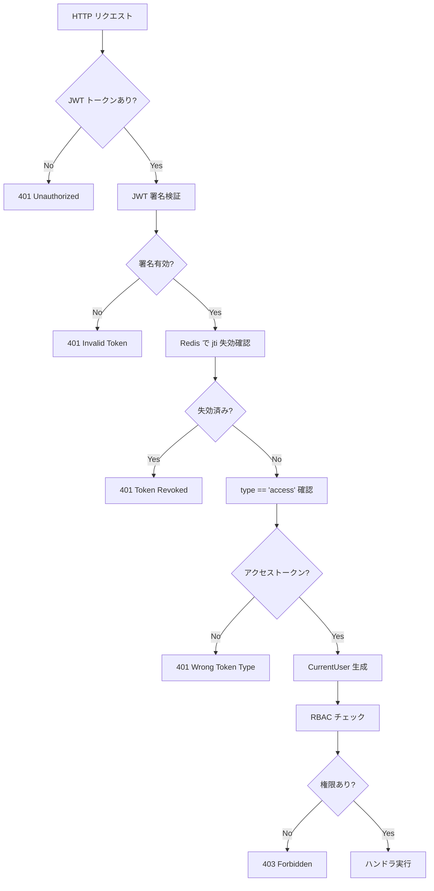
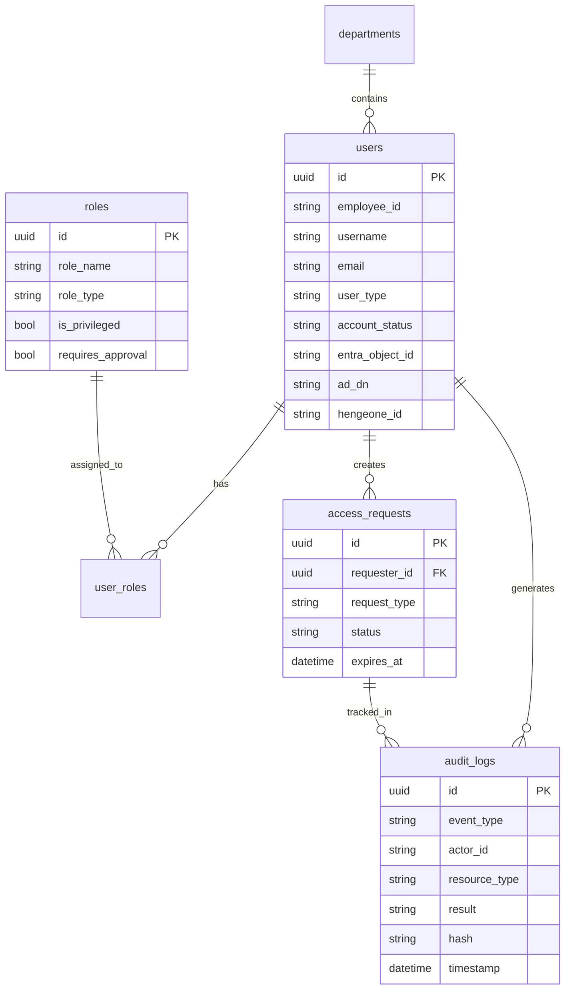

# バックエンドアーキテクチャ（Backend Architecture）

| 項目 | 内容 |
|------|------|
| **文書番号** | ARC-BE-001 |
| **バージョン** | 1.0.0 |
| **作成日** | 2026-03-25 |
| **フレームワーク** | FastAPI 0.100+ / Python 3.11 |

---

## 1. レイヤー構成

```
┌──────────────────────────────────────────────────┐
│  API Layer (api/v1/)                              │
│  Router → Request Validation → Response Schema   │
├──────────────────────────────────────────────────┤
│  Middleware Layer (core/*_middleware.py)          │
│  Security Headers → Rate Limit → Audit Log       │
├──────────────────────────────────────────────────┤
│  Service / Business Logic Layer                   │
│  RBAC Check → Validation → Domain Logic          │
├──────────────────────────────────────────────────┤
│  Engine Layer (engine/)                           │
│  Identity Engine → Policy Engine → Risk Engine   │
├──────────────────────────────────────────────────┤
│  Data Access Layer (models/ + SQLAlchemy)         │
│  ORM Models → Async Session → Transactions        │
├──────────────────────────────────────────────────┤
│  Infrastructure Layer                             │
│  PostgreSQL / Redis / Celery                     │
└──────────────────────────────────────────────────┘
```

---

## 2. 主要コンポーネント説明

### 2.1 API レイヤー (`api/v1/`)

| ファイル | エンドポイント群 | 主な機能 |
|---------|----------------|---------|
| `auth.py` | `/auth/login,logout,refresh` | JWT 認証・トークン管理 |
| `users.py` | `/users/*` | ユーザー CRUD |
| `roles.py` | `/roles/*` | ロール管理・割り当て |
| `access.py` | `/access-requests/*` | アクセス申請・承認 |
| `workflows.py` | `/workflows/*` | プロビジョニングワークフロー |
| `audit.py` | `/audit-logs/*` | 監査ログ検索・エクスポート |

### 2.2 ミドルウェアチェーン

```python
# main.py ミドルウェア適用順序（外側から内側へ）
app.add_middleware(AuditMiddleware)        # 監査ログ記録
app.add_middleware(RateLimitMiddleware)    # レート制限
app.add_middleware(SecurityHeadersMiddleware)  # セキュリティヘッダー
app.add_middleware(CORSMiddleware)         # CORS 制御
app.add_middleware(TrustedHostMiddleware)  # ホスト検証
```

### 2.3 認証フロー



---

## 3. データベース設計概要

### 3.1 主要テーブル



---

## 4. 非同期処理設計

### 4.1 Celery タスク

| タスク | キュー | 説明 |
|--------|--------|------|
| `provision_user` | `provisioning` | AD/EntraID/HENGEONE へのアカウント作成 |
| `deprovision_user` | `provisioning` | 全システムのアカウント無効化 |
| `account_review` | `review` | アカウント棚卸の実行 |
| `sync_identities` | `sync` | 外部システムとの定期同期 |

### 4.2 タスクフロー

```
API リクエスト
  ↓
FastAPI ハンドラ（即時レスポンス）
  ↓
Celery タスクキュー（Redis ブローカー）
  ↓
Celery ワーカー（非同期実行）
  ↓
外部システム連携（AD / EntraID / HENGEONE）
  ↓
結果を DB に保存
  ↓
監査ログ記録
```

---

## 5. エラーハンドリング

| エラー種別 | HTTP ステータス | 対応 |
|----------|---------------|------|
| 認証エラー | 401 | WWW-Authenticate ヘッダー付与 |
| 認可エラー | 403 | エラーメッセージのみ（詳細非公開） |
| バリデーションエラー | 422 | FastAPI 自動 Pydantic エラー |
| リソース未検出 | 404 | 詳細なメッセージ |
| レート制限 | 429 | Retry-After ヘッダー付与 |
| サーバーエラー | 500 | 詳細非公開・ログ記録 |
