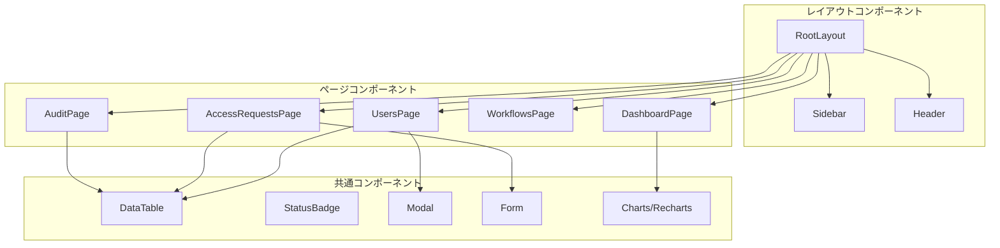
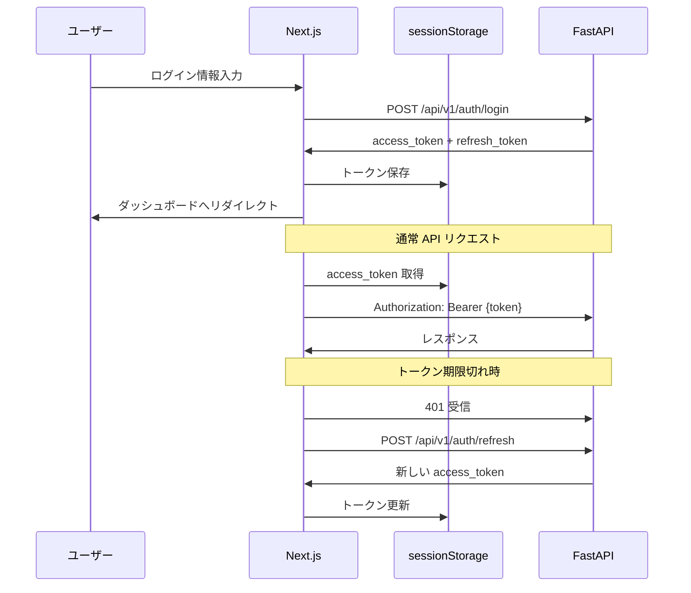

# フロントエンドアーキテクチャ（Frontend Architecture）

| 項目 | 内容 |
|------|------|
| **文書番号** | ARC-FE-001 |
| **バージョン** | 1.0.0 |
| **作成日** | 2026-03-25 |
| **フレームワーク** | Next.js 14 (App Router) / TypeScript |

---

## 1. ページ構成

```
app/
├── layout.tsx              # ルートレイアウト（認証ガード）
├── page.tsx                # ルートリダイレクト
├── (auth)/
│   └── login/              # ログインページ
├── dashboard/              # ダッシュボード（メトリクス・サマリー）
├── users/                  # ユーザー管理
│   ├── page.tsx            # ユーザー一覧
│   └── [id]/               # ユーザー詳細
├── access-requests/        # アクセス申請
│   ├── page.tsx            # 申請一覧
│   └── new/                # 新規申請
├── workflows/              # ワークフロー管理
│   └── page.tsx
└── audit/                  # 監査ログ
    └── page.tsx
```

---

## 2. コンポーネント設計



---

## 3. 状態管理・データフェッチング

| 技術 | 用途 | 設計方針 |
|------|------|---------|
| SWR | API データフェッチング | stale-while-revalidate でリアルタイム性確保 |
| React useState | ローカル UI 状態 | フォーム・モーダル・フィルター状態 |
| sessionStorage | JWT トークン保存 | アクセストークン・リフレッシュトークン |

### 3.1 認証フロー



---

## 4. セキュリティ設計

| 項目 | 実装 |
|------|------|
| XSS 防止 | Next.js による自動エスケープ |
| CSRF 防止 | SameSite Cookie + カスタムヘッダー |
| トークン管理 | sessionStorage（タブ閉じで自動削除） |
| API 通信 | HTTPS のみ |
| 認証ガード | layout.tsx レベルでのリダイレクト |

---

## 5. テスト設計

| テスト種別 | フレームワーク | カバレッジ対象 |
|----------|--------------|-------------|
| E2E テスト | Playwright | ページナビゲーション・認証フロー |
| コンポーネントテスト | - | 将来実装予定 |
| 型チェック | TypeScript (tsc) | 全 TypeScript ファイル |
| Lint | ESLint + next/core-web-vitals | コード品質 |

---

## 6. ビルド設定

```json
// package.json scripts
{
  "dev": "next dev",
  "build": "next build",
  "start": "next start",
  "lint": "next lint",
  "type-check": "tsc --noEmit",
  "test:e2e": "playwright test"
}
```
