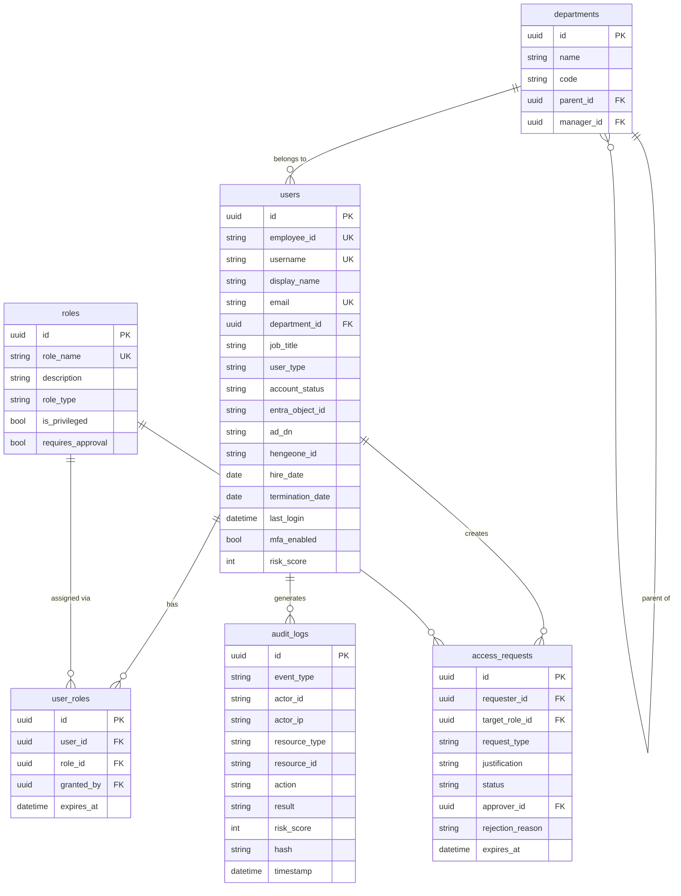

# データベース設計（Database Design）

| 項目 | 内容 |
|------|------|
| **文書番号** | ARC-DB-001 |
| **バージョン** | 1.0.0 |
| **作成日** | 2026-03-25 |
| **DBMS** | PostgreSQL 16 |

---

## 1. ER 図



---

## 2. テーブル定義

### 2.1 users テーブル

| カラム名 | 型 | 制約 | 説明 |
|---------|------|------|------|
| id | UUID | PK, DEFAULT gen_random_uuid() | 主キー |
| employee_id | VARCHAR(20) | UNIQUE, NOT NULL | 社員番号 |
| username | VARCHAR(100) | UNIQUE, NOT NULL | ログインID |
| display_name | VARCHAR(200) | NOT NULL | 表示名 |
| email | VARCHAR(254) | UNIQUE, NOT NULL | メールアドレス |
| department_id | UUID | FK → departments.id | 所属部署 |
| job_title | VARCHAR(200) | | 職位 |
| user_type | VARCHAR(20) | CHECK | employee/contractor/partner/admin |
| account_status | VARCHAR(20) | DEFAULT 'active' | active/disabled/locked |
| entra_object_id | VARCHAR(36) | | Azure AD Object ID |
| ad_dn | TEXT | | AD 識別名 |
| hengeone_id | VARCHAR(100) | | HENGEONE ID |
| hire_date | DATE | NOT NULL | 入社日 |
| termination_date | DATE | | 退職日 |
| last_login | TIMESTAMP WITH TZ | | 最終ログイン |
| mfa_enabled | BOOLEAN | DEFAULT false | MFA 有効フラグ |
| risk_score | INTEGER | DEFAULT 0 | リスクスコア (0-100) |
| created_at | TIMESTAMP WITH TZ | DEFAULT now() | 作成日時 |
| updated_at | TIMESTAMP WITH TZ | DEFAULT now() | 更新日時 |

### 2.2 roles テーブル

| カラム名 | 型 | 制約 | 説明 |
|---------|------|------|------|
| id | UUID | PK | 主キー |
| role_name | VARCHAR(100) | UNIQUE, NOT NULL | ロール名 |
| description | TEXT | | 説明 |
| role_type | VARCHAR(20) | | system/business/external |
| is_privileged | BOOLEAN | DEFAULT false | 特権ロールフラグ |
| requires_approval | BOOLEAN | DEFAULT false | 承認要否 |

### 2.3 audit_logs テーブル

| カラム名 | 型 | 制約 | 説明 |
|---------|------|------|------|
| id | UUID | PK | 主キー |
| event_type | VARCHAR(50) | NOT NULL | イベント種別 |
| actor_id | VARCHAR(100) | NOT NULL | 操作者 ID |
| actor_ip | VARCHAR(45) | | 操作者 IP |
| resource_type | VARCHAR(50) | | リソース種別 |
| resource_id | VARCHAR(100) | | リソース ID |
| action | VARCHAR(50) | | 操作内容 |
| result | VARCHAR(20) | | success/failure |
| risk_score | INTEGER | | リスクスコア |
| hash | VARCHAR(64) | | SHA-256 ハッシュ（改ざん防止） |
| timestamp | TIMESTAMP WITH TZ | DEFAULT now() | タイムスタンプ |

---

## 3. インデックス設計

```sql
-- users テーブル
CREATE INDEX idx_users_account_status ON users(account_status);
CREATE INDEX idx_users_department_id ON users(department_id);
CREATE INDEX idx_users_hire_date ON users(hire_date);

-- audit_logs テーブル（時系列クエリ最適化）
CREATE INDEX idx_audit_logs_timestamp ON audit_logs(timestamp DESC);
CREATE INDEX idx_audit_logs_actor_id ON audit_logs(actor_id);
CREATE INDEX idx_audit_logs_event_type ON audit_logs(event_type);

-- access_requests テーブル
CREATE INDEX idx_access_requests_status ON access_requests(status);
CREATE INDEX idx_access_requests_requester ON access_requests(requester_id);
```

---

## 4. マイグレーション戦略

| 項目 | 方針 |
|------|------|
| ツール | Alembic |
| 命名規則 | `{連番}_{説明}.py` |
| 適用方法 | `alembic upgrade head` |
| ロールバック | `alembic downgrade -1` |
| 本番適用 | blue-green で事前適用 |
| テスト | CI で毎回マイグレーション実行 |
