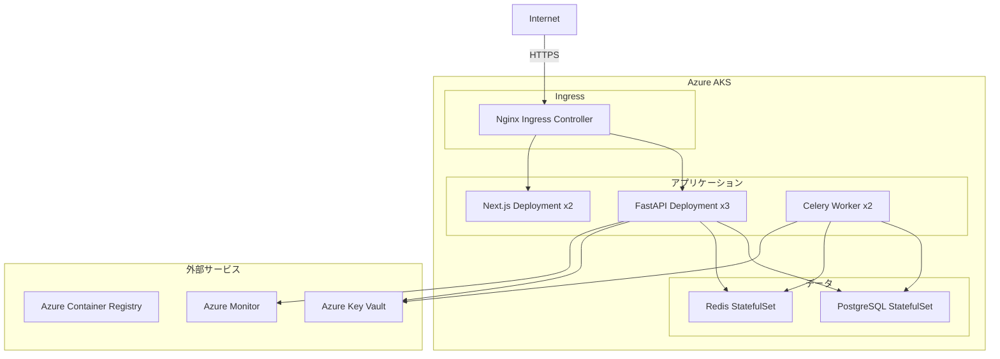
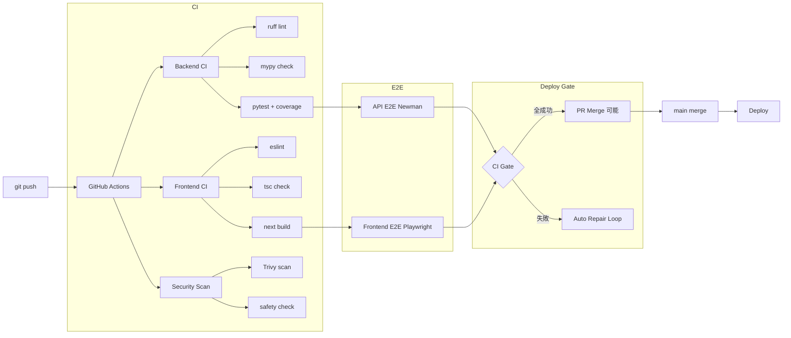

# インフラアーキテクチャ（Infrastructure Architecture）

| 項目 | 内容 |
|------|------|
| **文書番号** | ARC-INF-001 |
| **バージョン** | 1.0.0 |
| **作成日** | 2026-03-25 |

---

## 1. デプロイ構成

### 1.1 開発環境

```yaml
# docker-compose.yml 構成
services:
  backend:    FastAPI (uvicorn)  :8000
  frontend:   Next.js (dev)      :3000
  db:         PostgreSQL 16      :5432
  redis:      Redis 7            :6379
  worker:     Celery Worker
  flower:     Celery Monitor     :5555
```

### 1.2 本番環境（Kubernetes）



---

## 2. CI/CD パイプライン



---

## 3. 環境変数・設定管理

| 変数名 | 環境 | 説明 |
|--------|------|------|
| `DATABASE_URL` | 全環境 | PostgreSQL 接続 URL |
| `REDIS_URL` | 全環境 | Redis 接続 URL |
| `JWT_SECRET_KEY` | 全環境 | JWT 署名キー（128bit 以上） |
| `APP_ENV` | 全環境 | production/test/development |
| `ALLOWED_ORIGINS` | 全環境 | CORS 許可オリジン (JSON 配列) |
| `ALLOWED_HOSTS` | 全環境 | 許可ホスト名 (JSON 配列) |
| `ENTRA_TENANT_ID` | 本番 | Azure テナント ID |
| `ENTRA_CLIENT_ID` | 本番 | Azure アプリ クライアント ID |
| `ENTRA_CLIENT_SECRET` | 本番 | Azure クライアントシークレット |
| `AD_SERVER` | 本番 | AD サーバー URL |
| `AD_BIND_DN` | 本番 | AD バインド DN |
| `AD_BIND_PASSWORD` | 本番 | AD バインドパスワード |
| `HENGEONE_API_KEY` | 本番 | HENGEONE API キー |

---

## 4. ネットワーク設計

| セグメント | 用途 | 通信許可 |
|----------|------|---------|
| DMZ | Nginx Ingress | Internet → DMZ: HTTPS 443 |
| アプリ層 | FastAPI / Next.js | DMZ → アプリ: HTTP 8000/3000 |
| データ層 | PostgreSQL / Redis | アプリ → データ: 5432/6379 |
| 外部連携 | AD / Entra / HENGEONE | アプリ → 外部: LDAPS 636 / HTTPS 443 |

---

## 5. 監視・アラート設計

| 監視項目 | ツール | 閾値 |
|---------|--------|------|
| API レスポンスタイム | Prometheus + Grafana | p95 > 500ms でアラート |
| エラーレート | Prometheus | 5xx > 1% でアラート |
| CPU 使用率 | Azure Monitor | > 80% でスケールアウト |
| メモリ使用率 | Azure Monitor | > 85% でアラート |
| DB コネクション数 | PgBouncer | > 80% でアラート |
| Redis メモリ | Redis INFO | > 80% でアラート |
| セキュリティイベント | SIEM | 高リスクイベントで即時アラート |
