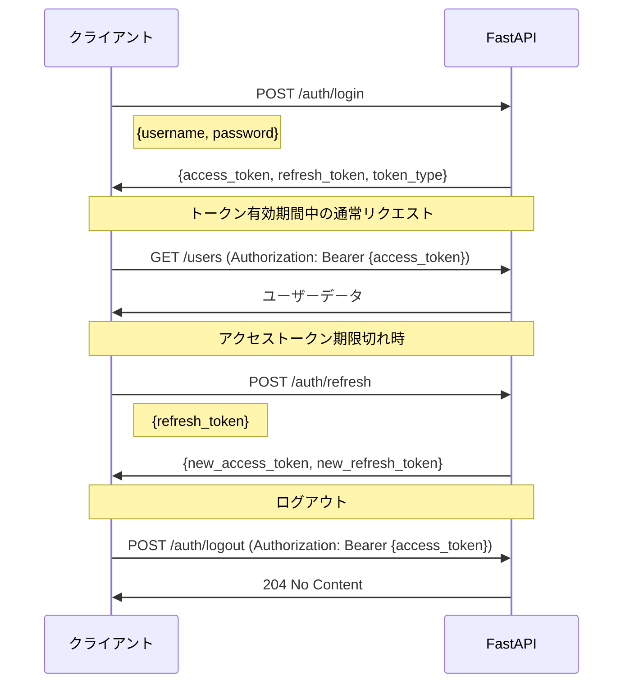

# API 概要（API Overview）

| 項目 | 内容 |
|------|------|
| **文書番号** | API-OVR-001 |
| **バージョン** | 1.0.0 |
| **作成日** | 2026-03-25 |
| **Base URL** | `https://api.zerotrust-id.mirai-kensetsu.co.jp/api/v1` |

---

## 1. API 設計原則

| 原則 | 内容 |
|------|------|
| RESTful | HTTP メソッドのセマンティクスに従った設計 |
| バージョニング | URL パス方式 (`/api/v1/`) |
| 認証 | Bearer JWT トークン必須（公開エンドポイント除く） |
| レスポンス形式 | JSON |
| エラー形式 | RFC 7807 Problem Details |
| ページング | `page` + `per_page` クエリパラメータ |
| フィルタリング | クエリパラメータによる絞り込み |

---

## 2. 認証方法

```http
Authorization: Bearer <access_token>
```

### 2.1 トークン取得フロー



---

## 3. エンドポイント一覧

### 3.1 認証 API

| エンドポイント | メソッド | 認証不要 | 説明 |
|--------------|---------|---------|------|
| `/auth/login` | POST | ✓（テスト環境のみ） | ログイン |
| `/auth/logout` | POST | - | ログアウト（トークン失効） |
| `/auth/refresh` | POST | ✓ | アクセストークン更新 |

### 3.2 ユーザー管理 API

| エンドポイント | メソッド | 必要ロール | 説明 |
|--------------|---------|-----------|------|
| `/users` | GET | GlobalAdmin, TenantAdmin | ユーザー一覧 |
| `/users` | POST | GlobalAdmin | ユーザー作成 |
| `/users/{id}` | GET | 全ロール | ユーザー詳細 |
| `/users/{id}` | PUT | GlobalAdmin, TenantAdmin | ユーザー更新 |
| `/users/{id}` | DELETE | GlobalAdmin | ユーザー削除 |

### 3.3 ロール管理 API

| エンドポイント | メソッド | 必要ロール | 説明 |
|--------------|---------|-----------|------|
| `/roles` | GET | 全ロール | ロール一覧 |
| `/roles` | POST | GlobalAdmin | ロール作成 |
| `/roles/{id}/assign` | POST | GlobalAdmin, TenantAdmin | ロール割り当て |
| `/roles/{id}/revoke` | DELETE | GlobalAdmin, TenantAdmin | ロール取消 |

### 3.4 アクセス申請 API

| エンドポイント | メソッド | 必要ロール | 説明 |
|--------------|---------|-----------|------|
| `/access-requests` | GET | 全ロール | 申請一覧 |
| `/access-requests` | POST | 全ロール | 申請作成 |
| `/access-requests/{id}` | GET | 全ロール | 申請詳細 |
| `/access-requests/{id}/approve` | POST | GlobalAdmin, TenantAdmin | 申請承認 |
| `/access-requests/{id}/reject` | POST | GlobalAdmin, TenantAdmin | 申請却下 |

### 3.5 監査ログ API

| エンドポイント | メソッド | 必要ロール | 説明 |
|--------------|---------|-----------|------|
| `/audit-logs` | GET | GlobalAdmin, Auditor | ログ一覧 |
| `/audit-logs/export` | GET | GlobalAdmin, Auditor | CSV エクスポート |

---

## 4. 共通レスポンス形式

### 4.1 成功レスポンス

```json
{
  "success": true,
  "data": { ... }
}
```

### 4.2 一覧レスポンス

```json
{
  "success": true,
  "data": [ ... ],
  "total": 100,
  "page": 1,
  "per_page": 20
}
```

### 4.3 エラーレスポンス

```json
{
  "detail": "エラーメッセージ"
}
```

---

## 5. HTTP ステータスコード

| コード | 説明 | 用途 |
|--------|------|------|
| 200 | OK | 通常成功 |
| 201 | Created | リソース作成成功 |
| 204 | No Content | 削除・ログアウト成功 |
| 400 | Bad Request | バリデーションエラー |
| 401 | Unauthorized | 認証エラー |
| 403 | Forbidden | 認可エラー |
| 404 | Not Found | リソース未検出 |
| 422 | Unprocessable Entity | Pydantic バリデーションエラー |
| 429 | Too Many Requests | レート制限 |
| 500 | Internal Server Error | サーバーエラー |

---

## 6. OpenAPI / Swagger

- **Swagger UI**: `http://localhost:8000/docs`
- **ReDoc**: `http://localhost:8000/redoc`
- **OpenAPI JSON**: `http://localhost:8000/openapi.json`
