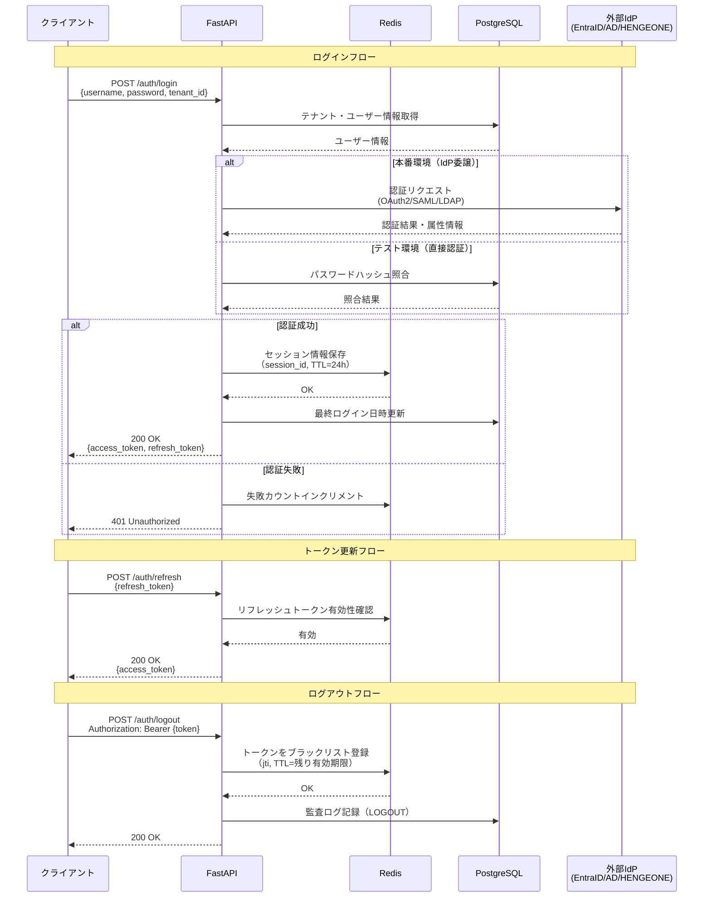

# 認証API 詳細仕様（Auth API Specification）

| 項目 | 内容 |
|------|------|
| 文書番号 | API-AUTH-001 |
| バージョン | 1.0.0 |
| 作成日 | 2026-03-25 |
| 作成者 | ZeroTrust-ID-Governance チーム |
| ステータス | Draft |

---

## 1. 概要

本ドキュメントは、ZeroTrust-ID-Governance システムの認証APIの詳細仕様を定義します。
認証APIは JWT（JSON Web Token）を使用したステートレス認証を提供します。

### 1.1 環境別認証方式

| 環境 | 認証方式 |
|------|----------|
| テスト環境 | 平文パスワードによる直接認証（DB照合） |
| ステージング環境 | EntraID / AD への委譲（フェデレーション） |
| 本番環境 | EntraID / Active Directory / HENGEONE への委譲（必須） |

> **注意**: テスト環境のみ平文パスワード認証を受け付けます。本番環境では外部IdP（EntraID/AD/HENGEONE）への認証委譲が必須です。

---

## 2. エンドポイント一覧

| メソッド | パス | 説明 | 認証必要 |
|----------|------|------|----------|
| POST | /auth/login | ログイン・トークン発行 | 不要 |
| POST | /auth/logout | ログアウト・トークン無効化 | 必要 |
| POST | /auth/refresh | アクセストークン更新 | 必要（リフレッシュトークン） |

---

## 3. POST /auth/login

### 3.1 概要

ユーザー認証を行い、アクセストークンとリフレッシュトークンを発行します。

- **URL**: `POST /api/v1/auth/login`
- **認証**: 不要
- **Content-Type**: `application/json`

### 3.2 リクエスト

```json
{
  "username": "user@example.com",
  "password": "P@ssw0rd!",
  "tenant_id": "tenant-uuid-1234",
  "mfa_code": "123456"
}
```

| フィールド | 型 | 必須 | 説明 |
|------------|-----|------|------|
| username | string | 必須 | ユーザー名またはメールアドレス |
| password | string | 必須（テスト環境） | パスワード（本番はIdP委譲） |
| tenant_id | string | 任意 | テナントID（マルチテナント時） |
| mfa_code | string | 任意 | MFA コード（TOTP 6桁） |

### 3.3 レスポンス（成功）

**HTTP 200 OK**

```json
{
  "access_token": "eyJhbGciOiJSUzI1NiIsInR5cCI6IkpXVCJ9...",
  "refresh_token": "eyJhbGciOiJSUzI1NiIsInR5cCI6IkpXVCJ9...",
  "token_type": "Bearer",
  "expires_in": 900,
  "refresh_expires_in": 86400,
  "user": {
    "id": "user-uuid-5678",
    "username": "user@example.com",
    "display_name": "山田 太郎",
    "tenant_id": "tenant-uuid-1234",
    "roles": ["GlobalViewer", "TenantUser"],
    "user_type": "employee",
    "mfa_enabled": true
  }
}
```

| フィールド | 型 | 説明 |
|------------|-----|------|
| access_token | string | JWT アクセストークン（有効期限: 15分） |
| refresh_token | string | JWT リフレッシュトークン（有効期限: 24時間） |
| token_type | string | トークンタイプ（常に "Bearer"） |
| expires_in | integer | アクセストークン有効期限（秒） |
| refresh_expires_in | integer | リフレッシュトークン有効期限（秒） |

### 3.4 エラーレスポンス

**HTTP 401 Unauthorized** - 認証失敗

```json
{
  "error": "AUTHENTICATION_FAILED",
  "message": "ユーザー名またはパスワードが正しくありません",
  "code": 401,
  "request_id": "req-uuid-abcd"
}
```

**HTTP 403 Forbidden** - アカウント無効

```json
{
  "error": "ACCOUNT_DISABLED",
  "message": "アカウントが無効化されています。管理者にお問い合わせください",
  "code": 403,
  "request_id": "req-uuid-efgh"
}
```

**HTTP 423 Locked** - アカウントロック

```json
{
  "error": "ACCOUNT_LOCKED",
  "message": "ログイン試行回数が上限に達しました。30分後に再試行してください",
  "code": 423,
  "locked_until": "2026-03-25T10:30:00Z",
  "request_id": "req-uuid-ijkl"
}
```

**HTTP 422 Unprocessable Entity** - MFA 必須

```json
{
  "error": "MFA_REQUIRED",
  "message": "多要素認証が必要です",
  "code": 422,
  "mfa_type": "totp",
  "request_id": "req-uuid-mnop"
}
```

### 3.5 エラーコード一覧

| エラーコード | HTTP ステータス | 説明 |
|--------------|-----------------|------|
| AUTHENTICATION_FAILED | 401 | 認証情報が不正 |
| ACCOUNT_DISABLED | 403 | アカウント無効化 |
| ACCOUNT_LOCKED | 423 | ログイン試行上限超過 |
| MFA_REQUIRED | 422 | MFA コードが必要 |
| MFA_INVALID | 401 | MFA コードが不正 |
| TENANT_NOT_FOUND | 404 | テナントが見つからない |
| IDP_UNAVAILABLE | 503 | 外部 IdP に接続不可 |

---

## 4. POST /auth/logout

### 4.1 概要

現在のセッションを無効化し、トークンをブラックリスト（Redis）に登録します。

- **URL**: `POST /api/v1/auth/logout`
- **認証**: Bearer トークン必須
- **Content-Type**: `application/json`

### 4.2 リクエスト

```json
{
  "refresh_token": "eyJhbGciOiJSUzI1NiIsInR5cCI6IkpXVCJ9..."
}
```

| フィールド | 型 | 必須 | 説明 |
|------------|-----|------|------|
| refresh_token | string | 任意 | 合わせて無効化するリフレッシュトークン |

### 4.3 レスポンス（成功）

**HTTP 200 OK**

```json
{
  "message": "ログアウトが完了しました",
  "logged_out_at": "2026-03-25T09:00:00Z"
}
```

### 4.4 エラーレスポンス

**HTTP 401 Unauthorized** - トークン無効

```json
{
  "error": "TOKEN_INVALID",
  "message": "無効なトークンです",
  "code": 401,
  "request_id": "req-uuid-qrst"
}
```

---

## 5. POST /auth/refresh

### 5.1 概要

リフレッシュトークンを使用して新しいアクセストークンを発行します。

- **URL**: `POST /api/v1/auth/refresh`
- **認証**: リフレッシュトークン必須
- **Content-Type**: `application/json`

### 5.2 リクエスト

```json
{
  "refresh_token": "eyJhbGciOiJSUzI1NiIsInR5cCI6IkpXVCJ9..."
}
```

### 5.3 レスポンス（成功）

**HTTP 200 OK**

```json
{
  "access_token": "eyJhbGciOiJSUzI1NiIsInR5cCI6IkpXVCJ9...",
  "token_type": "Bearer",
  "expires_in": 900
}
```

### 5.4 エラーレスポンス

**HTTP 401 Unauthorized** - リフレッシュトークン無効・期限切れ

```json
{
  "error": "REFRESH_TOKEN_EXPIRED",
  "message": "リフレッシュトークンが期限切れです。再度ログインしてください",
  "code": 401,
  "request_id": "req-uuid-uvwx"
}
```

---

## 6. JWT ペイロード構造

### 6.1 アクセストークン ペイロード

```json
{
  "sub": "user-uuid-5678",
  "iss": "zerotrust-id-governance",
  "aud": "zerotrust-api",
  "iat": 1742860800,
  "exp": 1742861700,
  "jti": "token-uuid-abcd",
  "tenant_id": "tenant-uuid-1234",
  "username": "user@example.com",
  "display_name": "山田 太郎",
  "roles": ["GlobalViewer", "TenantUser"],
  "user_type": "employee",
  "mfa_verified": true,
  "idp": "entra_id",
  "session_id": "session-uuid-efgh"
}
```

| クレーム | 型 | 説明 |
|----------|-----|------|
| sub | string | ユーザー一意識別子 |
| iss | string | トークン発行者 |
| aud | string | トークン対象サービス |
| iat | integer | 発行日時（Unix timestamp） |
| exp | integer | 有効期限（Unix timestamp） |
| jti | string | トークン一意ID（ブラックリスト管理用） |
| tenant_id | string | テナントID |
| roles | array | 割り当てロール一覧 |
| user_type | string | ユーザータイプ（employee/contractor/partner/admin） |
| mfa_verified | boolean | MFA 認証完了フラグ |
| idp | string | 認証元 IdP（local/entra_id/active_directory/hengeone） |
| session_id | string | セッションID（Redis管理） |

### 6.2 署名アルゴリズム

| 項目 | 設定値 |
|------|--------|
| アルゴリズム | RS256（RSA + SHA-256） |
| 鍵長 | 2048 bit |
| 鍵ローテーション | 90日ごと |

---

## 7. セキュリティ考慮事項

### 7.1 トークン管理

- アクセストークンの有効期限は **15分** に設定（短命トークン）
- リフレッシュトークンは **Redis** でセッション管理し、ログアウト時に即座に無効化
- トークンのブラックリストは Redis TTL で自動消去

### 7.2 ブルートフォース防止

- ログイン失敗 **5回** でアカウントを **30分間ロック**
- ロック状態は Redis で管理し、管理者が手動解除可能
- ロックアウト時は監査ログに記録

### 7.3 本番環境の認証委譲

```
本番環境では以下の外部IdPへ認証を委譲します:
- Microsoft Entra ID (旧 Azure AD): OAuth 2.0 / OIDC
- Active Directory: LDAP / Kerberos
- HENGEONE: SAML 2.0
```

テスト環境でのみ、DB内のハッシュ化パスワードと照合する直接認証を許可します。
本番環境でローカル認証を使用した場合は、セキュリティ警告を監査ログに記録します。

### 7.4 HTTPS 強制

- 全エンドポイントで HTTPS（TLS 1.2以上）を強制
- HTTP アクセスは 301 リダイレクトで HTTPS へ転送

---

## 8. 認証フロー図



---

## 9. 関連ドキュメント

| ドキュメント | 参照先 |
|--------------|--------|
| API概要 | `01_API概要（API_Overview）.md` |
| ユーザー管理API | `03_ユーザー管理API（User_Management_API）.md` |
| 監査ログAPI | `06_監査ログAPI（Audit_Log_API）.md` |
| セキュリティ設計 | `../05_セキュリティ設計/` |
