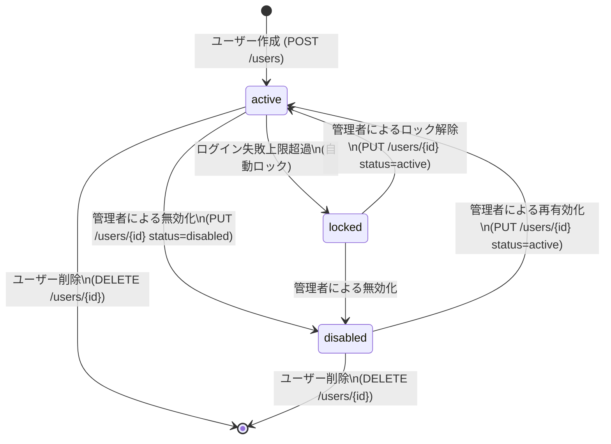

# ユーザー管理API 詳細仕様（User Management API Specification）

| 項目 | 内容 |
|------|------|
| 文書番号 | API-USR-001 |
| バージョン | 1.0.0 |
| 作成日 | 2026-03-25 |
| 作成者 | ZeroTrust-ID-Governance チーム |
| ステータス | Draft |

---

## 1. 概要

本ドキュメントは、ZeroTrust-ID-Governance システムのユーザー管理APIの詳細仕様を定義します。
ユーザーの作成・取得・更新・削除（CRUD）操作を提供します。

### 1.1 必要ロール

| 操作 | 必要ロール |
|------|-----------|
| ユーザー一覧取得 | GlobalAdmin / TenantAdmin / GlobalViewer |
| ユーザー作成 | GlobalAdmin / TenantAdmin |
| ユーザー詳細取得 | GlobalAdmin / TenantAdmin / GlobalViewer / 本人 |
| ユーザー更新 | GlobalAdmin / TenantAdmin |
| ユーザー削除 | GlobalAdmin |

### 1.2 ユーザータイプ

| タイプ | 説明 |
|--------|------|
| employee | 正社員・フルタイム従業員 |
| contractor | 契約社員・業務委託 |
| partner | パートナー企業ユーザー |
| admin | システム管理者 |

### 1.3 アカウントステータス

| ステータス | 説明 |
|------------|------|
| active | アクティブ（ログイン可） |
| disabled | 無効化（管理者による停止） |
| locked | ロック（ログイン試行上限超過） |

---

## 2. エンドポイント一覧

| メソッド | パス | 説明 | 必要ロール |
|----------|------|------|-----------|
| GET | /users | ユーザー一覧取得 | GlobalAdmin / TenantAdmin |
| POST | /users | ユーザー作成 | GlobalAdmin / TenantAdmin |
| GET | /users/{id} | ユーザー詳細取得 | GlobalAdmin / TenantAdmin / 本人 |
| PUT | /users/{id} | ユーザー情報更新 | GlobalAdmin / TenantAdmin |
| DELETE | /users/{id} | ユーザー削除 | GlobalAdmin |

---

## 3. GET /users（ユーザー一覧取得）

### 3.1 概要

- **URL**: `GET /api/v1/users`
- **認証**: Bearer トークン必須
- **必要ロール**: GlobalAdmin / TenantAdmin / GlobalViewer

### 3.2 クエリパラメータ

| パラメータ | 型 | 必須 | デフォルト | 説明 |
|------------|-----|------|-----------|------|
| page | integer | 任意 | 1 | ページ番号 |
| per_page | integer | 任意 | 20 | 1ページあたりの件数（最大100） |
| user_type | string | 任意 | - | ユーザータイプフィルタ（employee/contractor/partner/admin） |
| status | string | 任意 | - | ステータスフィルタ（active/disabled/locked） |
| tenant_id | string | 任意 | - | テナントIDフィルタ |
| search | string | 任意 | - | 氏名・メールアドレスの部分一致検索 |
| sort_by | string | 任意 | created_at | ソートカラム |
| sort_order | string | 任意 | desc | ソート順（asc/desc） |

### 3.3 レスポンス（成功）

**HTTP 200 OK**

```json
{
  "items": [
    {
      "id": "user-uuid-0001",
      "username": "yamada.taro@example.com",
      "display_name": "山田 太郎",
      "email": "yamada.taro@example.com",
      "user_type": "employee",
      "status": "active",
      "tenant_id": "tenant-uuid-1234",
      "department": "情報システム部",
      "job_title": "システムエンジニア",
      "roles": ["TenantUser"],
      "mfa_enabled": true,
      "last_login_at": "2026-03-25T08:00:00Z",
      "created_at": "2025-01-15T09:00:00Z",
      "updated_at": "2026-03-20T10:00:00Z"
    },
    {
      "id": "user-uuid-0002",
      "username": "suzuki.hanako@example.com",
      "display_name": "鈴木 花子",
      "email": "suzuki.hanako@example.com",
      "user_type": "contractor",
      "status": "active",
      "tenant_id": "tenant-uuid-1234",
      "department": "開発部",
      "job_title": "ソフトウェアエンジニア",
      "roles": ["TenantUser", "DeveloperRole"],
      "mfa_enabled": false,
      "last_login_at": "2026-03-24T17:30:00Z",
      "created_at": "2025-06-01T09:00:00Z",
      "updated_at": "2026-03-24T17:30:00Z"
    }
  ],
  "pagination": {
    "total": 150,
    "page": 1,
    "per_page": 20,
    "total_pages": 8,
    "has_next": true,
    "has_prev": false
  }
}
```

---

## 4. POST /users（ユーザー作成）

### 4.1 概要

- **URL**: `POST /api/v1/users`
- **認証**: Bearer トークン必須
- **必要ロール**: GlobalAdmin / TenantAdmin
- **Content-Type**: `application/json`

### 4.2 リクエスト

```json
{
  "username": "tanaka.jiro@example.com",
  "email": "tanaka.jiro@example.com",
  "display_name": "田中 二郎",
  "user_type": "employee",
  "tenant_id": "tenant-uuid-1234",
  "department": "営業部",
  "job_title": "営業担当",
  "employee_id": "EMP-12345",
  "phone": "+81-3-1234-5678",
  "manager_id": "user-uuid-0001",
  "roles": ["TenantUser"],
  "send_invitation": true,
  "contract_end_date": null,
  "idp_source": "entra_id",
  "idp_object_id": "entra-object-id-abcd"
}
```

| フィールド | 型 | 必須 | 説明 |
|------------|-----|------|------|
| username | string | 必須 | ユーザー名（一意） |
| email | string | 必須 | メールアドレス（一意） |
| display_name | string | 必須 | 表示名 |
| user_type | string | 必須 | ユーザータイプ |
| tenant_id | string | 必須 | テナントID |
| department | string | 任意 | 部署 |
| job_title | string | 任意 | 役職 |
| employee_id | string | 任意 | 社員番号 |
| roles | array | 任意 | 初期割り当てロール |
| send_invitation | boolean | 任意 | 招待メール送信フラグ |
| contract_end_date | string | 任意 | 契約終了日（ISO 8601） |
| idp_source | string | 任意 | IdP種別（entra_id/active_directory/hengeone/local） |
| idp_object_id | string | 任意 | IdP内オブジェクトID |

### 4.3 レスポンス（成功）

**HTTP 201 Created**

```json
{
  "id": "user-uuid-0003",
  "username": "tanaka.jiro@example.com",
  "email": "tanaka.jiro@example.com",
  "display_name": "田中 二郎",
  "user_type": "employee",
  "status": "active",
  "tenant_id": "tenant-uuid-1234",
  "department": "営業部",
  "job_title": "営業担当",
  "employee_id": "EMP-12345",
  "roles": ["TenantUser"],
  "mfa_enabled": false,
  "created_at": "2026-03-25T09:00:00Z",
  "updated_at": "2026-03-25T09:00:00Z",
  "invitation_sent": true
}
```

### 4.4 エラーレスポンス

**HTTP 409 Conflict** - ユーザー名重複

```json
{
  "error": "USER_ALREADY_EXISTS",
  "message": "指定されたユーザー名またはメールアドレスは既に使用されています",
  "code": 409,
  "field": "username",
  "request_id": "req-uuid-abcd"
}
```

**HTTP 422 Unprocessable Entity** - バリデーションエラー

```json
{
  "error": "VALIDATION_ERROR",
  "message": "入力値が不正です",
  "code": 422,
  "details": [
    {
      "field": "email",
      "message": "有効なメールアドレス形式ではありません"
    },
    {
      "field": "user_type",
      "message": "employee, contractor, partner, admin のいずれかを指定してください"
    }
  ],
  "request_id": "req-uuid-efgh"
}
```

---

## 5. GET /users/{id}（ユーザー詳細取得）

### 5.1 概要

- **URL**: `GET /api/v1/users/{id}`
- **認証**: Bearer トークン必須
- **必要ロール**: GlobalAdmin / TenantAdmin / GlobalViewer / 本人

### 5.2 パスパラメータ

| パラメータ | 型 | 説明 |
|------------|-----|------|
| id | string | ユーザーID（UUID） |

### 5.3 レスポンス（成功）

**HTTP 200 OK**

```json
{
  "id": "user-uuid-0001",
  "username": "yamada.taro@example.com",
  "email": "yamada.taro@example.com",
  "display_name": "山田 太郎",
  "user_type": "employee",
  "status": "active",
  "tenant_id": "tenant-uuid-1234",
  "department": "情報システム部",
  "job_title": "システムエンジニア",
  "employee_id": "EMP-00001",
  "phone": "+81-3-1234-5678",
  "manager_id": "user-uuid-0010",
  "manager_name": "佐藤 部長",
  "roles": [
    {
      "id": "role-uuid-0001",
      "name": "TenantUser",
      "type": "system",
      "assigned_at": "2025-01-15T09:00:00Z",
      "assigned_by": "admin@example.com"
    }
  ],
  "mfa_enabled": true,
  "mfa_type": "totp",
  "idp_source": "entra_id",
  "idp_object_id": "entra-object-id-abcd",
  "last_login_at": "2026-03-25T08:00:00Z",
  "login_count": 245,
  "failed_login_count": 0,
  "contract_end_date": null,
  "created_at": "2025-01-15T09:00:00Z",
  "updated_at": "2026-03-20T10:00:00Z",
  "created_by": "admin@example.com"
}
```

### 5.4 エラーレスポンス

**HTTP 404 Not Found**

```json
{
  "error": "USER_NOT_FOUND",
  "message": "指定されたユーザーが見つかりません",
  "code": 404,
  "user_id": "user-uuid-9999",
  "request_id": "req-uuid-ijkl"
}
```

---

## 6. PUT /users/{id}（ユーザー情報更新）

### 6.1 概要

- **URL**: `PUT /api/v1/users/{id}`
- **認証**: Bearer トークン必須
- **必要ロール**: GlobalAdmin / TenantAdmin
- **Content-Type**: `application/json`

### 6.2 リクエスト

```json
{
  "display_name": "山田 太郎（更新）",
  "department": "技術本部",
  "job_title": "シニアエンジニア",
  "phone": "+81-3-9876-5432",
  "status": "active",
  "contract_end_date": "2027-03-31",
  "manager_id": "user-uuid-0020"
}
```

> ※ 部分更新に対応。指定したフィールドのみ更新されます。

### 6.3 レスポンス（成功）

**HTTP 200 OK**

```json
{
  "id": "user-uuid-0001",
  "username": "yamada.taro@example.com",
  "display_name": "山田 太郎（更新）",
  "department": "技術本部",
  "job_title": "シニアエンジニア",
  "status": "active",
  "updated_at": "2026-03-25T10:00:00Z",
  "updated_by": "admin@example.com"
}
```

---

## 7. DELETE /users/{id}（ユーザー削除）

### 7.1 概要

ユーザーを論理削除します。物理削除は行いません（監査ログ保持のため）。

- **URL**: `DELETE /api/v1/users/{id}`
- **認証**: Bearer トークン必須
- **必要ロール**: GlobalAdmin のみ

### 7.2 リクエスト

```json
{
  "reason": "退職のため",
  "revoke_all_roles": true,
  "invalidate_sessions": true
}
```

| フィールド | 型 | 必須 | 説明 |
|------------|-----|------|------|
| reason | string | 必須 | 削除理由（監査ログに記録） |
| revoke_all_roles | boolean | 任意 | 全ロールを同時に取消すか（デフォルト: true） |
| invalidate_sessions | boolean | 任意 | アクティブセッションを全て無効化するか（デフォルト: true） |

### 7.3 レスポンス（成功）

**HTTP 200 OK**

```json
{
  "message": "ユーザーを削除しました",
  "user_id": "user-uuid-0001",
  "deleted_at": "2026-03-25T11:00:00Z",
  "deleted_by": "admin@example.com",
  "roles_revoked": ["TenantUser"],
  "sessions_invalidated": 2
}
```

### 7.4 エラーレスポンス

**HTTP 403 Forbidden** - 最後の GlobalAdmin 削除防止

```json
{
  "error": "LAST_ADMIN_DELETION_FORBIDDEN",
  "message": "システム内の最後の GlobalAdmin は削除できません",
  "code": 403,
  "request_id": "req-uuid-mnop"
}
```

---

## 8. ユーザーライフサイクル図



---

## 9. 関連ドキュメント

| ドキュメント | 参照先 |
|--------------|--------|
| 認証API | `02_認証API（Auth_API）.md` |
| ロール管理API | `04_ロール管理API（Role_Management_API）.md` |
| 監査ログAPI | `06_監査ログAPI（Audit_Log_API）.md` |
