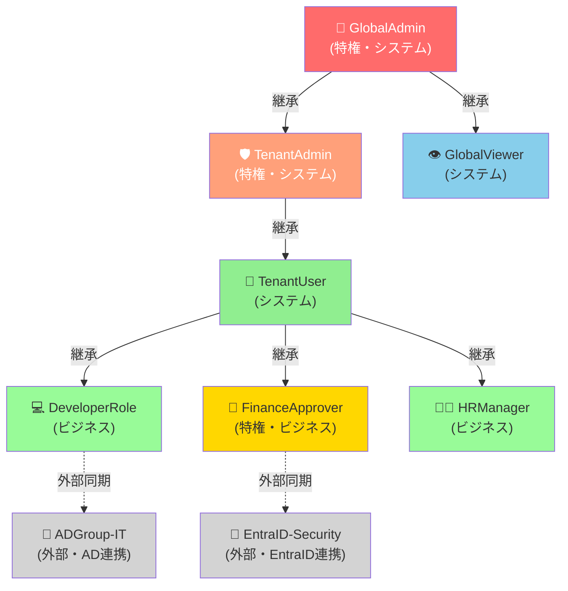

# ロール管理API 詳細仕様（Role Management API Specification）

| 項目 | 内容 |
|------|------|
| 文書番号 | API-ROLE-001 |
| バージョン | 1.0.0 |
| 作成日 | 2026-03-25 |
| 作成者 | ZeroTrust-ID-Governance チーム |
| ステータス | Draft |

---

## 1. 概要

本ドキュメントは、ZeroTrust-ID-Governance システムのロール管理APIの詳細仕様を定義します。
RBAC（Role-Based Access Control）モデルに基づき、ロールの作成・割り当て・取消を管理します。

### 1.1 ロールタイプ

| タイプ | 説明 | 例 |
|--------|------|-----|
| system | システム定義ロール（変更不可） | GlobalAdmin / TenantAdmin / GlobalViewer |
| business | ビジネス要件に基づくカスタムロール | DeveloperRole / FinanceApprover |
| external | 外部システム連携ロール | ADGroup-IT / EntraID-SecurityGroup |

### 1.2 必要ロール

| 操作 | 必要ロール |
|------|-----------|
| ロール一覧取得 | GlobalAdmin / TenantAdmin / GlobalViewer |
| ロール作成 | GlobalAdmin |
| ロール更新 | GlobalAdmin |
| ロール削除 | GlobalAdmin |
| ロール割り当て | GlobalAdmin / TenantAdmin |
| ロール取消 | GlobalAdmin / TenantAdmin |

### 1.3 特権ロール（Privileged Role）

`is_privileged: true` のロールは以下の追加制御が適用されます：

- 割り当て時に上位承認者の承認が必要
- 割り当て後に監査ログへ即時記録
- 定期的なアクセスレビュー（90日ごと）の対象
- Just-In-Time（JIT）アクセスオプション対応

---

## 2. エンドポイント一覧

| メソッド | パス | 説明 | 必要ロール |
|----------|------|------|-----------|
| GET | /roles | ロール一覧取得 | GlobalAdmin / TenantAdmin |
| POST | /roles | ロール作成 | GlobalAdmin |
| GET | /roles/{id} | ロール詳細取得 | GlobalAdmin / TenantAdmin |
| PUT | /roles/{id} | ロール更新 | GlobalAdmin |
| DELETE | /roles/{id} | ロール削除 | GlobalAdmin |
| POST | /roles/{id}/assign | ユーザーへのロール割り当て | GlobalAdmin / TenantAdmin |
| DELETE | /roles/{id}/revoke | ユーザーからのロール取消 | GlobalAdmin / TenantAdmin |
| GET | /roles/{id}/members | ロール所属ユーザー一覧 | GlobalAdmin / TenantAdmin |

---

## 3. GET /roles（ロール一覧取得）

### 3.1 概要

- **URL**: `GET /api/v1/roles`
- **認証**: Bearer トークン必須
- **必要ロール**: GlobalAdmin / TenantAdmin / GlobalViewer

### 3.2 クエリパラメータ

| パラメータ | 型 | 必須 | デフォルト | 説明 |
|------------|-----|------|-----------|------|
| page | integer | 任意 | 1 | ページ番号 |
| per_page | integer | 任意 | 20 | 1ページあたりの件数 |
| role_type | string | 任意 | - | ロールタイプフィルタ（system/business/external） |
| is_privileged | boolean | 任意 | - | 特権ロールフィルタ |
| tenant_id | string | 任意 | - | テナントIDフィルタ |
| search | string | 任意 | - | ロール名の部分一致検索 |

### 3.3 レスポンス（成功）

**HTTP 200 OK**

```json
{
  "items": [
    {
      "id": "role-uuid-0001",
      "name": "GlobalAdmin",
      "display_name": "グローバル管理者",
      "description": "全テナント・全機能への完全アクセス権を持つ最上位ロール",
      "role_type": "system",
      "is_privileged": true,
      "is_system": true,
      "tenant_id": null,
      "permissions": ["*"],
      "member_count": 3,
      "parent_role_id": null,
      "created_at": "2025-01-01T00:00:00Z",
      "updated_at": "2025-01-01T00:00:00Z"
    },
    {
      "id": "role-uuid-0002",
      "name": "TenantAdmin",
      "display_name": "テナント管理者",
      "description": "テナント内の全機能への管理権限",
      "role_type": "system",
      "is_privileged": true,
      "is_system": true,
      "tenant_id": "tenant-uuid-1234",
      "permissions": ["users:*", "roles:read", "roles:assign", "audit:read"],
      "member_count": 5,
      "parent_role_id": "role-uuid-0001",
      "created_at": "2025-01-01T00:00:00Z",
      "updated_at": "2025-01-01T00:00:00Z"
    },
    {
      "id": "role-uuid-0010",
      "name": "DeveloperRole",
      "display_name": "開発者ロール",
      "description": "開発環境へのアクセス権限",
      "role_type": "business",
      "is_privileged": false,
      "is_system": false,
      "tenant_id": "tenant-uuid-1234",
      "permissions": ["dev:read", "dev:write", "repo:access"],
      "member_count": 25,
      "parent_role_id": "role-uuid-0003",
      "created_at": "2025-03-01T09:00:00Z",
      "updated_at": "2025-03-01T09:00:00Z"
    }
  ],
  "pagination": {
    "total": 30,
    "page": 1,
    "per_page": 20,
    "total_pages": 2,
    "has_next": true,
    "has_prev": false
  }
}
```

---

## 4. POST /roles（ロール作成）

### 4.1 概要

- **URL**: `POST /api/v1/roles`
- **認証**: Bearer トークン必須
- **必要ロール**: GlobalAdmin
- **Content-Type**: `application/json`

### 4.2 リクエスト

```json
{
  "name": "FinanceApprover",
  "display_name": "財務承認者",
  "description": "財務システムの承認権限を持つロール",
  "role_type": "business",
  "is_privileged": true,
  "tenant_id": "tenant-uuid-1234",
  "parent_role_id": "role-uuid-0003",
  "permissions": [
    "finance:read",
    "finance:approve",
    "reports:read",
    "audit:read"
  ],
  "review_interval_days": 90,
  "max_assignment_days": 365
}
```

| フィールド | 型 | 必須 | 説明 |
|------------|-----|------|------|
| name | string | 必須 | ロール名（一意・英数字・アンダースコア） |
| display_name | string | 必須 | 表示名 |
| description | string | 任意 | 説明 |
| role_type | string | 必須 | ロールタイプ（business/external） |
| is_privileged | boolean | 必須 | 特権ロールフラグ |
| tenant_id | string | 任意 | テナントID（null の場合は全テナント共通） |
| parent_role_id | string | 任意 | 親ロールID（ロール継承） |
| permissions | array | 必須 | 権限スコープ一覧 |
| review_interval_days | integer | 任意 | アクセスレビュー間隔（日数） |
| max_assignment_days | integer | 任意 | 最大割り当て期間（日数） |

### 4.3 レスポンス（成功）

**HTTP 201 Created**

```json
{
  "id": "role-uuid-0020",
  "name": "FinanceApprover",
  "display_name": "財務承認者",
  "role_type": "business",
  "is_privileged": true,
  "tenant_id": "tenant-uuid-1234",
  "permissions": ["finance:read", "finance:approve", "reports:read", "audit:read"],
  "member_count": 0,
  "created_at": "2026-03-25T09:00:00Z",
  "created_by": "admin@example.com"
}
```

---

## 5. POST /roles/{id}/assign（ロール割り当て）

### 5.1 概要

指定ユーザーにロールを割り当てます。特権ロールの場合は承認フローを起動します。

- **URL**: `POST /api/v1/roles/{id}/assign`
- **認証**: Bearer トークン必須
- **必要ロール**: GlobalAdmin / TenantAdmin
- **Content-Type**: `application/json`

### 5.2 パスパラメータ

| パラメータ | 型 | 説明 |
|------------|-----|------|
| id | string | ロールID（UUID） |

### 5.3 リクエスト

```json
{
  "user_id": "user-uuid-0001",
  "reason": "財務システム移行プロジェクトのため",
  "expires_at": "2026-09-30T23:59:59Z",
  "notify_user": true,
  "skip_approval": false
}
```

| フィールド | 型 | 必須 | 説明 |
|------------|-----|------|------|
| user_id | string | 必須 | 割り当て先ユーザーID |
| reason | string | 必須 | 割り当て理由（監査ログ記録） |
| expires_at | string | 任意 | 有効期限（ISO 8601）。null の場合は無期限 |
| notify_user | boolean | 任意 | ユーザーへ通知メール送信 |
| skip_approval | boolean | 任意 | 承認スキップ（GlobalAdmin のみ有効） |

### 5.4 レスポンス（成功 - 即時割り当て）

**HTTP 200 OK**（非特権ロール、または skip_approval=true）

```json
{
  "assignment_id": "assign-uuid-0001",
  "role_id": "role-uuid-0010",
  "role_name": "DeveloperRole",
  "user_id": "user-uuid-0001",
  "user_name": "yamada.taro@example.com",
  "status": "assigned",
  "assigned_at": "2026-03-25T09:00:00Z",
  "assigned_by": "admin@example.com",
  "expires_at": null,
  "reason": "財務システム移行プロジェクトのため"
}
```

### 5.5 レスポンス（承認フロー起動）

**HTTP 202 Accepted**（特権ロール）

```json
{
  "assignment_id": "assign-uuid-0002",
  "role_id": "role-uuid-0020",
  "role_name": "FinanceApprover",
  "user_id": "user-uuid-0001",
  "status": "pending_approval",
  "workflow_id": "wf-uuid-0001",
  "approver_id": "user-uuid-0010",
  "approver_name": "佐藤 部長",
  "message": "特権ロールのため承認が必要です。承認者に通知しました。"
}
```

---

## 6. DELETE /roles/{id}/revoke（ロール取消）

### 6.1 概要

- **URL**: `DELETE /api/v1/roles/{id}/revoke`
- **認証**: Bearer トークン必須
- **必要ロール**: GlobalAdmin / TenantAdmin
- **Content-Type**: `application/json`

### 6.2 リクエスト

```json
{
  "user_id": "user-uuid-0001",
  "reason": "プロジェクト完了のためアクセス不要",
  "invalidate_active_sessions": true
}
```

### 6.3 レスポンス（成功）

**HTTP 200 OK**

```json
{
  "message": "ロールを取り消しました",
  "role_id": "role-uuid-0010",
  "role_name": "DeveloperRole",
  "user_id": "user-uuid-0001",
  "revoked_at": "2026-03-25T10:00:00Z",
  "revoked_by": "admin@example.com",
  "sessions_invalidated": 1
}
```

---

## 7. ロール階層図



---

## 8. 権限スコープ一覧

| スコープ | 説明 |
|----------|------|
| `*` | 全権限（GlobalAdmin のみ） |
| `users:read` | ユーザー情報の参照 |
| `users:write` | ユーザー情報の作成・更新 |
| `users:delete` | ユーザーの削除 |
| `roles:read` | ロール情報の参照 |
| `roles:assign` | ロールの割り当て・取消 |
| `roles:manage` | ロールの作成・更新・削除 |
| `audit:read` | 監査ログの参照 |
| `audit:export` | 監査ログのエクスポート |
| `finance:read` | 財務情報の参照 |
| `finance:approve` | 財務承認操作 |
| `dev:read` | 開発リソースの参照 |
| `dev:write` | 開発リソースの作成・更新 |
| `workflows:read` | ワークフロー情報の参照 |
| `workflows:manage` | ワークフローの管理 |

---

## 9. 関連ドキュメント

| ドキュメント | 参照先 |
|--------------|--------|
| 認証API | `02_認証API（Auth_API）.md` |
| ユーザー管理API | `03_ユーザー管理API（User_Management_API）.md` |
| アクセス申請API | `05_アクセス申請API（Access_Request_API）.md` |
| 監査ログAPI | `06_監査ログAPI（Audit_Log_API）.md` |
