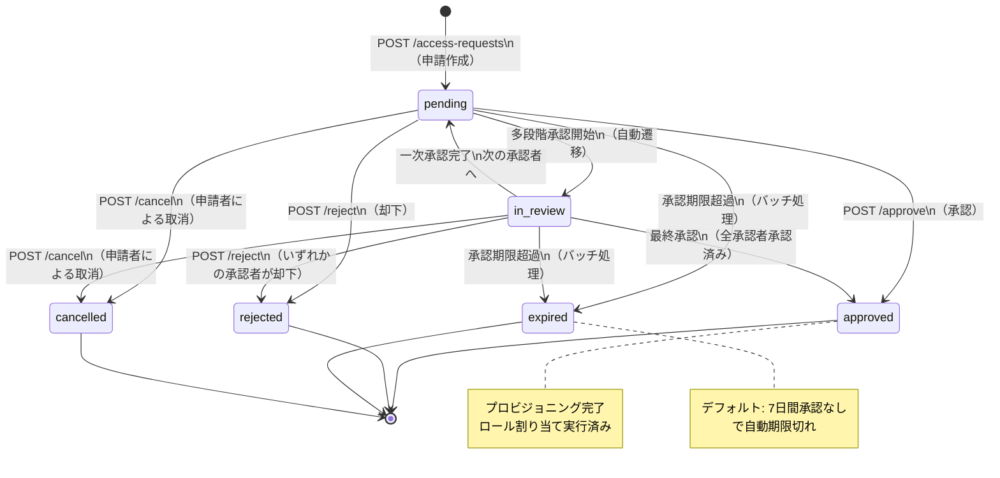

# アクセス申請API 詳細仕様（Access Request API Specification）

| 項目 | 内容 |
|------|------|
| 文書番号 | API-ACC-001 |
| バージョン | 1.0.0 |
| 作成日 | 2026-03-25 |
| 作成者 | ZeroTrust-ID-Governance チーム |
| ステータス | Draft |

---

## 1. 概要

本ドキュメントは、ZeroTrust-ID-Governance システムのアクセス申請・承認ワークフローAPIの詳細仕様を定義します。
ユーザーがロールやリソースへのアクセスを申請し、承認者が承認・却下する一連のワークフローを管理します。

### 1.1 必要ロール

| 操作 | 必要ロール |
|------|-----------|
| 申請一覧取得（全件） | GlobalAdmin / TenantAdmin / Auditor |
| 申請一覧取得（自分の申請） | 全認証ユーザー |
| 申請作成 | 全認証ユーザー |
| 申請詳細取得 | GlobalAdmin / TenantAdmin / 申請者 / 承認者 |
| 承認 | GlobalAdmin / TenantAdmin / 指定承認者 |
| 却下 | GlobalAdmin / TenantAdmin / 指定承認者 |

### 1.2 申請ステータス

| ステータス | 説明 |
|------------|------|
| pending | 承認待ち（初期状態） |
| approved | 承認済み・プロビジョニング完了 |
| rejected | 却下済み |
| expired | 期限切れ（承認されずに有効期限超過） |
| cancelled | 申請者による取消 |
| in_review | 多段階承認の審査中 |

---

## 2. エンドポイント一覧

| メソッド | パス | 説明 | 必要ロール |
|----------|------|------|-----------|
| GET | /access-requests | 申請一覧取得 | 認証ユーザー |
| POST | /access-requests | 申請作成 | 認証ユーザー |
| GET | /access-requests/{id} | 申請詳細取得 | 認証ユーザー（権限あり） |
| POST | /access-requests/{id}/approve | 承認 | 承認者ロール |
| POST | /access-requests/{id}/reject | 却下 | 承認者ロール |
| POST | /access-requests/{id}/cancel | 取消 | 申請者本人 |

---

## 3. GET /access-requests（申請一覧取得）

### 3.1 概要

- **URL**: `GET /api/v1/access-requests`
- **認証**: Bearer トークン必須
- **備考**: 一般ユーザーは自分の申請のみ取得可能。管理者は全件取得可能。

### 3.2 クエリパラメータ

| パラメータ | 型 | 必須 | デフォルト | 説明 |
|------------|-----|------|-----------|------|
| page | integer | 任意 | 1 | ページ番号 |
| per_page | integer | 任意 | 20 | 1ページあたりの件数 |
| status | string | 任意 | - | ステータスフィルタ（pending/approved/rejected/expired） |
| requester_id | string | 任意 | - | 申請者IDフィルタ |
| approver_id | string | 任意 | - | 承認者IDフィルタ |
| role_id | string | 任意 | - | 申請対象ロールIDフィルタ |
| from_date | string | 任意 | - | 申請日時（開始） ISO 8601 |
| to_date | string | 任意 | - | 申請日時（終了） ISO 8601 |
| my_approvals | boolean | 任意 | false | true の場合、自分が承認者の申請のみ取得 |

### 3.3 レスポンス（成功）

**HTTP 200 OK**

```json
{
  "items": [
    {
      "id": "req-uuid-0001",
      "request_number": "ACC-2026-00001",
      "requester_id": "user-uuid-0001",
      "requester_name": "山田 太郎",
      "target_user_id": "user-uuid-0001",
      "target_user_name": "山田 太郎",
      "role_id": "role-uuid-0020",
      "role_name": "FinanceApprover",
      "request_type": "role_assignment",
      "status": "pending",
      "reason": "財務システム移行プロジェクト参画のため",
      "priority": "normal",
      "approver_id": "user-uuid-0010",
      "approver_name": "佐藤 部長",
      "expires_at": "2026-04-01T23:59:59Z",
      "requested_access_expires_at": "2026-09-30T23:59:59Z",
      "created_at": "2026-03-25T09:00:00Z",
      "updated_at": "2026-03-25T09:00:00Z"
    },
    {
      "id": "req-uuid-0002",
      "request_number": "ACC-2026-00002",
      "requester_id": "user-uuid-0002",
      "requester_name": "鈴木 花子",
      "target_user_id": "user-uuid-0002",
      "target_user_name": "鈴木 花子",
      "role_id": "role-uuid-0010",
      "role_name": "DeveloperRole",
      "request_type": "role_assignment",
      "status": "approved",
      "reason": "新規プロジェクトアサインのため",
      "priority": "high",
      "approver_id": "user-uuid-0011",
      "approver_name": "田中 マネージャー",
      "approved_at": "2026-03-24T15:00:00Z",
      "expires_at": "2026-04-01T23:59:59Z",
      "requested_access_expires_at": null,
      "created_at": "2026-03-24T10:00:00Z",
      "updated_at": "2026-03-24T15:00:00Z"
    }
  ],
  "pagination": {
    "total": 42,
    "page": 1,
    "per_page": 20,
    "total_pages": 3,
    "has_next": true,
    "has_prev": false
  }
}
```

---

## 4. POST /access-requests（申請作成）

### 4.1 概要

- **URL**: `POST /api/v1/access-requests`
- **認証**: Bearer トークン必須
- **必要ロール**: 全認証ユーザー
- **Content-Type**: `application/json`

### 4.2 リクエスト

```json
{
  "target_user_id": "user-uuid-0001",
  "role_id": "role-uuid-0020",
  "request_type": "role_assignment",
  "reason": "財務システム移行プロジェクト参画のため、財務承認権限が必要です",
  "priority": "normal",
  "requested_access_expires_at": "2026-09-30T23:59:59Z",
  "business_justification": "プロジェクトコード: PROJ-2026-001\n承認済み予算: ¥5,000,000",
  "attachments": [
    {
      "name": "project_approval.pdf",
      "url": "https://storage.example.com/docs/project_approval.pdf"
    }
  ]
}
```

| フィールド | 型 | 必須 | 説明 |
|------------|-----|------|------|
| target_user_id | string | 必須 | アクセス付与対象ユーザーID |
| role_id | string | 必須（role_assignment時） | 申請対象ロールID |
| request_type | string | 必須 | 申請タイプ（role_assignment/resource_access/temporary_access） |
| reason | string | 必須 | 申請理由（必須・最低50文字推奨） |
| priority | string | 任意 | 優先度（low/normal/high/urgent） |
| requested_access_expires_at | string | 任意 | 申請するアクセス権の有効期限（ISO 8601） |
| business_justification | string | 任意 | ビジネス上の根拠（特権ロール申請時は必須） |
| attachments | array | 任意 | 添付ファイル一覧 |

### 4.3 レスポンス（成功）

**HTTP 201 Created**

```json
{
  "id": "req-uuid-0003",
  "request_number": "ACC-2026-00003",
  "requester_id": "user-uuid-0001",
  "target_user_id": "user-uuid-0001",
  "role_id": "role-uuid-0020",
  "role_name": "FinanceApprover",
  "status": "pending",
  "reason": "財務システム移行プロジェクト参画のため、財務承認権限が必要です",
  "priority": "normal",
  "approver_id": "user-uuid-0010",
  "approver_name": "佐藤 部長",
  "expires_at": "2026-04-01T23:59:59Z",
  "requested_access_expires_at": "2026-09-30T23:59:59Z",
  "notification_sent": true,
  "created_at": "2026-03-25T09:30:00Z"
}
```

### 4.4 エラーレスポンス

**HTTP 409 Conflict** - 重複申請

```json
{
  "error": "DUPLICATE_REQUEST",
  "message": "同一ロールに対する申請が既に存在します",
  "code": 409,
  "existing_request_id": "req-uuid-0001",
  "request_id": "req-uuid-system"
}
```

---

## 5. GET /access-requests/{id}（申請詳細取得）

### 5.1 概要

- **URL**: `GET /api/v1/access-requests/{id}`
- **認証**: Bearer トークン必須

### 5.2 レスポンス（成功）

**HTTP 200 OK**

```json
{
  "id": "req-uuid-0001",
  "request_number": "ACC-2026-00001",
  "requester": {
    "id": "user-uuid-0001",
    "name": "山田 太郎",
    "email": "yamada.taro@example.com",
    "department": "情報システム部"
  },
  "target_user": {
    "id": "user-uuid-0001",
    "name": "山田 太郎",
    "email": "yamada.taro@example.com"
  },
  "role": {
    "id": "role-uuid-0020",
    "name": "FinanceApprover",
    "display_name": "財務承認者",
    "is_privileged": true
  },
  "request_type": "role_assignment",
  "status": "pending",
  "reason": "財務システム移行プロジェクト参画のため、財務承認権限が必要です",
  "business_justification": "プロジェクトコード: PROJ-2026-001",
  "priority": "normal",
  "approver": {
    "id": "user-uuid-0010",
    "name": "佐藤 部長",
    "email": "sato.manager@example.com"
  },
  "approval_history": [],
  "expires_at": "2026-04-01T23:59:59Z",
  "requested_access_expires_at": "2026-09-30T23:59:59Z",
  "attachments": [],
  "created_at": "2026-03-25T09:00:00Z",
  "updated_at": "2026-03-25T09:00:00Z"
}
```

---

## 6. POST /access-requests/{id}/approve（承認）

### 6.1 概要

- **URL**: `POST /api/v1/access-requests/{id}/approve`
- **認証**: Bearer トークン必須
- **必要ロール**: 指定承認者 / TenantAdmin / GlobalAdmin
- **Content-Type**: `application/json`

### 6.2 リクエスト

```json
{
  "comment": "プロジェクトの必要性を確認しました。承認します。",
  "modify_expires_at": "2026-09-30T23:59:59Z"
}
```

| フィールド | 型 | 必須 | 説明 |
|------------|-----|------|------|
| comment | string | 必須 | 承認コメント |
| modify_expires_at | string | 任意 | 有効期限の変更（省略時は申請通り） |

### 6.3 レスポンス（成功）

**HTTP 200 OK**

```json
{
  "id": "req-uuid-0001",
  "request_number": "ACC-2026-00001",
  "status": "approved",
  "approved_at": "2026-03-25T10:00:00Z",
  "approved_by": "sato.manager@example.com",
  "comment": "プロジェクトの必要性を確認しました。承認します。",
  "provisioning_status": "completed",
  "role_assigned_at": "2026-03-25T10:00:05Z",
  "access_expires_at": "2026-09-30T23:59:59Z",
  "notification_sent": true
}
```

---

## 7. POST /access-requests/{id}/reject（却下）

### 7.1 概要

- **URL**: `POST /api/v1/access-requests/{id}/reject`
- **認証**: Bearer トークン必須
- **必要ロール**: 指定承認者 / TenantAdmin / GlobalAdmin
- **Content-Type**: `application/json`

### 7.2 リクエスト

```json
{
  "reason": "現時点では業務上の必要性が認められません。再度必要になった場合は上長の承認書を添付してください。"
}
```

| フィールド | 型 | 必須 | 説明 |
|------------|-----|------|------|
| reason | string | 必須 | 却下理由（必須） |

### 7.3 レスポンス（成功）

**HTTP 200 OK**

```json
{
  "id": "req-uuid-0001",
  "request_number": "ACC-2026-00001",
  "status": "rejected",
  "rejected_at": "2026-03-25T10:00:00Z",
  "rejected_by": "sato.manager@example.com",
  "reason": "現時点では業務上の必要性が認められません。再度必要になった場合は上長の承認書を添付してください。",
  "notification_sent": true
}
```

---

## 8. 申請ステータス遷移図



---

## 9. 承認者の自動決定ロジック

申請作成時、以下のロジックで承認者を自動決定します：

```
1. ロールの is_privileged = true の場合
   → GlobalAdmin または TenantAdmin を承認者に設定

2. 申請者の直属マネージャーが TenantAdmin の場合
   → 直属マネージャーを承認者に設定

3. 申請対象ロールに approval_group が設定されている場合
   → そのグループのメンバーをラウンドロビンで割り当て

4. 上記いずれにも該当しない場合
   → TenantAdmin 全員を承認者に設定（いずれかが承認・却下）
```

---

## 10. 関連ドキュメント

| ドキュメント | 参照先 |
|--------------|--------|
| ロール管理API | `04_ロール管理API（Role_Management_API）.md` |
| ワークフローAPI | `07_ワークフローAPI（Workflow_API）.md` |
| 監査ログAPI | `06_監査ログAPI（Audit_Log_API）.md` |
