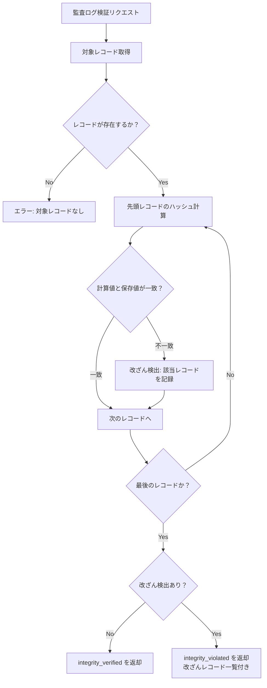

# 監査ログAPI 詳細仕様（Audit Log API Specification）

| 項目 | 内容 |
|------|------|
| 文書番号 | API-AUD-001 |
| バージョン | 1.0.0 |
| 作成日 | 2026-03-25 |
| 作成者 | ZeroTrust-ID-Governance チーム |
| ステータス | Draft |

---

## 1. 概要

本ドキュメントは、ZeroTrust-ID-Governance システムの監査ログAPIの詳細仕様を定義します。
全ての重要操作を監査ログとして記録し、改ざん防止のために SHA-256 ハッシュチェーンを適用します。

### 1.1 必要ロール

| 操作 | 必要ロール |
|------|-----------|
| 監査ログ一覧取得 | GlobalAdmin / TenantAdmin / Auditor |
| 監査ログ詳細取得 | GlobalAdmin / TenantAdmin / Auditor |
| 監査ログエクスポート | GlobalAdmin / Auditor |
| ハッシュ検証 | GlobalAdmin / Auditor |

### 1.2 データ保存ポリシー

| 項目 | 設定値 |
|------|--------|
| 保存期間 | 7年間（法的要件準拠） |
| ストレージ | PostgreSQL（ホットデータ 1年）+ アーカイブ（1年以降） |
| 暗号化 | AES-256（保存時）/ TLS 1.2+（転送時） |
| ハッシュアルゴリズム | SHA-256 チェーン |
| バックアップ | 日次バックアップ・オフサイト保管 |

---

## 2. イベントタイプ一覧

| イベントタイプ | カテゴリ | 説明 |
|----------------|----------|------|
| LOGIN | 認証 | ログイン成功 |
| LOGIN_FAILED | 認証 | ログイン失敗 |
| LOGOUT | 認証 | ログアウト |
| TOKEN_REFRESH | 認証 | トークン更新 |
| ACCOUNT_LOCKED | 認証 | アカウントロック |
| ACCOUNT_UNLOCKED | 認証 | アカウントロック解除 |
| MFA_ENABLED | 認証 | MFA 有効化 |
| MFA_DISABLED | 認証 | MFA 無効化 |
| USER_CREATE | ユーザー管理 | ユーザー作成 |
| USER_UPDATE | ユーザー管理 | ユーザー情報更新 |
| USER_DELETE | ユーザー管理 | ユーザー削除 |
| USER_STATUS_CHANGE | ユーザー管理 | ステータス変更（active/disabled） |
| ROLE_CREATE | ロール管理 | ロール作成 |
| ROLE_UPDATE | ロール管理 | ロール更新 |
| ROLE_DELETE | ロール管理 | ロール削除 |
| ROLE_ASSIGN | ロール管理 | ロール割り当て |
| ROLE_REVOKE | ロール管理 | ロール取消 |
| ACCESS_REQUEST_CREATE | アクセス申請 | アクセス申請作成 |
| ACCESS_REQUEST_APPROVE | アクセス申請 | アクセス申請承認 |
| ACCESS_REQUEST_REJECT | アクセス申請 | アクセス申請却下 |
| ACCESS_REQUEST_CANCEL | アクセス申請 | アクセス申請取消 |
| ACCESS_REQUEST_EXPIRE | アクセス申請 | アクセス申請期限切れ |
| WORKFLOW_START | ワークフロー | ワークフロー開始 |
| WORKFLOW_COMPLETE | ワークフロー | ワークフロー完了 |
| WORKFLOW_FAIL | ワークフロー | ワークフロー失敗 |
| AUDIT_LOG_EXPORT | 監査 | 監査ログエクスポート |
| AUDIT_LOG_VIEW | 監査 | 監査ログ参照 |
| SECURITY_ALERT | セキュリティ | セキュリティアラート |
| CONFIG_CHANGE | システム | システム設定変更 |

---

## 3. エンドポイント一覧

| メソッド | パス | 説明 | 必要ロール |
|----------|------|------|-----------|
| GET | /audit-logs | 監査ログ一覧取得 | GlobalAdmin / Auditor |
| GET | /audit-logs/{id} | 監査ログ詳細取得 | GlobalAdmin / Auditor |
| GET | /audit-logs/export | CSV エクスポート | GlobalAdmin / Auditor |
| POST | /audit-logs/verify | ハッシュ整合性検証 | GlobalAdmin / Auditor |

---

## 4. GET /audit-logs（監査ログ一覧取得）

### 4.1 概要

- **URL**: `GET /api/v1/audit-logs`
- **認証**: Bearer トークン必須
- **必要ロール**: GlobalAdmin / TenantAdmin / Auditor

### 4.2 フィルタパラメータ

| パラメータ | 型 | 必須 | デフォルト | 説明 |
|------------|-----|------|-----------|------|
| page | integer | 任意 | 1 | ページ番号 |
| per_page | integer | 任意 | 50 | 1ページあたりの件数（最大200） |
| event_type | string | 任意 | - | イベントタイプフィルタ（複数指定可: `event_type=LOGIN,LOGOUT`） |
| actor_id | string | 任意 | - | 操作者ユーザーIDフィルタ |
| actor_name | string | 任意 | - | 操作者名フィルタ（部分一致） |
| resource_type | string | 任意 | - | リソースタイプフィルタ（user/role/access_request/workflow） |
| resource_id | string | 任意 | - | リソースIDフィルタ |
| tenant_id | string | 任意 | - | テナントIDフィルタ |
| from_date | string | 任意 | - | ログ日時（開始）ISO 8601 |
| to_date | string | 任意 | - | ログ日時（終了）ISO 8601 |
| severity | string | 任意 | - | 重要度フィルタ（info/warning/critical） |
| result | string | 任意 | - | 結果フィルタ（success/failure） |
| ip_address | string | 任意 | - | IPアドレスフィルタ |
| sort_by | string | 任意 | occurred_at | ソートカラム |
| sort_order | string | 任意 | desc | ソート順（asc/desc） |

### 4.3 レスポンス（成功）

**HTTP 200 OK**

```json
{
  "items": [
    {
      "id": "log-uuid-0001",
      "sequence_number": 1042,
      "event_type": "LOGIN",
      "category": "認証",
      "severity": "info",
      "result": "success",
      "actor": {
        "id": "user-uuid-0001",
        "username": "yamada.taro@example.com",
        "display_name": "山田 太郎",
        "ip_address": "192.168.1.100",
        "user_agent": "Mozilla/5.0 (Windows NT 10.0; Win64; x64)...",
        "idp": "entra_id"
      },
      "resource": {
        "type": "session",
        "id": "session-uuid-abcd",
        "name": "Webセッション"
      },
      "tenant_id": "tenant-uuid-1234",
      "details": {
        "mfa_used": true,
        "mfa_type": "totp",
        "session_duration_limit": 900
      },
      "occurred_at": "2026-03-25T08:00:00Z",
      "hash": "a3f5b2c1d4e6...",
      "prev_hash": "9e8d7c6b5a4f..."
    },
    {
      "id": "log-uuid-0002",
      "sequence_number": 1043,
      "event_type": "ROLE_ASSIGN",
      "category": "ロール管理",
      "severity": "warning",
      "result": "success",
      "actor": {
        "id": "user-uuid-0010",
        "username": "sato.manager@example.com",
        "display_name": "佐藤 部長",
        "ip_address": "192.168.1.50",
        "user_agent": "Mozilla/5.0 (Macintosh; Intel Mac OS X 10_15_7)..."
      },
      "resource": {
        "type": "role_assignment",
        "id": "assign-uuid-0001",
        "name": "FinanceApprover → 山田 太郎"
      },
      "tenant_id": "tenant-uuid-1234",
      "details": {
        "role_id": "role-uuid-0020",
        "role_name": "FinanceApprover",
        "is_privileged": true,
        "target_user_id": "user-uuid-0001",
        "target_user_name": "山田 太郎",
        "request_id": "req-uuid-0001",
        "access_expires_at": "2026-09-30T23:59:59Z"
      },
      "occurred_at": "2026-03-25T10:00:00Z",
      "hash": "b4g6c3d5e7f1...",
      "prev_hash": "a3f5b2c1d4e6..."
    }
  ],
  "pagination": {
    "total": 10420,
    "page": 1,
    "per_page": 50,
    "total_pages": 209,
    "has_next": true,
    "has_prev": false
  },
  "summary": {
    "total_events": 10420,
    "by_severity": {
      "info": 9800,
      "warning": 580,
      "critical": 40
    },
    "by_result": {
      "success": 10100,
      "failure": 320
    }
  }
}
```

---

## 5. GET /audit-logs/export（CSV エクスポート）

### 5.1 概要

- **URL**: `GET /api/v1/audit-logs/export`
- **認証**: Bearer トークン必須
- **必要ロール**: GlobalAdmin / Auditor
- **レスポンスContent-Type**: `text/csv; charset=utf-8`

### 5.2 クエリパラメータ

| パラメータ | 型 | 必須 | 説明 |
|------------|-----|------|------|
| from_date | string | 必須 | エクスポート開始日時（ISO 8601） |
| to_date | string | 必須 | エクスポート終了日時（ISO 8601） |
| event_type | string | 任意 | イベントタイプフィルタ |
| format | string | 任意 | 出力形式（csv/json）デフォルト: csv |
| include_hash | boolean | 任意 | ハッシュ値を含めるか（デフォルト: true） |

### 5.3 レスポンスヘッダー（CSV）

```
Content-Type: text/csv; charset=utf-8
Content-Disposition: attachment; filename="audit-log-2026-03-25.csv"
X-Total-Records: 1042
X-Export-Generated-At: 2026-03-25T11:00:00Z
```

### 5.4 CSV 出力例

```
sequence_number,id,event_type,category,severity,result,actor_id,actor_name,actor_ip,resource_type,resource_id,resource_name,tenant_id,occurred_at,hash
1042,log-uuid-0001,LOGIN,認証,info,success,user-uuid-0001,山田 太郎,192.168.1.100,session,session-uuid-abcd,Webセッション,tenant-uuid-1234,2026-03-25T08:00:00Z,a3f5b2c1d4e6...
1043,log-uuid-0002,ROLE_ASSIGN,ロール管理,warning,success,user-uuid-0010,佐藤 部長,192.168.1.50,role_assignment,assign-uuid-0001,FinanceApprover → 山田 太郎,tenant-uuid-1234,2026-03-25T10:00:00Z,b4g6c3d5e7f1...
```

### 5.5 エクスポート要求時の監査ログ記録

エクスポート操作自体も監査ログに記録されます。

```json
{
  "event_type": "AUDIT_LOG_EXPORT",
  "actor_id": "user-uuid-0010",
  "details": {
    "from_date": "2026-03-01T00:00:00Z",
    "to_date": "2026-03-25T23:59:59Z",
    "total_records": 1042,
    "format": "csv"
  }
}
```

---

## 6. POST /audit-logs/verify（ハッシュ整合性検証）

### 6.1 概要

指定した範囲の監査ログのハッシュチェーンを検証し、改ざんの有無を確認します。

- **URL**: `POST /api/v1/audit-logs/verify`
- **認証**: Bearer トークン必須
- **必要ロール**: GlobalAdmin / Auditor

### 6.2 リクエスト

```json
{
  "from_sequence": 1000,
  "to_sequence": 1043
}
```

### 6.3 レスポンス（成功 - 改ざんなし）

**HTTP 200 OK**

```json
{
  "verification_result": "integrity_verified",
  "from_sequence": 1000,
  "to_sequence": 1043,
  "records_checked": 44,
  "verified_at": "2026-03-25T11:30:00Z",
  "verified_by": "auditor@example.com",
  "details": {
    "hash_chain_valid": true,
    "tampered_records": []
  }
}
```

### 6.4 レスポンス（改ざん検出）

**HTTP 200 OK**（HTTP ステータスは 200 だが verification_result が integrity_violated）

```json
{
  "verification_result": "integrity_violated",
  "from_sequence": 1000,
  "to_sequence": 1043,
  "records_checked": 44,
  "verified_at": "2026-03-25T11:30:00Z",
  "details": {
    "hash_chain_valid": false,
    "tampered_records": [
      {
        "sequence_number": 1025,
        "log_id": "log-uuid-0025",
        "expected_hash": "c5h7d4e6f8g2...",
        "actual_hash": "x9y8z7w6v5u4...",
        "occurred_at": "2026-03-24T15:30:00Z"
      }
    ]
  }
}
```

---

## 7. ハッシュ検証の仕組み

### 7.1 SHA-256 チェーン構造

各監査ログレコードのハッシュは以下の内容から計算されます：

```
hash = SHA256(
  sequence_number +
  event_type +
  actor_id +
  resource_id +
  occurred_at +
  prev_hash       ← 前のレコードのハッシュ（チェーン）
)
```

### 7.2 改ざん検出フロー



---

## 8. セキュリティ考慮事項

### 8.1 アクセス制御

- 監査ログの参照は GlobalAdmin / TenantAdmin / Auditor ロールに限定
- テナント管理者は自テナントのログのみ参照可能
- 監査ログ自体を削除・更新する API は提供しない（物理削除不可）

### 8.2 個人情報保護

- エクスポートデータには個人情報が含まれるため、ダウンロードは HTTPS 必須
- エクスポートファイルは一時 URL（有効期限: 30分）で提供
- 大量エクスポート（10万件以上）は非同期処理（バックグラウンドジョブ）

### 8.3 ログの完全性

- 監査ログは追記のみ（INSERT）。UPDATE/DELETE は禁止
- ハッシュチェーンにより連続したレコードの整合性を保証
- PostgreSQL の行レベルセキュリティ（RLS）でアクセス制御

---

## 9. 関連ドキュメント

| ドキュメント | 参照先 |
|--------------|--------|
| 認証API | `02_認証API（Auth_API）.md` |
| ユーザー管理API | `03_ユーザー管理API（User_Management_API）.md` |
| ロール管理API | `04_ロール管理API（Role_Management_API）.md` |
| アクセス申請API | `05_アクセス申請API（Access_Request_API）.md` |
