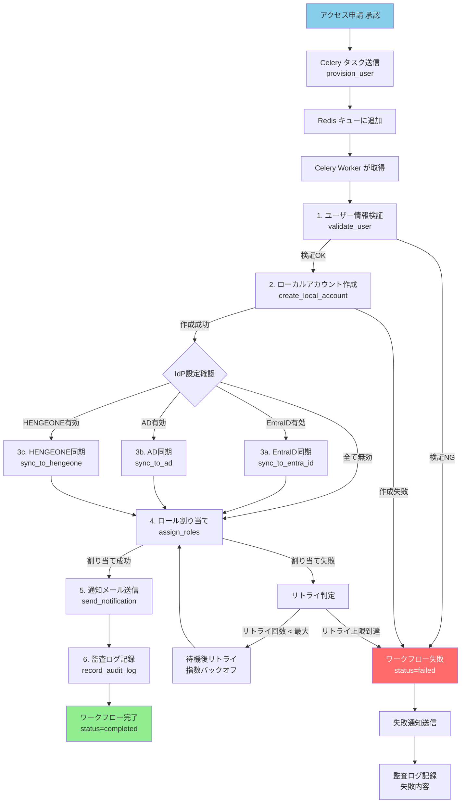

# ワークフローAPI 詳細仕様（Workflow API Specification）

| 項目 | 内容 |
|------|------|
| 文書番号 | API-WF-001 |
| バージョン | 1.0.0 |
| 作成日 | 2026-03-25 |
| 作成者 | ZeroTrust-ID-Governance チーム |
| ステータス | Draft |

---

## 1. 概要

本ドキュメントは、ZeroTrust-ID-Governance システムのプロビジョニングワークフローAPIの詳細仕様を定義します。
Celery（分散タスクキュー）を使用した非同期ワークフローの状態管理・進捗確認 API を提供します。

### 1.1 必要ロール

| 操作 | 必要ロール |
|------|-----------|
| ワークフロー一覧取得 | GlobalAdmin / TenantAdmin / GlobalViewer |
| ワークフロー詳細取得 | GlobalAdmin / TenantAdmin / 関係者 |
| ワークフロー手動キャンセル | GlobalAdmin / TenantAdmin |
| ワークフロー再実行 | GlobalAdmin |

### 1.2 ワークフローステータス

| ステータス | 説明 |
|------------|------|
| pending | キュー待ち（Celery への送信完了） |
| in_progress | 実行中（Celery Worker が処理中） |
| completed | 正常完了 |
| failed | 失敗（エラー発生） |
| cancelled | キャンセル済み |
| retrying | 失敗後リトライ中 |

### 1.3 Celery タスク一覧

| タスク名 | 説明 | タイムアウト |
|----------|------|------------|
| `provision_user` | ユーザープロビジョニング（アカウント作成・ロール付与・IdP同期） | 300秒 |
| `deprovision_user` | ユーザーデプロビジョニング（アカウント無効化・ロール取消・セッション削除） | 300秒 |
| `account_review` | アクセスレビュー（期限切れアクセス権のレビュー送付・自動取消） | 600秒 |
| `sync_identities` | IdP同期（EntraID/AD/HENGEONE からユーザー・グループ情報を同期） | 1800秒 |
| `role_assign_workflow` | 特権ロール割り当てワークフロー（承認→プロビジョニング） | 60秒 |
| `generate_access_report` | アクセスレポート生成 | 900秒 |

---

## 2. エンドポイント一覧

| メソッド | パス | 説明 | 必要ロール |
|----------|------|------|-----------|
| GET | /workflows | ワークフロー一覧取得 | GlobalAdmin / TenantAdmin |
| GET | /workflows/{id} | ワークフロー詳細・進捗取得 | GlobalAdmin / TenantAdmin |
| POST | /workflows/{id}/cancel | ワークフローキャンセル | GlobalAdmin / TenantAdmin |
| POST | /workflows/{id}/retry | ワークフロー再実行 | GlobalAdmin |

---

## 3. GET /workflows（ワークフロー一覧取得）

### 3.1 概要

- **URL**: `GET /api/v1/workflows`
- **認証**: Bearer トークン必須
- **必要ロール**: GlobalAdmin / TenantAdmin / GlobalViewer

### 3.2 クエリパラメータ

| パラメータ | 型 | 必須 | デフォルト | 説明 |
|------------|-----|------|-----------|------|
| page | integer | 任意 | 1 | ページ番号 |
| per_page | integer | 任意 | 20 | 1ページあたりの件数 |
| status | string | 任意 | - | ステータスフィルタ（pending/in_progress/completed/failed/cancelled） |
| task_name | string | 任意 | - | タスク名フィルタ |
| triggered_by | string | 任意 | - | 起動者ユーザーIDフィルタ |
| tenant_id | string | 任意 | - | テナントIDフィルタ |
| from_date | string | 任意 | - | 開始日時（ISO 8601） |
| to_date | string | 任意 | - | 終了日時（ISO 8601） |

### 3.3 レスポンス（成功）

**HTTP 200 OK**

```json
{
  "items": [
    {
      "id": "wf-uuid-0001",
      "workflow_number": "WF-2026-00001",
      "task_name": "provision_user",
      "task_display_name": "ユーザープロビジョニング",
      "status": "completed",
      "celery_task_id": "celery-task-uuid-abcd",
      "trigger_type": "access_request_approved",
      "trigger_ref": {
        "type": "access_request",
        "id": "req-uuid-0001",
        "number": "ACC-2026-00001"
      },
      "target": {
        "type": "user",
        "id": "user-uuid-0001",
        "name": "山田 太郎"
      },
      "triggered_by": {
        "id": "user-uuid-0010",
        "name": "佐藤 部長"
      },
      "tenant_id": "tenant-uuid-1234",
      "started_at": "2026-03-25T10:00:00Z",
      "completed_at": "2026-03-25T10:00:45Z",
      "duration_seconds": 45,
      "retry_count": 0,
      "created_at": "2026-03-25T10:00:00Z"
    },
    {
      "id": "wf-uuid-0002",
      "workflow_number": "WF-2026-00002",
      "task_name": "sync_identities",
      "task_display_name": "IdP同期",
      "status": "in_progress",
      "celery_task_id": "celery-task-uuid-efgh",
      "trigger_type": "scheduled",
      "trigger_ref": {
        "type": "schedule",
        "id": "cron-daily-sync",
        "name": "日次IdP同期"
      },
      "target": {
        "type": "tenant",
        "id": "tenant-uuid-1234",
        "name": "テナント A"
      },
      "triggered_by": {
        "id": "system",
        "name": "システム（スケジューラー）"
      },
      "tenant_id": "tenant-uuid-1234",
      "started_at": "2026-03-25T02:00:00Z",
      "completed_at": null,
      "duration_seconds": null,
      "retry_count": 0,
      "created_at": "2026-03-25T02:00:00Z"
    }
  ],
  "pagination": {
    "total": 58,
    "page": 1,
    "per_page": 20,
    "total_pages": 3,
    "has_next": true,
    "has_prev": false
  }
}
```

---

## 4. GET /workflows/{id}（ワークフロー詳細・進捗確認）

### 4.1 概要

ワークフローの詳細情報と各ステップの進捗状況を取得します。

- **URL**: `GET /api/v1/workflows/{id}`
- **認証**: Bearer トークン必須
- **必要ロール**: GlobalAdmin / TenantAdmin / GlobalViewer

### 4.2 パスパラメータ

| パラメータ | 型 | 説明 |
|------------|-----|------|
| id | string | ワークフローID（UUID） |

### 4.3 レスポンス（成功 - provision_user 完了）

**HTTP 200 OK**

```json
{
  "id": "wf-uuid-0001",
  "workflow_number": "WF-2026-00001",
  "task_name": "provision_user",
  "task_display_name": "ユーザープロビジョニング",
  "status": "completed",
  "celery_task_id": "celery-task-uuid-abcd",
  "celery_queue": "default",
  "celery_worker": "worker-01@hostname",
  "trigger_type": "access_request_approved",
  "trigger_ref": {
    "type": "access_request",
    "id": "req-uuid-0001",
    "number": "ACC-2026-00001"
  },
  "target": {
    "type": "user",
    "id": "user-uuid-0001",
    "name": "山田 太郎",
    "email": "yamada.taro@example.com"
  },
  "triggered_by": {
    "id": "user-uuid-0010",
    "name": "佐藤 部長"
  },
  "tenant_id": "tenant-uuid-1234",
  "steps": [
    {
      "step_number": 1,
      "step_name": "validate_user",
      "step_display_name": "ユーザー情報検証",
      "status": "completed",
      "started_at": "2026-03-25T10:00:00Z",
      "completed_at": "2026-03-25T10:00:02Z",
      "duration_seconds": 2,
      "result": {
        "valid": true,
        "checks_passed": ["email_format", "tenant_exists", "role_valid"]
      }
    },
    {
      "step_number": 2,
      "step_name": "create_local_account",
      "step_display_name": "ローカルアカウント作成",
      "status": "completed",
      "started_at": "2026-03-25T10:00:02Z",
      "completed_at": "2026-03-25T10:00:05Z",
      "duration_seconds": 3,
      "result": {
        "user_id": "user-uuid-0001",
        "created": true
      }
    },
    {
      "step_number": 3,
      "step_name": "sync_to_idp",
      "step_display_name": "IdPへのアカウント同期",
      "status": "completed",
      "started_at": "2026-03-25T10:00:05Z",
      "completed_at": "2026-03-25T10:00:30Z",
      "duration_seconds": 25,
      "result": {
        "entra_id_synced": true,
        "entra_object_id": "entra-object-id-abcd",
        "ad_synced": false,
        "ad_skip_reason": "テナント設定でAD無効"
      }
    },
    {
      "step_number": 4,
      "step_name": "assign_roles",
      "step_display_name": "ロール割り当て",
      "status": "completed",
      "started_at": "2026-03-25T10:00:30Z",
      "completed_at": "2026-03-25T10:00:35Z",
      "duration_seconds": 5,
      "result": {
        "roles_assigned": ["FinanceApprover"],
        "roles_count": 1
      }
    },
    {
      "step_number": 5,
      "step_name": "send_notification",
      "step_display_name": "通知メール送信",
      "status": "completed",
      "started_at": "2026-03-25T10:00:35Z",
      "completed_at": "2026-03-25T10:00:40Z",
      "duration_seconds": 5,
      "result": {
        "email_sent": true,
        "recipient": "yamada.taro@example.com"
      }
    },
    {
      "step_number": 6,
      "step_name": "record_audit_log",
      "step_display_name": "監査ログ記録",
      "status": "completed",
      "started_at": "2026-03-25T10:00:40Z",
      "completed_at": "2026-03-25T10:00:45Z",
      "duration_seconds": 5,
      "result": {
        "audit_log_id": "log-uuid-0002"
      }
    }
  ],
  "result": {
    "success": true,
    "summary": "ユーザープロビジョニングが正常に完了しました"
  },
  "error": null,
  "retry_count": 0,
  "max_retries": 3,
  "started_at": "2026-03-25T10:00:00Z",
  "completed_at": "2026-03-25T10:00:45Z",
  "duration_seconds": 45,
  "created_at": "2026-03-25T10:00:00Z"
}
```

### 4.4 レスポンス（失敗時）

**HTTP 200 OK**（ステータスは `failed`）

```json
{
  "id": "wf-uuid-0003",
  "workflow_number": "WF-2026-00003",
  "task_name": "sync_identities",
  "status": "failed",
  "steps": [
    {
      "step_number": 1,
      "step_name": "connect_to_entra_id",
      "status": "failed",
      "error": {
        "code": "IDP_CONNECTION_TIMEOUT",
        "message": "EntraID への接続がタイムアウトしました（30秒）",
        "occurred_at": "2026-03-25T02:05:30Z"
      }
    }
  ],
  "error": {
    "code": "IDP_CONNECTION_TIMEOUT",
    "message": "EntraID への接続がタイムアウトしました",
    "stack_trace": "ConnectionTimeoutError: ...",
    "occurred_at": "2026-03-25T02:05:30Z"
  },
  "retry_count": 3,
  "max_retries": 3,
  "next_retry_at": null,
  "started_at": "2026-03-25T02:00:00Z",
  "completed_at": "2026-03-25T02:20:00Z"
}
```

---

## 5. Celery タスク連携詳細

### 5.1 タスク構成

```
Celery ブローカー: Redis
Celery バックエンド: Redis（タスク結果保存）
ワーカー数: デフォルト 4（スケーラブル）
```

### 5.2 provision_user タスク

ユーザー作成承認後に自動起動されます。

```
起動条件: アクセス申請承認 (POST /access-requests/{id}/approve)
キュー: high_priority
タイムアウト: 300秒
最大リトライ: 3回
リトライ間隔: 指数バックオフ（10秒, 20秒, 40秒）
```

処理ステップ:
1. `validate_user` - 入力データ検証
2. `create_local_account` - PostgreSQL にユーザーレコード作成
3. `sync_to_idp` - EntraID / AD / HENGEONE へアカウント同期
4. `assign_roles` - 承認されたロールを付与
5. `send_notification` - 対象ユーザーへ通知メール送信
6. `record_audit_log` - 全ステップの監査ログ記録

### 5.3 deprovision_user タスク

```
起動条件: ユーザー削除 (DELETE /users/{id}) または 契約終了日到達（バッチ）
キュー: high_priority
タイムアウト: 300秒
最大リトライ: 3回
```

処理ステップ:
1. `validate_deprovision` - デプロビジョニング検証（最後のGlobalAdmin保護チェック）
2. `invalidate_sessions` - 全アクティブセッションの Redis からの削除
3. `revoke_all_roles` - 全ロールの取消
4. `disable_local_account` - ローカルアカウントを `disabled` に更新
5. `sync_idp_disable` - IdP 上のアカウントを無効化
6. `send_notification` - 管理者・本人への通知
7. `record_audit_log` - 監査ログ記録

### 5.4 account_review タスク

```
起動条件: スケジューラー（毎日 03:00 UTC）または手動起動
キュー: default
タイムアウト: 600秒
最大リトライ: 1回
```

処理ステップ:
1. `find_expiring_access` - 30日以内に期限切れになるアクセス権を検索
2. `send_review_notifications` - 管理者・承認者へレビュー通知
3. `revoke_expired_access` - 既に期限切れのアクセス権を自動取消
4. `generate_review_report` - レビューレポート生成
5. `record_audit_log` - 監査ログ記録

### 5.5 sync_identities タスク

```
起動条件: スケジューラー（毎日 02:00 UTC）または手動起動
キュー: low_priority
タイムアウト: 1800秒
最大リトライ: 2回
```

処理ステップ:
1. `connect_to_entra_id` - EntraID へ接続
2. `fetch_entra_users` - EntraID のユーザー・グループ情報取得
3. `connect_to_ad` - Active Directory へ接続（設定有効時のみ）
4. `fetch_ad_users` - AD のユーザー・グループ情報取得
5. `connect_to_hengeone` - HENGEONE へ接続（設定有効時のみ）
6. `fetch_hengeone_users` - HENGEONE のユーザー情報取得
7. `reconcile_users` - 差分検出・ローカルDBへの反映
8. `update_role_mappings` - 外部グループとロールのマッピング更新
9. `record_audit_log` - 同期結果の監査ログ記録

---

## 6. プロビジョニングフロー図



---

## 7. ワークフロー監視・アラート

### 7.1 SLA 設定

| タスク | 警告閾値 | エラー閾値 |
|--------|----------|-----------|
| provision_user | 60秒 | 300秒 |
| deprovision_user | 60秒 | 300秒 |
| sync_identities | 300秒 | 1800秒 |
| account_review | 120秒 | 600秒 |

### 7.2 自動アラート条件

```
以下の場合に管理者へアラート送信:

1. ワークフロー失敗（status=failed）
   → 即時 Slack / メール通知

2. SLA 超過（実行時間がエラー閾値超過）
   → 即時 Slack / メール通知

3. キュー積滞（pending が 100件以上）
   → 5分間隔でチェック

4. sync_identities 連続失敗（3日連続）
   → P1 アラート（緊急）
```

---

## 8. 関連ドキュメント

| ドキュメント | 参照先 |
|--------------|--------|
| アクセス申請API | `05_アクセス申請API（Access_Request_API）.md` |
| ロール管理API | `04_ロール管理API（Role_Management_API）.md` |
| 監査ログAPI | `06_監査ログAPI（Audit_Log_API）.md` |
| Celery 設定 | `../04_インフラ設計/Celery設定.md` |
