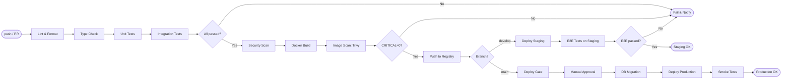

# デプロイ手順（Deployment Procedure）

| 項目 | 内容 |
|------|------|
| 文書番号 | DEV-DEP-001 |
| バージョン | 1.0.0 |
| 作成日 | 2026-03-24 |
| 最終更新 | 2026-03-24 |
| 対象プロジェクト | ZeroTrust-ID-Governance |
| 担当 | 開発チーム / SRE チーム |
| ステータス | 有効 |

---

## 目次

1. [デプロイ前チェックリスト](#1-デプロイ前チェックリスト)
2. [Docker イメージビルド手順](#2-docker-イメージビルド手順)
3. [GitHub Actions CI/CD パイプライン](#3-github-actions-cicd-パイプライン)
4. [ステージング環境デプロイ手順](#4-ステージング環境デプロイ手順)
5. [本番環境 Kubernetes デプロイ手順](#5-本番環境-kubernetes-デプロイ手順)
6. [DB マイグレーション（Blue-Green 事前適用）](#6-db-マイグレーションblue-green-事前適用)
7. [デプロイ後確認手順](#7-デプロイ後確認手順)
8. [ロールバック手順](#8-ロールバック手順)

---

## 1. デプロイ前チェックリスト

### 1.1 STABLE 判定基準

デプロイを実施するには、以下のすべての条件を満たしている必要があります。

| カテゴリ | チェック項目 | 確認方法 | 必須 |
|---------|------------|---------|------|
| **テスト** | ユニットテスト全通過 | CI ログ確認 | 必須 |
| **テスト** | 統合テスト全通過 | CI ログ確認 | 必須 |
| **テスト** | E2E テスト全通過 | CI ログ確認 | 必須 |
| **テスト** | カバレッジ 80% 以上 | coverage レポート確認 | 必須 |
| **CI** | GitHub Actions 全ジョブ通過 | Actions タブ確認 | 必須 |
| **CI** | Lint チェック通過（ruff / ESLint） | CI ログ確認 | 必須 |
| **CI** | 型チェック通過（mypy / tsc） | CI ログ確認 | 必須 |
| **ビルド** | Docker イメージビルド成功 | CI ログ確認 | 必須 |
| **セキュリティ** | Trivy イメージスキャン 0 CRITICAL | セキュリティスキャンレポート | 必須 |
| **セキュリティ** | SAST（bandit / semgrep）エラー 0 件 | CI セキュリティジョブ確認 | 必須 |
| **セキュリティ** | 依存関係脆弱性スキャン通過 | pip-audit / npm audit | 必須 |
| **レビュー** | PR レビュー Approve 取得 | GitHub PR 確認 | 必須 |
| **レビュー** | 全 Blocker コメント解消 | GitHub PR コメント確認 | 必須 |
| **ドキュメント** | CHANGELOG 更新済み | CHANGELOG.md 確認 | 推奨 |
| **ドキュメント** | API 仕様書更新済み（変更がある場合） | docs 確認 | 推奨 |

### 1.2 デプロイ承認フロー

```
開発者 → PR 作成 → CI 自動チェック → レビュア Approve
  → Tech Lead 承認 → ステージングデプロイ → QA 確認
  → CTO / 担当者承認 → 本番デプロイ実行
```

---

## 2. Docker イメージビルド手順

### 2.1 バックエンドイメージのビルド

```bash
# ルートディレクトリから実行

# バックエンドイメージのビルド
docker build \
  --file backend/Dockerfile \
  --tag ztid-backend:latest \
  --tag ztid-backend:$(git rev-parse --short HEAD) \
  --build-arg APP_VERSION=$(git describe --tags --always) \
  backend/

# ビルドキャッシュを無効化してビルド（クリーンビルド）
docker build \
  --no-cache \
  --file backend/Dockerfile \
  --tag ztid-backend:latest \
  backend/
```

### 2.2 フロントエンドイメージのビルド

```bash
# フロントエンドイメージのビルド
docker build \
  --file frontend/Dockerfile \
  --tag ztid-frontend:latest \
  --tag ztid-frontend:$(git rev-parse --short HEAD) \
  --build-arg NEXT_PUBLIC_API_BASE_URL=https://api.example.com \
  frontend/
```

### 2.3 イメージのセキュリティスキャン（Trivy）

```bash
# Trivy でイメージスキャン（CRITICAL/HIGH のみ検出）
trivy image \
  --severity CRITICAL,HIGH \
  --exit-code 1 \
  ztid-backend:latest

trivy image \
  --severity CRITICAL,HIGH \
  --exit-code 1 \
  ztid-frontend:latest

# JSON 形式でレポート出力
trivy image \
  --format json \
  --output trivy-report.json \
  ztid-backend:latest
```

### 2.4 コンテナレジストリへのプッシュ

```bash
# GitHub Container Registry (GHCR) へのプッシュ
REGISTRY="ghcr.io/your-org"
TAG=$(git rev-parse --short HEAD)

docker tag ztid-backend:latest ${REGISTRY}/ztid-backend:${TAG}
docker tag ztid-backend:latest ${REGISTRY}/ztid-backend:latest

docker push ${REGISTRY}/ztid-backend:${TAG}
docker push ${REGISTRY}/ztid-backend:latest

docker tag ztid-frontend:latest ${REGISTRY}/ztid-frontend:${TAG}
docker push ${REGISTRY}/ztid-frontend:${TAG}
docker push ${REGISTRY}/ztid-frontend:latest
```

---

## 3. GitHub Actions CI/CD パイプライン

### 3.1 パイプライン全体フロー



### 3.2 CI/CD ジョブ一覧

| ジョブ名 | トリガー | 実行内容 | 所要時間目安 |
|---------|---------|---------|------------|
| `lint` | PR / push | ruff, ESLint, mypy, tsc | 2分 |
| `test-unit` | PR / push | pytest -m unit | 3分 |
| `test-integration` | PR / push | pytest -m integration | 5分 |
| `security-scan` | PR / push | bandit, pip-audit, npm audit | 2分 |
| `docker-build` | develop / main push | Docker ビルド | 5分 |
| `image-scan` | develop / main push | Trivy スキャン | 3分 |
| `deploy-staging` | develop push | ステージングデプロイ | 5分 |
| `e2e-staging` | develop push | Playwright E2E | 10分 |
| `deploy-production` | main push + 承認 | 本番デプロイ | 10分 |
| `smoke-test` | 本番デプロイ後 | ヘルスチェック・基本動作確認 | 3分 |

### 3.3 GitHub Actions ワークフロー例

```yaml
# .github/workflows/ci.yml（抜粋）
name: CI Pipeline

on:
  push:
    branches: [main, develop]
  pull_request:
    branches: [main, develop]

jobs:
  lint:
    runs-on: ubuntu-latest
    steps:
      - uses: actions/checkout@v4
      - uses: actions/setup-python@v5
        with:
          python-version: "3.11"
      - name: Install dependencies
        run: pip install ruff mypy
      - name: Run ruff
        run: ruff check backend/
      - name: Run mypy
        run: mypy backend/

  test-unit:
    runs-on: ubuntu-latest
    needs: lint
    services:
      postgres:
        image: postgres:16-alpine
        env:
          POSTGRES_USER: ztid
          POSTGRES_PASSWORD: ztid_password
          POSTGRES_DB: ztid_test_db
        ports:
          - 5432:5432
      redis:
        image: redis:7-alpine
        ports:
          - 6379:6379
    steps:
      - uses: actions/checkout@v4
      - name: Run unit tests
        run: pytest -m unit --cov=app --cov-report=xml
      - uses: codecov/codecov-action@v4
        with:
          file: coverage.xml

  deploy-production:
    runs-on: ubuntu-latest
    needs: [test-unit, test-integration, image-scan]
    if: github.ref == 'refs/heads/main'
    environment:
      name: production
      url: https://app.example.com
    steps:
      - name: Deploy to Kubernetes
        run: kubectl apply -f k8s/production/
```

---

## 4. ステージング環境デプロイ手順

### 4.1 ステージング環境の構成

| コンポーネント | 構成 | 備考 |
|-------------|------|------|
| バックエンド | Docker コンテナ（1レプリカ） | ステージングサーバー上 |
| フロントエンド | Docker コンテナ（1レプリカ） | ステージングサーバー上 |
| PostgreSQL | Docker コンテナ or マネージドDB | データは本番と分離 |
| Redis | Docker コンテナ | |

### 4.2 ステージングデプロイ手順

```bash
# 1. ステージングサーバーに SSH 接続
ssh deploy@staging.example.com

# 2. 最新イメージをプル
cd /opt/ztid-staging
docker compose pull

# 3. 環境変数の確認・更新
diff .env .env.example
# 必要に応じて .env を更新

# 4. DB マイグレーションの実行（事前）
docker compose run --rm backend alembic upgrade head

# 5. サービスを再起動
docker compose up -d --no-deps backend frontend

# 6. ヘルスチェック
curl -f https://staging.example.com/health || exit 1
```

### 4.3 ステージング用 Docker Compose コマンド

```bash
# ステージング用 compose ファイルで起動
docker compose -f docker-compose.yml -f docker-compose.staging.yml up -d

# イメージタグを指定して更新
IMAGE_TAG=abc1234 docker compose up -d --no-deps backend

# ログ確認
docker compose logs -f --tail=100 backend
```

---

## 5. 本番環境 Kubernetes デプロイ手順

### 5.1 Kubernetes マニフェスト構成

```
k8s/
├── namespace.yaml
├── configmap.yaml
├── secret.yaml
├── backend/
│   ├── deployment.yaml
│   ├── service.yaml
│   └── hpa.yaml           # HorizontalPodAutoscaler
├── frontend/
│   ├── deployment.yaml
│   └── service.yaml
├── ingress.yaml
└── monitoring/
    └── servicemonitor.yaml
```

### 5.2 デプロイ手順

```bash
# 前提: kubectl が本番クラスターに接続済み
kubectl config current-context
# → production-cluster

# 1. Namespace の確認・作成
kubectl get namespace ztid-production
kubectl apply -f k8s/namespace.yaml

# 2. ConfigMap / Secret の適用
kubectl apply -f k8s/configmap.yaml
kubectl apply -f k8s/secret.yaml

# 3. DB マイグレーション Job の実行
kubectl apply -f k8s/jobs/db-migration.yaml
kubectl wait --for=condition=complete job/db-migration -n ztid-production --timeout=300s

# 4. バックエンドのデプロイ
kubectl apply -f k8s/backend/deployment.yaml
kubectl apply -f k8s/backend/service.yaml
kubectl apply -f k8s/backend/hpa.yaml

# 5. フロントエンドのデプロイ
kubectl apply -f k8s/frontend/deployment.yaml
kubectl apply -f k8s/frontend/service.yaml

# 6. Ingress の適用
kubectl apply -f k8s/ingress.yaml

# 7. デプロイ状態の確認
kubectl rollout status deployment/ztid-backend -n ztid-production
kubectl rollout status deployment/ztid-frontend -n ztid-production
```

### 5.3 イメージタグを指定した更新（Rolling Update）

```bash
# 特定バージョンにイメージを更新（Rolling Update）
NEW_TAG="abc1234"  # Git コミットハッシュ

kubectl set image deployment/ztid-backend \
  backend=ghcr.io/your-org/ztid-backend:${NEW_TAG} \
  -n ztid-production

kubectl set image deployment/ztid-frontend \
  frontend=ghcr.io/your-org/ztid-frontend:${NEW_TAG} \
  -n ztid-production

# ロールアウト状況を監視
kubectl rollout status deployment/ztid-backend -n ztid-production --watch
```

### 5.4 Kubernetes Deployment マニフェスト例

```yaml
# k8s/backend/deployment.yaml
apiVersion: apps/v1
kind: Deployment
metadata:
  name: ztid-backend
  namespace: ztid-production
  labels:
    app: ztid-backend
    version: "1.0.0"
spec:
  replicas: 3
  selector:
    matchLabels:
      app: ztid-backend
  strategy:
    type: RollingUpdate
    rollingUpdate:
      maxSurge: 1
      maxUnavailable: 0        # ゼロダウンタイムデプロイ
  template:
    metadata:
      labels:
        app: ztid-backend
    spec:
      containers:
        - name: backend
          image: ghcr.io/your-org/ztid-backend:latest
          ports:
            - containerPort: 8000
          envFrom:
            - configMapRef:
                name: ztid-config
            - secretRef:
                name: ztid-secrets
          livenessProbe:
            httpGet:
              path: /health
              port: 8000
            initialDelaySeconds: 30
            periodSeconds: 10
          readinessProbe:
            httpGet:
              path: /health/ready
              port: 8000
            initialDelaySeconds: 10
            periodSeconds: 5
          resources:
            requests:
              cpu: "250m"
              memory: "512Mi"
            limits:
              cpu: "1000m"
              memory: "2Gi"
```

---

## 6. DB マイグレーション（Blue-Green 事前適用）

### 6.1 Blue-Green デプロイ時のマイグレーション戦略

Blue-Green デプロイでは、**新旧バージョンが同時に動作する期間**が発生します。
この期間中に DB スキーマを安全に変更するための手順を定義します。

```
[Blue 環境（現行）] ─────────────── [Blue 環境（継続稼働）]
                                              ↑ 切り替え後に停止
[Green 環境（新規）] ─ マイグレーション → 起動 → トラフィック切り替え
```

### 6.2 後方互換性を保つマイグレーション手順

```bash
# フェーズ1: カラム追加（後方互換 - 旧バージョンに影響なし）
# Blue 環境が稼働したまま実行可能
alembic upgrade head

# フェーズ2: 新バージョン（Green）をデプロイ
# 新カラムを使用するコードをデプロイ

# フェーズ3: トラフィックを Green に切り替え

# フェーズ4: Blue 環境を停止

# フェーズ5: 不要になった旧カラムを削除（次のデプロイサイクルで）
alembic revision -m "remove_deprecated_column"
```

### 6.3 マイグレーション実行コマンド

```bash
# Kubernetes Job としてマイグレーションを実行
kubectl apply -f k8s/jobs/db-migration.yaml

# Job の完了を待機（タイムアウト: 5分）
kubectl wait \
  --for=condition=complete \
  job/db-migration \
  -n ztid-production \
  --timeout=300s

# Job のログ確認
kubectl logs job/db-migration -n ztid-production

# Job が失敗した場合の確認
kubectl describe job/db-migration -n ztid-production
```

```yaml
# k8s/jobs/db-migration.yaml
apiVersion: batch/v1
kind: Job
metadata:
  name: db-migration
  namespace: ztid-production
spec:
  backoffLimit: 0            # 失敗時にリトライしない
  template:
    spec:
      restartPolicy: Never
      containers:
        - name: migration
          image: ghcr.io/your-org/ztid-backend:latest
          command: ["alembic", "upgrade", "head"]
          envFrom:
            - secretRef:
                name: ztid-secrets
```

### 6.4 マイグレーション失敗時の対処

```bash
# マイグレーション状態を確認
kubectl exec -it deployment/ztid-backend -n ztid-production \
  -- alembic current

# マイグレーション履歴を確認
kubectl exec -it deployment/ztid-backend -n ztid-production \
  -- alembic history --verbose

# 1ステップ前に戻す（緊急時）
kubectl exec -it deployment/ztid-backend -n ztid-production \
  -- alembic downgrade -1
```

---

## 7. デプロイ後確認手順

### 7.1 ヘルスチェック

```bash
# バックエンドのヘルスチェック
curl -f https://api.example.com/health
# 期待値: {"status": "healthy", "database": "connected", "redis": "connected"}

# フロントエンドのアクセス確認
curl -f https://app.example.com/
# 期待値: HTTP 200

# Kubernetes Pod の状態確認
kubectl get pods -n ztid-production
# 全 Pod が Running であることを確認

# ログにエラーがないことを確認
kubectl logs deployment/ztid-backend -n ztid-production --tail=100 | grep -i error
```

### 7.2 スモークテスト

```bash
# 認証 API の動作確認
curl -X POST https://api.example.com/api/v1/auth/login \
  -H "Content-Type: application/json" \
  -d '{"email": "health-check@example.com", "password": "HealthCheck@123"}' \
  | jq '.access_token'

# ユーザー一覧の取得確認
TOKEN="<上記で取得したトークン>"
curl -H "Authorization: Bearer $TOKEN" \
  https://api.example.com/api/v1/users?limit=1 \
  | jq '.total'
```

### 7.3 デプロイ後確認チェックリスト

| 確認項目 | 確認方法 | 期待値 |
|---------|---------|--------|
| ヘルスチェック API | `GET /health` | `{"status": "healthy"}` |
| DB 接続 | ヘルスチェックレスポンス | `"database": "connected"` |
| Redis 接続 | ヘルスチェックレスポンス | `"redis": "connected"` |
| 認証 API | ログイン API 実行 | トークン取得成功 |
| フロントエンド表示 | ブラウザアクセス | ログインページ表示 |
| Pod 起動数 | `kubectl get pods` | 全 Pod が Running |
| エラーログ | アプリケーションログ | エラー 0 件 |
| レスポンスタイム | モニタリングダッシュボード | P95 < 500ms |

---

## 8. ロールバック手順

### 8.1 Kubernetes ロールバック（アプリケーション）

```bash
# デプロイ履歴の確認
kubectl rollout history deployment/ztid-backend -n ztid-production

# 直前のバージョンにロールバック
kubectl rollout undo deployment/ztid-backend -n ztid-production

# 特定のリビジョンにロールバック
kubectl rollout undo deployment/ztid-backend \
  --to-revision=3 \
  -n ztid-production

# ロールバック状況の確認
kubectl rollout status deployment/ztid-backend -n ztid-production

# フロントエンドも同様にロールバック
kubectl rollout undo deployment/ztid-frontend -n ztid-production
```

### 8.2 DB マイグレーションのロールバック

```bash
# 1ステップ前に戻す
kubectl exec -it deployment/ztid-backend -n ztid-production \
  -- alembic downgrade -1

# 特定リビジョンに戻す
kubectl exec -it deployment/ztid-backend -n ztid-production \
  -- alembic downgrade <revision_id>

# マイグレーション状態を確認
kubectl exec -it deployment/ztid-backend -n ztid-production \
  -- alembic current
```

### 8.3 ロールバック判断基準

| 状況 | 対応 | 緊急度 |
|------|------|--------|
| ヘルスチェック失敗が 5分以上継続 | 即時ロールバック | 緊急 |
| エラー率が 1% 超（正常時: 0.1%以下） | 即時ロールバック | 緊急 |
| P95 レスポンスタイムが 2倍超 | 監視しつつロールバック検討 | 高 |
| 一部機能のみ不具合（認証以外） | 原因調査後に判断 | 中 |
| ログに WARNING が増加 | 翌営業日対応可 | 低 |

### 8.4 ロールバック後の対応

```bash
# 1. ロールバック完了を確認
kubectl get pods -n ztid-production
curl -f https://api.example.com/health

# 2. インシデントレポートの作成（Slack / GitHub Issue）
# - 発生時刻・検知時刻・復旧時刻
# - 影響範囲
# - 根本原因（暫定）
# - 恒久対策

# 3. GitHub で hotfix ブランチを作成
git checkout main
git pull origin main
git checkout -b hotfix/fix-critical-bug

# 4. 修正後、通常の CI/CD フローでデプロイ
```

---

*文書番号: DEV-DEP-001 | バージョン: 1.0.0 | 最終更新: 2026-03-24*
