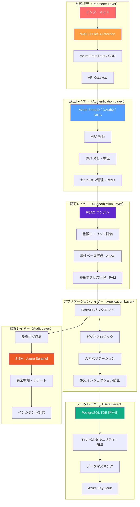

# セキュリティアーキテクチャ（Security Architecture）

| 項目 | 内容 |
|------|------|
| 文書番号 | SEC-ARC-001 |
| バージョン | 1.0.0 |
| 作成日 | 2026-03-24 |
| 最終更新日 | 2026-03-24 |
| 作成者 | セキュリティアーキテクチャチーム |
| 承認者 | CISO |
| 分類 | 機密（Confidential） |
| 準拠規格 | ISO 27001 A.5.15〜A.8.2 / NIST CSF PR.AA / ゼロトラストアーキテクチャ |

---

## 目次

1. [概要](#概要)
2. [ゼロトラスト原則](#ゼロトラスト原則)
3. [セキュリティレイヤー構成](#セキュリティレイヤー構成)
4. [セキュリティコントロール一覧](#セキュリティコントロール一覧)
5. [多層防御設計](#多層防御設計)
6. [セキュリティヘッダー](#セキュリティヘッダー)
7. [脅威モデル](#脅威モデル)

---

## 概要

本文書は、ZeroTrust-ID-Governance システムにおけるセキュリティアーキテクチャの全体設計を定義する。ISO 27001 およびNIST Cybersecurity Framework（CSF）に準拠し、ゼロトラストの原則に基づいた多層防御を実現する。

本システムは、クラウドネイティブなアイデンティティガバナンス基盤として、組織内外のリソースへのアクセス制御を一元管理する。攻撃者が内部ネットワークに侵入していることを前提とした設計を採用し、すべてのアクセス要求を継続的に検証する。

---

## ゼロトラスト原則

### Never Trust, Always Verify（決して信頼せず、常に検証する）

ゼロトラストアーキテクチャは以下の核心原則に基づく。

| 原則 | 説明 | 実装方法 |
|------|------|----------|
| **明示的な検証** | すべてのアクセス要求を常に認証・認可する | JWT + MFA + コンテキスト検証 |
| **最小権限アクセス** | 業務遂行に必要な最小限の権限のみ付与する | RBAC + 時限付きアクセス |
| **侵害を想定** | 攻撃者がすでに内部に存在することを前提とする | セグメント化 + 継続的監視 |
| **継続的監視** | リアルタイムでセキュリティイベントを監視する | SIEM + 異常検知 |
| **マイクロセグメンテーション** | ネットワーク内部をセグメント化し横断移動を阻止 | VPC + セキュリティグループ |

### ゼロトラスト成熟度モデル

```
Level 1（初期）: 従来の境界防御
Level 2（基本）: ID ベースの認証強化
Level 3（中級）: コンテキストアウェアなアクセス制御 ← 現在のターゲット
Level 4（高度）: リアルタイム適応型アクセス制御
Level 5（最適）: 完全自動化されたゼロトラスト
```

---

## セキュリティレイヤー構成



### レイヤー別責任範囲

| レイヤー | 責任 | 主要コンポーネント | 対応する NIST CSF |
|----------|------|-------------------|------------------|
| 外部境界 | 不正トラフィック遮断・DDoS防御 | WAF, CDN, API Gateway | PR.AC-4, DE.CM-1 |
| 認証 | アイデンティティの確認・トークン管理 | EntraID, JWT, MFA | PR.AA-1, PR.AA-2 |
| 認可 | アクセス権限の評価・施行 | RBAC, ABAC, PAM | PR.AA-5, PR.AA-6 |
| アプリケーション | セキュアコーディング・入力検証 | FastAPI, Pydantic | PR.DS-1, PR.DS-2 |
| データ | データ保護・暗号化・マスキング | PostgreSQL, Key Vault | PR.DS-1, PR.DS-5 |
| 監査 | 継続的監視・ログ管理・インシデント対応 | Sentinel, SIEM | DE.CM-1, RS.AN-1 |

---

## セキュリティコントロール一覧

### ISO 27001 対応コントロール

| コントロール ID | ISO 27001 条項 | コントロール名 | 実装状況 | 担当 |
|----------------|---------------|---------------|----------|------|
| AC-001 | A.5.15 | アクセス制御ポリシー | 実装済 | セキュリティチーム |
| AC-002 | A.5.16 | アイデンティティ管理 | 実装済 | 開発チーム |
| AC-003 | A.5.17 | 認証情報管理 | 実装済 | 開発チーム |
| AC-004 | A.5.18 | アクセス権限のレビュー | 実装済 | 運用チーム |
| AC-005 | A.8.2 | 特権アクセス権管理 | 実装済 | セキュリティチーム |
| CR-001 | A.8.24 | 暗号化の利用 | 実装済 | 開発チーム |
| LOG-001 | A.8.15 | ログ記録 | 実装済 | 運用チーム |
| LOG-002 | A.8.16 | 監視活動 | 実装済 | セキュリティチーム |
| NET-001 | A.8.20 | ネットワーク管理 | 実装済 | インフラチーム |
| NET-002 | A.8.22 | ネットワークのセグメント化 | 実装済 | インフラチーム |
| VUL-001 | A.8.8 | 技術的脆弱性管理 | 実装済 | セキュリティチーム |

### NIST CSF PR.AA 対応コントロール

| コントロール | NIST CSF ID | 説明 | 実装方法 |
|-------------|-------------|------|----------|
| 認証 | PR.AA-1 | アイデンティティの検証 | MFA + Azure EntraID |
| 認証情報管理 | PR.AA-2 | 認証情報のライフサイクル管理 | Key Vault + bcrypt |
| リモートアクセス | PR.AA-3 | リモートアクセスの管理 | VPN + Zero Trust Network Access |
| アクセス権限 | PR.AA-5 | アクセス権限の管理 | RBAC + 最小権限 |
| アイデンティティ | PR.AA-6 | 強力な認証の要求 | FIDO2 / TOTP MFA |

---

## 多層防御設計

### 防御の深さ（Defense in Depth）

```
[第1層] ネットワーク境界
  ├── WAF ルール（OWASP CRS）
  ├── DDoS Protection（レート制限）
  └── IP ホワイトリスト / ブラックリスト

[第2層] 認証・認可
  ├── 強力なパスワードポリシー
  ├── MFA（TOTP / FIDO2）
  ├── JWT + 短命トークン（15分）
  └── RBAC による細粒度権限制御

[第3層] アプリケーション
  ├── 入力バリデーション（Pydantic）
  ├── SQLインジェクション防止（ORM）
  ├── XSS 対策（CSP ヘッダー）
  └── CSRF トークン

[第4層] データ
  ├── 保存時暗号化（TDE）
  ├── 通信時暗号化（TLS 1.3）
  ├── フィールドレベル暗号化（PII）
  └── データマスキング（ログ・API レスポンス）

[第5層] 監査・監視
  ├── 全操作ログ記録
  ├── リアルタイム異常検知
  ├── SIEM 連携（Azure Sentinel）
  └── 自動インシデント対応
```

### セキュリティコントロールの冗長性

| 攻撃ベクター | 第1防御 | 第2防御 | 第3防御 |
|-------------|---------|---------|---------|
| ブルートフォース | レート制限 | アカウントロックアウト | CAPTCHA |
| SQLインジェクション | WAF | ORM パラメータ化 | 入力バリデーション |
| XSS | CSP ヘッダー | 出力エスケープ | HttpOnly Cookie |
| CSRF | SameSite Cookie | CSRF トークン | Origin 検証 |
| セッションハイジャック | HTTPS/HSTS | セッション固定防止 | Secure Cookie |
| 特権昇格 | RBAC | 最小権限 | 監査ログ |

---

## セキュリティヘッダー

### HTTP セキュリティヘッダー設定

```python
# FastAPI セキュリティヘッダーミドルウェア
from fastapi import Request
from starlette.middleware.base import BaseHTTPMiddleware

class SecurityHeadersMiddleware(BaseHTTPMiddleware):
    async def dispatch(self, request: Request, call_next):
        response = await call_next(request)

        # クリックジャッキング防止
        response.headers["X-Frame-Options"] = "DENY"

        # MIME タイプスニッフィング防止
        response.headers["X-Content-Type-Options"] = "nosniff"

        # XSS 保護（レガシーブラウザ向け）
        response.headers["X-XSS-Protection"] = "1; mode=block"

        # HTTPS 強制（HSTS）
        response.headers["Strict-Transport-Security"] = (
            "max-age=31536000; includeSubDomains; preload"
        )

        # コンテンツセキュリティポリシー
        response.headers["Content-Security-Policy"] = (
            "default-src 'self'; "
            "script-src 'self' 'nonce-{nonce}'; "
            "style-src 'self' 'unsafe-inline'; "
            "img-src 'self' data: https:; "
            "font-src 'self'; "
            "connect-src 'self' https://login.microsoftonline.com; "
            "frame-ancestors 'none'; "
            "form-action 'self'; "
            "base-uri 'self'"
        )

        # Referrer ポリシー
        response.headers["Referrer-Policy"] = "strict-origin-when-cross-origin"

        # 権限ポリシー
        response.headers["Permissions-Policy"] = (
            "geolocation=(), microphone=(), camera=(), "
            "payment=(), usb=(), magnetometer=()"
        )

        # キャッシュ制御（機密データ）
        response.headers["Cache-Control"] = "no-store, no-cache, must-revalidate"
        response.headers["Pragma"] = "no-cache"

        return response
```

### セキュリティヘッダー一覧と目的

| ヘッダー名 | 設定値 | 目的 |
|-----------|--------|------|
| `X-Frame-Options` | `DENY` | クリックジャッキング攻撃防止 |
| `X-Content-Type-Options` | `nosniff` | MIME タイプスニッフィング防止 |
| `X-XSS-Protection` | `1; mode=block` | 反射型 XSS 自動ブロック |
| `Strict-Transport-Security` | `max-age=31536000; includeSubDomains; preload` | HTTPS 強制・HSTS プリロード |
| `Content-Security-Policy` | `default-src 'self'` + 詳細指定 | XSS・インジェクション防止 |
| `Referrer-Policy` | `strict-origin-when-cross-origin` | Referer 情報漏洩防止 |
| `Permissions-Policy` | 全機能無効化 | ブラウザ機能の不正利用防止 |
| `Cache-Control` | `no-store` | 機密情報のキャッシュ防止 |

---

## 脅威モデル

### STRIDE 脅威モデル

| 脅威カテゴリ | 脅威の例 | リスクレベル | 対策 |
|-------------|---------|-------------|------|
| **S**poofing（なりすまし） | セッションハイジャック、フィッシング | 高 | MFA、JWT 短命化、HTTPS |
| **T**ampering（改ざん） | データ改ざん、ログ削除 | 高 | TDE、ハッシュチェーン、署名 |
| **R**epudiation（否認） | 操作履歴の否認 | 中 | 不変監査ログ、デジタル署名 |
| **I**nformation Disclosure（情報漏洩） | PII 漏洩、認証情報漏洩 | 高 | 暗号化、データマスキング、Key Vault |
| **D**enial of Service（サービス拒否） | DDoS、ブルートフォース | 中 | レート制限、WAF、CDN |
| **E**levation of Privilege（特権昇格） | 水平移動、垂直権限昇格 | 高 | RBAC、最小権限、PAM |

### 主要脅威シナリオと対策

#### 脅威 1: 認証情報の窃取

```
攻撃シナリオ:
  攻撃者がフィッシングメール経由でユーザー認証情報を窃取
  → システムへの不正アクセスを試みる

対策:
  1. MFA（TOTP/FIDO2）による二次認証必須化
  2. パスワードをハッシュ化（bcrypt, cost=12）して保存
  3. 漏洩パスワードチェック（HaveIBeenPwned API）
  4. 異常なログイン試行の検知・アラート
  5. セッショントークンの短命化（JWT 15分）
```

#### 脅威 2: API への不正アクセス

```
攻撃シナリオ:
  攻撃者が JWT トークンを窃取し、API へ不正リクエストを送信

対策:
  1. JWT の短命化（アクセストークン 15分）
  2. jti（JWT ID）ブラックリスト管理（Redis）
  3. トークン失効時の即座の無効化
  4. リクエストレート制限（エンドポイント別）
  5. IP アドレス異常検知
```

#### 脅威 3: インサイダー脅威

```
攻撃シナリオ:
  内部の悪意あるユーザーが他ユーザーのデータに不正アクセス

対策:
  1. 最小権限の原則（必要なリソースのみアクセス可能）
  2. 行レベルセキュリティ（PostgreSQL RLS）
  3. 全操作の監査ログ記録（改ざん防止）
  4. 特権ロールへの時限付きアクセス
  5. 定期的な権限レビュー（四半期）
```

#### 脅威 4: サプライチェーン攻撃

```
攻撃シナリオ:
  依存ライブラリへの悪意あるコードの挿入

対策:
  1. Trivy / safety / Bandit による自動脆弱性スキャン
  2. Renovate による自動依存関係更新
  3. ソフトウェアBOM（SBOM）の管理
  4. プライベートパッケージリポジトリの利用
  5. CI/CD パイプラインでの署名検証
```

### リスクマトリクス

| リスク | 発生可能性 | 影響度 | リスクスコア | 対応優先度 |
|--------|-----------|-------|-------------|-----------|
| 認証情報窃取 | 中（3） | 高（4） | 12 | 最高 |
| SQLインジェクション | 低（2） | 高（4） | 8 | 高 |
| XSS 攻撃 | 中（3） | 中（3） | 9 | 高 |
| DDoS 攻撃 | 中（3） | 中（3） | 9 | 高 |
| 特権昇格 | 低（2） | 最高（5） | 10 | 高 |
| データ漏洩 | 低（2） | 最高（5） | 10 | 高 |
| インサイダー脅威 | 低（2） | 高（4） | 8 | 高 |
| サプライチェーン | 低（2） | 高（4） | 8 | 中 |

> リスクスコア = 発生可能性（1-5）× 影響度（1-5）
> 対応優先度：最高（12+）、高（8-11）、中（4-7）、低（1-3）

---

## 改訂履歴

| バージョン | 日付 | 変更内容 | 変更者 |
|-----------|------|---------|--------|
| 1.0.0 | 2026-03-24 | 初版作成 | セキュリティアーキテクチャチーム |
