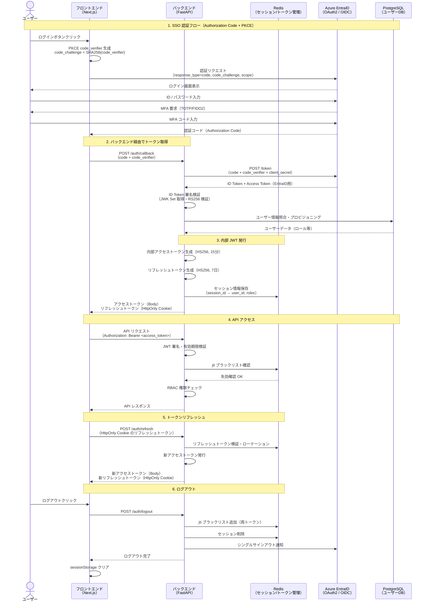

# 認証設計（Authentication Design）

| 項目 | 内容 |
|------|------|
| 文書番号 | SEC-AUTH-001 |
| バージョン | 1.0.0 |
| 作成日 | 2026-03-24 |
| 最終更新日 | 2026-03-24 |
| 作成者 | セキュリティ開発チーム |
| 承認者 | CISO |
| 分類 | 機密（Confidential） |
| 準拠規格 | ISO 27001 A.5.17 / NIST CSF PR.AA-1, PR.AA-2 / OWASP ASVS L2 |

---

## 目次

1. [概要](#概要)
2. [JWT 認証設計](#jwt-認証設計)
3. [トークン失効管理（Redis）](#トークン失効管理redis)
4. [MFA 設計](#mfa-設計)
5. [セッション管理](#セッション管理)
6. [パスワードポリシー](#パスワードポリシー)
7. [Azure EntraID 統合認証フロー](#azure-entraid-統合認証フロー)
8. [ロックアウトポリシー](#ロックアウトポリシー)

---

## 概要

本文書は、ZeroTrust-ID-Governance システムにおける認証機能の設計を定義する。ゼロトラストの原則「Never Trust, Always Verify」に基づき、すべてのアクセス要求に対して継続的な認証検証を行う。

主要な認証方式として、JWT（JSON Web Token）を用いたステートレス認証、Redis を使用したトークン失効管理、Azure EntraID を活用したエンタープライズ SSO を組み合わせた多層認証アーキテクチャを採用する。

---

## JWT 認証設計

### トークン種別と有効期限

| トークン種別 | 有効期限 | 用途 | 保存場所 |
|-------------|---------|------|----------|
| アクセストークン（Access Token） | **15分** | API アクセス認証 | メモリ（変数） |
| リフレッシュトークン（Refresh Token） | **7日** | アクセストークン更新 | HttpOnly Cookie |
| ID トークン（ID Token） | 1時間 | ユーザー情報取得 | メモリ（変数） |

> アクセストークンの有効期限を 15分と短く設定することで、トークン窃取時の被害を最小化する。

### JWT ペイロード設計

```python
# アクセストークンのペイロード構造
from pydantic import BaseModel
from datetime import datetime
from uuid import UUID

class AccessTokenPayload(BaseModel):
    # 標準クレーム（RFC 7519）
    sub: str           # Subject: ユーザー ID
    iss: str           # Issuer: トークン発行者
    aud: str           # Audience: 対象システム
    exp: int           # Expiration: 有効期限（Unix タイムスタンプ）
    iat: int           # Issued At: 発行時刻
    jti: str           # JWT ID: 一意識別子（失効管理用）

    # カスタムクレーム
    tenant_id: UUID    # テナント ID（マルチテナント対応）
    roles: list[str]   # ユーザーロール一覧
    permissions: list[str]  # 具体的な権限一覧
    mfa_verified: bool # MFA 検証済みフラグ
    session_id: str    # セッション ID（監査用）

class RefreshTokenPayload(BaseModel):
    sub: str           # ユーザー ID
    jti: str           # JWT ID（ローテーション管理）
    exp: int           # 有効期限（7日）
    iat: int           # 発行時刻
    family: str        # トークンファミリー（リプレイ攻撃防止）
    tenant_id: UUID    # テナント ID
```

### JWT 署名アルゴリズム

```python
# JWT 署名設定
JWT_CONFIG = {
    # 内部トークン：HS256（HMAC-SHA256）
    "internal": {
        "algorithm": "HS256",
        "secret_key": "Azure Key Vault から取得",
        "access_token_expire_minutes": 15,
        "refresh_token_expire_days": 7,
    },
    # 外部連携（Azure EntraID）：RS256（RSA-SHA256）
    "external": {
        "algorithm": "RS256",
        "public_key": "Azure EntraID の公開鍵（JWK Set）",
        "jwks_uri": "https://login.microsoftonline.com/{tenant}/discovery/v2.0/keys",
    }
}

# トークン生成
import jwt
from datetime import datetime, timedelta, timezone
import uuid

def create_access_token(user_id: str, tenant_id: str, roles: list[str]) -> str:
    now = datetime.now(timezone.utc)
    payload = {
        "sub": user_id,
        "iss": "https://id.example.com",
        "aud": "api.example.com",
        "exp": now + timedelta(minutes=15),
        "iat": now,
        "jti": str(uuid.uuid4()),
        "tenant_id": tenant_id,
        "roles": roles,
        "mfa_verified": True,
    }
    return jwt.encode(payload, SECRET_KEY, algorithm="HS256")
```

### トークン検証フロー

```
クライアント → API リクエスト（Authorization: Bearer <token>）
    ↓
[1] トークン形式検証（JWT 構造確認）
    ↓
[2] 署名検証（HS256 / RS256）
    ↓
[3] 有効期限確認（exp クレーム）
    ↓
[4] 発行者確認（iss クレーム）
    ↓
[5] 対象システム確認（aud クレーム）
    ↓
[6] jti ブラックリスト照合（Redis）← 失効チェック
    ↓
[7] ユーザー存在確認（DB）
    ↓
[8] テナント整合性確認
    ↓
認証成功 → リクエスト処理続行
```

---

## トークン失効管理（Redis）

### jti ブラックリスト設計

JWT はステートレスなため、発行後に無効化できない問題がある。Redis を使用した jti（JWT ID）ブラックリストにより、即座のトークン失効を実現する。

```python
# Redis を使用したトークン失効管理
import redis.asyncio as redis
from datetime import timedelta

class TokenRevocationService:
    def __init__(self, redis_client: redis.Redis):
        self.redis = redis_client
        self.prefix = "jwt:revoked:"  # キープレフィックス

    async def revoke_token(self, jti: str, expires_in_seconds: int) -> None:
        """
        トークンを失効させる
        - jti をブラックリストに追加
        - TTL をトークンの残り有効時間に設定（自動クリーンアップ）
        """
        key = f"{self.prefix}{jti}"
        await self.redis.setex(
            name=key,
            time=timedelta(seconds=expires_in_seconds),
            value="revoked"
        )

    async def is_token_revoked(self, jti: str) -> bool:
        """jti がブラックリストに存在するか確認"""
        key = f"{self.prefix}{jti}"
        return await self.redis.exists(key) > 0

    async def revoke_all_user_tokens(self, user_id: str) -> None:
        """
        ユーザーの全トークンを一括失効
        - パスワード変更時
        - アカウント停止時
        - セキュリティインシデント時
        """
        # ユーザーの全 jti を管理するセット
        user_tokens_key = f"jwt:user_tokens:{user_id}"
        jtis = await self.redis.smembers(user_tokens_key)

        pipeline = self.redis.pipeline()
        for jti in jtis:
            key = f"{self.prefix}{jti.decode()}"
            pipeline.setex(key, timedelta(days=7), "revoked")
        await pipeline.execute()
        await self.redis.delete(user_tokens_key)
```

### Redis キー設計

| キーパターン | 型 | TTL | 用途 |
|------------|-----|-----|------|
| `jwt:revoked:{jti}` | String | トークン残有効期限 | jti ブラックリスト |
| `jwt:user_tokens:{user_id}` | Set | 7日 | ユーザー別 jti 管理 |
| `jwt:refresh:{family}` | String | 7日 | リフレッシュトークンファミリー |
| `session:{session_id}` | Hash | 15分 | セッション情報 |
| `lockout:{user_id}` | String | 30分 | ロックアウト状態 |
| `login_attempts:{user_id}` | String | 1時間 | ログイン試行回数 |

### リフレッシュトークンローテーション

```python
# リフレッシュトークンローテーション（リプレイ攻撃防止）
async def rotate_refresh_token(old_refresh_token: str) -> tuple[str, str]:
    """
    リフレッシュトークンをローテーション
    1. 古いリフレッシュトークンを検証・失効
    2. 新しいアクセストークン + リフレッシュトークンを発行
    3. 同一ファミリーの古いトークンの再使用を検知した場合は全失効
    """
    payload = verify_refresh_token(old_refresh_token)
    family = payload["family"]

    # ファミリーの最新トークンか確認
    stored_jti = await redis.get(f"jwt:refresh:{family}")
    if stored_jti != payload["jti"]:
        # リプレイ攻撃の可能性 → ファミリー全体を失効
        await revoke_token_family(family)
        raise SecurityException("トークンの再使用が検出されました")

    # 古いトークンを失効
    await revoke_token(payload["jti"], remaining_seconds)

    # 新しいトークンを発行（同一ファミリー）
    new_access_token = create_access_token(...)
    new_refresh_token = create_refresh_token(family=family)

    return new_access_token, new_refresh_token
```

---

## MFA 設計

### MFA 方式一覧

| MFA 方式 | 説明 | セキュリティレベル | 対応状況 |
|---------|------|-----------------|---------|
| **TOTP**（Time-based OTP） | 認証アプリ（Google Authenticator等）の6桁コード | 高 | 実装済（推奨） |
| **FIDO2 / WebAuthn** | 生体認証・ハードウェアキー | 最高 | 実装済 |
| **SMS OTP** | SMS による6桁コード送信 | 中（SIM スワップリスク） | 実装済（非推奨） |
| **Email OTP** | メール による6桁コード送信 | 低（メール乗っ取りリスク） | バックアップ用のみ |
| **Push 通知** | Authenticator アプリへのプッシュ通知 | 高 | 計画中 |

### TOTP 実装設計

```python
# TOTP（RFC 6238）実装
import pyotp
import qrcode
from io import BytesIO
import base64

class TOTPService:
    def generate_secret(self) -> str:
        """ユーザー専用の TOTP シークレットを生成"""
        return pyotp.random_base32()

    def get_provisioning_uri(
        self,
        secret: str,
        user_email: str,
        issuer: str = "ZeroTrust-ID-Governance"
    ) -> str:
        """QR コード用の URI を生成"""
        totp = pyotp.TOTP(secret)
        return totp.provisioning_uri(
            name=user_email,
            issuer_name=issuer
        )

    def verify_totp(
        self,
        secret: str,
        token: str,
        valid_window: int = 1  # ±30秒の許容範囲
    ) -> bool:
        """
        TOTP コードを検証
        - valid_window=1: 前後1ステップ（±30秒）を許容
        - タイムドリフト対策
        """
        totp = pyotp.TOTP(secret)
        return totp.verify(token, valid_window=valid_window)

    def generate_backup_codes(self, count: int = 10) -> list[str]:
        """
        バックアップコードを生成（MFA 紛失時）
        - 各コードは一度のみ使用可能
        - bcrypt でハッシュ化して保存
        """
        import secrets
        codes = [secrets.token_hex(5).upper() for _ in range(count)]
        return codes  # 表示用の平文（DB にはハッシュを保存）
```

### MFA 登録フロー

```
ユーザー → MFA 設定ページ
    ↓
[1] TOTP シークレット生成（サーバーサイド）
    ↓
[2] QR コード生成・表示
    ↓
[3] 認証アプリでスキャン
    ↓
[4] 初回検証コード入力（確認）
    ↓
[5] 検証成功 → シークレットを暗号化して DB 保存
    ↓
[6] バックアップコード（10個）を表示・ダウンロード
    ↓
MFA 設定完了 → 次回ログインから MFA 必須
```

### MFA ポリシー

| 設定項目 | 値 | 説明 |
|---------|-----|------|
| MFA 必須ロール | GlobalAdmin, TenantAdmin | 特権ロールは MFA 必須 |
| MFA 猶予期間 | 初回ログインから 24時間 | 設定を促す猶予 |
| バックアップコード有効数 | 10個（1回使い切り） | MFA 紛失時用 |
| TOTP 許容タイムウィンドウ | ±30秒（1ステップ） | タイムドリフト対策 |
| MFA バイパス条件 | なし（特権ロールは必須） | セキュリティポリシー |

---

## セッション管理

### sessionStorage 使用理由

フロントエンドのトークン保存先として `sessionStorage` を採用する理由を以下に示す。

| 保存場所 | XSS 耐性 | CSRF 耐性 | セッション継続性 | 採用 |
|---------|---------|----------|----------------|------|
| `localStorage` | 低（JS からアクセス可） | 高 | タブ間共有 | 不採用 |
| `sessionStorage` | 低（JS からアクセス可） | 高 | タブ単位で分離 | **アクセストークン採用** |
| `HttpOnly Cookie` | 高（JS からアクセス不可） | 低（CSRF 対策必要） | ブラウザ再起動後も継続 | **リフレッシュトークン採用** |
| メモリ変数 | 最高（JS が制御） | 高 | ページリロードで消失 | 検討中 |

```
採用方針:
  - アクセストークン（15分）: sessionStorage
    → タブ単位で分離され、ブラウザ終了時に自動削除
    → 短命なため漏洩リスクが最小
    → XSS リスクは CSP ヘッダーで緩和

  - リフレッシュトークン（7日）: HttpOnly Cookie (SameSite=Strict, Secure)
    → JS からアクセス不可（XSS で窃取不可）
    → CSRF は SameSite=Strict で防止
    → 自動的にリクエストに付与
```

### セッション固定攻撃防止

```python
# ログイン成功時に必ずセッション ID を再生成
async def login(credentials: LoginRequest) -> LoginResponse:
    user = await authenticate_user(credentials)

    # 旧セッションを完全に破棄
    await session_service.destroy(old_session_id)

    # 新しいセッション ID を生成（固定攻撃防止）
    new_session_id = secrets.token_urlsafe(32)

    # 新しいトークンを発行
    access_token = create_access_token(user.id, new_session_id)
    refresh_token = create_refresh_token(user.id)

    return LoginResponse(
        access_token=access_token,
        session_id=new_session_id
    )
```

---

## パスワードポリシー

### パスワード要件

| 要件 | 設定値 | 理由 |
|------|--------|------|
| 最小文字数 | **12文字** | NIST SP 800-63B 推奨 |
| 最大文字数 | **128文字** | パスフレーズ対応 |
| 大文字 | 1文字以上 | 複雑性確保 |
| 小文字 | 1文字以上 | 複雑性確保 |
| 数字 | 1文字以上 | 複雑性確保 |
| 記号 | 1文字以上 | 複雑性確保 |
| 連続する同一文字 | 3文字以下 | 推測攻撃防止 |
| ユーザー名の含有 | 禁止 | 推測攻撃防止 |
| よく使われるパスワード | 禁止（上位 10万件） | ブルートフォース防止 |
| 漏洩パスワード | 禁止（HaveIBeenPwned） | 侵害済みパスワード除外 |
| パスワード有効期限 | **なし**（NIST 推奨） | 頻繁な変更は安全性低下 |
| パスワード履歴 | 直近 **5回** 禁止 | 再利用防止 |

### パスワードハッシュ

```python
# bcrypt によるパスワードハッシュ
from passlib.context import CryptContext

pwd_context = CryptContext(
    schemes=["bcrypt"],
    deprecated="auto",
    bcrypt__rounds=12  # コストファクター 12（約250ms）
)

def hash_password(plain_password: str) -> str:
    return pwd_context.hash(plain_password)

def verify_password(plain_password: str, hashed_password: str) -> bool:
    return pwd_context.verify(plain_password, hashed_password)

# bcrypt コストファクターの目安（ハードウェア依存）
# rounds=10: ~100ms
# rounds=12: ~400ms ← 推奨（ブルートフォースに対して十分な遅延）
# rounds=14: ~1600ms
```

---

## Azure EntraID 統合認証フロー



---

## ロックアウトポリシー

### アカウントロックアウト設定

| 設定項目 | 値 | 説明 |
|---------|-----|------|
| ロックアウトまでの試行回数 | **5回** | 失敗5回でロック |
| ロックアウト期間 | **30分**（自動解除） | 一時的なロック |
| 永続ロックアウト | 24時間以内に3回ロック | 管理者による解除が必要 |
| 試行カウントリセット | 最後の失敗から **1時間** | Redis TTL で管理 |
| 管理者通知 | ロックアウト発生時即座に通知 | セキュリティアラート |

### ロックアウト実装

```python
# Redis を使用したロックアウト管理
class AccountLockoutService:
    MAX_ATTEMPTS = 5
    LOCKOUT_DURATION = timedelta(minutes=30)
    ATTEMPT_WINDOW = timedelta(hours=1)

    async def record_failed_attempt(self, user_id: str) -> dict:
        """
        ログイン失敗を記録し、ロックアウト状態を返す
        """
        attempt_key = f"login_attempts:{user_id}"
        lockout_key = f"lockout:{user_id}"

        # 失敗カウントをインクリメント
        current = await self.redis.incr(attempt_key)
        if current == 1:
            # 初回失敗時に TTL を設定
            await self.redis.expire(attempt_key, self.ATTEMPT_WINDOW)

        if current >= self.MAX_ATTEMPTS:
            # ロックアウト状態を設定
            await self.redis.setex(
                lockout_key,
                self.LOCKOUT_DURATION,
                "locked"
            )
            # セキュリティアラートを送信
            await self.send_lockout_alert(user_id)
            return {"locked": True, "attempts": current}

        remaining = self.MAX_ATTEMPTS - current
        return {"locked": False, "remaining_attempts": remaining}

    async def is_locked_out(self, user_id: str) -> bool:
        """アカウントがロックアウト状態か確認"""
        lockout_key = f"lockout:{user_id}"
        return await self.redis.exists(lockout_key) > 0

    async def unlock_account(self, user_id: str, admin_id: str) -> None:
        """管理者によるロックアウト解除"""
        await self.redis.delete(f"lockout:{user_id}")
        await self.redis.delete(f"login_attempts:{user_id}")
        await self.audit_log.record(
            action="account_unlocked",
            target_user=user_id,
            performed_by=admin_id
        )
```

### プログレッシブ遅延（レート制限）

```
ログイン試行回数に応じた遅延（ブルートフォース防止）:

  1回失敗: 遅延なし
  2回失敗: 1秒遅延
  3回失敗: 2秒遅延
  4回失敗: 4秒遅延
  5回失敗: アカウントロックアウト（30分）
```

---

## 改訂履歴

| バージョン | 日付 | 変更内容 | 変更者 |
|-----------|------|---------|--------|
| 1.0.0 | 2026-03-24 | 初版作成 | セキュリティ開発チーム |
