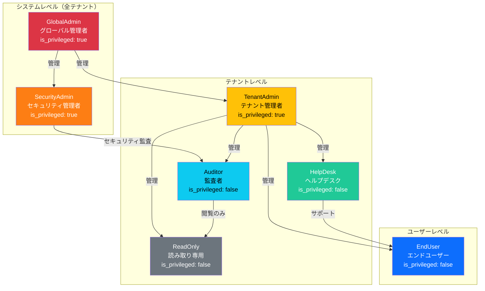

# 認可設計（Authorization Design）

| 項目 | 内容 |
|------|------|
| 文書番号 | SEC-AUTHZ-001 |
| バージョン | 1.0.0 |
| 作成日 | 2026-03-24 |
| 最終更新日 | 2026-03-24 |
| 作成者 | セキュリティ開発チーム |
| 承認者 | CISO |
| 分類 | 機密（Confidential） |
| 準拠規格 | ISO 27001 A.5.15, A.8.2 / NIST CSF PR.AA-5, PR.AA-6 / OWASP ASVS L2 |

---

## 目次

1. [概要](#概要)
2. [RBAC 設計](#rbac-設計)
3. [ロール定義一覧](#ロール定義一覧)
4. [最小権限の原則](#最小権限の原則)
5. [権限マトリクス](#権限マトリクス)
6. [特権ロール管理](#特権ロール管理)
7. [時限付きアクセス](#時限付きアクセス)
8. [ロール階層](#ロール階層)

---

## 概要

本文書は、ZeroTrust-ID-Governance システムにおける認可機能の設計を定義する。ロールベースアクセス制御（RBAC）を基盤とし、属性ベースアクセス制御（ABAC）を組み合わせた細粒度の権限管理を実現する。

ゼロトラストの原則に基づき、「最小権限の原則（Principle of Least Privilege）」を徹底し、業務遂行に必要な最小限の権限のみを付与する。すべてのアクセス決定は認証済みアイデンティティ、リソース属性、環境コンテキストを総合的に評価して行う。

---

## RBAC 設計

### RBAC の基本構造

```
User（ユーザー）
  ↓ 所属する
Role（ロール）
  ↓ 持つ
Permission（権限）
  ↓ 制御する
Resource（リソース）+ Action（操作）
```

### データモデル

```python
# ロール・権限モデル（Pydantic）
from pydantic import BaseModel
from uuid import UUID
from datetime import datetime
from typing import Optional

class Role(BaseModel):
    id: UUID
    name: str                    # ロール識別名（例: "GlobalAdmin"）
    display_name: str            # 表示名（例: "グローバル管理者"）
    description: str
    tenant_id: Optional[UUID]    # None = システム全体ロール
    is_privileged: bool          # 特権ロールフラグ
    is_system: bool              # システム定義ロール（変更不可）
    created_at: datetime
    updated_at: datetime

class Permission(BaseModel):
    id: UUID
    resource: str                # リソース名（例: "users"）
    action: str                  # 操作名（例: "read", "write", "delete"）
    description: str
    conditions: Optional[dict]   # ABAC 条件（テナント限定等）

class RolePermission(BaseModel):
    role_id: UUID
    permission_id: UUID
    granted_at: datetime
    granted_by: UUID

class UserRole(BaseModel):
    user_id: UUID
    role_id: UUID
    tenant_id: UUID
    is_privileged: bool          # 特権アクセスフラグ
    expires_at: Optional[datetime]  # 時限付きアクセス
    assigned_at: datetime
    assigned_by: UUID
    reason: str                  # 付与理由（監査用）
```

### RBAC 評価エンジン

```python
# 認可チェックロジック
from functools import lru_cache
from typing import Any

class AuthorizationEngine:

    async def evaluate(
        self,
        user_id: UUID,
        resource: str,
        action: str,
        tenant_id: UUID,
        context: dict[str, Any] = {}
    ) -> AuthorizationResult:
        """
        認可評価を実行
        1. ユーザーのロールを取得
        2. 各ロールの権限をチェック
        3. ABAC 条件を評価
        4. 結果を監査ログに記録
        """
        # ユーザーロール取得（有効期限チェック含む）
        user_roles = await self.get_active_roles(user_id, tenant_id)

        # 特権ロールの時限付きアクセス確認
        for role in user_roles:
            if role.is_privileged and role.expires_at:
                if role.expires_at < datetime.now(timezone.utc):
                    # 期限切れの特権ロールを無効化
                    await self.deactivate_role(user_id, role.id)
                    continue

        # 権限チェック
        has_permission = await self.check_permission(
            user_roles, resource, action, context
        )

        # 監査ログ記録
        await self.audit_log.record(
            user_id=user_id,
            resource=resource,
            action=action,
            tenant_id=tenant_id,
            result="allow" if has_permission else "deny",
            context=context
        )

        return AuthorizationResult(
            allowed=has_permission,
            roles=user_roles,
            evaluated_at=datetime.now(timezone.utc)
        )
```

---

## ロール定義一覧

### システムロール

| ロール ID | ロール名 | 表示名 | スコープ | is_privileged | 説明 |
|----------|---------|--------|---------|---------------|------|
| `GLOBAL_ADMIN` | GlobalAdmin | グローバル管理者 | システム全体 | **true** | 全テナント・全機能へのフルアクセス |
| `TENANT_ADMIN` | TenantAdmin | テナント管理者 | テナント内 | **true** | テナント内全機能の管理権限 |
| `SECURITY_ADMIN` | SecurityAdmin | セキュリティ管理者 | システム全体 | **true** | セキュリティ設定・監査ログ閲覧 |
| `AUDITOR` | Auditor | 監査者 | テナント内 | false | 読み取り専用・監査ログ閲覧 |
| `END_USER` | EndUser | エンドユーザー | 自己リソース | false | 自身のプロファイル・権限の確認のみ |
| `HELPDESK` | HelpDesk | ヘルプデスク | テナント内 | false | ユーザーパスワードリセット・基本操作 |
| `READONLY` | ReadOnly | 読み取り専用 | テナント内 | false | 全リソースの読み取りのみ |

### ロール詳細定義

#### GlobalAdmin（グローバル管理者）

```
スコープ: システム全体（全テナント）
is_privileged: true
主な権限:
  - 全テナントの管理
  - ユーザー・ロールの作成・変更・削除
  - セキュリティポリシーの設定
  - システム設定の変更
  - 全監査ログの閲覧
  - 他管理者アカウントの管理
注意事項:
  - MFA 必須
  - 全操作が監査ログに記録される
  - Just-In-Time（JIT）アクセス推奨
```

#### TenantAdmin（テナント管理者）

```
スコープ: 担当テナント内のみ
is_privileged: true
主な権限:
  - テナント内ユーザーの管理
  - テナント内ロールの付与・剥奪
  - テナント固有のポリシー設定
  - テナント監査ログの閲覧
  - アプリケーション統合の管理
除外権限:
  - 他テナントのリソースへのアクセス
  - システム設定の変更
  - 他管理者の権限変更
```

#### Auditor（監査者）

```
スコープ: 担当テナント内（読み取り専用）
is_privileged: false
主な権限:
  - 全リソースの読み取り（機密フィールドは除く）
  - 監査ログの閲覧
  - コンプライアンスレポートの生成
  - アクセスレビューの実施
除外権限:
  - データの作成・変更・削除
  - ポリシーの変更
  - 他ユーザーへの権限付与
```

#### EndUser（エンドユーザー）

```
スコープ: 自己リソースのみ
is_privileged: false
主な権限:
  - 自身のプロファイル情報の閲覧・更新
  - 自身の MFA 設定の管理
  - 自身のアクセス権限の確認
  - パスワード変更
除外権限:
  - 他ユーザーのデータへのアクセス
  - ロール・権限の管理
  - 監査ログの閲覧
```

---

## 最小権限の原則

### Principle of Least Privilege（PoLP）実装方針

| 実装方針 | 説明 | 実装方法 |
|---------|------|----------|
| デフォルト拒否 | 明示的に許可されていない操作はすべて拒否 | RBAC デフォルト DENY |
| 業務必要性の確認 | 権限付与前に業務上の必要性を確認 | 申請・承認ワークフロー |
| 定期的な権限レビュー | 不要な権限を定期的に棚卸し・削除 | 四半期アクセスレビュー |
| 特権アクセスの最小化 | 特権操作は JIT（Just-In-Time）アクセスを優先 | 時限付き特権付与 |
| テナント分離 | テナント間のデータアクセスを完全に分離 | RLS + テナント ID 検証 |

### 権限付与プロセス

```
[申請]
  ユーザー/管理者 → 権限申請フォーム
  （必要な権限・理由・期間を明記）
    ↓
[承認]
  テナント管理者 → 申請内容を審査
  （業務必要性・最小権限の原則を確認）
  GlobalAdmin → 特権ロールの最終承認
    ↓
[付与]
  承認後に権限を付与
  期限付きアクセスを設定（デフォルト 30日）
    ↓
[監視]
  権限使用状況をモニタリング
  未使用権限のアラート（30日間未使用）
    ↓
[レビュー]
  四半期ごとにアクセスレビュー実施
  不要な権限は自動的に期限切れ
```

---

## 権限マトリクス

### エンドポイント × ロール権限マトリクス

| エンドポイント | 操作 | GlobalAdmin | TenantAdmin | SecurityAdmin | Auditor | EndUser | HelpDesk |
|--------------|------|:-----------:|:-----------:|:-------------:|:-------:|:-------:|:--------:|
| `GET /users` | 全ユーザー一覧 | O | O（テナント内） | O | O（読取） | X | O（テナント内） |
| `GET /users/{id}` | ユーザー詳細 | O | O（テナント内） | O | O（読取） | O（自身のみ） | O（テナント内） |
| `POST /users` | ユーザー作成 | O | O（テナント内） | X | X | X | X |
| `PUT /users/{id}` | ユーザー更新 | O | O（テナント内） | X | X | O（自身のみ） | O（基本情報） |
| `DELETE /users/{id}` | ユーザー削除 | O | O（テナント内） | X | X | X | X |
| `GET /roles` | ロール一覧 | O | O（テナント内） | O | O（読取） | O（自身） | O（読取） |
| `POST /roles` | ロール作成 | O | O（テナント内） | X | X | X | X |
| `POST /users/{id}/roles` | ロール付与 | O | O（テナント内） | X | X | X | X |
| `DELETE /users/{id}/roles/{role}` | ロール剥奪 | O | O（テナント内） | X | X | X | X |
| `GET /audit-logs` | 監査ログ閲覧 | O | O（テナント内） | O | O（テナント内） | X | X |
| `GET /tenants` | テナント一覧 | O | X | O | X | X | X |
| `POST /tenants` | テナント作成 | O | X | X | X | X | X |
| `GET /policies` | ポリシー確認 | O | O | O | O（読取） | X | X |
| `PUT /policies` | ポリシー変更 | O | O（テナント内） | O | X | X | X |
| `POST /auth/reset-password/{id}` | パスワードリセット | O | O（テナント内） | X | X | O（自身のみ） | O（テナント内） |
| `GET /reports/compliance` | コンプライアンスレポート | O | O（テナント内） | O | O（テナント内） | X | X |

> 凡例: O = 許可, X = 拒否, （テナント内）= 自テナントのリソースのみ

### API 認可デコレーター実装

```python
# FastAPI 依存性注入による認可チェック
from fastapi import Depends, HTTPException, status
from functools import wraps

def require_permission(resource: str, action: str):
    """
    エンドポイントに権限チェックを追加するデコレーター
    """
    async def permission_checker(
        current_user: UserContext = Depends(get_current_user),
        auth_engine: AuthorizationEngine = Depends(get_auth_engine)
    ):
        result = await auth_engine.evaluate(
            user_id=current_user.id,
            resource=resource,
            action=action,
            tenant_id=current_user.tenant_id,
            context={"ip": current_user.ip_address}
        )

        if not result.allowed:
            raise HTTPException(
                status_code=status.HTTP_403_FORBIDDEN,
                detail={
                    "error": "permission_denied",
                    "message": f"{resource}:{action} 権限がありません",
                    "required_permission": f"{resource}:{action}"
                }
            )
        return current_user

    return Depends(permission_checker)

# 使用例
@router.get("/users", dependencies=[require_permission("users", "read")])
async def list_users():
    ...

@router.post("/users", dependencies=[require_permission("users", "write")])
async def create_user():
    ...
```

---

## 特権ロール管理

### 特権ロール（is_privileged）の取り扱い

特権ロール（GlobalAdmin, TenantAdmin, SecurityAdmin）は、誤操作・悪意ある操作によるシステム全体への影響が大きいため、以下の追加制御を適用する。

```python
# 特権ロール管理テーブル
class PrivilegedRoleAssignment(BaseModel):
    user_id: UUID
    role_id: UUID
    tenant_id: UUID
    is_privileged: bool = True

    # 付与情報
    assigned_by: UUID           # 付与した管理者
    assigned_at: datetime       # 付与日時
    reason: str                 # 付与理由（必須・監査用）
    ticket_id: Optional[str]   # 関連チケット番号

    # 時限付きアクセス設定
    expires_at: Optional[datetime]  # 期限（None = 無期限）
    is_jit: bool = False            # JIT（Just-In-Time）アクセスか

    # 承認情報
    approved_by: Optional[UUID]     # 承認者
    approved_at: Optional[datetime] # 承認日時
```

### 特権ロール付与要件

| 要件 | 説明 |
|------|------|
| 二重承認 | TenantAdmin 以上の2名による承認が必要 |
| MFA 必須 | 特権操作の実行前に MFA を再認証 |
| 理由の明記 | 業務上の必要性・期間・関連チケットを記録 |
| 時限設定 | デフォルト 24時間（最大 30日）の期限付き |
| 全操作記録 | 特権ロールによる操作は全て監査ログに記録 |
| 異常検知 | 業務時間外・通常と異なるパターンの特権操作をアラート |

### Just-In-Time（JIT）アクセス

```python
# JIT 特権アクセス要求
class JITAccessRequest(BaseModel):
    user_id: UUID
    requested_role: str          # 要求するロール
    reason: str                  # 業務上の理由
    duration_minutes: int        # 必要な時間（最大 240分）
    resources_needed: list[str]  # アクセスが必要なリソース一覧

async def request_jit_access(request: JITAccessRequest) -> JITAccessGrant:
    """
    JIT 特権アクセスを付与
    1. 申請内容を検証
    2. 自動承認ルールを評価（緊急時等）
    3. 承認者に通知
    4. 承認後に時限付き特権ロールを付与
    """
    ...

    # 付与後すぐに監査ログを記録
    await audit_log.record(
        action="jit_access_granted",
        user_id=request.user_id,
        role=request.requested_role,
        duration=request.duration_minutes,
        reason=request.reason,
        expires_at=datetime.now() + timedelta(minutes=request.duration_minutes)
    )
```

---

## 時限付きアクセス

### expires_at フィールドの設計

```python
# 時限付きロール付与のデータモデル
class UserRoleAssignment(BaseModel):
    user_id: UUID
    role_id: UUID
    tenant_id: UUID
    is_privileged: bool
    expires_at: Optional[datetime]  # null = 無期限

    # 自動期限設定のデフォルト値（ロール種別によって異なる）
    DEFAULT_EXPIRY = {
        "GlobalAdmin": timedelta(days=30),   # 30日（最大）
        "TenantAdmin": timedelta(days=90),   # 90日
        "SecurityAdmin": timedelta(days=30), # 30日
        "Auditor": timedelta(days=180),      # 180日
        "EndUser": None,                     # 無期限
        "HelpDesk": timedelta(days=90),      # 90日
        "ReadOnly": timedelta(days=180),     # 180日
    }
```

### 期限切れロールの自動処理

```python
# バックグラウンドジョブ（定期実行）
from apscheduler.schedulers.asyncio import AsyncIOScheduler

async def cleanup_expired_roles():
    """
    期限切れロールを無効化するバッチ処理
    実行間隔: 1時間ごと
    """
    expired_roles = await db.query("""
        SELECT user_id, role_id, tenant_id
        FROM user_role_assignments
        WHERE expires_at < NOW()
          AND is_active = true
    """)

    for assignment in expired_roles:
        # ロールを無効化
        await deactivate_role(assignment)

        # ユーザーへ通知
        await notify_user_role_expired(assignment)

        # 監査ログ記録
        await audit_log.record(
            action="role_expired",
            user_id=assignment.user_id,
            role_id=assignment.role_id,
            expired_at=datetime.now()
        )

    # 期限切れ前の警告（7日前・1日前）
    upcoming_expirations = await db.query("""
        SELECT user_id, role_id, expires_at
        FROM user_role_assignments
        WHERE expires_at BETWEEN NOW() AND NOW() + INTERVAL '7 days'
          AND is_active = true
          AND expiry_notified = false
    """)

    for item in upcoming_expirations:
        await notify_expiry_warning(item)
```

### 時限付きアクセスのユースケース

| ユースケース | デフォルト期限 | 説明 |
|------------|-------------|------|
| プロジェクトメンバー | プロジェクト終了日 | 期間限定のプロジェクト参加 |
| 外部委託業者 | 契約期間 | 委託業務の期間のみアクセス |
| 緊急メンテナンス | 4時間 | 障害対応時の緊急特権付与 |
| 監査期間 | 監査終了日 | 内部・外部監査員へのアクセス |
| 研修期間 | 研修期間 | 新人の学習期間限定アクセス |

---

## ロール階層



### ロール継承規則

| ルール | 説明 |
|--------|------|
| GlobalAdmin は全権限を含む | GlobalAdmin は TenantAdmin の全権限を暗黙的に持つ |
| テナント境界は越えない | TenantAdmin は自テナントの権限のみ持つ |
| 明示的な付与が必要 | 上位ロールの権限は自動的に継承されない（明示的付与） |
| 複数ロールの組み合わせ可 | ユーザーは複数ロールを同時に持てる |
| 否定権限は全体に優先 | 明示的な DENY は全ロールの ALLOW より優先 |

---

## 改訂履歴

| バージョン | 日付 | 変更内容 | 変更者 |
|-----------|------|---------|--------|
| 1.0.0 | 2026-03-24 | 初版作成 | セキュリティ開発チーム |
