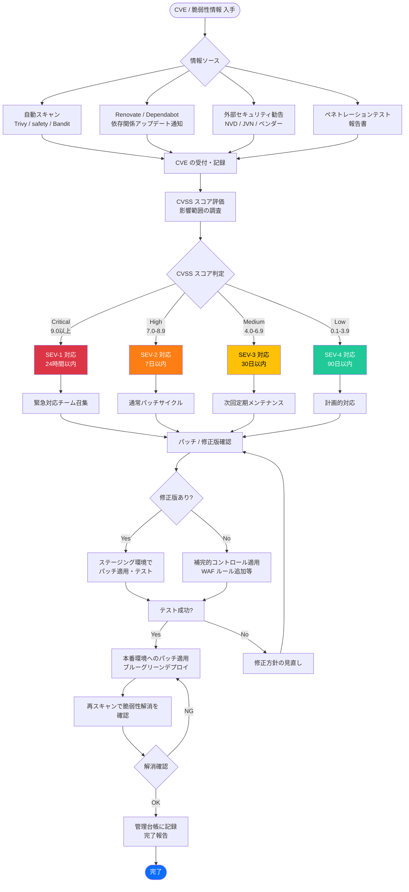

# 脆弱性管理（Vulnerability Management）

| 項目 | 内容 |
|------|------|
| 文書番号 | SEC-VUL-001 |
| バージョン | 1.0.0 |
| 作成日 | 2026-03-24 |
| 最終更新日 | 2026-03-24 |
| 作成者 | セキュリティエンジニアリングチーム |
| 承認者 | CISO |
| 分類 | 機密（Confidential） |
| 準拠規格 | ISO 27001 A.8.8 / NIST CSF ID.RA-1, DE.CM-8 / OWASP Top 10 |

---

## 目次

1. [概要](#概要)
2. [脆弱性スキャン](#脆弱性スキャン)
3. [OWASP Top 10 対策](#owasp-top-10-対策)
4. [依存関係の脆弱性管理](#依存関係の脆弱性管理)
5. [セキュリティパッチ適用ポリシー](#セキュリティパッチ適用ポリシー)
6. [ペネトレーションテスト計画](#ペネトレーションテスト計画)
7. [インシデント対応](#インシデント対応)
8. [CVE 対応フロー](#cve-対応フロー)

---

## 概要

本文書は、ZeroTrust-ID-Governance システムにおける脆弱性管理プロセスを定義する。脆弱性を早期に発見・評価・修正し、継続的なセキュリティ向上を実現することを目的とする。

ISO 27001 A.8.8「技術的脆弱性の管理」および NIST CSF に基づき、脆弱性スキャン・パッチ管理・インシデント対応を一体的に運用する。

### 脆弱性管理の原則

```
1. 予防（Prevention）: 安全な開発プロセスで脆弱性の混入を防止
2. 検出（Detection）: 継続的スキャンで脆弱性を早期発見
3. 評価（Assessment）: CVSS スコアに基づくリスク評価
4. 修正（Remediation）: 優先度に応じた迅速な修正・パッチ適用
5. 検証（Verification）: 修正後の再スキャンで効果を確認
6. 報告（Reporting）: ステークホルダーへの透明な報告
```

---

## 脆弱性スキャン

### スキャンツール一覧

| ツール | 対象 | スキャン種別 | 実行タイミング |
|--------|------|------------|-------------|
| **Trivy** | コンテナイメージ・OS パッケージ | CVE スキャン | PR 時・デイリー |
| **safety** | Python 依存ライブラリ | CVE スキャン | PR 時・デイリー |
| **Bandit** | Python ソースコード | SAST（静的解析） | PR 時・デイリー |
| **Semgrep** | ソースコード全般 | SAST（セキュリティルール） | PR 時 |
| **OWASP ZAP** | Web アプリケーション | DAST（動的解析） | リリース前・週次 |
| **Checkov** | IaC（Terraform/Bicep） | 設定ミス検出 | PR 時 |
| **GitLeaks** | Git リポジトリ | シークレット漏洩検出 | コミット時 |
| **npm audit / pip audit** | 依存関係 | CVE スキャン | PR 時 |

### Trivy（コンテナスキャン）

```yaml
# .github/workflows/security-scan.yml
name: Security Scan

on:
  push:
    branches: [main, develop]
  pull_request:
    branches: [main]
  schedule:
    - cron: '0 2 * * *'  # 毎日午前2時（JST 11時）に定期スキャン

jobs:
  trivy-scan:
    name: Trivy Container Scan
    runs-on: ubuntu-latest
    steps:
      - uses: actions/checkout@v4

      - name: Build Docker image
        run: docker build -t zt-id-governance:${{ github.sha }} .

      - name: Run Trivy vulnerability scanner
        uses: aquasecurity/trivy-action@master
        with:
          image-ref: 'zt-id-governance:${{ github.sha }}'
          format: 'sarif'
          output: 'trivy-results.sarif'
          severity: 'CRITICAL,HIGH'       # CRITICAL/HIGH を検出対象
          exit-code: '1'                  # 脆弱性検出時は CI を失敗させる
          ignore-unfixed: true            # 修正版がないものは除外
          vuln-type: 'os,library'

      - name: Upload Trivy scan results to GitHub Security
        uses: github/codeql-action/upload-sarif@v3
        with:
          sarif_file: 'trivy-results.sarif'
```

### Bandit（Python SAST）

```yaml
  bandit-scan:
    name: Bandit Python Security Scan
    runs-on: ubuntu-latest
    steps:
      - uses: actions/checkout@v4

      - name: Run Bandit
        run: |
          pip install bandit[toml]
          bandit -r ./backend \
            -c pyproject.toml \
            --format json \
            --output bandit-report.json \
            --severity-level medium \
            --confidence-level medium \
            --exit-zero  # レポート生成のみ（CI 失敗は別途判定）

      - name: Check Bandit results
        run: |
          HIGH_COUNT=$(cat bandit-report.json | jq '[.results[] | select(.issue_severity == "HIGH")] | length')
          CRITICAL_COUNT=$(cat bandit-report.json | jq '[.results[] | select(.issue_severity == "CRITICAL")] | length')
          if [ $HIGH_COUNT -gt 0 ] || [ $CRITICAL_COUNT -gt 0 ]; then
            echo "High/Critical セキュリティ問題が検出されました"
            exit 1
          fi
```

```toml
# pyproject.toml（Bandit 設定）
[tool.bandit]
exclude_dirs = ["tests", "docs"]
skips = [
    "B101",  # assert 使用（テストコードのみ）
]
```

### safety（Python 依存関係スキャン）

```bash
# safety によるPython パッケージ脆弱性チェック
pip install safety

# requirements.txt をスキャン
safety check -r requirements.txt \
  --json \
  --output safety-report.json

# 特定の CVE を無視する場合（承認済みのもののみ）
safety check -r requirements.txt \
  --ignore 12345 \  # CVE ID
  --json
```

### GitLeaks（シークレット検出）

```yaml
  gitleaks-scan:
    name: GitLeaks Secret Detection
    runs-on: ubuntu-latest
    steps:
      - uses: actions/checkout@v4
        with:
          fetch-depth: 0  # 全履歴をスキャン

      - uses: gitleaks/gitleaks-action@v2
        env:
          GITHUB_TOKEN: ${{ secrets.GITHUB_TOKEN }}
          GITLEAKS_LICENSE: ${{ secrets.GITLEAKS_LICENSE }}
```

---

## OWASP Top 10 対策

### OWASP Top 10 2021 対策一覧

| 順位 | 脆弱性カテゴリ | リスクレベル | 対策実装状況 | 実装方法 |
|-----|-------------|------------|------------|---------|
| A01 | アクセス制御の不備 | 高 | 実装済 | RBAC + 最小権限 + PostgreSQL RLS |
| A02 | 暗号化の失敗 | 高 | 実装済 | TLS 1.3 + AES-256 + bcrypt + Key Vault |
| A03 | インジェクション | 高 | 実装済 | SQLAlchemy ORM + Pydantic バリデーション |
| A04 | 安全でない設計 | 中 | 実装済 | 脅威モデリング + セキュアデザインレビュー |
| A05 | セキュリティの設定ミス | 中 | 実装済 | Checkov + セキュリティヘッダー + 最小権限設定 |
| A06 | 脆弱で古いコンポーネント | 中 | 実装済 | Trivy + safety + Renovate |
| A07 | 識別と認証の失敗 | 高 | 実装済 | MFA + JWT 短命化 + ロックアウト |
| A08 | ソフトウェアとデータの整合性の失敗 | 中 | 実装済 | 署名検証 + SBOM + Supply Chain Security |
| A09 | セキュリティログとモニタリングの失敗 | 中 | 実装済 | 監査ログ + SIEM + アラート |
| A10 | サーバーサイドリクエストフォージェリ（SSRF） | 中 | 実装済 | URL バリデーション + アウトバウンド制限 |

### A01: アクセス制御の不備

```python
# 実装例: オブジェクトレベルアクセス制御（BOLA/IDOR 防止）
@router.get("/users/{user_id}")
async def get_user(
    user_id: UUID,
    current_user: UserContext = Depends(get_current_user)
):
    """
    ユーザー情報取得
    - EndUser は自分のデータのみ取得可能（IDOR 防止）
    - TenantAdmin はテナント内ユーザーのみ
    - GlobalAdmin は全ユーザー
    """
    # オブジェクトレベルの認可チェック
    if not current_user.can_access_user(user_id):
        raise HTTPException(
            status_code=403,
            detail="このユーザーデータへのアクセス権限がありません"
        )

    return await user_service.get_user(user_id, current_user.tenant_id)
```

### A03: インジェクション

```python
# SQLAlchemy ORM でパラメータ化クエリを使用（SQL インジェクション防止）
from sqlalchemy import select
from sqlalchemy.orm import Session

# 安全: ORM を使用したパラメータ化クエリ
async def get_user_by_email(email: str, db: Session) -> User:
    stmt = select(User).where(User.email == email)  # パラメータ化
    return db.execute(stmt).scalar_one_or_none()

# 禁止: 文字列連結（SQL インジェクションの危険）
# query = f"SELECT * FROM users WHERE email = '{email}'"  # NG

# Pydantic による入力バリデーション
from pydantic import BaseModel, EmailStr, field_validator
import re

class UserCreateRequest(BaseModel):
    email: EmailStr          # メール形式の自動検証
    display_name: str
    password: str

    @field_validator("display_name")
    @classmethod
    def validate_display_name(cls, v: str) -> str:
        if not re.match(r'^[\w\s\-\.]{1,100}$', v):
            raise ValueError("表示名に無効な文字が含まれています")
        return v.strip()
```

### A07: 識別と認証の失敗

```python
# 認証失敗のセキュアな処理（エラーメッセージの一般化）
async def authenticate_user(credentials: LoginRequest) -> User:
    """
    認証失敗時のエラーメッセージを一般化（ユーザー名列挙攻撃防止）
    """
    user = await user_repo.get_by_email(credentials.email)

    # ユーザーが存在しない場合もダミーハッシュと比較して
    # 処理時間を一定に保つ（タイミング攻撃防止）
    dummy_hash = "$2b$12$dummyhashfordummypasswordcheck"
    hash_to_compare = user.hashed_password if user else dummy_hash

    is_valid = pwd_service.verify_password(credentials.password, hash_to_compare)

    if not user or not is_valid:
        # ユーザーが存在しないかパスワードが違うかを明示しない
        raise HTTPException(
            status_code=401,
            detail="メールアドレスまたはパスワードが正しくありません"
        )

    return user
```

### A10: SSRF

```python
# SSRF 防止: URL バリデーション
import ipaddress
from urllib.parse import urlparse

ALLOWED_DOMAINS = [
    "login.microsoftonline.com",
    "graph.microsoft.com",
]

def validate_external_url(url: str) -> str:
    """外部 URL の SSRF 攻撃を防止"""
    parsed = urlparse(url)

    # スキーマチェック（http/https のみ）
    if parsed.scheme not in ("http", "https"):
        raise ValueError(f"許可されていないスキーマ: {parsed.scheme}")

    # ホワイトリストドメイン確認
    if parsed.netloc not in ALLOWED_DOMAINS:
        raise ValueError(f"許可されていないドメイン: {parsed.netloc}")

    # プライベートIPアドレスへのアクセス禁止
    try:
        ip = ipaddress.ip_address(parsed.hostname)
        if ip.is_private or ip.is_loopback or ip.is_link_local:
            raise ValueError("内部 IP アドレスへのアクセスは禁止されています")
    except ValueError:
        pass  # ホスト名の場合はDNS解決後に再チェック

    return url
```

---

## 依存関係の脆弱性管理

### Renovate による自動依存関係更新

```json
// renovate.json
{
  "$schema": "https://docs.renovatebot.com/renovate-schema.json",
  "extends": ["config:base"],
  "timezone": "Asia/Tokyo",
  "schedule": ["every weekend"],

  "vulnerabilityAlerts": {
    "enabled": true,
    "labels": ["security", "dependencies"],
    "assignees": ["@security-team"]
  },

  "packageRules": [
    {
      "description": "セキュリティ修正は即座に適用",
      "matchUpdateTypes": ["patch"],
      "matchCategories": ["security"],
      "automerge": true,
      "automergeType": "pr",
      "schedule": "at any time"
    },
    {
      "description": "マイナーアップデートは週次でまとめる",
      "matchUpdateTypes": ["minor"],
      "groupName": "minor-dependencies",
      "schedule": ["every weekend"]
    },
    {
      "description": "メジャーアップデートはレビュー必須",
      "matchUpdateTypes": ["major"],
      "dependencyDashboardApproval": true
    }
  ],

  "pip": {
    "enabled": true,
    "fileMatch": ["requirements*.txt", "pyproject.toml"]
  },

  "npm": {
    "enabled": true
  },

  "docker": {
    "enabled": true
  }
}
```

### SBOM（ソフトウェア部品表）管理

```yaml
  generate-sbom:
    name: Generate SBOM
    runs-on: ubuntu-latest
    steps:
      - uses: actions/checkout@v4

      - name: Generate SBOM（CycloneDX 形式）
        run: |
          pip install cyclonedx-bom
          cyclonedx-py --format json --output sbom.json

      - name: Upload SBOM as artifact
        uses: actions/upload-artifact@v4
        with:
          name: sbom-${{ github.sha }}
          path: sbom.json

      - name: Scan SBOM for vulnerabilities（Trivy）
        uses: aquasecurity/trivy-action@master
        with:
          scan-type: 'sbom'
          scan-ref: 'sbom.json'
```

---

## セキュリティパッチ適用ポリシー

### 重大度別対応期限

| CVSS スコア | 重大度 | 対応期限 | 対応手順 |
|------------|--------|---------|---------|
| 9.0 - 10.0 | **Critical** | **24時間以内** | 緊急パッチ・即座に本番適用 |
| 7.0 - 8.9 | **High** | **7日以内** | 通常パッチサイクルで適用 |
| 4.0 - 6.9 | **Medium** | **30日以内** | 次回定期メンテナンスで適用 |
| 0.1 - 3.9 | **Low** | **90日以内** | 計画的に対応 |

### パッチ適用プロセス

```
[1] 脆弱性の検出
  - Trivy / safety / Renovate による自動検出
  - CVE データベースとの照合
  - セキュリティアドバイザリの監視
    ↓
[2] リスク評価
  - CVSS スコアの確認
  - 本システムへの影響度評価（悪用可能性・対象コンポーネント）
  - 補完的コントロールの有無確認
    ↓
[3] パッチ適用計画
  - 修正バージョンの特定
  - 影響範囲のテスト（ステージング環境）
  - ロールバック計画の策定
    ↓
[4] テスト・適用
  - ステージング環境でのパッチ適用・動作確認
  - 自動テストスイートの実行
  - 本番環境への適用（ブルーグリーンデプロイ）
    ↓
[5] 検証・報告
  - パッチ適用後の再スキャン
  - 脆弱性が解消されたことを確認
  - セキュリティ管理台帳への記録
```

---

## ペネトレーションテスト計画

### テスト計画概要

| 項目 | 内容 |
|------|------|
| 実施頻度 | 年1回（定期）+ 重大変更時（臨時） |
| 実施形式 | ブラックボックス + グレーボックス |
| 実施者 | 外部の認定ペネトレーションテスター |
| 対象範囲 | Web アプリ・API・インフラ・ソーシャルエンジニアリング |
| 使用手法 | OWASP テストガイド / PTES（Penetration Testing Execution Standard） |

### テスト対象と範囲

```
[外部からの攻撃シミュレーション]
  1. Web アプリケーション
    - OWASP Top 10 全項目
    - ビジネスロジック脆弱性
    - セッション管理
    - 認証・認可バイパス

  2. API セキュリティ
    - OWASP API Security Top 10
    - JWT 操作
    - レート制限バイパス
    - マスアサインメント

  3. インフラストラクチャ
    - オープンポートスキャン
    - クラウド設定レビュー（Azure）
    - ネットワーク分離確認

[内部からの攻撃シミュレーション]
  4. 特権昇格テスト
    - 水平移動（横断）
    - 垂直移動（権限昇格）
    - テナント越境アクセス

  5. インサイダー脅威シミュレーション
    - 最小権限違反の試行
    - 監査ログ改ざん試行
```

### テスト後の対応

```
[報告書の受領と評価]
  1. テスト業者から報告書を受領（機密扱い）
  2. Critical/High 脆弱性の即座の把握
  3. セキュリティチームによる内部評価会議

[修正計画の策定]
  1. 重大度別の修正優先度決定
  2. 担当チームへのタスク割り当て
  3. 修正期限の設定

[修正・検証]
  1. 脆弱性の修正実施
  2. テスト業者による修正確認（リテスト）
  3. 全脆弱性の解消確認

[報告]
  1. 経営層への報告（エグゼクティブサマリー）
  2. コンプライアンス記録への記載
  3. セキュリティ改善計画の更新
```

---

## インシデント対応

### インシデント分類

| 重大度 | 定義 | 例 | 対応時間目標 |
|--------|------|-----|------------|
| **SEV-1（Critical）** | サービス全停止・大規模データ漏洩 | DB 不正アクセス・ランサムウェア | 即座（15分以内） |
| **SEV-2（High）** | 部分的サービス障害・認証システム侵害 | JWT 鍵漏洩・管理者アカウント乗っ取り | 1時間以内 |
| **SEV-3（Medium）** | 限定的な影響・脆弱性悪用の試み | ブルートフォース検知・XSS 試行 | 4時間以内 |
| **SEV-4（Low）** | 軽微な問題・潜在的リスク | 設定ミスの発見・スキャン検知 | 24時間以内 |

### セキュリティ侵害時の対応手順

```
=== フェーズ 1: 検出・初動（0-30分）===
  □ アラートの受信・確認
  □ インシデントチームの召集（SIRT: Security Incident Response Team）
  □ 初期評価（影響範囲・重大度の概算）
  □ インシデントログの開始
  □ 法的・規制上の通知義務の確認

=== フェーズ 2: 封じ込め（30分-4時間）===
  □ 侵害されたアカウント・システムを即座に分離
  □ 影響を受けたユーザーのセッションを全失効（Redis jti ブラックリスト）
  □ 侵害が疑われる API キー・シークレットを即座にローテーション
  □ 追加の侵害拡大を防ぐための緊急アクセス制限
  □ フォレンジック用のログ・スナップショットを保全

=== フェーズ 3: 根本原因分析（4-24時間）===
  □ 監査ログ・SIEM の詳細分析
  □ 攻撃ベクター・侵入経路の特定
  □ 影響を受けたデータ・システムの範囲確定
  □ タイムラインの再構築

=== フェーズ 4: 根絶（24-72時間）===
  □ 脆弱性の修正・パッチ適用
  □ マルウェア・バックドアの除去
  □ 設定の修正・強化
  □ セキュリティコントロールの見直し

=== フェーズ 5: 復旧（72時間以降）===
  □ クリーンな状態への復旧
  □ モニタリング強化での段階的サービス再開
  □ 影響を受けたユーザーへの通知
  □ 関係機関への報告（NISC、個人情報保護委員会等）

=== フェーズ 6: 事後対応（1-2週間）===
  □ 詳細インシデントレポートの作成
  □ 再発防止策の策定・実施
  □ セキュリティポリシーの更新
  □ ポストモーテム会議（非難しない文化）
  □ 教訓の全チームへの共有
```

### 通知・報告義務

| 通知先 | 条件 | 期限 |
|--------|------|------|
| 個人情報保護委員会 | 個人データ漏洩（1000件以上） | 発覚から72時間以内 |
| 影響を受けた本人 | 個人データ漏洩 | できるだけ速やかに |
| NISC（内閣サイバーセキュリティセンター） | 重要インフラへの攻撃 | 発覚から72時間以内 |
| Azure セキュリティ | Azure 環境での侵害 | 即座に報告 |
| 経営層 | SEV-1 / SEV-2 | 発覚から1時間以内 |

---

## CVE 対応フロー



### CVE 管理台帳

| 管理項目 | 説明 |
|---------|------|
| CVE ID | 例：CVE-2024-12345 |
| 対象コンポーネント | 影響を受けるライブラリ・サービス |
| CVSS スコア | 基本スコア（Base Score）と評価ベクター |
| 本システムへの影響 | 悪用可能性の実際の評価 |
| 対応状況 | 未対応 / 対応中 / 完了 / 受容（リスク許容） |
| 修正バージョン | パッチが適用されたバージョン |
| 適用日 | 実際にパッチを適用した日時 |
| 担当者 | 対応担当エンジニア |
| 確認者 | レビュー・承認者 |
| 備考 | 補完的コントロール等の追加情報 |

### セキュリティアドバイザリ監視

```python
# セキュリティアドバイザリの定期監視設定
ADVISORY_SOURCES = [
    "https://nvd.nist.gov/feeds/json/cve/1.1/",           # NVD
    "https://jvndb.jvn.jp/apis/",                          # JVN（日本）
    "https://github.com/advisories",                        # GitHub Advisory
    "https://security.snyk.io/",                           # Snyk
    "https://pypi.org/security/",                          # PyPI
]

# Slack / Teams への自動通知設定
ALERT_THRESHOLDS = {
    "critical": {
        "cvss_min": 9.0,
        "notify": ["#security-alerts", "@security-team"],
        "pagerduty": True
    },
    "high": {
        "cvss_min": 7.0,
        "notify": ["#security-alerts"],
        "pagerduty": False
    }
}
```

---

## 改訂履歴

| バージョン | 日付 | 変更内容 | 変更者 |
|-----------|------|---------|--------|
| 1.0.0 | 2026-03-24 | 初版作成 | セキュリティエンジニアリングチーム |
