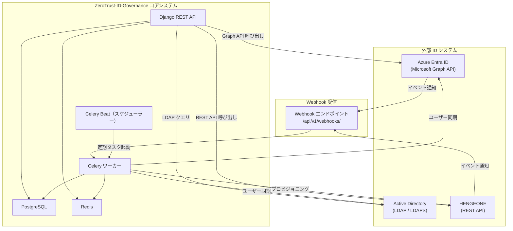
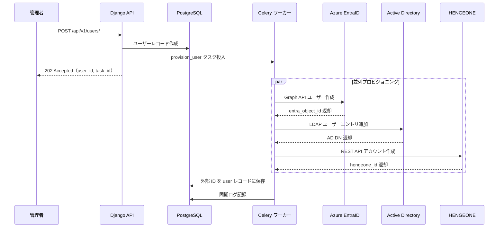
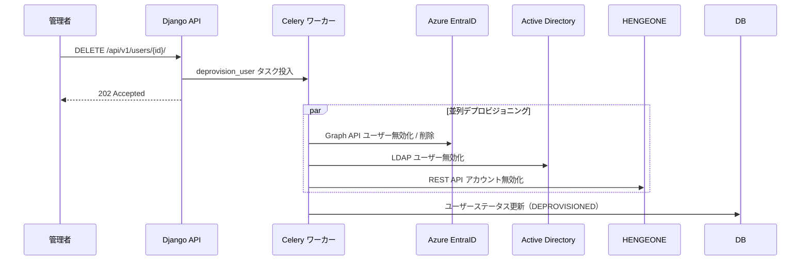

# 外部システム連携概要（Integration Overview）

| 項目 | 内容 |
|------|------|
| 文書番号 | INT-OVR-001 |
| バージョン | 1.0.0 |
| 作成日 | 2026-03-24 |
| 最終更新日 | 2026-03-24 |
| 作成者 | アーキテクチャチーム |
| ステータス | ドラフト |
| 関連システム | EntraID / Active Directory / HENGEONE |

---

## 1. 概要

本文書は、ZeroTrust-ID-Governance システムと外部 ID 管理システムとの統合アーキテクチャ全体を定義する。
各外部システムとの連携方式、データフロー、非同期処理方針、エラーハンドリングおよび監視方針を網羅的に記述する。

---

## 2. 統合対象システム一覧

| システム名 | 略称 | 用途 | 接続方式 | 優先度 |
|-----------|------|------|---------|--------|
| Azure Entra ID（旧 Azure AD） | EntraID | クラウド ID プロビジョニング / SSO | Microsoft Graph API / OAuth2 | 高 |
| Active Directory（オンプレミス） | AD | オンプレミスユーザー / グループ管理 | LDAP / LDAPS | 高 |
| HENGEONE | HEN | クラウド IDaaS / アクセス管理 | REST API（API キー認証） | 中 |

---

## 3. 統合アーキテクチャ全体図



---

## 4. 同期方式

### 4.1 同期方式の分類

| 方式 | 説明 | 対象システム | トリガー |
|------|------|------------|---------|
| リアルタイム同期 | Webhook 受信後に即時 Celery タスクを投入 | EntraID / HENGEONE | 外部システムからのイベント |
| バッチ同期 | Celery Beat による定期スケジュール実行 | EntraID / AD / HENGEONE | cron スケジュール |
| 手動同期 | API エンドポイント経由で管理者が手動起動 | 全システム | 管理者操作 |

### 4.2 同期頻度設定

| 対象システム | バッチ同期間隔 | 同期スコープ |
|------------|------------|-----------|
| EntraID | 15分ごと | ユーザー / グループ / ロール |
| Active Directory | 30分ごと | ユーザー / グループ |
| HENGEONE | 1時間ごと | ユーザーアカウント |
| 全システム差分チェック | 5分ごと | 変更検知のみ |

---

## 5. データフロー概要

### 5.1 ユーザー作成フロー



### 5.2 ユーザー削除（デプロビジョニング）フロー



---

## 6. Celery タスクによる非同期統合処理

### 6.1 主要タスク一覧

| タスク名 | キュー | 説明 | タイムアウト |
|---------|------|------|-----------|
| `provision_user` | `integration` | ユーザーを全外部システムに作成 | 120秒 |
| `deprovision_user` | `integration` | ユーザーを全外部システムで無効化 | 120秒 |
| `sync_entra_users` | `sync` | EntraID からユーザー情報を同期 | 600秒 |
| `sync_ad_users` | `sync` | AD からユーザー情報を同期 | 600秒 |
| `sync_hengeone_users` | `sync` | HENGEONE からユーザー情報を同期 | 300秒 |
| `process_webhook_event` | `webhook` | Webhook イベントを処理 | 60秒 |
| `update_user_roles` | `integration` | ロール変更を外部システムに反映 | 90秒 |
| `health_check_integrations` | `monitoring` | 外部システム接続確認 | 30秒 |

### 6.2 Celery キュー構成

```python
CELERY_TASK_ROUTES = {
    "integrations.tasks.provision_user": {"queue": "integration"},
    "integrations.tasks.deprovision_user": {"queue": "integration"},
    "integrations.tasks.sync_entra_users": {"queue": "sync"},
    "integrations.tasks.sync_ad_users": {"queue": "sync"},
    "integrations.tasks.sync_hengeone_users": {"queue": "sync"},
    "integrations.tasks.process_webhook_event": {"queue": "webhook"},
    "integrations.tasks.health_check_integrations": {"queue": "monitoring"},
}

CELERY_BEAT_SCHEDULE = {
    "sync-entra-every-15min": {
        "task": "integrations.tasks.sync_entra_users",
        "schedule": crontab(minute="*/15"),
    },
    "sync-ad-every-30min": {
        "task": "integrations.tasks.sync_ad_users",
        "schedule": crontab(minute="*/30"),
    },
    "sync-hengeone-every-hour": {
        "task": "integrations.tasks.sync_hengeone_users",
        "schedule": crontab(minute=0),
    },
    "health-check-every-5min": {
        "task": "integrations.tasks.health_check_integrations",
        "schedule": crontab(minute="*/5"),
    },
}
```

---

## 7. エラーハンドリングと再試行ポリシー

### 7.1 再試行設定

| タスク種別 | 最大再試行回数 | 再試行間隔 | バックオフ |
|-----------|-------------|---------|----------|
| プロビジョニング | 5回 | 60秒 | 指数（2倍） |
| デプロビジョニング | 5回 | 60秒 | 指数（2倍） |
| バッチ同期 | 3回 | 300秒 | 固定 |
| Webhook 処理 | 3回 | 30秒 | 指数（1.5倍） |

### 7.2 エラー分類と対応方針

| エラー種別 | HTTP / LDAP コード | 対応方針 |
|-----------|------------------|---------|
| 一時的な接続エラー | 5xx / LDAP_SERVER_DOWN | 再試行キューに投入 |
| 認証エラー | 401 / 403 | アラート通知、再試行なし |
| リソース重複エラー | 409 / LDAP_ALREADY_EXISTS | 更新処理に切り替え |
| リソース未存在エラー | 404 / LDAP_NO_SUCH_OBJECT | スキップ、ログ記録 |
| レートリミット | 429 | 指定された Retry-After 後に再試行 |
| タイムアウト | - | 再試行（最大 5回）後に Dead Letter キュー |

### 7.3 Dead Letter キュー（DLQ）処理

```python
# 最大再試行超過後の処理
@app.task(bind=True, max_retries=5)
def provision_user(self, user_id: int):
    try:
        _do_provision(user_id)
    except TemporaryError as exc:
        raise self.retry(exc=exc, countdown=60 * (2 ** self.request.retries))
    except Exception as exc:
        # DLQ へ移動してアラート送信
        IntegrationFailure.objects.create(
            task_name="provision_user",
            user_id=user_id,
            error=str(exc),
            retry_count=self.request.retries,
        )
        notify_admin_alert(f"provision_user 失敗: user_id={user_id}, error={exc}")
        raise
```

---

## 8. 統合監視方針

### 8.1 監視対象指標

| 指標 | 説明 | 警告閾値 | 緊急閾値 |
|------|------|---------|---------|
| 同期成功率 | バッチ同期の成功割合 | < 95% | < 80% |
| タスク処理遅延 | Celery キュー待機時間 | > 5分 | > 15分 |
| 外部 API 応答時間 | 各システムの API レイテンシ | > 3秒 | > 10秒 |
| Webhook 処理失敗数 | 1時間あたりの失敗件数 | > 10件 | > 50件 |
| DLQ 件数 | 未処理の失敗タスク数 | > 5件 | > 20件 |
| 外部システム接続断 | ヘルスチェック失敗 | 1回 | 3回連続 |

### 8.2 監視エンドポイント

```
GET /api/v1/admin/integrations/health/
GET /api/v1/admin/integrations/sync-status/
GET /api/v1/admin/integrations/failures/
GET /api/v1/admin/integrations/metrics/
```

### 8.3 アラート通知先

| 重大度 | 通知先 | 通知方法 |
|--------|-------|---------|
| Warning | 担当チーム | メール / Slack |
| Critical | オンコール担当 | PagerDuty / Slack |
| System Down | 全関係者 | メール / 電話 |

---

## 9. 関連文書

| 文書番号 | 文書名 |
|---------|-------|
| INT-ENT-001 | EntraID 連携設計 |
| INT-AD-001 | Active Directory 連携設計 |
| INT-HEN-001 | HENGEONE 連携設計 |
| INT-WH-001 | Webhook 設計 |
| SEC-001 | セキュリティ設計概要 |
| OPS-001 | 運用監視設計 |
