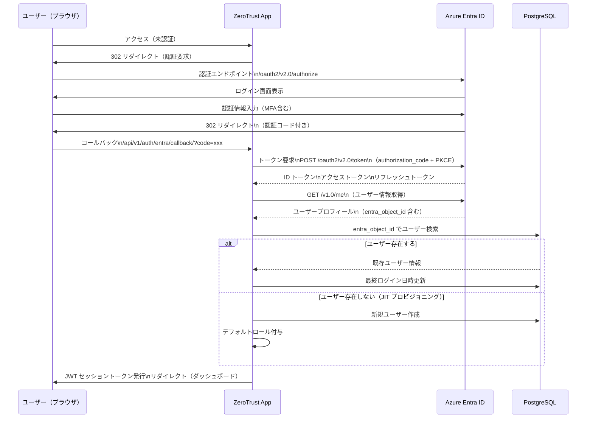
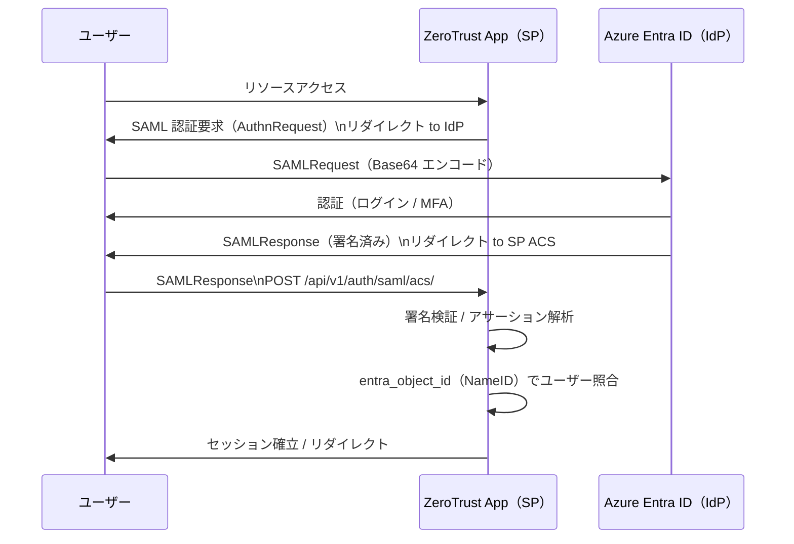

# EntraID 連携設計（EntraID Integration）

| 項目 | 内容 |
|------|------|
| 文書番号 | INT-ENT-001 |
| バージョン | 1.0.0 |
| 作成日 | 2026-03-24 |
| 最終更新日 | 2026-03-24 |
| 作成者 | アーキテクチャチーム |
| ステータス | ドラフト |
| 関連システム | Azure Entra ID（旧 Azure Active Directory） |

---

## 1. 概要

本文書は、ZeroTrust-ID-Governance システムと Azure Entra ID（旧称: Azure Active Directory）との統合設計を定義する。
Microsoft Graph API を通じてユーザー・グループ・ロールの同期を行い、SSO（シングルサインオン）を SAML 2.0 / OAuth2 / OpenID Connect により実現する。

### 1.1 統合目標

- クラウドユーザーの一元的なライフサイクル管理
- EntraID を IdP（Identity Provider）として利用した SSO の実現
- グループ・ロールの自動同期によるアクセス権管理の自動化
- `entra_object_id` によるユーザーの一意紐付け

---

## 2. 必要な Azure 設定

### 2.1 アプリ登録（App Registration）

Azure Portal にてアプリケーションを登録し、以下の情報を取得する。

| 設定項目 | 説明 | 設定場所 |
|---------|------|---------|
| テナント ID | Azure AD テナントの一意識別子 | Azure Portal > Azure Active Directory > テナント情報 |
| クライアント ID | 登録アプリケーションの ID | Azure Portal > アプリの登録 > 概要 |
| クライアントシークレット | アプリ認証用のシークレット値 | Azure Portal > アプリの登録 > 証明書とシークレット |
| リダイレクト URI | 認証コールバック先 URL | Azure Portal > アプリの登録 > 認証 |

### 2.2 必要な API 権限

| 権限 | 種別 | 用途 |
|------|------|------|
| `User.Read.All` | アプリケーション | 全ユーザー情報読み取り |
| `User.ReadWrite.All` | アプリケーション | ユーザー作成・更新・削除 |
| `Group.Read.All` | アプリケーション | グループ情報読み取り |
| `Group.ReadWrite.All` | アプリケーション | グループ管理 |
| `Directory.Read.All` | アプリケーション | ディレクトリ情報読み取り |
| `RoleManagement.Read.All` | アプリケーション | ロール情報読み取り |

### 2.3 環境変数設定

```bash
# Azure Entra ID 接続設定
AZURE_TENANT_ID=xxxxxxxx-xxxx-xxxx-xxxx-xxxxxxxxxxxx
AZURE_CLIENT_ID=xxxxxxxx-xxxx-xxxx-xxxx-xxxxxxxxxxxx
AZURE_CLIENT_SECRET=your-client-secret-value

# OAuth2 / OIDC 設定
AZURE_AUTHORITY=https://login.microsoftonline.com/${AZURE_TENANT_ID}
AZURE_REDIRECT_URI=https://your-domain.com/api/v1/auth/entra/callback/
AZURE_SCOPES=openid profile email User.Read

# Graph API
GRAPH_API_BASE_URL=https://graph.microsoft.com/v1.0
```

---

## 3. Microsoft Graph API を使用したユーザー同期

### 3.1 Graph API クライアント実装

```python
# integrations/entra/client.py
import httpx
from django.conf import settings
from django.core.cache import cache


class GraphAPIClient:
    """Microsoft Graph API クライアント"""

    BASE_URL = "https://graph.microsoft.com/v1.0"
    TOKEN_CACHE_KEY = "entra_access_token"

    def __init__(self):
        self.tenant_id = settings.AZURE_TENANT_ID
        self.client_id = settings.AZURE_CLIENT_ID
        self.client_secret = settings.AZURE_CLIENT_SECRET

    def get_access_token(self) -> str:
        """クライアントクレデンシャルフローでアクセストークンを取得"""
        token = cache.get(self.TOKEN_CACHE_KEY)
        if token:
            return token

        url = f"https://login.microsoftonline.com/{self.tenant_id}/oauth2/v2.0/token"
        data = {
            "grant_type": "client_credentials",
            "client_id": self.client_id,
            "client_secret": self.client_secret,
            "scope": "https://graph.microsoft.com/.default",
        }
        response = httpx.post(url, data=data, timeout=30)
        response.raise_for_status()
        token_data = response.json()
        token = token_data["access_token"]
        # expires_in より少し早め（5分前）にキャッシュを失効させる
        cache.set(self.TOKEN_CACHE_KEY, token, timeout=token_data["expires_in"] - 300)
        return token

    def get_headers(self) -> dict:
        return {
            "Authorization": f"Bearer {self.get_access_token()}",
            "Content-Type": "application/json",
        }

    def list_users(self, delta_link: str | None = None) -> dict:
        """ユーザー一覧取得（差分同期対応）"""
        url = delta_link or f"{self.BASE_URL}/users/delta"
        response = httpx.get(url, headers=self.get_headers(), timeout=60)
        response.raise_for_status()
        return response.json()

    def get_user(self, entra_object_id: str) -> dict:
        """特定ユーザー取得"""
        url = f"{self.BASE_URL}/users/{entra_object_id}"
        response = httpx.get(url, headers=self.get_headers(), timeout=30)
        response.raise_for_status()
        return response.json()

    def create_user(self, user_data: dict) -> dict:
        """ユーザー作成"""
        url = f"{self.BASE_URL}/users"
        response = httpx.post(url, json=user_data, headers=self.get_headers(), timeout=30)
        response.raise_for_status()
        return response.json()

    def update_user(self, entra_object_id: str, user_data: dict) -> None:
        """ユーザー更新"""
        url = f"{self.BASE_URL}/users/{entra_object_id}"
        response = httpx.patch(url, json=user_data, headers=self.get_headers(), timeout=30)
        response.raise_for_status()

    def disable_user(self, entra_object_id: str) -> None:
        """ユーザー無効化"""
        self.update_user(entra_object_id, {"accountEnabled": False})

    def delete_user(self, entra_object_id: str) -> None:
        """ユーザー削除"""
        url = f"{self.BASE_URL}/users/{entra_object_id}"
        response = httpx.delete(url, headers=self.get_headers(), timeout=30)
        response.raise_for_status()
```

### 3.2 差分同期（Delta Query）の活用

```python
# integrations/entra/sync.py
from integrations.entra.client import GraphAPIClient
from django.core.cache import cache


DELTA_LINK_CACHE_KEY = "entra_delta_link"


def sync_entra_users():
    """EntraID ユーザー差分同期"""
    client = GraphAPIClient()
    delta_link = cache.get(DELTA_LINK_CACHE_KEY)

    while True:
        response = client.list_users(delta_link=delta_link)
        users = response.get("value", [])

        for user in users:
            _process_entra_user(user)

        # 次回差分取得用の deltaLink を保存
        if "@odata.deltaLink" in response:
            cache.set(DELTA_LINK_CACHE_KEY, response["@odata.deltaLink"], timeout=86400)
            break
        # nextLink がある場合は続きを取得
        delta_link = response.get("@odata.nextLink")
        if not delta_link:
            break
```

---

## 4. SAML / OAuth2 / OpenID Connect フロー

### 4.1 OpenID Connect 認証フロー



### 4.2 SAML 2.0 フロー（SP-Initiated）



---

## 5. ユーザープロビジョニング / デプロビジョニング

### 5.1 プロビジョニング処理

```python
# integrations/entra/provisioning.py
from integrations.entra.client import GraphAPIClient


def provision_user_to_entra(user) -> str:
    """
    ZeroTrust ユーザーを EntraID に作成し、entra_object_id を返す
    """
    client = GraphAPIClient()

    entra_user_data = {
        "accountEnabled": True,
        "displayName": user.get_full_name(),
        "mailNickname": user.username,
        "userPrincipalName": f"{user.username}@{settings.AZURE_DOMAIN}",
        "mail": user.email,
        "givenName": user.first_name,
        "surname": user.last_name,
        "passwordProfile": {
            "forceChangePasswordNextSignIn": True,
            "password": _generate_temp_password(),
        },
        "usageLocation": "JP",
        "department": user.department,
        "jobTitle": user.job_title,
    }

    created = client.create_user(entra_user_data)
    return created["id"]  # entra_object_id


def deprovision_user_from_entra(entra_object_id: str) -> None:
    """EntraID ユーザーを無効化"""
    client = GraphAPIClient()
    client.disable_user(entra_object_id)
```

### 5.2 プロビジョニングステータス管理

| ステータス | 説明 |
|-----------|------|
| `PENDING` | プロビジョニング待機中 |
| `PROVISIONING` | 処理中 |
| `PROVISIONED` | 完了 |
| `FAILED` | 失敗（要調査） |
| `DEPROVISIONING` | 削除処理中 |
| `DEPROVISIONED` | 無効化完了 |

---

## 6. グループ / ロール同期

### 6.1 グループ同期設計

```python
def sync_entra_groups(user):
    """EntraID グループ情報を ZeroTrust ロールに同期"""
    client = GraphAPIClient()
    url = f"{client.BASE_URL}/users/{user.entra_object_id}/memberOf"
    response = httpx.get(url, headers=client.get_headers(), timeout=30)
    response.raise_for_status()

    entra_groups = response.json().get("value", [])
    entra_group_ids = {g["id"] for g in entra_groups}

    # グループ → ロールマッピング
    for mapping in EntraGroupRoleMapping.objects.filter(
        entra_group_id__in=entra_group_ids
    ):
        user.roles.add(mapping.role)
```

### 6.2 グループ・ロールマッピング設定例

| EntraID グループ名 | EntraID グループ ID | ZeroTrust ロール |
|-------------------|-------------------|----------------|
| `IT-Admins` | `xxxxxxxx-...` | `SYSTEM_ADMIN` |
| `Security-Team` | `xxxxxxxx-...` | `SECURITY_ADMIN` |
| `All-Employees` | `xxxxxxxx-...` | `USER` |
| `IT-ReadOnly` | `xxxxxxxx-...` | `READONLY` |

---

## 7. entra_object_id によるユーザー紐付け

### 7.1 データモデル

```python
# users/models.py（抜粋）
class User(AbstractBaseUser):
    # EntraID 連携フィールド
    entra_object_id = models.UUIDField(
        unique=True,
        null=True,
        blank=True,
        db_index=True,
        help_text="Azure Entra ID オブジェクト ID",
    )
    entra_provisioning_status = models.CharField(
        max_length=20,
        choices=ProvisioningStatus.choices,
        default=ProvisioningStatus.PENDING,
    )
    entra_last_synced_at = models.DateTimeField(null=True, blank=True)
    entra_upn = models.EmailField(
        null=True,
        blank=True,
        help_text="Entra ID UserPrincipalName",
    )
```

### 7.2 ユーザー検索・照合ロジック

```python
def find_or_create_user_from_entra(entra_profile: dict):
    """
    EntraID プロフィールから ZeroTrust ユーザーを検索または作成する。
    照合優先順位: entra_object_id > email > UPN
    """
    from users.models import User

    entra_object_id = entra_profile.get("id")
    email = entra_profile.get("mail") or entra_profile.get("userPrincipalName")

    # 1. entra_object_id で検索
    user = User.objects.filter(entra_object_id=entra_object_id).first()
    if user:
        return user, False  # (user, created)

    # 2. メールアドレスで検索（既存ユーザーとの紐付け）
    if email:
        user = User.objects.filter(email=email).first()
        if user:
            user.entra_object_id = entra_object_id
            user.save(update_fields=["entra_object_id"])
            return user, False

    # 3. 新規作成（JIT プロビジョニング）
    user = User.objects.create(
        entra_object_id=entra_object_id,
        email=email,
        first_name=entra_profile.get("givenName", ""),
        last_name=entra_profile.get("surname", ""),
        entra_provisioning_status=ProvisioningStatus.PROVISIONED,
    )
    return user, True
```

---

## 8. 関連文書

| 文書番号 | 文書名 |
|---------|-------|
| INT-OVR-001 | 外部システム連携概要 |
| INT-AD-001 | Active Directory 連携設計 |
| INT-WH-001 | Webhook 設計 |
| SEC-001 | セキュリティ設計概要 |
