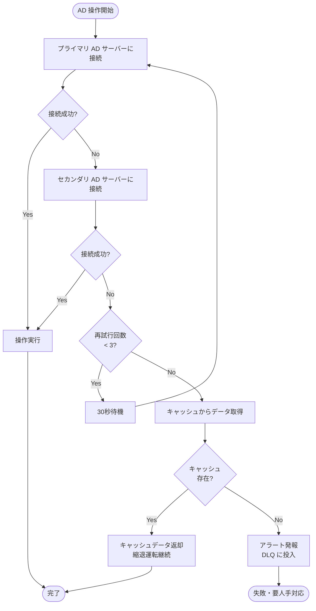

# Active Directory 連携設計（AD Integration）

| 項目 | 内容 |
|------|------|
| 文書番号 | INT-AD-001 |
| バージョン | 1.0.0 |
| 作成日 | 2026-03-24 |
| 最終更新日 | 2026-03-24 |
| 作成者 | アーキテクチャチーム |
| ステータス | ドラフト |
| 関連システム | Active Directory（オンプレミス） |

---

## 1. 概要

本文書は、ZeroTrust-ID-Governance システムとオンプレミス Active Directory（AD）との統合設計を定義する。
LDAP / LDAPS プロトコルを通じてユーザー・グループ情報の同期と管理を行い、オンプレミス環境のアイデンティティライフサイクルを自動化する。

### 1.1 統合目標

- オンプレミス AD ユーザーの一元的なライフサイクル管理
- LDAP / LDAPS による安全な接続
- DN（Distinguished Name）を用いた正確なユーザー・グループ管理
- `ad_dn` によるユーザーの一意紐付け
- 定期バッチ同期によるディレクトリ整合性の維持

---

## 2. LDAP / LDAPS 接続設定

### 2.1 接続パラメータ

| 設定項目 | 環境変数名 | 説明 | 例 |
|---------|-----------|------|---|
| AD サーバーアドレス | `AD_SERVER` | LDAP サーバーのホスト名または IP | `ldaps://ad.example.com:636` |
| バインド DN | `AD_BIND_DN` | 接続用サービスアカウントの DN | `CN=svc-zerotrust,OU=ServiceAccounts,DC=example,DC=com` |
| バインドパスワード | `AD_BIND_PASSWORD` | サービスアカウントのパスワード | `（秘密情報）` |
| ベース DN | `AD_BASE_DN` | 検索ベースとなる DN | `DC=example,DC=com` |
| ユーザー OU | `AD_USER_OU` | ユーザー作成先の OU | `OU=Users,DC=example,DC=com` |
| グループ OU | `AD_GROUP_OU` | グループ検索対象の OU | `OU=Groups,DC=example,DC=com` |
| タイムアウト | `AD_TIMEOUT` | 接続タイムアウト（秒） | `30` |
| TLS 証明書検証 | `AD_TLS_VERIFY` | TLS 証明書の検証有無 | `true` |
| CA 証明書パス | `AD_CA_CERT_PATH` | カスタム CA 証明書のパス | `/etc/ssl/certs/company-ca.pem` |

### 2.2 環境変数設定例

```bash
# Active Directory 接続設定
AD_SERVER=ldaps://ad.example.com:636
AD_BIND_DN=CN=svc-zerotrust,OU=ServiceAccounts,DC=example,DC=com
AD_BIND_PASSWORD=your-service-account-password
AD_BASE_DN=DC=example,DC=com
AD_USER_OU=OU=Users,DC=example,DC=com
AD_GROUP_OU=OU=Groups,DC=example,DC=com
AD_TIMEOUT=30
AD_TLS_VERIFY=true
AD_CA_CERT_PATH=/etc/ssl/certs/company-ca.pem
```

### 2.3 LDAP クライアント実装

```python
# integrations/ad/client.py
import ldap3
from django.conf import settings


class ADClient:
    """Active Directory LDAP クライアント"""

    def __init__(self):
        self.server_uri = settings.AD_SERVER
        self.bind_dn = settings.AD_BIND_DN
        self.bind_password = settings.AD_BIND_PASSWORD
        self.base_dn = settings.AD_BASE_DN
        self.timeout = int(settings.AD_TIMEOUT)

    def get_connection(self) -> ldap3.Connection:
        """LDAP 接続を確立して返す"""
        tls = None
        if settings.AD_TLS_VERIFY:
            tls = ldap3.Tls(
                ca_certs_file=settings.AD_CA_CERT_PATH,
                validate=ssl.CERT_REQUIRED,
            )

        server = ldap3.Server(
            self.server_uri,
            use_ssl=self.server_uri.startswith("ldaps://"),
            tls=tls,
            connect_timeout=self.timeout,
        )
        conn = ldap3.Connection(
            server,
            user=self.bind_dn,
            password=self.bind_password,
            auto_bind=ldap3.AUTO_BIND_TLS_BEFORE_BIND,
            raise_exceptions=True,
        )
        return conn
```

---

## 3. ユーザー操作（検索・作成・更新・無効化）

### 3.1 ユーザー検索

```python
def search_user(self, username: str) -> dict | None:
    """sAMAccountName でユーザーを検索する"""
    with self.get_connection() as conn:
        conn.search(
            search_base=self.base_dn,
            search_filter=f"(&(objectClass=user)(sAMAccountName={ldap3.utils.conv.escape_filter_chars(username)}))",
            search_scope=ldap3.SUBTREE,
            attributes=[
                "cn", "sAMAccountName", "userPrincipalName",
                "mail", "givenName", "sn", "distinguishedName",
                "memberOf", "userAccountControl", "whenCreated", "whenChanged",
            ],
        )
        if conn.entries:
            return conn.entries[0].entry_attributes_as_dict
    return None

def search_users_by_ou(self, ou: str | None = None) -> list[dict]:
    """OU 内の全ユーザーを一覧取得"""
    base = ou or settings.AD_USER_OU
    with self.get_connection() as conn:
        conn.search(
            search_base=base,
            search_filter="(&(objectClass=user)(!(objectClass=computer)))",
            search_scope=ldap3.SUBTREE,
            attributes=ldap3.ALL_ATTRIBUTES,
            paged_size=1000,  # ページング設定
        )
        return [e.entry_attributes_as_dict for e in conn.entries]
```

### 3.2 ユーザー作成

```python
def create_user(self, user_data: dict) -> str:
    """
    AD ユーザーエントリを作成し、DN を返す
    user_data: {username, first_name, last_name, email, password, ou}
    """
    username = user_data["username"]
    ou = user_data.get("ou", settings.AD_USER_OU)
    dn = f"CN={user_data['first_name']} {user_data['last_name']},{ou}"

    attributes = {
        "objectClass": ["top", "person", "organizationalPerson", "user"],
        "cn": f"{user_data['first_name']} {user_data['last_name']}",
        "sAMAccountName": username,
        "userPrincipalName": f"{username}@{settings.AD_DOMAIN}",
        "mail": user_data["email"],
        "givenName": user_data["first_name"],
        "sn": user_data["last_name"],
        "displayName": f"{user_data['first_name']} {user_data['last_name']}",
        "userAccountControl": "512",  # NORMAL_ACCOUNT（有効）
    }

    with self.get_connection() as conn:
        conn.add(dn, attributes=attributes)
        if not conn.result["result"] == 0:
            raise ADOperationError(f"ユーザー作成失敗: {conn.result}")

        # パスワード設定（LDAPS 必須）
        conn.extend.microsoft.modify_password(dn, user_data["password"])

    return dn
```

### 3.3 ユーザー更新

```python
def update_user(self, dn: str, changes: dict) -> None:
    """
    AD ユーザー属性を更新する
    changes: {attribute_name: new_value}
    """
    modification_map = {
        attr: [(ldap3.MODIFY_REPLACE, [value])]
        for attr, value in changes.items()
    }

    with self.get_connection() as conn:
        conn.modify(dn, modification_map)
        if conn.result["result"] != 0:
            raise ADOperationError(f"ユーザー更新失敗: {conn.result}")
```

### 3.4 ユーザー無効化

```python
# userAccountControl フラグ値
UAC_NORMAL_ACCOUNT = 512      # 有効アカウント
UAC_ACCOUNTDISABLE = 514      # 無効アカウント（512 + 2）
UAC_PASSWORD_EXPIRED = 8388608  # パスワード期限切れ

def disable_user(self, dn: str) -> None:
    """AD ユーザーを無効化する"""
    self.update_user(dn, {"userAccountControl": str(UAC_ACCOUNTDISABLE)})

def enable_user(self, dn: str) -> None:
    """AD ユーザーを有効化する"""
    self.update_user(dn, {"userAccountControl": str(UAC_NORMAL_ACCOUNT)})

def delete_user(self, dn: str) -> None:
    """AD ユーザーを削除する（慎重に使用）"""
    with self.get_connection() as conn:
        conn.delete(dn)
        if conn.result["result"] != 0:
            raise ADOperationError(f"ユーザー削除失敗: {conn.result}")
```

---

## 4. AD DN（Distinguished Name）管理

### 4.1 DN 設計方針

```
# OU 構造
DC=example,DC=com
├── OU=Users
│   ├── OU=IT
│   ├── OU=Sales
│   ├── OU=HR
│   └── OU=Disabled        ← 無効化ユーザー移動先
├── OU=Groups
│   ├── OU=SecurityGroups
│   └── OU=DistributionGroups
└── OU=ServiceAccounts     ← サービスアカウント
```

### 4.2 DN のデータモデル

```python
# users/models.py（抜粋）
class User(AbstractBaseUser):
    # Active Directory 連携フィールド
    ad_dn = models.CharField(
        max_length=512,
        unique=True,
        null=True,
        blank=True,
        db_index=True,
        help_text="Active Directory Distinguished Name",
    )
    ad_sam_account_name = models.CharField(
        max_length=256,
        null=True,
        blank=True,
        help_text="AD sAMAccountName",
    )
    ad_provisioning_status = models.CharField(
        max_length=20,
        choices=ProvisioningStatus.choices,
        default=ProvisioningStatus.PENDING,
    )
    ad_last_synced_at = models.DateTimeField(null=True, blank=True)
```

### 4.3 ユーザー移動（OU 変更）

```python
def move_user_to_ou(self, current_dn: str, target_ou: str) -> str:
    """ユーザーを別の OU に移動する（退職時: Disabled OU 等）"""
    # CN 部分を抽出
    cn_part = current_dn.split(",")[0]
    new_dn = f"{cn_part},{target_ou}"

    with self.get_connection() as conn:
        conn.modify_dn(current_dn, cn_part, new_superior=target_ou)
        if conn.result["result"] != 0:
            raise ADOperationError(f"ユーザー移動失敗: {conn.result}")

    return new_dn
```

---

## 5. AD グループとロールのマッピング

### 5.1 グループ検索

```python
def get_user_groups(self, user_dn: str) -> list[str]:
    """ユーザーが所属するグループの DN リストを返す（ネストグループ対応）"""
    with self.get_connection() as conn:
        conn.search(
            search_base=self.base_dn,
            search_filter=f"(member:1.2.840.113556.1.4.1941:={user_dn})",
            search_scope=ldap3.SUBTREE,
            attributes=["distinguishedName", "cn", "sAMAccountName"],
        )
        return [e.entry_dn for e in conn.entries]
```

### 5.2 グループ・ロールマッピング設定例

| AD グループ DN | ZeroTrust ロール | 説明 |
|--------------|----------------|------|
| `CN=IT-Admins,OU=SecurityGroups,...` | `SYSTEM_ADMIN` | IT 管理者グループ |
| `CN=Security-Team,OU=SecurityGroups,...` | `SECURITY_ADMIN` | セキュリティチーム |
| `CN=All-Employees,OU=SecurityGroups,...` | `USER` | 全社員 |
| `CN=IT-ReadOnly,OU=SecurityGroups,...` | `READONLY` | 読み取り専用 |

### 5.3 グループ同期処理

```python
def sync_user_roles_from_ad(user):
    """AD グループ情報を ZeroTrust ロールに同期"""
    client = ADClient()
    group_dns = client.get_user_groups(user.ad_dn)

    mapped_roles = ADGroupRoleMapping.objects.filter(
        ad_group_dn__in=group_dns
    ).values_list("role__name", flat=True)

    # 現在のロールを更新
    current_roles = set(user.roles.values_list("name", flat=True))
    target_roles = set(mapped_roles)

    # 追加ロール
    for role_name in target_roles - current_roles:
        role = Role.objects.get(name=role_name)
        user.roles.add(role)

    # 削除ロール（AD から外れた場合）
    for role_name in current_roles - target_roles:
        role = Role.objects.get(name=role_name)
        user.roles.remove(role)
```

---

## 6. 定期同期スケジュール

### 6.1 同期スケジュール設定

| タスク | 頻度 | 対象 | 説明 |
|--------|------|------|------|
| フル同期 | 毎日 02:00 | 全ユーザー | AD からの全ユーザー情報を取得・同期 |
| 増分同期 | 30分ごと | 変更されたユーザー | `whenChanged` 属性を使用した差分取得 |
| グループ同期 | 1時間ごと | 全グループ | グループ所属の変更を ZeroTrust に反映 |
| 接続ヘルスチェック | 5分ごと | 接続確認のみ | LDAP 接続確認と簡易クエリ実行 |

### 6.2 増分同期（whenChanged を使用）

```python
from datetime import datetime, timedelta, timezone


def sync_ad_users_incremental():
    """
    直近 35分間に変更されたユーザーのみを同期
    （30分スケジュールで 5分のバッファを持たせる）
    """
    client = ADClient()
    cutoff = datetime.now(timezone.utc) - timedelta(minutes=35)
    # AD の generalized time フォーマット
    ad_time = cutoff.strftime("%Y%m%d%H%M%S.0Z")

    with client.get_connection() as conn:
        conn.search(
            search_base=settings.AD_USER_OU,
            search_filter=f"(&(objectClass=user)(whenChanged>={ad_time}))",
            search_scope=ldap3.SUBTREE,
            attributes=ldap3.ALL_ATTRIBUTES,
        )
        for entry in conn.entries:
            _process_ad_user(entry.entry_attributes_as_dict)
```

---

## 7. フォールバック処理

### 7.1 フォールバック戦略



### 7.2 フォールバック実装

```python
AD_SERVERS = [
    settings.AD_PRIMARY_SERVER,
    settings.AD_SECONDARY_SERVER,  # 冗長化構成の場合
]


def get_connection_with_fallback() -> ldap3.Connection:
    """プライマリ → セカンダリの順で接続を試みる"""
    last_error = None
    for server_uri in AD_SERVERS:
        try:
            server = ldap3.Server(server_uri, use_ssl=True, connect_timeout=10)
            conn = ldap3.Connection(
                server,
                user=settings.AD_BIND_DN,
                password=settings.AD_BIND_PASSWORD,
                auto_bind=True,
                raise_exceptions=True,
            )
            return conn
        except ldap3.core.exceptions.LDAPException as e:
            last_error = e
            logger.warning(f"AD サーバー {server_uri} への接続失敗: {e}")

    raise ADConnectionError(f"全 AD サーバーへの接続失敗: {last_error}")
```

### 7.3 縮退運転モード

AD への接続が完全に失敗した場合、以下の縮退運転を行う。

| 操作 | 縮退運転時の動作 |
|------|---------------|
| ユーザー認証 | キャッシュされた認証情報でローカル認証を継続 |
| ユーザー同期 | タスクを DLQ に保留し、復旧後に再処理 |
| ユーザー作成 | ZeroTrust DB にのみ作成し、AD 同期は保留 |
| ユーザー無効化 | ZeroTrust での無効化のみ実施、AD は保留 |

---

## 8. 関連文書

| 文書番号 | 文書名 |
|---------|-------|
| INT-OVR-001 | 外部システム連携概要 |
| INT-ENT-001 | EntraID 連携設計 |
| INT-HEN-001 | HENGEONE 連携設計 |
| SEC-001 | セキュリティ設計概要 |
| OPS-001 | 運用監視設計 |
