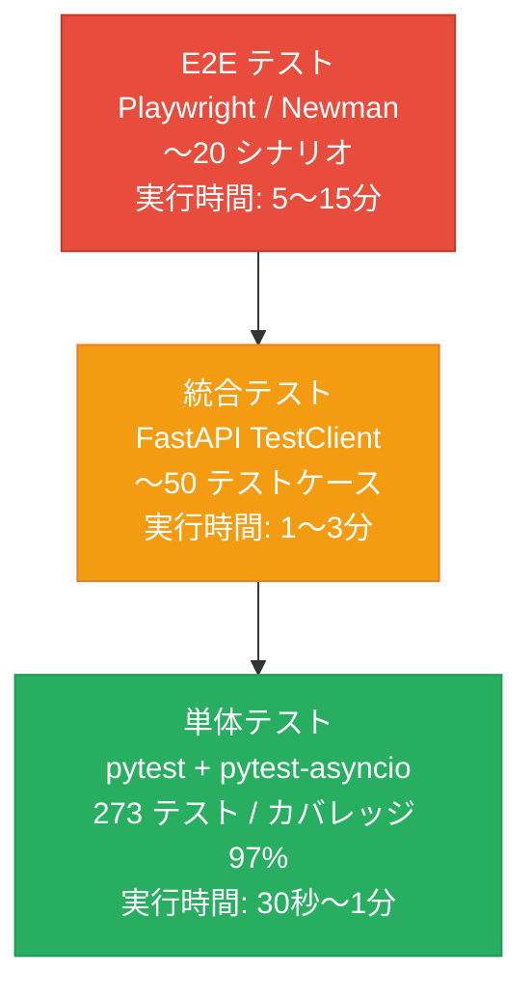
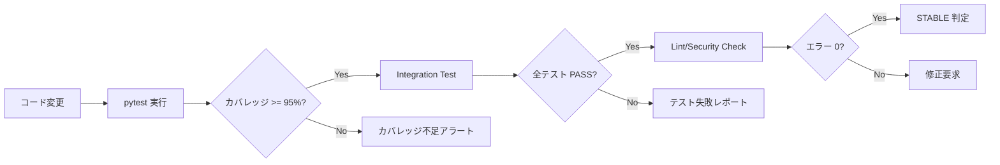
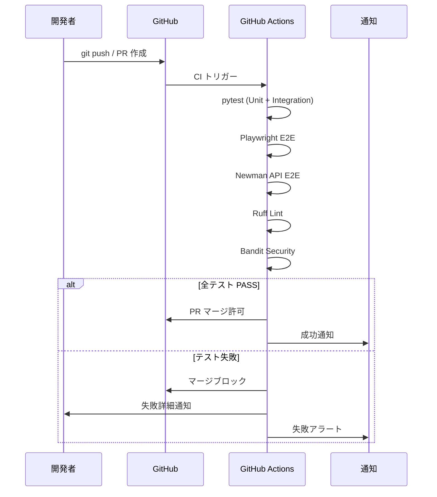
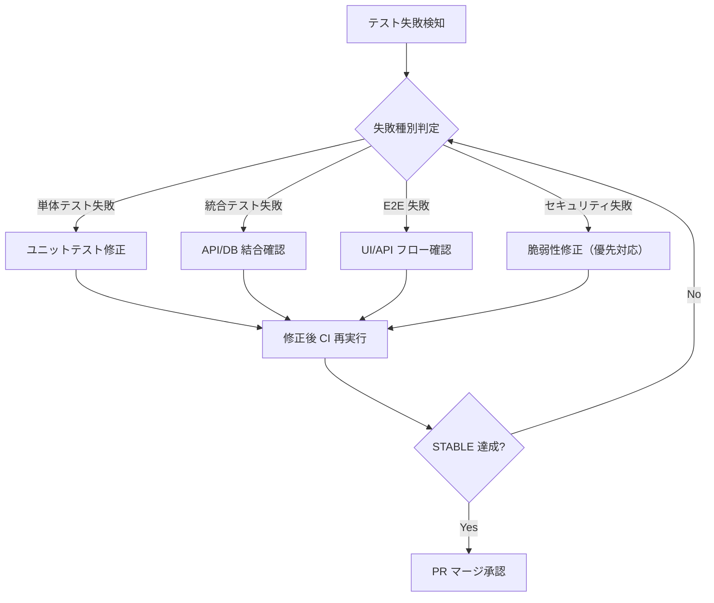

# テスト戦略（Test Strategy）

| 項目 | 内容 |
|------|------|
| 文書番号 | TST-STR-001 |
| バージョン | 1.0.0 |
| 作成日 | 2026-03-25 |
| 作成者 | ZeroTrust-ID-Governance 開発チーム |
| ステータス | 承認済み |

---

## 1. テスト方針

### 1.1 基本方針

ZeroTrust-ID-Governance プロジェクトにおけるテストは、**品質ゲートとしての CI/CD 統合**を中心に設計されています。すべてのコード変更は、自動化されたテストパイプラインを通過することが必須であり、STABLE 状態を維持することがデプロイの前提条件です。

| 方針 | 説明 |
|------|------|
| シフトレフト | 開発初期段階からテストを実施し、バグの早期発見を促進する |
| 自動化優先 | 手動テストを最小化し、回帰テストは完全自動化する |
| 品質ゲート統合 | CI/CD パイプラインでのテスト失敗時はマージをブロックする |
| カバレッジ重視 | コードカバレッジ 95% 以上を常時維持する |
| セキュリティテスト組み込み | セキュリティ検証をテストサイクルに統合する |

### 1.2 CI/CD 品質ゲート

```
Push → CI Pipeline → [Unit Test] → [Integration Test] → [Lint/Security] → [Build] → Deploy
                          |                |                   |               |
                        PASS/FAIL       PASS/FAIL           PASS/FAIL      PASS/FAIL
                          ↓                ↓                   ↓               ↓
                       Coverage       DB Integration        Bandit/Ruff     Docker Build
                       Report         Validation            Check           Success
```

---

## 2. テストピラミッド



| レイヤー | ツール | テスト数 | 目標カバレッジ | 実行頻度 |
|----------|--------|----------|----------------|----------|
| 単体テスト | pytest / pytest-asyncio | 273 | 97%（実績） | 全コミット時 |
| 統合テスト | FastAPI TestClient / pytest | ~50 | 90% 以上 | PR マージ時 |
| E2E テスト | Playwright / Newman | ~20 シナリオ | 全シナリオ PASS | リリース前 |
| パフォーマンステスト | Locust | 負荷シナリオ | p95 < 500ms | 週次 |

---

## 3. 品質指標目標

### 3.1 定量的品質指標

| 指標 | 目標値 | 現在値 | 測定方法 |
|------|--------|--------|----------|
| コードカバレッジ | >95% | **97%** | pytest-cov |
| テストパス率 | 100% | 100%（273/273） | pytest |
| E2E テスト全パス | 100% | 100% | Playwright / Newman |
| CI 成功率 | >99% | >99% | GitHub Actions |
| API レスポンスタイム（p95） | <500ms | 測定中 | Locust |
| セキュリティ脆弱性 | 0 件 | 0 件 | Bandit / Safety |
| Lint エラー | 0 件 | 0 件 | Ruff |

### 3.2 品質トレンド管理



---

## 4. STABLE 判定基準

STABLE 状態はデプロイの必要条件です。以下の全条件を満たす必要があります。

### 4.1 STABLE 条件一覧

| カテゴリ | 条件 | 判定ツール |
|----------|------|------------|
| テスト | 全単体テスト PASS（273/273） | pytest |
| テスト | 全統合テスト PASS | pytest + TestClient |
| テスト | 全 E2E テスト PASS | Playwright / Newman |
| CI | GitHub Actions 全ジョブ成功 | GitHub Actions |
| Lint | Ruff エラー 0 件 | Ruff |
| ビルド | Docker イメージビルド成功 | Docker |
| エラー | ランタイムエラー 0 件 | ログ監視 |
| セキュリティ | Bandit 高リスク 0 件 | Bandit |
| セキュリティ | 依存関係脆弱性 0 件 | Safety / pip-audit |

### 4.2 重大度別 STABLE 回復 N 回数

| 重大度 | 定義 | 連続成功必要回数 |
|--------|------|-----------------|
| Small | Lint 警告・軽微な修正 | 2 回 |
| Normal | 機能変更・バグ修正 | 3 回 |
| Critical | セキュリティ修正・アーキテクチャ変更 | 5 回 |

---

## 5. テスト環境

### 5.1 環境別テスト戦略

| 環境 | 単体テスト | 統合テスト | E2E テスト | 負荷テスト |
|------|------------|------------|------------|------------|
| **ローカル** | 実施（必須） | 実施（任意） | 任意 | 任意 |
| **CI（GitHub Actions）** | 実施（必須） | 実施（必須） | 実施（PR時） | なし |
| **ステージング** | なし | なし | 実施（必須） | 実施（週次） |
| **本番** | なし | なし | スモークテスト | なし |

### 5.2 ローカル環境

```bash
# 単体テスト実行
pytest tests/unit/ -v --cov=. --cov-report=html

# 統合テスト実行（PostgreSQL 起動が必要）
docker-compose up -d postgres redis
pytest tests/integration/ -v

# E2E テスト実行（フロントエンド起動が必要）
npx playwright test
newman run collections/api_e2e.json -e environments/local.json
```

### 5.3 CI 環境（GitHub Actions）

```yaml
# .github/workflows/ci.yml の概要
jobs:
  unit-test:
    runs-on: ubuntu-latest
    services:
      postgres:
        image: postgres:15
      redis:
        image: redis:7
    steps:
      - pytest --cov=. --cov-fail-under=95

  integration-test:
    needs: unit-test
    steps:
      - pytest tests/integration/ -v

  e2e-test:
    needs: integration-test
    steps:
      - npx playwright test
      - newman run ...

  lint-security:
    steps:
      - ruff check .
      - bandit -r . -ll
      - pip-audit
```

### 5.4 ステージング環境

| 設定項目 | 値 |
|----------|----|
| URL | https://staging.zerotrust-id.example.com |
| データベース | PostgreSQL 15（専用インスタンス） |
| 認証 | 本番同等の Keycloak 設定 |
| E2E 実行タイミング | リリース前 / 夜間バッチ |
| 負荷テスト実行タイミング | 毎週日曜日 02:00 |

---

## 6. テスト自動化戦略

### 6.1 自動化対象と優先度

| テスト種別 | 自動化率 | 優先度 | 備考 |
|------------|----------|--------|------|
| 単体テスト | 100% | 最高 | 全機能を網羅 |
| 統合テスト | 100% | 高 | API + DB 結合 |
| E2E テスト | 95% | 高 | 主要フロー全自動 |
| 回帰テスト | 100% | 最高 | CI で毎回実行 |
| セキュリティテスト | 80% | 高 | Bandit / Safety |
| パフォーマンステスト | 70% | 中 | Locust スクリプト |

### 6.2 テスト自動化フロー



### 6.3 テストデータ管理

| データ種別 | 管理方法 | 備考 |
|------------|----------|------|
| 単体テスト用モックデータ | コード内 fixtures | pytest fixture で管理 |
| 統合テスト用 DB データ | pytest fixtures + factory | テスト後ロールバック |
| E2E テスト用シードデータ | SQL スクリプト | 環境別に分離 |
| パフォーマンステスト用データ | Locust タスク内生成 | 本番相当データ量 |

### 6.4 テスト失敗時の対応フロー



---

## 7. テストドキュメント体系

| ドキュメント | 文書番号 | 内容 |
|--------------|----------|------|
| テスト戦略 | TST-STR-001 | 本文書 |
| 単体テスト仕様 | TST-UNIT-001 | pytest 単体テスト詳細 |
| 統合テスト仕様 | TST-INT-001 | FastAPI 統合テスト詳細 |
| E2E テスト仕様 | TST-E2E-001 | Playwright / Newman 詳細 |
| パフォーマンステスト仕様 | TST-PERF-001 | Locust 負荷テスト詳細 |

---

*最終更新: 2026-03-25 | 文書番号: TST-STR-001 | バージョン: 1.0.0*
