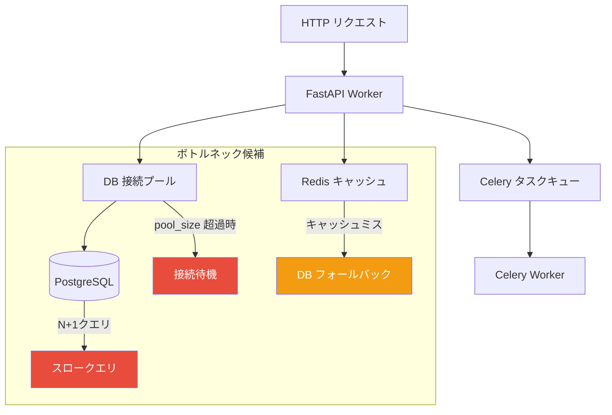
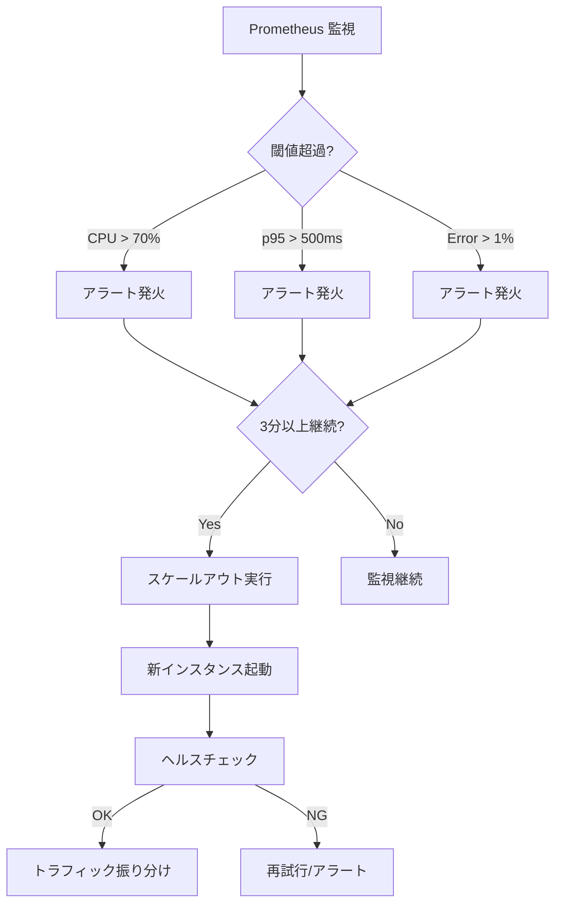
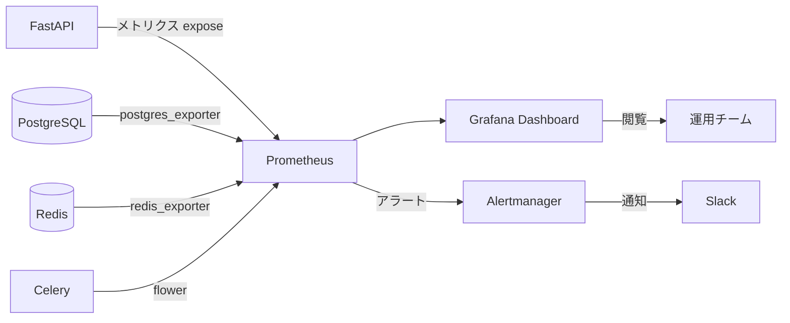

# パフォーマンステスト仕様（Performance Test Specification）

| 項目 | 内容 |
|------|------|
| 文書番号 | TST-PERF-001 |
| バージョン | 1.0.0 |
| 作成日 | 2026-03-25 |
| 作成者 | ZeroTrust-ID-Governance 開発チーム |
| ステータス | 承認済み |

---

## 1. 概要

パフォーマンステストは、ZeroTrust-ID-Governance システムが本番環境の負荷条件下で要求されるレスポンスタイムとスループットを達成できることを検証します。Locust を使用した負荷テストと Prometheus + Grafana による監視を組み合わせます。

### 1.1 パフォーマンステストの種類

| テスト種別 | 目的 | 実施頻度 |
|------------|------|----------|
| 負荷テスト（Load Test） | 通常負荷での性能確認 | 週次 |
| ストレステスト（Stress Test） | 限界負荷の特定 | リリース前 |
| スパイクテスト（Spike Test） | 突発的負荷への対応確認 | リリース前 |
| 耐久テスト（Endurance Test） | 長時間稼働での性能劣化確認 | 月次 |

---

## 2. パフォーマンス目標

### 2.1 レスポンスタイム目標

| エンドポイント | p50 目標 | p95 目標 | p99 目標 | タイムアウト |
|----------------|----------|----------|----------|-------------|
| `GET /health` | < 10ms | < 50ms | < 100ms | 1秒 |
| `POST /auth/login` | < 200ms | < 500ms | < 1,000ms | 5秒 |
| `GET /users` | < 100ms | < 300ms | < 500ms | 3秒 |
| `GET /users/:id` | < 50ms | < 150ms | < 300ms | 2秒 |
| `POST /users` | < 200ms | < 500ms | < 1,000ms | 5秒 |
| `GET /audit-logs` | < 200ms | < 500ms | < 1,000ms | 5秒 |
| `GET /access-requests` | < 100ms | < 300ms | < 500ms | 3秒 |
| `POST /access-requests` | < 200ms | < 500ms | < 1,000ms | 5秒 |

### 2.2 スループット・同時接続目標

| 指標 | 通常負荷 | ピーク負荷 | 限界負荷 |
|------|----------|------------|----------|
| 同時接続ユーザー数 | 50 | **100** | 300 |
| リクエスト/秒（RPS） | 100 | 200 | 500 |
| エラー率 | < 0.1% | < 0.5% | < 1% |

### 2.3 インフラ性能目標

| コンポーネント | 指標 | 目標値 |
|----------------|------|--------|
| **PostgreSQL** | クエリ応答時間（p95） | < 100ms |
| **PostgreSQL** | 接続プール使用率 | < 80% |
| **Redis** | キャッシュヒット率 | > 80% |
| **Redis** | レスポンスタイム（p95） | < 10ms |
| **FastAPI Worker** | CPU 使用率 | < 70% |
| **FastAPI Worker** | メモリ使用量 | < 512MB/プロセス |
| **Celery Worker** | タスクキュー遅延 | < 5秒 |

---

## 3. Locust 負荷テスト計画

### 3.1 Locust インストール・セットアップ

```bash
# インストール
pip install locust==2.24.1

# 基本実行（CLI モード）
locust -f tests/performance/locustfile.py \
  --host http://localhost:8000 \
  --users 100 \
  --spawn-rate 10 \
  --run-time 5m \
  --headless \
  --html reports/locust_report.html \
  --csv reports/locust_stats

# Web UI モード（ブラウザで http://localhost:8089 を開く）
locust -f tests/performance/locustfile.py \
  --host http://localhost:8000
```

### 3.2 Locust 設定ファイル

```ini
# locust.conf
headless = false
host = http://localhost:8000
users = 100
spawn-rate = 10
run-time = 5m
loglevel = INFO
html = reports/locust_report.html
csv = reports/locust_stats
```

### 3.3 メイン Locust ファイル

```python
# tests/performance/locustfile.py
import random
import json
from locust import HttpUser, task, between, events
from locust.exception import StopUser


class ZeroTrustUser(HttpUser):
    """ZeroTrust-ID-Governance の典型的なユーザー操作をシミュレート"""

    wait_time = between(1, 3)  # リクエスト間に 1〜3 秒待機
    host = "http://localhost:8000"

    def on_start(self):
        """ユーザーセッション開始時にログイン"""
        self.token = self._login()
        if not self.token:
            raise StopUser()
        self.headers = {"Authorization": f"Bearer {self.token}"}

    def _login(self) -> str | None:
        """ログインしてアクセストークンを取得"""
        users = [
            {"email": "user1@example.com", "password": "Pass123!"},
            {"email": "user2@example.com", "password": "Pass123!"},
            {"email": "viewer@example.com", "password": "Pass123!"},
        ]
        credentials = random.choice(users)

        with self.client.post(
            "/api/v1/auth/login",
            json=credentials,
            catch_response=True,
            name="/auth/login"
        ) as response:
            if response.status_code == 200:
                return response.json().get("access_token")
            else:
                response.failure(f"ログイン失敗: {response.status_code}")
                return None

    @task(10)
    def get_users_list(self):
        """ユーザー一覧取得（最も頻繁な操作）"""
        page = random.randint(1, 5)
        with self.client.get(
            f"/api/v1/users?page={page}&limit=20",
            headers=self.headers,
            catch_response=True,
            name="/users (list)"
        ) as response:
            if response.status_code == 200:
                data = response.json()
                if "items" not in data:
                    response.failure("レスポンスに items フィールドがない")
            elif response.status_code == 401:
                self.token = self._login()
                self.headers = {"Authorization": f"Bearer {self.token}"}
                response.failure("トークン期限切れ（再ログイン実施）")
            else:
                response.failure(f"予期しないステータス: {response.status_code}")

    @task(5)
    def get_user_detail(self):
        """ユーザー詳細取得"""
        user_id = random.randint(1, 50)
        with self.client.get(
            f"/api/v1/users/{user_id}",
            headers=self.headers,
            catch_response=True,
            name="/users/:id"
        ) as response:
            if response.status_code in [200, 404]:
                response.success()
            else:
                response.failure(f"予期しないステータス: {response.status_code}")

    @task(3)
    def search_audit_logs(self):
        """監査ログ検索"""
        date_from = "2026-03-01"
        date_to = "2026-03-25"
        with self.client.get(
            f"/api/v1/audit-logs?date_from={date_from}&date_to={date_to}&limit=50",
            headers=self.headers,
            catch_response=True,
            name="/audit-logs (search)"
        ) as response:
            if response.status_code == 200:
                response.success()
            else:
                response.failure(f"監査ログ取得失敗: {response.status_code}")

    @task(2)
    def get_access_requests(self):
        """アクセス申請一覧取得"""
        with self.client.get(
            "/api/v1/access-requests?status=pending",
            headers=self.headers,
            catch_response=True,
            name="/access-requests (list)"
        ) as response:
            if response.status_code == 200:
                response.success()
            else:
                response.failure(f"申請一覧取得失敗: {response.status_code}")

    @task(1)
    def create_access_request(self):
        """アクセス申請作成（低頻度）"""
        resources = ["database-prod", "server-web01", "s3-bucket-logs"]
        payload = {
            "resource": random.choice(resources),
            "access_type": "read",
            "reason": "業務データ分析のため",
            "duration_days": random.choice([1, 7, 30]),
        }
        with self.client.post(
            "/api/v1/access-requests",
            json=payload,
            headers=self.headers,
            catch_response=True,
            name="/access-requests (create)"
        ) as response:
            if response.status_code in [201, 400, 403]:
                response.success()
            else:
                response.failure(f"申請作成失敗: {response.status_code}")

    @task(1)
    def health_check(self):
        """ヘルスチェック"""
        self.client.get("/health", name="/health")


class AdminUser(HttpUser):
    """管理者ユーザーの操作をシミュレート（低割合）"""

    wait_time = between(2, 5)
    weight = 1  # ZeroTrustUser(weight=10) に対して低割合

    def on_start(self):
        response = self.client.post("/api/v1/auth/login", json={
            "email": "admin@example.com",
            "password": "AdminPass123!",
        })
        self.headers = {"Authorization": f"Bearer {response.json()['access_token']}"}

    @task(3)
    def list_all_users(self):
        """全ユーザー一覧取得（管理者向け）"""
        self.client.get("/api/v1/users?limit=100", headers=self.headers)

    @task(2)
    def view_audit_reports(self):
        """監査レポート閲覧"""
        self.client.get("/api/v1/audit-logs/summary", headers=self.headers)

    @task(1)
    def manage_roles(self):
        """ロール管理"""
        self.client.get("/api/v1/roles", headers=self.headers)
```

---

## 4. テストシナリオ

### 4.1 シナリオ 1：通常業務負荷テスト

```python
# tests/performance/scenarios/normal_load.py
"""
シナリオ: 通常業務時間帯の負荷
- 同時ユーザー: 50
- スポーン速度: 5ユーザー/秒
- 実行時間: 10分
- 想定: 月曜朝のピーク時間帯
"""

from locust import LoadTestShape


class NormalLoadShape(LoadTestShape):
    stages = [
        {"duration": 60, "users": 10, "spawn_rate": 2},    # ランプアップ
        {"duration": 300, "users": 50, "spawn_rate": 5},   # 定常負荷
        {"duration": 360, "users": 50, "spawn_rate": 5},   # 継続
        {"duration": 420, "users": 0, "spawn_rate": 10},   # 終了
    ]

    def tick(self):
        run_time = self.get_run_time()
        for stage in self.stages:
            if run_time < stage["duration"]:
                return stage["users"], stage["spawn_rate"]
        return None
```

### 4.2 シナリオ 2：ピーク負荷テスト

```python
# tests/performance/scenarios/peak_load.py
"""
シナリオ: ピーク時（100同時ユーザー）
- 同時ユーザー: 100
- スポーン速度: 10ユーザー/秒
- 実行時間: 15分
- 合格基準: p95 < 500ms、エラー率 < 0.5%
"""

class PeakLoadShape(LoadTestShape):
    stages = [
        {"duration": 120, "users": 100, "spawn_rate": 10},  # 急速ランプアップ
        {"duration": 720, "users": 100, "spawn_rate": 10},  # ピーク持続
        {"duration": 840, "users": 0,   "spawn_rate": 20},  # 終了
    ]

    def tick(self):
        run_time = self.get_run_time()
        for stage in self.stages:
            if run_time < stage["duration"]:
                return stage["users"], stage["spawn_rate"]
        return None
```

### 4.3 シナリオ 3：スパイクテスト

```python
# tests/performance/scenarios/spike_test.py
"""
シナリオ: 突発的アクセス増加（スパイク）
- 通常時: 20ユーザー → 突然 200ユーザーに増加 → 通常に戻る
- 目的: オートスケーリングの効果確認
"""

class SpikeTestShape(LoadTestShape):
    stages = [
        {"duration": 120, "users": 20,  "spawn_rate": 5},   # 通常
        {"duration": 180, "users": 200, "spawn_rate": 100},  # スパイク
        {"duration": 240, "users": 200, "spawn_rate": 100},  # スパイク持続
        {"duration": 360, "users": 20,  "spawn_rate": 50},   # 回復
        {"duration": 480, "users": 20,  "spawn_rate": 5},    # 通常に戻る
    ]
```

### 4.4 シナリオ 4：監査ログ検索負荷テスト（ヘビークエリ）

```python
# tests/performance/scenarios/audit_log_heavy.py
"""
シナリオ: 大量データの監査ログ検索
- 対象: 100万件以上のログデータに対する検索
- 目的: DB インデックス・クエリ最適化の確認
"""

class AuditLogHeavyUser(HttpUser):
    wait_time = between(1, 2)

    @task
    def complex_audit_log_search(self):
        """複合条件での監査ログ検索"""
        params = {
            "date_from": "2025-01-01",
            "date_to": "2026-03-25",
            "action": "delete",
            "resource_type": "user",
            "actor_id": random.randint(1, 100),
            "limit": 100,
            "offset": random.randint(0, 10000),
        }
        query_string = "&".join(f"{k}={v}" for k, v in params.items())

        with self.client.get(
            f"/api/v1/audit-logs?{query_string}",
            headers=self.headers,
            catch_response=True,
            name="/audit-logs (complex search)"
        ) as response:
            if response.elapsed.total_seconds() > 1.0:
                response.failure(
                    f"レスポンスが遅すぎる: {response.elapsed.total_seconds():.2f}s"
                )
```

---

## 5. ボトルネック分析

### 5.1 主要ボトルネック箇所



### 5.2 DB 接続プール設定

```python
# app/core/database.py
from sqlalchemy.ext.asyncio import create_async_engine

engine = create_async_engine(
    settings.DATABASE_URL,
    pool_size=20,          # 通常接続プールサイズ（同時接続100に対して20）
    max_overflow=30,       # オーバーフロー接続（ピーク時の追加接続）
    pool_pre_ping=True,    # 接続の死活確認
    pool_recycle=3600,     # 接続リサイクル間隔（秒）
    pool_timeout=30,       # 接続待機タイムアウト
    echo=False,
)
```

### 5.3 パフォーマンス問題の診断

```bash
# スロークエリの確認（PostgreSQL）
psql -U postgres -d zerotrust_id -c "
SELECT
  query,
  calls,
  total_exec_time / calls AS avg_time_ms,
  rows / calls AS avg_rows
FROM pg_stat_statements
WHERE total_exec_time / calls > 100  -- 100ms 以上のクエリ
ORDER BY avg_time_ms DESC
LIMIT 20;
"

# 接続プール使用状況確認
psql -U postgres -d zerotrust_id -c "
SELECT count(*), state
FROM pg_stat_activity
WHERE datname = 'zerotrust_id'
GROUP BY state;
"

# Redis キャッシュヒット率確認
redis-cli INFO stats | grep -E "keyspace_hits|keyspace_misses"

# Celery タスクキュー確認
celery -A app.worker inspect active
celery -A app.worker inspect reserved
```

### 5.4 ボトルネック対策一覧

| ボトルネック | 症状 | 対策 |
|-------------|------|------|
| DB 接続プール枯渇 | レスポンスタイム急増・タイムアウト | `pool_size` 増加 / PgBouncer 導入 |
| N+1 クエリ | ユーザー一覧取得が遅い | `joinedload()` / `selectinload()` 使用 |
| Redis キャッシュミス | 繰り返しクエリで DB 負荷増大 | TTL 調整・キャッシュ戦略見直し |
| Celery キュー遅延 | 通知・承認フローが遅い | Celery Worker 数増加・優先度設定 |
| インデックス不足 | 監査ログ検索が遅い | 複合インデックス追加 |
| メモリ不足 | GC 頻発・レスポンス不安定 | Worker プロセス数調整 |

---

## 6. スケールアウト判定基準

### 6.1 スケールアウトトリガー

| 指標 | スケールアウト閾値 | スケールイン閾値 |
|------|-------------------|-----------------|
| CPU 使用率（FastAPI） | > 70%（5分平均） | < 30%（10分平均） |
| メモリ使用率 | > 80% | < 50% |
| p95 レスポンスタイム | > 500ms（3分継続） | < 200ms（10分継続） |
| エラー率 | > 1% | < 0.1% |
| DB 接続プール使用率 | > 80% | < 50% |
| Celery キュー深度 | > 1,000 件 | < 100 件 |

### 6.2 スケールアウト判定フロー



### 6.3 Kubernetes HPA 設定例

```yaml
# k8s/hpa.yaml
apiVersion: autoscaling/v2
kind: HorizontalPodAutoscaler
metadata:
  name: zerotrust-api-hpa
spec:
  scaleTargetRef:
    apiVersion: apps/v1
    kind: Deployment
    name: zerotrust-api
  minReplicas: 2
  maxReplicas: 10
  metrics:
    - type: Resource
      resource:
        name: cpu
        target:
          type: Utilization
          averageUtilization: 70
    - type: Resource
      resource:
        name: memory
        target:
          type: Utilization
          averageUtilization: 80
  behavior:
    scaleUp:
      stabilizationWindowSeconds: 60
      policies:
        - type: Percent
          value: 100
          periodSeconds: 60
    scaleDown:
      stabilizationWindowSeconds: 300
      policies:
        - type: Percent
          value: 50
          periodSeconds: 60
```

---

## 7. パフォーマンス監視（Prometheus + Grafana）

### 7.1 監視アーキテクチャ



### 7.2 FastAPI メトリクス設定

```python
# app/middleware/metrics.py
from prometheus_fastapi_instrumentator import Instrumentator
from prometheus_client import Histogram, Counter, Gauge

# カスタムメトリクス定義
request_duration = Histogram(
    "http_request_duration_seconds",
    "HTTP リクエスト処理時間",
    ["method", "endpoint", "status_code"],
    buckets=[0.01, 0.05, 0.1, 0.25, 0.5, 1.0, 2.5, 5.0]
)

active_users = Gauge(
    "zerotrust_active_users_total",
    "アクティブなユーザーセッション数"
)

db_pool_size = Gauge(
    "zerotrust_db_pool_size",
    "DB 接続プール使用数",
    ["status"]  # active, idle, overflow
)

access_request_total = Counter(
    "zerotrust_access_requests_total",
    "アクセス申請総数",
    ["status"]  # created, approved, rejected
)


def setup_metrics(app):
    """Prometheus メトリクスのセットアップ"""
    instrumentator = Instrumentator(
        should_group_status_codes=False,
        should_ignore_untemplated=True,
        should_respect_env_var=True,
        should_instrument_requests_inprogress=True,
        excluded_handlers=["/health", "/metrics"],
        env_var_name="ENABLE_METRICS",
        inprogress_name="http_requests_inprogress",
        inprogress_labels=True,
    )
    instrumentator.instrument(app).expose(app, endpoint="/metrics")
```

### 7.3 Prometheus 設定

```yaml
# monitoring/prometheus.yml
global:
  scrape_interval: 15s
  evaluation_interval: 15s

alerting:
  alertmanagers:
    - static_configs:
        - targets: ["alertmanager:9093"]

rule_files:
  - "rules/zerotrust_alerts.yml"

scrape_configs:
  - job_name: "zerotrust-api"
    static_configs:
      - targets: ["api:8000"]
    metrics_path: "/metrics"
    scrape_interval: 10s

  - job_name: "postgres"
    static_configs:
      - targets: ["postgres-exporter:9187"]

  - job_name: "redis"
    static_configs:
      - targets: ["redis-exporter:9121"]

  - job_name: "celery"
    static_configs:
      - targets: ["flower:5555"]
    metrics_path: "/metrics"
```

### 7.4 アラートルール

```yaml
# monitoring/rules/zerotrust_alerts.yml
groups:
  - name: zerotrust_performance
    rules:
      - alert: HighResponseTime
        expr: |
          histogram_quantile(0.95,
            rate(http_request_duration_seconds_bucket[5m])
          ) > 0.5
        for: 3m
        labels:
          severity: warning
        annotations:
          summary: "p95 レスポンスタイムが 500ms を超過"
          description: "エンドポイント {{ $labels.handler }} の p95 が {{ $value }}s"

      - alert: HighErrorRate
        expr: |
          rate(http_requests_total{status_code=~"5.."}[5m]) /
          rate(http_requests_total[5m]) > 0.01
        for: 2m
        labels:
          severity: critical
        annotations:
          summary: "エラー率が 1% を超過"
          description: "現在のエラー率: {{ $value | humanizePercentage }}"

      - alert: DBConnectionPoolExhausted
        expr: zerotrust_db_pool_size{status="overflow"} > 20
        for: 1m
        labels:
          severity: critical
        annotations:
          summary: "DB 接続プールがオーバーフロー"

      - alert: RedisCacheMissRateHigh
        expr: |
          rate(redis_keyspace_misses_total[5m]) /
          (rate(redis_keyspace_hits_total[5m]) + rate(redis_keyspace_misses_total[5m]))
          > 0.2
        for: 5m
        labels:
          severity: warning
        annotations:
          summary: "Redis キャッシュミス率が 20% を超過"
```

### 7.5 Grafana ダッシュボード構成

| ダッシュボード | 主要パネル |
|----------------|-----------|
| **Overview** | RPS・エラー率・p95 レイテンシ・アクティブユーザー数 |
| **API Performance** | エンドポイント別レスポンスタイム・スループット・エラー分布 |
| **Database** | クエリ時間・接続プール使用率・スロークエリ TOP 10 |
| **Cache (Redis)** | キャッシュヒット率・メモリ使用量・接続数 |
| **Workers (Celery)** | タスク処理数・キュー深度・タスク失敗率 |
| **Infrastructure** | CPU・メモリ・ネットワーク I/O・ディスク使用率 |

---

## 8. パフォーマンステスト実行手順

### 8.1 事前準備

```bash
# テスト用データ投入（100,000ユーザー・1,000,000監査ログ）
python tests/performance/seed_data.py \
  --users 100000 \
  --audit-logs 1000000 \
  --access-requests 50000

# 監視システム起動
docker-compose -f docker-compose.monitoring.yml up -d

# Locust インストール確認
locust --version
```

### 8.2 テスト実行コマンド

```bash
# 通常負荷テスト（10分）
locust -f tests/performance/locustfile.py \
  --host http://staging.zerotrust-id.example.com \
  --users 50 \
  --spawn-rate 5 \
  --run-time 10m \
  --headless \
  --html reports/normal_load_$(date +%Y%m%d).html \
  --csv reports/normal_load_$(date +%Y%m%d)

# ピーク負荷テスト（15分）
locust -f tests/performance/locustfile.py \
  -f tests/performance/scenarios/peak_load.py \
  --host http://staging.zerotrust-id.example.com \
  --headless \
  --html reports/peak_load_$(date +%Y%m%d).html \
  --csv reports/peak_load_$(date +%Y%m%d)

# ストレステスト（限界値探索）
locust -f tests/performance/locustfile.py \
  --host http://staging.zerotrust-id.example.com \
  --users 500 \
  --spawn-rate 20 \
  --run-time 20m \
  --headless \
  --html reports/stress_test_$(date +%Y%m%d).html
```

### 8.3 結果判定基準

| 判定 | 条件 |
|------|------|
| **合格（PASS）** | p95 < 500ms かつ エラー率 < 0.5% かつ 全シナリオ完走 |
| **条件付き合格** | p95 < 800ms かつ エラー率 < 1% |
| **不合格（FAIL）** | p95 >= 800ms または エラー率 >= 1% またはタイムアウト多発 |

---

*最終更新: 2026-03-25 | 文書番号: TST-PERF-001 | バージョン: 1.0.0*
