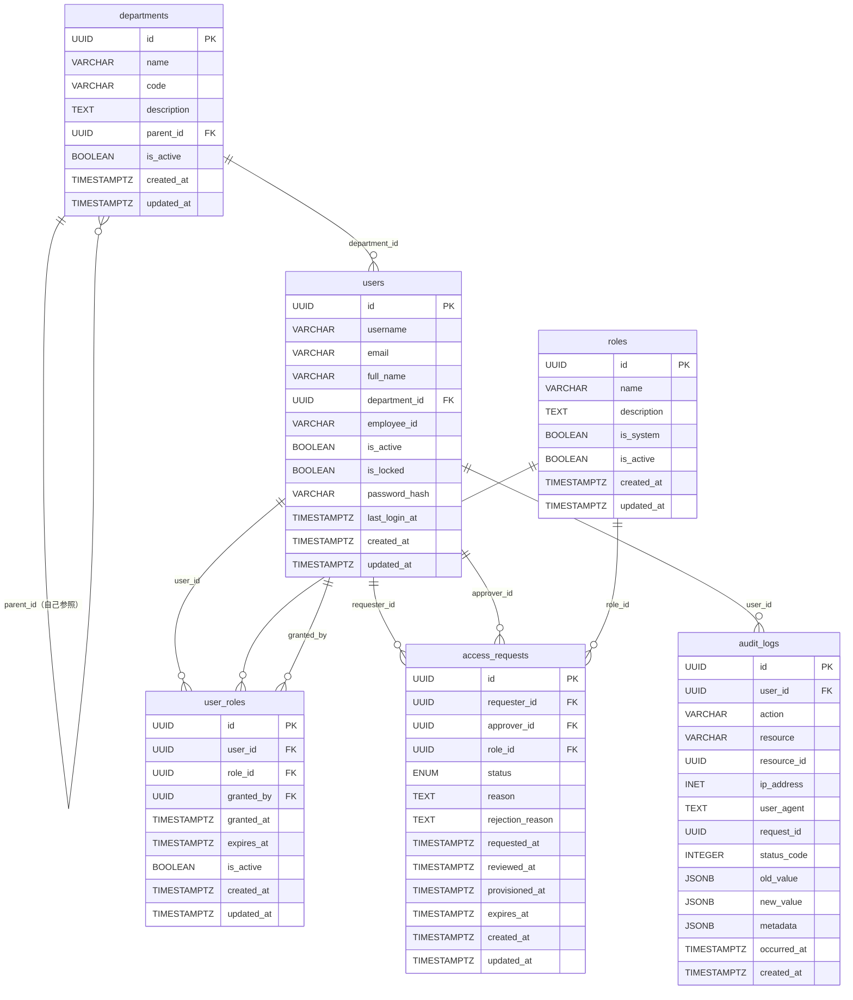

# エンティティ定義（Entity Definition）

| 項目 | 内容 |
|------|------|
| 文書番号 | DM-ENT-001 |
| バージョン | 1.0.0 |
| 作成日 | 2026-03-25 |
| 作成者 | ZeroTrust-ID-Governance 開発チーム |
| ステータス | 承認済み |

---

## 目次

1. [概要](#概要)
2. [エンティティ一覧](#エンティティ一覧)
3. [UUID主キー採用理由](#uuid主キー採用理由)
4. [タイムスタンプカラムの共通化](#タイムスタンプカラムの共通化)
5. [各エンティティ詳細定義](#各エンティティ詳細定義)
6. [エンティティ関係図](#エンティティ関係図)

---

## 概要

本文書は ZeroTrust-ID-Governance システムにおけるデータモデルのエンティティ定義を記述する。
PostgreSQL 16 をデータベースとして使用し、SQLAlchemy をORM、Alembic をマイグレーションツールとして採用する。

### 技術スタック

| コンポーネント | 採用技術 | バージョン |
|--------------|---------|----------|
| データベース | PostgreSQL | 16.x |
| ORM | SQLAlchemy | 2.x |
| マイグレーション | Alembic | 1.x |
| UUID生成 | Python uuid / PostgreSQL gen_random_uuid() | - |

---

## エンティティ一覧

| No. | エンティティ名 | テーブル名 | 説明 | レコード規模 |
|----|--------------|----------|------|------------|
| 1 | 部門 | departments | 組織内の部門・部署情報 | 小規模（〜1,000件） |
| 2 | ユーザー | users | システム利用者の基本情報 | 中規模（〜100,000件） |
| 3 | ロール | roles | 権限ロールの定義 | 小規模（〜500件） |
| 4 | ユーザーロール | user_roles | ユーザーとロールの紐付け（中間テーブル） | 中規模（〜500,000件） |
| 5 | アクセス申請 | access_requests | アクセス権限の申請レコード | 大規模（〜1,000,000件） |
| 6 | 監査ログ | audit_logs | 全操作の監査証跡 | 大規模（〜10,000,000件） |

---

## UUID主キー採用理由

### 採用決定の背景

本システムでは全テーブルの主キーに UUID（Universally Unique Identifier）を採用する。
従来の連番（SERIAL / AUTO_INCREMENT）ではなく UUID を選択した理由は以下の通り。

### 採用理由

#### 1. 分散システム対応

```
連番の問題点：
  - 複数のデータベースノードで重複が発生する
  - シャーディング時に採番の競合が起きる
  - マイクロサービス間でIDが衝突する可能性がある

UUIDの利点：
  - 各ノードが独立してIDを生成可能
  - グローバルに一意性を保証
  - 将来的な水平スケーリングに対応
```

#### 2. セキュリティ

```
連番の問題点：
  - 次のIDが予測可能（例: ID=100 の次は 101）
  - URLに埋め込んだ場合に列挙攻撃（IDOR）のリスク
  - レコード総数が外部から推測される

UUIDの利点：
  - 予測不可能なランダム値（UUID v4）
  - IDOR攻撃への耐性
  - ビジネス情報の秘匿性確保
```

#### 3. データ統合・移行

```
UUIDの利点：
  - 複数システムのデータをマージしてもID衝突なし
  - バックアップからのリストアでID体系が変わらない
  - テスト環境と本番環境でIDが独立
```

### 実装方針

```python
import uuid
from sqlalchemy import Column
from sqlalchemy.dialects.postgresql import UUID

# PostgreSQL ネイティブ UUID 型を使用
id = Column(
    UUID(as_uuid=True),
    primary_key=True,
    default=uuid.uuid4,
    nullable=False,
    comment="主キー（UUID v4）"
)
```

```sql
-- PostgreSQL側での生成も可能
id UUID PRIMARY KEY DEFAULT gen_random_uuid()
```

---

## タイムスタンプカラムの共通化

全エンティティに以下の共通タイムスタンプカラムを実装する。

### 共通カラム定義

| カラム名 | 型 | デフォルト | 説明 |
|---------|---|----------|------|
| `created_at` | TIMESTAMPTZ | `NOW()` | レコード作成日時（UTC） |
| `updated_at` | TIMESTAMPTZ | `NOW()` | レコード最終更新日時（UTC） |

### SQLAlchemy 実装（Base Mixin）

```python
from datetime import datetime, timezone
from sqlalchemy import Column, DateTime
from sqlalchemy.ext.declarative import declared_attr

class TimestampMixin:
    """全エンティティ共通のタイムスタンプ Mixin"""

    @declared_attr
    def created_at(cls):
        return Column(
            DateTime(timezone=True),
            default=lambda: datetime.now(timezone.utc),
            nullable=False,
            comment="レコード作成日時（UTC）"
        )

    @declared_attr
    def updated_at(cls):
        return Column(
            DateTime(timezone=True),
            default=lambda: datetime.now(timezone.utc),
            onupdate=lambda: datetime.now(timezone.utc),
            nullable=False,
            comment="レコード最終更新日時（UTC）"
        )
```

### 設計原則

- **タイムゾーン**: 全タイムスタンプは UTC で保存（`TIMESTAMPTZ`型）
- **表示変換**: フロントエンドで各ロケールに変換
- **自動更新**: `updated_at` は SQLAlchemy の `onupdate` フックで自動更新
- **インデックス**: `created_at` には必要に応じてBTreeインデックスを付与

---

## 各エンティティ詳細定義

### 1. departments（部門）

組織の部門・部署を管理するマスターテーブル。

```sql
CREATE TABLE departments (
    id          UUID PRIMARY KEY DEFAULT gen_random_uuid(),
    name        VARCHAR(200) NOT NULL UNIQUE,
    code        VARCHAR(50)  NOT NULL UNIQUE,
    description TEXT,
    parent_id   UUID REFERENCES departments(id) ON DELETE SET NULL,
    is_active   BOOLEAN NOT NULL DEFAULT TRUE,
    created_at  TIMESTAMPTZ NOT NULL DEFAULT NOW(),
    updated_at  TIMESTAMPTZ NOT NULL DEFAULT NOW()
);
```

| カラム名 | 型 | 制約 | 説明 |
|---------|---|-----|------|
| `id` | UUID | PRIMARY KEY | 部門ID（UUID v4） |
| `name` | VARCHAR(200) | NOT NULL, UNIQUE | 部門名 |
| `code` | VARCHAR(50) | NOT NULL, UNIQUE | 部門コード（例: DEV-001） |
| `description` | TEXT | NULL可 | 部門説明 |
| `parent_id` | UUID | FK → departments.id | 親部門ID（階層構造用） |
| `is_active` | BOOLEAN | NOT NULL, DEFAULT TRUE | 有効フラグ |
| `created_at` | TIMESTAMPTZ | NOT NULL | 作成日時 |
| `updated_at` | TIMESTAMPTZ | NOT NULL | 更新日時 |

**インデックス**

```sql
CREATE INDEX idx_departments_code     ON departments(code);
CREATE INDEX idx_departments_parent_id ON departments(parent_id);
CREATE INDEX idx_departments_is_active ON departments(is_active);
```

---

### 2. users（ユーザー）

システム利用者の基本情報を管理するコアテーブル。

```sql
CREATE TABLE users (
    id            UUID PRIMARY KEY DEFAULT gen_random_uuid(),
    username      VARCHAR(100) NOT NULL UNIQUE,
    email         VARCHAR(255) NOT NULL UNIQUE,
    full_name     VARCHAR(200) NOT NULL,
    department_id UUID REFERENCES departments(id) ON DELETE SET NULL,
    employee_id   VARCHAR(50) UNIQUE,
    is_active     BOOLEAN NOT NULL DEFAULT TRUE,
    is_locked     BOOLEAN NOT NULL DEFAULT FALSE,
    password_hash VARCHAR(255),
    last_login_at TIMESTAMPTZ,
    created_at    TIMESTAMPTZ NOT NULL DEFAULT NOW(),
    updated_at    TIMESTAMPTZ NOT NULL DEFAULT NOW()
);
```

| カラム名 | 型 | 制約 | 説明 |
|---------|---|-----|------|
| `id` | UUID | PRIMARY KEY | ユーザーID（UUID v4） |
| `username` | VARCHAR(100) | NOT NULL, UNIQUE | ログインユーザー名 |
| `email` | VARCHAR(255) | NOT NULL, UNIQUE | メールアドレス |
| `full_name` | VARCHAR(200) | NOT NULL | 氏名 |
| `department_id` | UUID | FK → departments.id | 所属部門ID |
| `employee_id` | VARCHAR(50) | UNIQUE, NULL可 | 社員番号 |
| `is_active` | BOOLEAN | NOT NULL, DEFAULT TRUE | 有効フラグ |
| `is_locked` | BOOLEAN | NOT NULL, DEFAULT FALSE | アカウントロックフラグ |
| `password_hash` | VARCHAR(255) | NULL可 | パスワードハッシュ（bcrypt） |
| `last_login_at` | TIMESTAMPTZ | NULL可 | 最終ログイン日時 |
| `created_at` | TIMESTAMPTZ | NOT NULL | 作成日時 |
| `updated_at` | TIMESTAMPTZ | NOT NULL | 更新日時 |

**インデックス**

```sql
CREATE INDEX idx_users_email         ON users(email);
CREATE INDEX idx_users_username      ON users(username);
CREATE INDEX idx_users_department_id ON users(department_id);
CREATE INDEX idx_users_employee_id   ON users(employee_id);
CREATE INDEX idx_users_is_active     ON users(is_active);
```

---

### 3. roles（ロール）

アクセス権限ロールを定義するマスターテーブル。

```sql
CREATE TABLE roles (
    id          UUID PRIMARY KEY DEFAULT gen_random_uuid(),
    name        VARCHAR(100) NOT NULL UNIQUE,
    description TEXT,
    is_system   BOOLEAN NOT NULL DEFAULT FALSE,
    is_active   BOOLEAN NOT NULL DEFAULT TRUE,
    created_at  TIMESTAMPTZ NOT NULL DEFAULT NOW(),
    updated_at  TIMESTAMPTZ NOT NULL DEFAULT NOW()
);
```

| カラム名 | 型 | 制約 | 説明 |
|---------|---|-----|------|
| `id` | UUID | PRIMARY KEY | ロールID（UUID v4） |
| `name` | VARCHAR(100) | NOT NULL, UNIQUE | ロール名（例: ADMIN, VIEWER） |
| `description` | TEXT | NULL可 | ロール説明 |
| `is_system` | BOOLEAN | NOT NULL, DEFAULT FALSE | システム予約ロールフラグ |
| `is_active` | BOOLEAN | NOT NULL, DEFAULT TRUE | 有効フラグ |
| `created_at` | TIMESTAMPTZ | NOT NULL | 作成日時 |
| `updated_at` | TIMESTAMPTZ | NOT NULL | 更新日時 |

**インデックス**

```sql
CREATE INDEX idx_roles_name      ON roles(name);
CREATE INDEX idx_roles_is_system ON roles(is_system);
CREATE INDEX idx_roles_is_active ON roles(is_active);
```

---

### 4. user_roles（ユーザーロール）

ユーザーとロールの多対多関係を管理する中間テーブル。

```sql
CREATE TABLE user_roles (
    id          UUID PRIMARY KEY DEFAULT gen_random_uuid(),
    user_id     UUID NOT NULL REFERENCES users(id) ON DELETE CASCADE,
    role_id     UUID NOT NULL REFERENCES roles(id) ON DELETE CASCADE,
    granted_by  UUID REFERENCES users(id) ON DELETE SET NULL,
    granted_at  TIMESTAMPTZ NOT NULL DEFAULT NOW(),
    expires_at  TIMESTAMPTZ,
    is_active   BOOLEAN NOT NULL DEFAULT TRUE,
    created_at  TIMESTAMPTZ NOT NULL DEFAULT NOW(),
    updated_at  TIMESTAMPTZ NOT NULL DEFAULT NOW(),
    CONSTRAINT uq_user_roles_user_role UNIQUE (user_id, role_id)
);
```

| カラム名 | 型 | 制約 | 説明 |
|---------|---|-----|------|
| `id` | UUID | PRIMARY KEY | レコードID（UUID v4） |
| `user_id` | UUID | NOT NULL, FK → users.id | ユーザーID |
| `role_id` | UUID | NOT NULL, FK → roles.id | ロールID |
| `granted_by` | UUID | FK → users.id | 付与者ユーザーID |
| `granted_at` | TIMESTAMPTZ | NOT NULL | ロール付与日時 |
| `expires_at` | TIMESTAMPTZ | NULL可 | ロール有効期限（NULL = 無期限） |
| `is_active` | BOOLEAN | NOT NULL, DEFAULT TRUE | 有効フラグ |
| `created_at` | TIMESTAMPTZ | NOT NULL | 作成日時 |
| `updated_at` | TIMESTAMPTZ | NOT NULL | 更新日時 |

**インデックス**

```sql
CREATE INDEX idx_user_roles_user_id   ON user_roles(user_id);
CREATE INDEX idx_user_roles_role_id   ON user_roles(role_id);
CREATE INDEX idx_user_roles_expires_at ON user_roles(expires_at);
CREATE INDEX idx_user_roles_is_active  ON user_roles(is_active);
```

---

### 5. access_requests（アクセス申請）

アクセス権限申請の全ライフサイクルを管理するテーブル。

```sql
CREATE TYPE access_request_status AS ENUM (
    'pending', 'approved', 'rejected', 'cancelled', 'provisioned'
);

CREATE TABLE access_requests (
    id              UUID PRIMARY KEY DEFAULT gen_random_uuid(),
    requester_id    UUID NOT NULL REFERENCES users(id) ON DELETE RESTRICT,
    approver_id     UUID REFERENCES users(id) ON DELETE SET NULL,
    role_id         UUID NOT NULL REFERENCES roles(id) ON DELETE RESTRICT,
    status          access_request_status NOT NULL DEFAULT 'pending',
    reason          TEXT NOT NULL,
    rejection_reason TEXT,
    requested_at    TIMESTAMPTZ NOT NULL DEFAULT NOW(),
    reviewed_at     TIMESTAMPTZ,
    provisioned_at  TIMESTAMPTZ,
    expires_at      TIMESTAMPTZ,
    created_at      TIMESTAMPTZ NOT NULL DEFAULT NOW(),
    updated_at      TIMESTAMPTZ NOT NULL DEFAULT NOW()
);
```

| カラム名 | 型 | 制約 | 説明 |
|---------|---|-----|------|
| `id` | UUID | PRIMARY KEY | 申請ID（UUID v4） |
| `requester_id` | UUID | NOT NULL, FK → users.id | 申請者ユーザーID |
| `approver_id` | UUID | FK → users.id | 承認者ユーザーID |
| `role_id` | UUID | NOT NULL, FK → roles.id | 申請対象ロールID |
| `status` | ENUM | NOT NULL, DEFAULT 'pending' | 申請ステータス |
| `reason` | TEXT | NOT NULL | 申請理由 |
| `rejection_reason` | TEXT | NULL可 | 却下理由 |
| `requested_at` | TIMESTAMPTZ | NOT NULL | 申請日時 |
| `reviewed_at` | TIMESTAMPTZ | NULL可 | 審査完了日時 |
| `provisioned_at` | TIMESTAMPTZ | NULL可 | プロビジョニング完了日時 |
| `expires_at` | TIMESTAMPTZ | NULL可 | 申請有効期限 |
| `created_at` | TIMESTAMPTZ | NOT NULL | 作成日時 |
| `updated_at` | TIMESTAMPTZ | NOT NULL | 更新日時 |

**ステータス遷移**

```
pending → approved  → provisioned
        → rejected
        → cancelled
```

**インデックス**

```sql
CREATE INDEX idx_access_requests_requester_id ON access_requests(requester_id);
CREATE INDEX idx_access_requests_approver_id  ON access_requests(approver_id);
CREATE INDEX idx_access_requests_role_id      ON access_requests(role_id);
CREATE INDEX idx_access_requests_status       ON access_requests(status);
CREATE INDEX idx_access_requests_requested_at ON access_requests(requested_at);
```

---

### 6. audit_logs（監査ログ）

システム上の全操作を不変の監査証跡として記録するテーブル。

```sql
CREATE TABLE audit_logs (
    id           UUID PRIMARY KEY DEFAULT gen_random_uuid(),
    user_id      UUID REFERENCES users(id) ON DELETE SET NULL,
    action       VARCHAR(100) NOT NULL,
    resource     VARCHAR(100) NOT NULL,
    resource_id  UUID,
    ip_address   INET,
    user_agent   TEXT,
    request_id   UUID,
    status_code  INTEGER,
    old_value    JSONB,
    new_value    JSONB,
    metadata     JSONB,
    occurred_at  TIMESTAMPTZ NOT NULL DEFAULT NOW(),
    created_at   TIMESTAMPTZ NOT NULL DEFAULT NOW()
);
```

| カラム名 | 型 | 制約 | 説明 |
|---------|---|-----|------|
| `id` | UUID | PRIMARY KEY | ログID（UUID v4） |
| `user_id` | UUID | FK → users.id, NULL可 | 操作ユーザーID（システム操作はNULL） |
| `action` | VARCHAR(100) | NOT NULL | 操作種別（例: CREATE, UPDATE, DELETE, LOGIN） |
| `resource` | VARCHAR(100) | NOT NULL | 操作対象リソース（例: users, roles） |
| `resource_id` | UUID | NULL可 | 操作対象リソースID |
| `ip_address` | INET | NULL可 | 操作元IPアドレス |
| `user_agent` | TEXT | NULL可 | ユーザーエージェント |
| `request_id` | UUID | NULL可 | HTTPリクエストID（トレーシング用） |
| `status_code` | INTEGER | NULL可 | HTTPレスポンスコード |
| `old_value` | JSONB | NULL可 | 変更前データ |
| `new_value` | JSONB | NULL可 | 変更後データ |
| `metadata` | JSONB | NULL可 | 追加メタデータ |
| `occurred_at` | TIMESTAMPTZ | NOT NULL | 操作発生日時 |
| `created_at` | TIMESTAMPTZ | NOT NULL | ログ挿入日時 |

> **注意**: 監査ログは UPDATE / DELETE を禁止し、追記専用（append-only）とする。
> PostgreSQL Row Level Security (RLS) でこれを強制する。

**インデックス**

```sql
CREATE INDEX idx_audit_logs_user_id     ON audit_logs(user_id);
CREATE INDEX idx_audit_logs_action      ON audit_logs(action);
CREATE INDEX idx_audit_logs_resource    ON audit_logs(resource);
CREATE INDEX idx_audit_logs_resource_id ON audit_logs(resource_id);
CREATE INDEX idx_audit_logs_occurred_at ON audit_logs(occurred_at);
CREATE INDEX idx_audit_logs_request_id  ON audit_logs(request_id);
-- JSONB インデックス（検索頻度が高い場合）
CREATE INDEX idx_audit_logs_metadata    ON audit_logs USING GIN(metadata);
```

**パーティショニング**（大規模運用時）

```sql
-- 月次パーティション（1,000万件超の場合に適用）
CREATE TABLE audit_logs (
    ...
) PARTITION BY RANGE (occurred_at);

CREATE TABLE audit_logs_2026_01 PARTITION OF audit_logs
    FOR VALUES FROM ('2026-01-01') TO ('2026-02-01');
```

---

## エンティティ関係図



---

## 改訂履歴

| バージョン | 日付 | 変更内容 | 変更者 |
|----------|------|---------|-------|
| 1.0.0 | 2026-03-25 | 初版作成 | 開発チーム |
