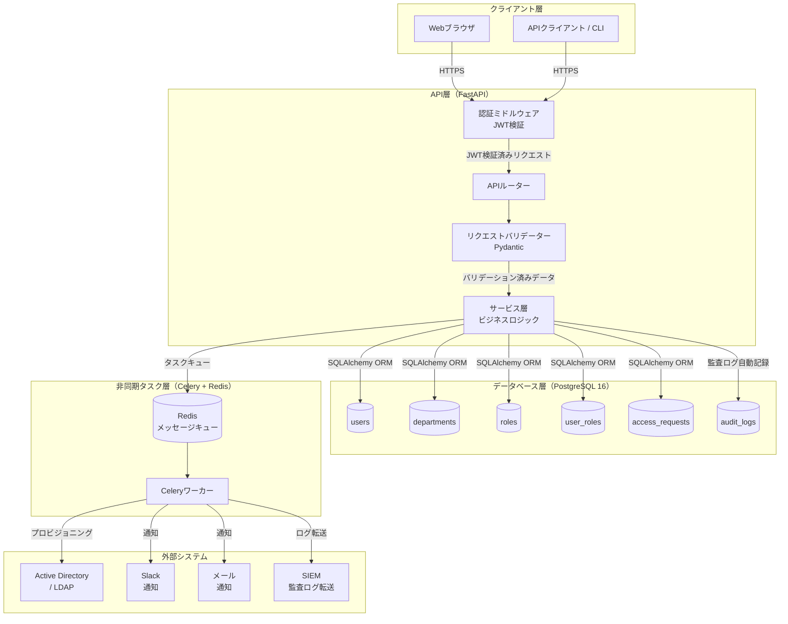
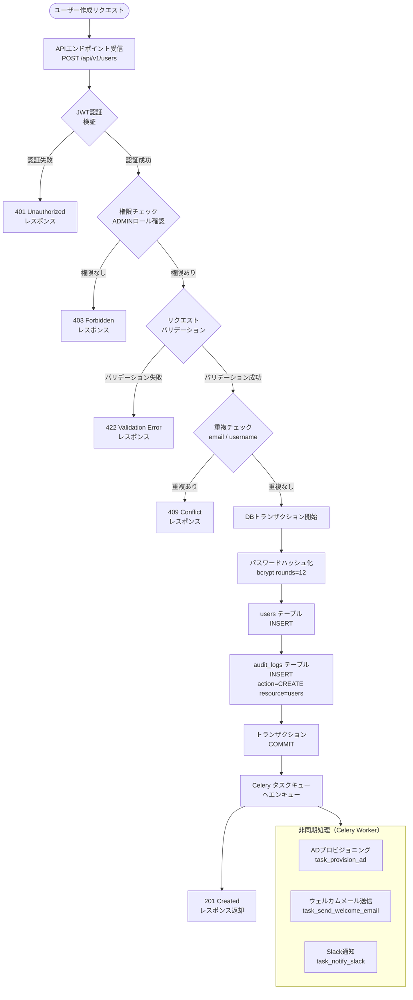
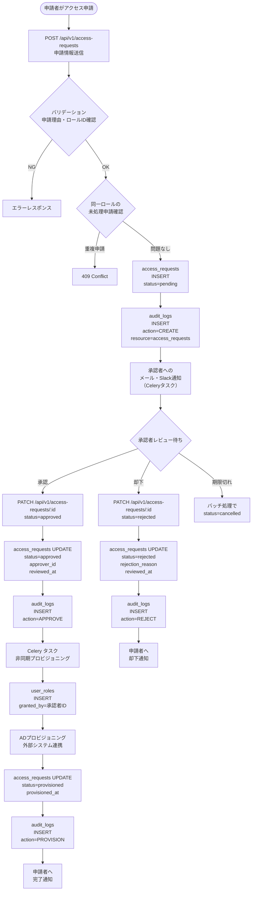
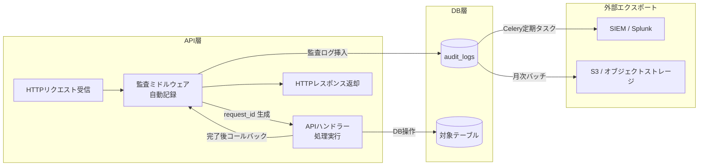

# データフロー設計（Data Flow Design）

| 項目 | 内容 |
|------|------|
| 文書番号 | DM-FLOW-001 |
| バージョン | 1.0.0 |
| 作成日 | 2026-03-25 |
| 作成者 | ZeroTrust-ID-Governance 開発チーム |
| ステータス | 承認済み |

---

## 目次

1. [概要](#概要)
2. [システム全体データフロー](#システム全体データフロー)
3. [ユーザー作成フロー](#ユーザー作成フロー)
4. [アクセス申請フロー](#アクセス申請フロー)
5. [監査ログ生成フロー](#監査ログ生成フロー)
6. [データ変換・マッピング仕様](#データ変換マッピング仕様)

---

## 概要

本文書は ZeroTrust-ID-Governance システムにおけるデータの流れを定義する。
データはAPI層・DB層・非同期タスク層・外部システム連携層を通じて処理される。

### データフローの設計原則

| 原則 | 内容 |
|------|------|
| 単一責任 | 各コンポーネントは明確なデータ処理責務を持つ |
| 不変性 | 監査ログは追記専用（変更・削除不可） |
| 非同期処理 | 外部システム連携は Celery による非同期処理で実施 |
| トレーサビリティ | 全操作は `request_id` で追跡可能 |
| ゼロトラスト | 全リクエストは認証・認可を経由する |

---

## システム全体データフロー



---

## ユーザー作成フロー

### フロー概要



### データ変換（リクエスト → DB）

| フィールド | リクエスト（JSON） | DBカラム | 変換処理 |
|---------|----------------|---------|---------|
| `username` | `"john_doe"` | `username` | 小文字化・前後トリム |
| `email` | `"John@Example.com"` | `email` | 小文字化 |
| `full_name` | `"John Doe"` | `full_name` | 前後トリム |
| `department_id` | `"uuid-string"` | `department_id` | UUID型変換・存在確認 |
| `password` | `"raw_password"` | `password_hash` | bcrypt ハッシュ化（平文は保存しない） |
| - | - | `id` | UUID v4 自動生成 |
| - | - | `is_active` | `TRUE`（デフォルト） |
| - | - | `is_locked` | `FALSE`（デフォルト） |
| - | - | `created_at` | `NOW()` UTC |
| - | - | `updated_at` | `NOW()` UTC |

### SQLAlchemy 実装例

```python
from app.models import User
from app.schemas import UserCreateRequest
from app.core.security import hash_password
from app.tasks import provision_ad, send_welcome_email

async def create_user(
    db: AsyncSession,
    request: UserCreateRequest,
    current_user: User
) -> User:
    # 重複チェック
    existing = await db.execute(
        select(User).where(
            (User.email == request.email.lower()) |
            (User.username == request.username.lower())
        )
    )
    if existing.scalar_one_or_none():
        raise ConflictError("email または username が既に存在します")

    # ユーザー生成
    user = User(
        username=request.username.lower().strip(),
        email=request.email.lower(),
        full_name=request.full_name.strip(),
        department_id=request.department_id,
        password_hash=hash_password(request.password),
    )
    db.add(user)

    # 監査ログ記録
    audit_log = AuditLog(
        user_id=current_user.id,
        action="CREATE",
        resource="users",
        resource_id=user.id,
        new_value=user.to_dict(),
    )
    db.add(audit_log)

    await db.commit()
    await db.refresh(user)

    # 非同期タスクをキュー
    provision_ad.delay(str(user.id))
    send_welcome_email.delay(str(user.id))

    return user
```

---

## アクセス申請フロー

### フロー概要



### ステータス遷移詳細

| 現ステータス | トリガー | 次ステータス | 処理内容 |
|-----------|---------|------------|---------|
| `pending` | 承認者が承認 | `approved` | `approver_id`, `reviewed_at` セット |
| `pending` | 承認者が却下 | `rejected` | `rejection_reason`, `reviewed_at` セット |
| `pending` | 申請者がキャンセル | `cancelled` | `updated_at` セット |
| `pending` | バッチ処理（期限切れ） | `cancelled` | `expires_at` 超過時に自動更新 |
| `approved` | Celeryプロビジョニング完了 | `provisioned` | `provisioned_at` セット・`user_roles` 挿入 |

---

## 監査ログ生成フロー

### フロー概要



### 監査ログ自動記録の仕組み

```python
# FastAPI ミドルウェアによる自動記録
import uuid
from fastapi import Request
from starlette.middleware.base import BaseHTTPMiddleware

class AuditMiddleware(BaseHTTPMiddleware):
    async def dispatch(self, request: Request, call_next):
        request_id = uuid.uuid4()
        request.state.request_id = request_id

        response = await call_next(request)

        # 書き込み系操作のみ監査ログを記録
        if request.method in ("POST", "PUT", "PATCH", "DELETE"):
            await self._record_audit(
                request=request,
                response=response,
                request_id=request_id,
            )

        return response

    async def _record_audit(self, request, response, request_id):
        user_id = getattr(request.state, "user_id", None)
        audit_log = AuditLog(
            user_id=user_id,
            action=self._resolve_action(request.method),
            resource=self._resolve_resource(request.url.path),
            ip_address=request.client.host,
            user_agent=request.headers.get("user-agent"),
            request_id=request_id,
            status_code=response.status_code,
        )
        await db.execute(insert(AuditLog).values(**audit_log.dict()))
```

### 記録される操作一覧

| 操作 | `action` 値 | `resource` 値 | 記録タイミング |
|-----|-----------|-------------|------------|
| ユーザー作成 | `CREATE` | `users` | コミット後 |
| ユーザー更新 | `UPDATE` | `users` | コミット後 |
| ユーザー削除 | `DELETE` | `users` | コミット後 |
| ロール付与 | `GRANT_ROLE` | `user_roles` | コミット後 |
| ロール剥奪 | `REVOKE_ROLE` | `user_roles` | コミット後 |
| アクセス申請 | `CREATE` | `access_requests` | コミット後 |
| 申請承認 | `APPROVE` | `access_requests` | コミット後 |
| 申請却下 | `REJECT` | `access_requests` | コミット後 |
| プロビジョニング | `PROVISION` | `access_requests` | Celery完了後 |
| ログイン成功 | `LOGIN_SUCCESS` | `auth` | 認証成功時 |
| ログイン失敗 | `LOGIN_FAILURE` | `auth` | 認証失敗時 |
| ログアウト | `LOGOUT` | `auth` | ログアウト時 |

---

## データ変換・マッピング仕様

### APIレスポンス → DBエンティティ 変換規則

```mermaid
flowchart LR
    subgraph INPUT["入力（リクエストJSON）"]
        J1["{ username, email,\nfull_name, password,\ndepartment_id }"]
    end

    subgraph TRANSFORM["変換処理"]
        T1[文字列正規化\n小文字化・トリム]
        T2[バリデーション\nPydantic スキーマ]
        T3[セキュリティ変換\nパスワードハッシュ化]
        T4[UUID生成\nauto-assign]
        T5[タイムスタンプ\nUTC NOW()]
    end

    subgraph OUTPUT["出力（DBレコード）"]
        D1["{ id: UUID,\nusername: str,\nemail: str,\nfull_name: str,\ndepartment_id: UUID,\npassword_hash: str,\nis_active: bool,\nis_locked: bool,\ncreated_at: timestamptz,\nupdated_at: timestamptz }"]
    end

    J1 --> T1 --> T2 --> T3 --> T4 --> T5 --> D1
```

### 型マッピング表

| Python型 | SQLAlchemy型 | PostgreSQL型 | 備考 |
|---------|------------|------------|------|
| `uuid.UUID` | `UUID(as_uuid=True)` | `UUID` | ネイティブUUID型 |
| `str` | `String(N)` | `VARCHAR(N)` | N = 最大文字数 |
| `str` | `Text` | `TEXT` | 長文テキスト |
| `bool` | `Boolean` | `BOOLEAN` | - |
| `int` | `Integer` | `INTEGER` | - |
| `datetime` | `DateTime(timezone=True)` | `TIMESTAMPTZ` | 常にUTC |
| `dict` | `JSONB` | `JSONB` | GINインデックス対応 |
| `Enum` | `Enum(name=...)` | `ENUM型` | PostgreSQL ENUM |
| `IPv4Address` | `INET` | `INET` | IPv4/IPv6対応 |

### レスポンス変換（DB → API）

```python
# Pydantic スキーマによるシリアライズ
from pydantic import BaseModel, field_serializer
from datetime import datetime
from uuid import UUID

class UserResponse(BaseModel):
    id: UUID
    username: str
    email: str
    full_name: str
    department_id: UUID | None
    is_active: bool
    created_at: datetime
    updated_at: datetime

    model_config = {"from_attributes": True}

    @field_serializer("id", "department_id")
    def serialize_uuid(self, v: UUID | None) -> str | None:
        return str(v) if v else None

    @field_serializer("created_at", "updated_at")
    def serialize_datetime(self, v: datetime) -> str:
        # ISO 8601 形式・UTC明示
        return v.isoformat()
```

### 機密データのマスキング

| フィールド | API レスポンスでの扱い | 監査ログでの扱い |
|---------|-------------------|--------------|
| `password_hash` | **除外**（返却しない） | **除外** |
| `email` | 完全表示（認証済みのみ） | 完全表示 |
| `ip_address` | 除外 | 完全記録 |
| `old_value` | 除外 | 完全記録（変更前） |
| `new_value` | 除外 | 完全記録（変更後） |

---

## 改訂履歴

| バージョン | 日付 | 変更内容 | 変更者 |
|----------|------|---------|-------|
| 1.0.0 | 2026-03-25 | 初版作成 | 開発チーム |
