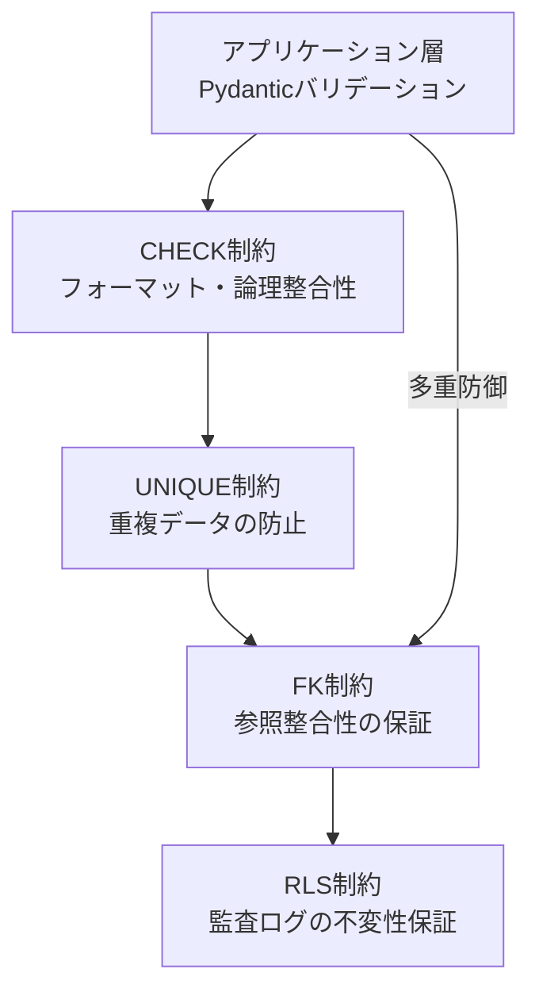
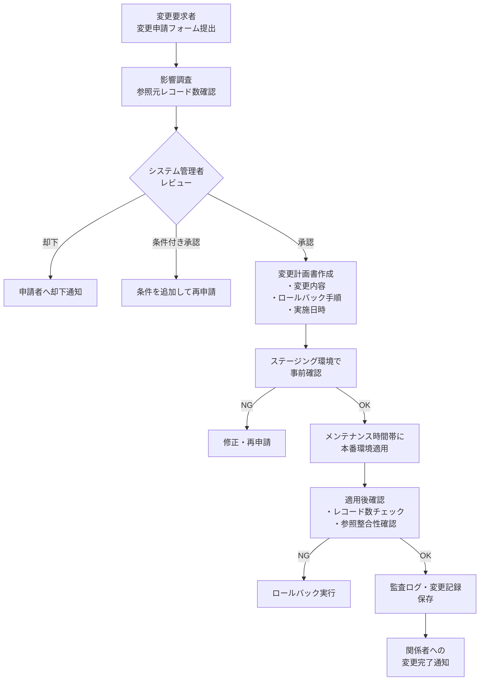

# マスターデータ管理（Master Data Management）

| 項目 | 内容 |
|------|------|
| 文書番号 | DM-MDM-001 |
| バージョン | 1.0.0 |
| 作成日 | 2026-03-25 |
| 作成者 | ZeroTrust-ID-Governance 開発チーム |
| ステータス | 承認済み |

---

## 目次

1. [概要](#概要)
2. [マスターデータ一覧](#マスターデータ一覧)
3. [初期データ（Seed Data）仕様](#初期データseed-data仕様)
4. [データ整合性制約](#データ整合性制約)
5. [マスターデータ変更フロー](#マスターデータ変更フロー)
6. [データ品質指標](#データ品質指標)

---

## 概要

マスターデータとは、業務プロセス全体で参照される基盤データであり、
ユーザーデータ・トランザクションデータとは区別して管理する。

### マスターデータの特徴

| 特徴 | 説明 |
|------|------|
| 参照頻度が高い | トランザクションデータから頻繁にFKで参照される |
| 変更頻度が低い | 一度設定した後の変更は業務影響が大きい |
| 変更には承認が必要 | 変更前の影響調査・承認プロセスが必須 |
| 履歴管理が必要 | 変更履歴を監査ログで追跡できる |

---

## マスターデータ一覧

| No. | テーブル名 | 日本語名 | 管理責任者 | 変更頻度 | レコード規模 |
|----|----------|---------|---------|---------|-----------|
| 1 | `departments` | 部門マスター | システム管理者 / HR | 月1〜数回 | 〜1,000件 |
| 2 | `roles` | ロールマスター | システム管理者 / セキュリティ担当 | 四半期1〜数回 | 〜500件 |

---

## 初期データ（Seed Data）仕様

システム初期デプロイ時に投入するシードデータを定義する。

### departments 初期データ

```python
# app/seeds/departments.py

INITIAL_DEPARTMENTS = [
    {
        "id": "00000000-0000-0000-0000-000000000001",
        "name": "経営企画部",
        "code": "EXEC-001",
        "description": "経営戦略・企画立案を担当する部門",
        "parent_id": None,
        "is_active": True,
    },
    {
        "id": "00000000-0000-0000-0000-000000000002",
        "name": "情報システム部",
        "code": "IT-001",
        "description": "社内ITシステムの開発・運用を担当する部門",
        "parent_id": None,
        "is_active": True,
    },
    {
        "id": "00000000-0000-0000-0000-000000000003",
        "name": "セキュリティ管理部",
        "code": "SEC-001",
        "description": "情報セキュリティ管理・監査を担当する部門",
        "parent_id": "00000000-0000-0000-0000-000000000002",
        "is_active": True,
    },
    {
        "id": "00000000-0000-0000-0000-000000000004",
        "name": "人事部",
        "code": "HR-001",
        "description": "採用・人事管理を担当する部門",
        "parent_id": None,
        "is_active": True,
    },
    {
        "id": "00000000-0000-0000-0000-000000000005",
        "name": "開発部",
        "code": "DEV-001",
        "description": "製品・システムの開発を担当する部門",
        "parent_id": "00000000-0000-0000-0000-000000000002",
        "is_active": True,
    },
]
```

### roles 初期データ

```python
# app/seeds/roles.py

INITIAL_ROLES = [
    {
        "id": "00000000-0000-0001-0000-000000000001",
        "name": "SUPER_ADMIN",
        "description": "システム全機能へのフルアクセス権（システム予約ロール）",
        "is_system": True,
        "is_active": True,
    },
    {
        "id": "00000000-0000-0001-0000-000000000002",
        "name": "ADMIN",
        "description": "ユーザー・ロール管理権限（管理者ロール）",
        "is_system": True,
        "is_active": True,
    },
    {
        "id": "00000000-0000-0001-0000-000000000003",
        "name": "APPROVER",
        "description": "アクセス申請の承認権限",
        "is_system": True,
        "is_active": True,
    },
    {
        "id": "00000000-0000-0001-0000-000000000004",
        "name": "USER",
        "description": "一般ユーザー権限（アクセス申請・参照のみ）",
        "is_system": True,
        "is_active": True,
    },
    {
        "id": "00000000-0000-0001-0000-000000000005",
        "name": "AUDITOR",
        "description": "監査ログの参照権限（読み取り専用）",
        "is_system": True,
        "is_active": True,
    },
    {
        "id": "00000000-0000-0001-0000-000000000006",
        "name": "READONLY",
        "description": "全リソースの参照専用権限",
        "is_system": False,
        "is_active": True,
    },
]
```

### シードデータ投入コマンド

```bash
# 開発環境
python -m app.seeds.run --env=development

# ステージング環境
python -m app.seeds.run --env=staging

# 本番環境（初回のみ）
python -m app.seeds.run --env=production --confirm

# Alembic マイグレーションと合わせて実行
alembic upgrade head && python -m app.seeds.run
```

### シードデータ投入スクリプト

```python
# app/seeds/run.py
import asyncio
from sqlalchemy.dialects.postgresql import insert
from app.db import AsyncSessionFactory
from app.models import Department, Role
from app.seeds.departments import INITIAL_DEPARTMENTS
from app.seeds.roles import INITIAL_ROLES

async def seed_departments(session):
    stmt = insert(Department).values(INITIAL_DEPARTMENTS)
    # 既存データがあればスキップ（冪等性確保）
    stmt = stmt.on_conflict_do_nothing(index_elements=["id"])
    await session.execute(stmt)

async def seed_roles(session):
    stmt = insert(Role).values(INITIAL_ROLES)
    stmt = stmt.on_conflict_do_nothing(index_elements=["id"])
    await session.execute(stmt)

async def run():
    async with AsyncSessionFactory() as session:
        async with session.begin():
            await seed_departments(session)
            await seed_roles(session)
    print("シードデータ投入完了")

if __name__ == "__main__":
    asyncio.run(run())
```

---

## データ整合性制約

### FK制約（外部キー制約）

| テーブル | カラム | 参照先 | 削除時の動作 | 目的 |
|---------|-------|-------|-----------|------|
| `departments` | `parent_id` | `departments.id` | `SET NULL` | 親部門削除時に子部門は残す |
| `users` | `department_id` | `departments.id` | `SET NULL` | 部門削除時にユーザーは残す |
| `user_roles` | `user_id` | `users.id` | `CASCADE` | ユーザー削除時にロール紐付けも削除 |
| `user_roles` | `role_id` | `roles.id` | `CASCADE` | ロール削除時に紐付けも削除 |
| `user_roles` | `granted_by` | `users.id` | `SET NULL` | 付与者が削除されても記録は残す |
| `access_requests` | `requester_id` | `users.id` | `RESTRICT` | 申請中ユーザーの削除を防ぐ |
| `access_requests` | `approver_id` | `users.id` | `SET NULL` | 承認者削除時も申請記録は残す |
| `access_requests` | `role_id` | `roles.id` | `RESTRICT` | 申請対象ロールの削除を防ぐ |
| `audit_logs` | `user_id` | `users.id` | `SET NULL` | ユーザー削除後も監査ログは保持 |

### UNIQUE制約

```sql
-- departments
ALTER TABLE departments ADD CONSTRAINT uq_departments_name UNIQUE (name);
ALTER TABLE departments ADD CONSTRAINT uq_departments_code UNIQUE (code);

-- users
ALTER TABLE users ADD CONSTRAINT uq_users_username    UNIQUE (username);
ALTER TABLE users ADD CONSTRAINT uq_users_email       UNIQUE (email);
ALTER TABLE users ADD CONSTRAINT uq_users_employee_id UNIQUE (employee_id);

-- roles
ALTER TABLE roles ADD CONSTRAINT uq_roles_name UNIQUE (name);

-- user_roles（同一ユーザーへの同一ロール重複登録防止）
ALTER TABLE user_roles ADD CONSTRAINT uq_user_roles_user_role UNIQUE (user_id, role_id);
```

### CHECK制約

```sql
-- users: メールアドレス形式チェック
ALTER TABLE users ADD CONSTRAINT chk_users_email_format
    CHECK (email ~* '^[A-Za-z0-9._%+-]+@[A-Za-z0-9.-]+\.[A-Za-z]{2,}$');

-- users: ユーザー名形式チェック（英数字・アンダースコア・ハイフンのみ）
ALTER TABLE users ADD CONSTRAINT chk_users_username_format
    CHECK (username ~* '^[a-z0-9_-]{3,100}$');

-- departments: コード形式チェック（大文字英字・数字・ハイフン）
ALTER TABLE departments ADD CONSTRAINT chk_departments_code_format
    CHECK (code ~* '^[A-Z0-9-]{2,50}$');

-- user_roles: 有効期限は付与日より後
ALTER TABLE user_roles ADD CONSTRAINT chk_user_roles_expires_after_granted
    CHECK (expires_at IS NULL OR expires_at > granted_at);

-- access_requests: 審査日時は申請日時より後
ALTER TABLE access_requests ADD CONSTRAINT chk_access_requests_reviewed_after_requested
    CHECK (reviewed_at IS NULL OR reviewed_at >= requested_at);

-- audit_logs: 挿入禁止の制約（RLS で実装）
-- ※ UPDATE / DELETE は Row Level Security で制限
```

### Row Level Security（RLS）による監査ログ保護

```sql
-- 監査ログは追記専用（UPDATE・DELETE を全員に禁止）
ALTER TABLE audit_logs ENABLE ROW LEVEL SECURITY;

-- 挿入は許可
CREATE POLICY audit_logs_insert ON audit_logs
    FOR INSERT TO app_user WITH CHECK (TRUE);

-- 参照は許可
CREATE POLICY audit_logs_select ON audit_logs
    FOR SELECT TO app_user USING (TRUE);

-- 更新・削除は禁止（AUDITOR ロールも含む全員）
-- ポリシーなし = 暗黙的拒否
```

### 整合性制約まとめ



---

## マスターデータ変更フロー

マスターデータの変更は業務影響が大きいため、以下の承認プロセスを経る。



### 変更操作別の手順

| 変更種別 | 影響レベル | 承認者 | 所要時間 |
|---------|---------|-------|---------|
| 新規部門追加 | 低 | システム管理者 | 即日〜翌営業日 |
| 部門名変更 | 中 | システム管理者 + 関連部門長 | 3営業日 |
| 部門削除（論理削除） | 高 | システム管理者 + CTO/CISO | 1週間 |
| 部門削除（物理削除） | 最高 | CTO/CISO + コンプライアンス | 要別途検討 |
| 新規ロール追加 | 低 | システム管理者 | 即日〜翌営業日 |
| ロール権限変更 | 高 | セキュリティ担当 + CTO/CISO | 1週間 |
| システムロール変更 | 最高 | CTO/CISO | 要別途検討・禁止推奨 |

### 影響調査クエリ例

```sql
-- 部門を削除する前の影響調査
SELECT
    d.name AS department_name,
    COUNT(u.id) AS user_count,
    COUNT(ar.id) AS pending_requests
FROM departments d
LEFT JOIN users u ON u.department_id = d.id AND u.is_active = TRUE
LEFT JOIN access_requests ar ON ar.requester_id = u.id AND ar.status = 'pending'
WHERE d.id = '00000000-0000-0000-0000-000000000002'
GROUP BY d.name;

-- ロールを削除する前の影響調査
SELECT
    r.name AS role_name,
    COUNT(ur.id) AS assigned_users,
    COUNT(ar.id) AS pending_requests
FROM roles r
LEFT JOIN user_roles ur ON ur.role_id = r.id AND ur.is_active = TRUE
LEFT JOIN access_requests ar ON ar.role_id = r.id AND ar.status = 'pending'
WHERE r.id = '00000000-0000-0001-0000-000000000006'
GROUP BY r.name;
```

---

## データ品質指標

### 品質チェック項目

| 指標 | 内容 | 目標値 | 計測頻度 |
|------|------|-------|---------|
| 参照整合性 | FK制約違反レコード数 | 0件 | 毎日 |
| UNIQUE制約 | 重複レコード数 | 0件 | 毎日 |
| NULL許容違反 | NOT NULLカラムのNULLレコード数 | 0件 | 毎日 |
| 孤立レコード | 親レコードが存在しない子レコード数 | 0件 | 毎週 |
| 非アクティブ参照 | is_active=FALSE のマスターを参照するレコード数 | 0件 | 毎週 |
| フォーマット違反 | CHECK制約対象カラムの不正フォーマット数 | 0件 | 毎日 |

### データ品質チェッククエリ

```sql
-- 1. 孤立した users レコード確認（部門IDが存在しない）
SELECT COUNT(*) AS orphan_users
FROM users u
WHERE u.department_id IS NOT NULL
  AND NOT EXISTS (
    SELECT 1 FROM departments d WHERE d.id = u.department_id
  );

-- 2. 無効部門に所属するアクティブユーザー数
SELECT COUNT(*) AS users_in_inactive_dept
FROM users u
JOIN departments d ON d.id = u.department_id
WHERE u.is_active = TRUE AND d.is_active = FALSE;

-- 3. 期限切れロールを持つアクティブユーザーロール数
SELECT COUNT(*) AS expired_active_user_roles
FROM user_roles
WHERE is_active = TRUE
  AND expires_at IS NOT NULL
  AND expires_at < NOW();

-- 4. 無効ロールのアクティブ割り当て数
SELECT COUNT(*) AS assignments_with_inactive_roles
FROM user_roles ur
JOIN roles r ON r.id = ur.role_id
WHERE ur.is_active = TRUE AND r.is_active = FALSE;

-- 5. 長期間放置されている pending 申請数
SELECT COUNT(*) AS stale_pending_requests
FROM access_requests
WHERE status = 'pending'
  AND requested_at < NOW() - INTERVAL '30 days';
```

### 品質監視スケジュール

| チェック種別 | 実行タイミング | 通知先 | 対応 SLA |
|-----------|------------|-------|---------|
| 参照整合性チェック | 毎日 02:00 UTC | システム管理者 | 即時対応 |
| 期限切れロール自動無効化 | 毎時 0分 | - | 自動対応 |
| 放置申請の自動キャンセル | 毎日 03:00 UTC | 申請者・承認者 | 自動対応 |
| 総合品質レポート | 毎週月曜 09:00 JST | システム管理者 | 3営業日以内 |

---

## 改訂履歴

| バージョン | 日付 | 変更内容 | 変更者 |
|----------|------|---------|-------|
| 1.0.0 | 2026-03-25 | 初版作成 | 開発チーム |
