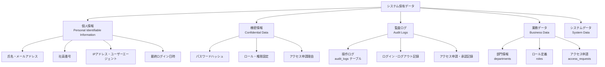
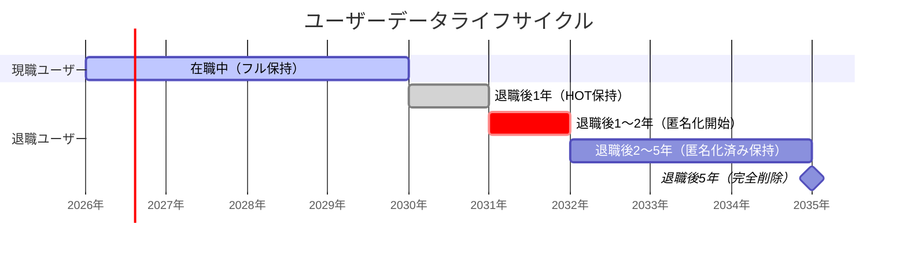
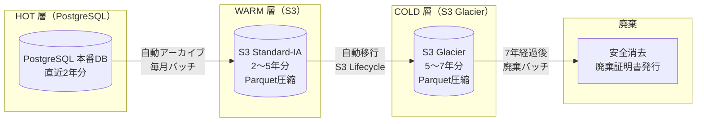
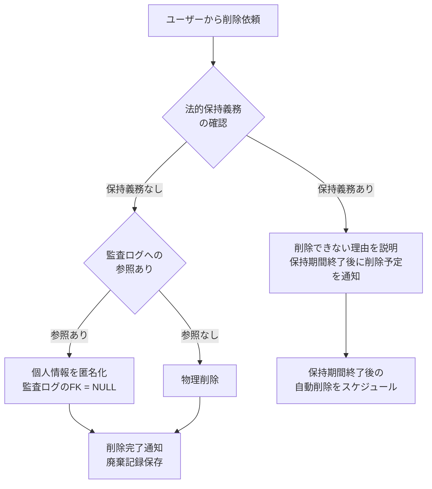
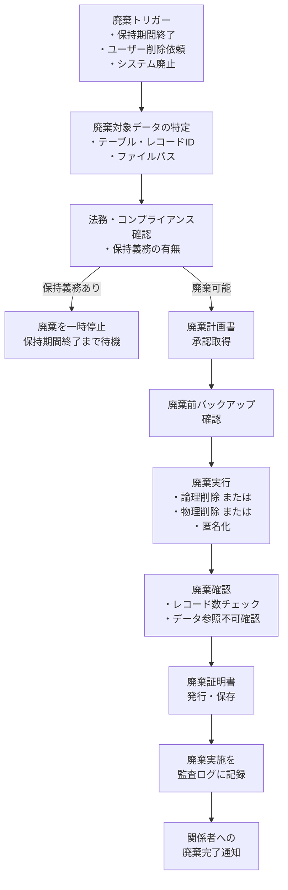

# データ保持ポリシー（Data Retention Policy）

| 項目 | 内容 |
|------|------|
| 文書番号 | DM-RET-001 |
| バージョン | 1.0.0 |
| 作成日 | 2026-03-25 |
| 作成者 | ZeroTrust-ID-Governance 開発チーム |
| ステータス | 承認済み |
| 準拠法令 | 個人情報保護法（日本）/ GDPR / 不正競争防止法 |

---

## 目次

1. [概要](#概要)
2. [データ分類](#データ分類)
3. [保持期間一覧](#保持期間一覧)
4. [アーカイブ設計](#アーカイブ設計)
5. [削除・匿名化ポリシー](#削除匿名化ポリシー)
6. [バックアップ保持期間](#バックアップ保持期間)
7. [データ廃棄手順](#データ廃棄手順)

---

## 概要

本文書は ZeroTrust-ID-Governance システムが取り扱うデータの保持期間・アーカイブ・廃棄に関するポリシーを定義する。

### 法令準拠の背景

| 法令・基準 | 主な要件 | 対象データ |
|---------|---------|---------|
| 個人情報保護法（日本） | 利用目的外の保有禁止・適切な管理 | 氏名・メール・その他個人情報 |
| GDPR（EU一般データ保護規則） | データ最小化・保持期間の制限・削除権（忘れられる権利） | EU域内ユーザーの個人データ |
| 金融商品取引法（該当する場合） | 取引記録7年保存 | 監査ログ・アクセス記録 |
| 不正競争防止法 | 営業秘密の適切な管理 | アクセス権限・システム設定情報 |
| e-文書法 | 電子保存の要件 | 監査ログ・承認記録 |

### データ保持の原則

| 原則 | 内容 |
|------|------|
| 最小保持 | 必要最小限の期間のみ保持する |
| 目的限定 | 収集目的の範囲内でのみ利用・保持する |
| 安全管理 | 保持期間中は適切なアクセス制御を維持する |
| 確実な廃棄 | 保持期間終了後は確実かつ安全に廃棄する |
| 記録と説明責任 | 廃棄の記録を残し、説明責任を果たす |

---

## データ分類

### 分類体系



### 分類定義

| 分類 | 定義 | 例 | 保護レベル |
|------|------|---|----------|
| **個人情報（PII）** | 特定の個人を識別できる情報 | 氏名・メール・社員番号・IPアドレス | 最高 |
| **機密情報** | 業務上の秘密または不正利用リスクが高い情報 | パスワードハッシュ・権限設定 | 最高 |
| **監査ログ** | コンプライアンス・法令対応のために保持するログ | 操作履歴・ログイン記録 | 高 |
| **業務データ** | 日常業務で生成・参照されるデータ | 申請情報・部門情報 | 中 |
| **システムデータ** | システム稼働のために生成されるデータ | マイグレーション履歴・設定情報 | 低 |

---

## 保持期間一覧

### テーブル別保持期間

| テーブル名 | データ種別 | 保持期間 | 保持期間の根拠 | アーカイブ | 廃棄方法 |
|----------|---------|--------|------------|---------|---------|
| `audit_logs` | 監査ログ | **7年** | 金融商品取引法・コンプライアンス要件 | 2年後にアーカイブ | 完全削除 |
| `users`（退職者） | 個人情報 | 退職後 **5年** | 個人情報保護法・労働関係記録保存 | 1年後に匿名化 | 匿名化または完全削除 |
| `users`（現職） | 個人情報 | 在職中 + 退職後5年 | 個人情報保護法 | 対象外 | 退職処理後のポリシーに従う |
| `access_requests` | 業務データ | **7年** | 業務記録・コンプライアンス要件 | 2年後にアーカイブ | 完全削除 |
| `user_roles` | 業務データ | **7年** | 権限付与記録（コンプライアンス） | 3年後にアーカイブ | 完全削除 |
| `departments` | マスターデータ | 論理削除後 **10年** | 組織記録 | 5年後にアーカイブ | 完全削除 |
| `roles` | マスターデータ | 論理削除後 **10年** | 権限定義記録 | 5年後にアーカイブ | 完全削除 |

### 詳細保持スケジュール（監査ログ）

| 段階 | 期間 | 保存場所 | アクセス速度 | コスト |
|-----|------|---------|-----------|------|
| HOT（即時参照） | 0〜2年 | PostgreSQL 本番DB | 高速（秒以内） | 高 |
| WARM（低頻度参照） | 2〜5年 | S3 / オブジェクトストレージ（圧縮） | 中速（数分） | 中 |
| COLD（アーカイブ） | 5〜7年 | S3 Glacier / コールドストレージ | 低速（数時間） | 低 |
| 廃棄 | 7年経過後 | - | - | - |

### 詳細保持スケジュール（ユーザーデータ）



---

## アーカイブ設計

### アーカイブ対象と方式



### アーカイブバッチ処理

```python
# app/tasks/archival.py
from celery import shared_task
from datetime import datetime, timezone, timedelta
import pandas as pd
import boto3
from app.db import SyncSessionFactory
from app.models import AuditLog

@shared_task(name="archive_audit_logs")
def archive_audit_logs():
    """2年以上前の監査ログを S3 にアーカイブし、PostgreSQL から削除する"""
    cutoff = datetime.now(timezone.utc) - timedelta(days=730)  # 2年前

    with SyncSessionFactory() as session:
        # アーカイブ対象レコードを取得
        logs = session.query(AuditLog).filter(
            AuditLog.occurred_at < cutoff
        ).order_by(AuditLog.occurred_at).all()

        if not logs:
            return {"archived": 0}

        # Parquet 形式に変換
        df = pd.DataFrame([log.to_dict() for log in logs])
        archive_key = f"audit_logs/{cutoff.strftime('%Y/%m')}/audit_logs_{cutoff.strftime('%Y%m')}.parquet"

        # S3 にアップロード
        s3 = boto3.client("s3")
        parquet_bytes = df.to_parquet(index=False, compression="snappy")
        s3.put_object(
            Bucket="zerotrust-id-archive",
            Key=archive_key,
            Body=parquet_bytes,
            ServerSideEncryption="aws:kms",
        )

        # PostgreSQL から削除
        ids = [log.id for log in logs]
        session.query(AuditLog).filter(AuditLog.id.in_(ids)).delete()
        session.commit()

    return {"archived": len(logs), "s3_key": archive_key}
```

### S3 Lifecycle ポリシー

```json
{
  "Rules": [
    {
      "ID": "audit-logs-tiering",
      "Status": "Enabled",
      "Filter": { "Prefix": "audit_logs/" },
      "Transitions": [
        {
          "Days": 1095,
          "StorageClass": "STANDARD_IA"
        },
        {
          "Days": 1825,
          "StorageClass": "GLACIER"
        }
      ],
      "Expiration": {
        "Days": 2555
      }
    }
  ]
}
```

---

## 削除・匿名化ポリシー

### GDPR / 個人情報保護法対応

#### 削除権（忘れられる権利）への対応



#### 匿名化の実装

```python
# app/services/anonymization.py
from sqlalchemy import update
from app.models import User, AuditLog
import uuid

async def anonymize_user(db: AsyncSession, user_id: uuid.UUID) -> None:
    """退職ユーザーの個人情報を匿名化する"""

    anon_suffix = str(user_id)[:8]  # UUIDの先頭8文字でユニーク性を確保

    await db.execute(
        update(User)
        .where(User.id == user_id)
        .values(
            # 個人情報を匿名化
            username=f"deleted_user_{anon_suffix}",
            email=f"deleted_{anon_suffix}@anonymized.invalid",
            full_name="削除済みユーザー",
            employee_id=None,
            password_hash="[ANONYMIZED]",
            last_login_at=None,
            # 論理削除
            is_active=False,
        )
    )

    # 監査ログの個人情報フィールドをマスク
    # ※ user_id FK は保持（操作記録の整合性のため）
    # ※ ip_address・user_agent はNULL化
    await db.execute(
        update(AuditLog)
        .where(AuditLog.user_id == user_id)
        .values(
            ip_address=None,
            user_agent=None,
        )
    )

    await db.commit()
```

### 匿名化対象フィールド

| テーブル | カラム | 匿名化方式 | 匿名化後の値 |
|---------|-------|---------|-----------|
| `users` | `username` | 置換 | `deleted_user_{id_prefix}` |
| `users` | `email` | 置換 | `deleted_{id_prefix}@anonymized.invalid` |
| `users` | `full_name` | 置換 | `削除済みユーザー` |
| `users` | `employee_id` | NULL化 | `NULL` |
| `users` | `password_hash` | 置換 | `[ANONYMIZED]` |
| `users` | `last_login_at` | NULL化 | `NULL` |
| `audit_logs` | `ip_address` | NULL化 | `NULL` |
| `audit_logs` | `user_agent` | NULL化 | `NULL` |
| `audit_logs` | `user_id` | 保持 | UUID（操作記録の整合性のため） |

### 匿名化 vs 物理削除の判断基準

| 状況 | 方式 | 理由 |
|------|------|------|
| 監査ログに操作記録がある | **匿名化** | 監査ログの整合性を保持 |
| 監査ログに操作記録がない | **物理削除** | 不要なデータを完全削除 |
| 申請記録が `access_requests` に残る | **匿名化** | FK 整合性のため |
| 保持義務期間を超えた | **物理削除** | 法令上の保持不要 |
| ユーザーから削除要求（GDPR Art.17） | **匿名化 → 期間後物理削除** | 法的保持義務との両立 |

---

## バックアップ保持期間

### バックアップ種別と保持期間

| バックアップ種別 | 頻度 | 保持期間 | 保存場所 | 暗号化 |
|--------------|------|--------|---------|-------|
| フルバックアップ | 毎日 | **30日** | S3 + 別リージョン | AES-256（KMS） |
| 差分バックアップ | 毎時 | **7日** | S3 | AES-256（KMS） |
| WAL（Write-Ahead Log） | 継続的 | **7日** | S3 | AES-256（KMS） |
| 月次スナップショット | 毎月1日 | **1年** | S3 Glacier | AES-256（KMS） |
| 年次スナップショット | 毎年1月1日 | **7年** | S3 Glacier Deep Archive | AES-256（KMS） |

### Point-in-Time Recovery（PITR）

| 目標 | 設定値 |
|------|--------|
| RPO（目標復旧時点） | **1時間以内**（差分バックアップ + WAL） |
| RTO（目標復旧時間） | **4時間以内**（フルリストア） |
| PITR 可能期間 | 直近 **7日間**（WAL保持期間内） |

### バックアップ設定（pg_basebackup / pgBackRest）

```bash
# pgBackRest 設定例
# /etc/pgbackrest/pgbackrest.conf

[global]
repo1-path=/var/lib/pgbackrest
repo1-s3-bucket=zerotrust-id-backup
repo1-s3-region=ap-northeast-1
repo1-s3-key=<AWS_ACCESS_KEY_ID>
repo1-s3-key-secret=<AWS_SECRET_ACCESS_KEY>
repo1-type=s3
repo1-cipher-type=aes-256-cbc
repo1-retention-full=30       # フルバックアップ30世代保持
repo1-retention-diff=7        # 差分バックアップ7世代保持
repo1-retention-archive=7     # WAL 7日保持

[zerotrust-id]
pg1-path=/var/lib/postgresql/16/main
pg1-port=5432
```

```bash
# フルバックアップ実行（毎日 02:00 UTC にcron実行）
pgbackrest --stanza=zerotrust-id backup --type=full

# 差分バックアップ実行（毎時 実行）
pgbackrest --stanza=zerotrust-id backup --type=diff

# リストア（任意時点への復旧）
pgbackrest --stanza=zerotrust-id restore \
    --target="2026-03-25 10:30:00+09" \
    --target-action=promote
```

### バックアップ整合性確認

```bash
# 週次バックアップ検証（データが正常に復元できることを確認）
pgbackrest --stanza=zerotrust-id check

# バックアップ情報の確認
pgbackrest --stanza=zerotrust-id info
```

---

## データ廃棄手順

### 廃棄フロー



### DB データの廃棄コマンド

```sql
-- 1. 廃棄対象の確認（実行前に必ず確認）
SELECT COUNT(*) AS target_count
FROM audit_logs
WHERE occurred_at < NOW() - INTERVAL '7 years';

-- 2. バックアップが存在することを確認
-- （pgBackRest info コマンドで確認済みであること）

-- 3. 廃棄実行（トランザクション内で実行）
BEGIN;

DELETE FROM audit_logs
WHERE occurred_at < NOW() - INTERVAL '7 years';

-- 削除件数を確認
SELECT ROW_COUNT();

-- 問題なければコミット
COMMIT;
-- 問題があればロールバック
-- ROLLBACK;
```

### ストレージ・ファイルの廃棄方法

| 対象 | 廃棄方法 | 詳細 |
|------|---------|------|
| PostgreSQL レコード | `DELETE` 文 + `VACUUM` | 論理削除後に `VACUUM FULL` で物理削除 |
| S3 オブジェクト（通常） | S3 Lifecycle / 手動削除 | S3 オブジェクトキーを指定して削除 |
| S3 Glacier（アーカイブ） | Glacier 削除API / Lifecycle | 削除リクエスト後最大24時間で削除完了 |
| 物理ディスク（廃棄時） | NIST SP 800-88 ガイドライン準拠 | データ消去ツール（`shred`等）または物理破壊 |
| バックアップファイル | pgBackRest retention 設定 | 保持期間超過分を自動削除 |

### 廃棄証明書テンプレート

```
==========================================
       データ廃棄証明書
==========================================
文書番号 : CERT-{YYYYMMDD}-{連番}
廃棄日時 : {YYYY-MM-DD HH:MM:SS JST}
実施者   : {氏名} / {部門}
承認者   : {氏名} / {部門}

廃棄対象:
  テーブル/ファイル : {対象名}
  廃棄条件         : {例: occurred_at < 2019-03-25}
  廃棄件数         : {件数}
  廃棄理由         : {保持期間7年超過}

廃棄方法:
  方式 : {物理削除 / 匿名化 / ストレージ消去}
  詳細 : {使用ツール・コマンド}

確認事項:
  □ バックアップ確認済み
  □ 法的保持義務なし（法務確認済み）
  □ 廃棄後の参照不可確認済み
  □ 監査ログへの記録完了

署名:
  実施者: ___________________
  承認者: ___________________
==========================================
```

### 廃棄スケジュール自動化

```python
# app/tasks/retention.py
from celery import shared_task
from celery.schedules import crontab
from datetime import datetime, timezone, timedelta

@shared_task(name="purge_expired_audit_logs")
def purge_expired_audit_logs():
    """7年超過の監査ログを自動廃棄（毎月1日 03:00 UTC 実行）"""
    cutoff = datetime.now(timezone.utc) - timedelta(days=365 * 7)

    with SyncSessionFactory() as session:
        count = session.query(AuditLog).filter(
            AuditLog.occurred_at < cutoff
        ).delete(synchronize_session=False)
        session.commit()

    # 廃棄記録を監査ログ（新レコード）に記録
    _record_purge_event("audit_logs", count, cutoff)
    return {"purged": count, "cutoff": cutoff.isoformat()}


@shared_task(name="anonymize_retired_users")
def anonymize_retired_users():
    """退職後1年経過したユーザーを匿名化（毎週日曜 02:00 UTC 実行）"""
    cutoff = datetime.now(timezone.utc) - timedelta(days=365)

    with SyncSessionFactory() as session:
        users = session.query(User).filter(
            User.is_active == False,
            User.updated_at < cutoff,
            User.email.notlike("deleted_%@anonymized.invalid"),  # 既匿名化を除外
        ).all()

        for user in users:
            _anonymize_user_sync(session, user)

        session.commit()

    return {"anonymized": len(users)}


# Celery Beat スケジュール
CELERYBEAT_SCHEDULE = {
    "purge-expired-audit-logs": {
        "task": "purge_expired_audit_logs",
        "schedule": crontab(day_of_month=1, hour=3, minute=0),  # 毎月1日 03:00 UTC
    },
    "anonymize-retired-users": {
        "task": "anonymize_retired_users",
        "schedule": crontab(day_of_week=0, hour=2, minute=0),  # 毎週日曜 02:00 UTC
    },
}
```

---

## 改訂履歴

| バージョン | 日付 | 変更内容 | 変更者 |
|----------|------|---------|-------|
| 1.0.0 | 2026-03-25 | 初版作成 | 開発チーム |
