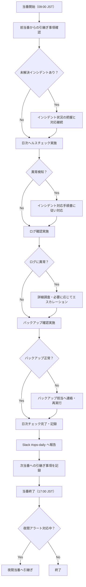

# 運用手順書

| 項目 | 内容 |
|------|------|
| 文書番号 | OPS-PROC-001 |
| バージョン | 1.0.0 |
| 作成日 | 2026-03-25 |
| 作成者 | 運用チーム |
| 承認者 | CTO |
| 対象システム | ZeroTrust-ID-Governance（Azure AKS / Prometheus / Grafana / Azure Monitor / PgBouncer / Celery） |

---

## 目次

1. [概要](#概要)
2. [日次運用タスク](#日次運用タスク)
3. [週次運用タスク](#週次運用タスク)
4. [月次運用タスク](#月次運用タスク)
5. [Kubernetes 運用コマンド](#kubernetes-運用コマンド)
6. [ヘルスチェックエンドポイント一覧](#ヘルスチェックエンドポイント一覧)
7. [運用当番フロー](#運用当番フロー)

---

## 概要

本文書は、ZeroTrust-ID-Governance システムの日常運用における手順を定義するものです。
Azure AKS 上で稼働するマイクロサービス群の安定稼働を維持するため、定期的な監視・メンテナンス・バックアップ確認を実施します。

### 対象読者

- 運用チームメンバー
- 当番担当者
- インフラエンジニア

### 前提条件

- Azure CLI インストール・認証済み
- kubectl 設定済み（AKS クラスタへのアクセス権限あり）
- Grafana / Prometheus へのアクセス権限あり
- 必要なシークレット（Vault）へのアクセス権限あり

---

## 日次運用タスク

毎日（営業日・休日問わず）以下のタスクを実施します。実施時刻の目安は **09:00 JST** です。

### 1. ヘルスチェック

| タスク | 確認方法 | 合格基準 | 担当 |
|--------|----------|----------|------|
| API ゲートウェイ疎通確認 | ヘルスチェックエンドポイントへの HTTP GET | HTTP 200 返却 | 当番 |
| 全 Pod 稼働確認 | `kubectl get pods -A` | すべて Running / Completed | 当番 |
| Deployment レプリカ数確認 | `kubectl get deployments -n ztid` | READY 列が DESIRED と一致 | 当番 |
| PgBouncer 接続確認 | `psql -h pgbouncer-svc -U admin -c "SHOW POOLS;"` | active 接続数が 0 以上 | 当番 |
| Redis 疎通確認 | `redis-cli -h redis-svc PING` | `PONG` 返却 | 当番 |
| Celery ワーカー確認 | `celery -A app inspect active` | ワーカー応答あり | 当番 |

```bash
# ヘルスチェックスクリプト（日次実行）
#!/bin/bash
set -e

NAMESPACE="ztid"
API_ENDPOINT="https://api.ztid.example.com/health"

echo "=== [1] API ヘルスチェック ==="
HTTP_STATUS=$(curl -s -o /dev/null -w "%{http_code}" "$API_ENDPOINT")
if [ "$HTTP_STATUS" != "200" ]; then
  echo "ERROR: API health check failed. Status: $HTTP_STATUS"
  exit 1
fi
echo "OK: API responded with 200"

echo "=== [2] Pod 稼働確認 ==="
kubectl get pods -n "$NAMESPACE" --no-headers | grep -v "Running\|Completed" && echo "WARNING: Non-running pods detected" || echo "OK: All pods running"

echo "=== [3] Deployment レプリカ確認 ==="
kubectl get deployments -n "$NAMESPACE"

echo "=== [4] PgBouncer 接続確認 ==="
kubectl exec -n "$NAMESPACE" deploy/pgbouncer -- psql -U pgbouncer -c "SHOW POOLS;" 2>/dev/null | head -20

echo "=== [5] Redis 確認 ==="
kubectl exec -n "$NAMESPACE" deploy/redis -- redis-cli PING

echo "=== 日次ヘルスチェック完了 ==="
```

### 2. ログ確認

| 確認対象 | 確認内容 | 閾値 |
|----------|----------|------|
| API エラーログ | ERROR レベルのログ件数 | 前日比 2 倍以上で警告 |
| 認証失敗ログ | 認証失敗イベント数 | 1 時間あたり 100 件超で警告 |
| Celery タスク失敗 | FAILURE ステータスのタスク数 | 全体の 1% 超で警告 |
| セキュリティ監査ログ | 異常なアクセスパターン | 手動確認 |

```bash
# ログ確認コマンド（直近 24 時間）
NAMESPACE="ztid"

# API エラーログ
kubectl logs -n "$NAMESPACE" deploy/api-gateway --since=24h | grep -c "ERROR" || true

# 認証失敗ログ
kubectl logs -n "$NAMESPACE" deploy/auth-service --since=24h | grep -c "authentication_failed" || true

# Celery タスク失敗
kubectl logs -n "$NAMESPACE" deploy/celery-worker --since=24h | grep -c "Task.*FAILURE" || true
```

### 3. バックアップ確認

| バックアップ対象 | 確認方法 | 期待値 |
|-----------------|----------|--------|
| PostgreSQL フルバックアップ | Azure Backup ジョブ状態確認 | Completed |
| Redis スナップショット | Azure Cache for Redis バックアップ状態 | Succeeded |
| Kubernetes シークレット | Azure Key Vault バックアップ | 直近 24 時間以内に完了 |

```bash
# Azure Backup ジョブ状態確認
az backup job list \
  --resource-group rg-ztid-prod \
  --vault-name rsv-ztid-prod \
  --query "[?properties.status=='Failed']" \
  --output table
```

---

## 週次運用タスク

毎週月曜日 10:00 JST を目安に実施します。

### 1. パフォーマンスレビュー

| 確認項目 | ツール | 対象期間 |
|----------|--------|----------|
| API p95 レスポンスタイム | Grafana ダッシュボード | 直近 7 日間 |
| エラーレート推移 | Prometheus / Grafana | 直近 7 日間 |
| CPU/メモリ使用率トレンド | Azure Monitor | 直近 7 日間 |
| DB 接続数推移 | PgBouncer メトリクス | 直近 7 日間 |
| Celery キュー深度 | Flower / Prometheus | 直近 7 日間 |
| ストレージ使用量 | Azure Portal | 直近 7 日間 |

```bash
# Prometheus クエリ例（週次レビュー用）
# p95 レスポンスタイム（7日間平均）
curl -G 'http://prometheus:9090/api/v1/query' \
  --data-urlencode 'query=histogram_quantile(0.95, rate(http_request_duration_seconds_bucket[7d]))' \
  | jq '.data.result'

# エラーレート
curl -G 'http://prometheus:9090/api/v1/query' \
  --data-urlencode 'query=rate(http_requests_total{status=~"5.."}[7d]) / rate(http_requests_total[7d]) * 100' \
  | jq '.data.result'
```

**パフォーマンス基準値：**

| メトリクス | 正常 | 警告 | 危険 |
|-----------|------|------|------|
| API p95 レスポンスタイム | < 200ms | 200ms〜500ms | > 500ms |
| 5xx エラーレート | < 0.1% | 0.1%〜1% | > 1% |
| CPU 使用率（平均） | < 60% | 60%〜80% | > 80% |
| メモリ使用率（平均） | < 70% | 70%〜85% | > 85% |
| DB 接続数（PgBouncer） | < 80% 上限 | 80%〜90% | > 90% |

### 2. セキュリティスキャン

| スキャン種別 | ツール | 実施内容 |
|-------------|--------|----------|
| コンテナイメージ脆弱性スキャン | Trivy / Azure Defender | 全 Pod のイメージスキャン |
| 依存パッケージ脆弱性 | pip-audit / Safety | requirements.txt 検査 |
| Kubernetes RBAC レビュー | kubectl auth | 過剰権限の確認 |
| ネットワークポリシー確認 | kubectl get networkpolicy | 不要な開放ポートの確認 |
| シークレット有効期限確認 | Azure Key Vault | 30 日以内に期限切れのシークレット特定 |

```bash
# コンテナイメージ脆弱性スキャン
NAMESPACE="ztid"
IMAGES=$(kubectl get pods -n "$NAMESPACE" -o jsonpath='{.items[*].spec.containers[*].image}' | tr ' ' '\n' | sort -u)

for IMAGE in $IMAGES; do
  echo "=== Scanning: $IMAGE ==="
  trivy image --severity HIGH,CRITICAL "$IMAGE"
done

# シークレット有効期限確認（30日以内に期限切れ）
az keyvault secret list \
  --vault-name kv-ztid-prod \
  --query "[?attributes.expires != null && attributes.expires < '$(date -d '+30 days' -u +%Y-%m-%dT%H:%M:%SZ)'].{name:name, expires:attributes.expires}" \
  --output table
```

---

## 月次運用タスク

毎月第 1 営業日 13:00 JST を目安に実施します。

### 1. アカウント棚卸

| 対象 | 確認内容 | 対応 |
|------|----------|------|
| Azure AD ユーザー | 退職・異動者のアカウント確認 | 不要アカウントの無効化 |
| サービスプリンシパル | 使用中のサービスプリンシパル確認 | 未使用のものを削除 |
| AKS 管理者ロール | kubectl アクセス権限保持者一覧 | 不要な権限の削除 |
| データベースユーザー | PostgreSQL ユーザー一覧 | 不要ユーザーの削除 |
| Redis ACL | Redis ACL 設定確認 | 不要なルールの削除 |

```bash
# Azure AD ユーザー一覧（最終サインイン情報付き）
az ad user list \
  --query "[].{displayName:displayName, userPrincipalName:userPrincipalName, accountEnabled:accountEnabled}" \
  --output table

# データベースユーザー一覧
kubectl exec -n ztid deploy/postgresql -- psql -U postgres -c "\du"
```

### 2. アクセスレビュー

| レビュー対象 | 実施内容 | 記録先 |
|-------------|----------|--------|
| Azure RBAC ロール割り当て | 各リソースグループの権限一覧取得 | 月次レポート |
| Kubernetes RBAC | ClusterRole / Role の割り当て確認 | 月次レポート |
| API アクセスログ分析 | 異常なアクセスパターンの検出 | SIEM レポート |
| ゼロトラストポリシー適合 | アクセス制御ポリシーの遵守確認 | コンプライアンスレポート |

```bash
# Kubernetes RBAC 確認
kubectl get rolebindings,clusterrolebindings -A \
  -o custom-columns='KIND:kind,NAMESPACE:metadata.namespace,NAME:metadata.name,ROLE:roleRef.name,USERS:subjects[*].name'
```

### 3. SSL/TLS 証明書確認

| 証明書 | 対象ドメイン | 確認コマンド |
|--------|-------------|-------------|
| API エンドポイント | api.ztid.example.com | `openssl s_client` |
| 管理コンソール | console.ztid.example.com | `openssl s_client` |
| Grafana | grafana.ztid.example.com | `openssl s_client` |
| Ingress ワイルドカード | *.ztid.example.com | `kubectl get certificate` |

```bash
# 証明書有効期限一括確認
DOMAINS=(
  "api.ztid.example.com"
  "console.ztid.example.com"
  "grafana.ztid.example.com"
)

for DOMAIN in "${DOMAINS[@]}"; do
  EXPIRY=$(echo | openssl s_client -connect "$DOMAIN:443" -servername "$DOMAIN" 2>/dev/null \
    | openssl x509 -noout -enddate 2>/dev/null | cut -d= -f2)
  echo "$DOMAIN: 有効期限 = $EXPIRY"
done

# cert-manager 管理の証明書確認
kubectl get certificates -A -o custom-columns='NAMESPACE:metadata.namespace,NAME:metadata.name,READY:status.conditions[0].status,EXPIRY:status.notAfter'
```

---

## Kubernetes 運用コマンド

### Pod 確認

```bash
# 全 Namespace の Pod 一覧
kubectl get pods -A

# ztid Namespace の Pod 一覧（詳細）
kubectl get pods -n ztid -o wide

# Pod の状態が正常でないものだけ表示
kubectl get pods -n ztid --field-selector=status.phase!=Running,status.phase!=Succeeded

# Pod の再起動回数が多いものを確認
kubectl get pods -n ztid --sort-by='.status.containerStatuses[0].restartCount'
```

### ログ確認

```bash
# Pod のログ（直近 100 行）
kubectl logs -n ztid <pod-name> --tail=100

# 全コンテナのログ（マルチコンテナ Pod）
kubectl logs -n ztid <pod-name> --all-containers=true

# リアルタイムログストリーミング
kubectl logs -n ztid <pod-name> -f

# 前回のコンテナ（クラッシュ後）のログ
kubectl logs -n ztid <pod-name> --previous

# 直近 1 時間のログ
kubectl logs -n ztid deploy/api-gateway --since=1h
```

### Pod 詳細確認

```bash
# Pod 詳細情報（イベント含む）
kubectl describe pod -n ztid <pod-name>

# Deployment 詳細
kubectl describe deployment -n ztid api-gateway

# Node の状態確認
kubectl describe node <node-name>

# イベント一覧（警告のみ）
kubectl get events -n ztid --field-selector=type=Warning --sort-by='.lastTimestamp'
```

### スケーリング

```bash
# 手動スケールアウト
kubectl scale deployment -n ztid api-gateway --replicas=5

# HPA 確認
kubectl get hpa -n ztid

# リソース使用量確認
kubectl top pods -n ztid
kubectl top nodes
```

### デバッグ

```bash
# Pod へのシェルアクセス
kubectl exec -it -n ztid <pod-name> -- /bin/bash

# 一時的なデバッグ Pod の起動
kubectl run debug-pod --rm -it --image=curlimages/curl -n ztid -- /bin/sh

# ネットワーク疎通確認
kubectl exec -n ztid <pod-name> -- curl -s http://pgbouncer-svc:5432

# ConfigMap 確認
kubectl get configmap -n ztid -o yaml
```

### ロールアウト管理

```bash
# ロールアウト状態確認
kubectl rollout status deployment/api-gateway -n ztid

# ロールアウト履歴確認
kubectl rollout history deployment/api-gateway -n ztid

# 前バージョンへのロールバック
kubectl rollout undo deployment/api-gateway -n ztid

# 特定リビジョンへのロールバック
kubectl rollout undo deployment/api-gateway -n ztid --to-revision=2
```

---

## ヘルスチェックエンドポイント一覧

| サービス | エンドポイント | メソッド | 期待レスポンス | 認証 |
|---------|--------------|---------|--------------|------|
| API ゲートウェイ | `https://api.ztid.example.com/health` | GET | `{"status": "ok"}` | 不要 |
| API ゲートウェイ（詳細） | `https://api.ztid.example.com/health/detailed` | GET | 各コンポーネント状態 | Bearer Token |
| 認証サービス | `https://api.ztid.example.com/auth/health` | GET | `{"status": "ok"}` | 不要 |
| ユーザー管理サービス | `https://api.ztid.example.com/users/health` | GET | `{"status": "ok"}` | 不要 |
| アクセス制御サービス | `https://api.ztid.example.com/access/health` | GET | `{"status": "ok"}` | 不要 |
| Prometheus | `http://prometheus:9090/-/healthy` | GET | `Prometheus is Healthy.` | 不要（内部） |
| Grafana | `https://grafana.ztid.example.com/api/health` | GET | `{"database": "ok"}` | 不要 |
| PgBouncer | `psql -c "SHOW VERSION;"` | SQL | バージョン文字列 | DB 認証 |

```bash
# 全エンドポイントの一括ヘルスチェックスクリプト
#!/bin/bash
ENDPOINTS=(
  "https://api.ztid.example.com/health"
  "https://api.ztid.example.com/auth/health"
  "https://api.ztid.example.com/users/health"
  "https://api.ztid.example.com/access/health"
)

ALL_OK=true
for EP in "${ENDPOINTS[@]}"; do
  STATUS=$(curl -s -o /dev/null -w "%{http_code}" --max-time 10 "$EP")
  if [ "$STATUS" == "200" ]; then
    echo "OK    [$STATUS] $EP"
  else
    echo "FAIL  [$STATUS] $EP"
    ALL_OK=false
  fi
done

if [ "$ALL_OK" = false ]; then
  echo "一部のエンドポイントでヘルスチェックが失敗しました。インシデント対応手順を参照してください。"
  exit 1
fi
echo "全エンドポイント正常"
```

---

## 運用当番フロー

### 当番引継ぎ手順



### 当番報告テンプレート

毎日 17:00 JST に Slack `#ops-daily` チャンネルへ以下のフォーマットで報告します。

```
【日次運用報告】YYYY-MM-DD

担当者: [氏名]

■ ヘルスチェック
- 全 Pod 正常稼働: ✅ / ⚠️ / ❌
- API エンドポイント: ✅ / ⚠️ / ❌
- DB/Redis: ✅ / ⚠️ / ❌
- バックアップ: ✅ / ⚠️ / ❌

■ アラート発生状況
- 発生件数: X 件
- 対応済み: Y 件
- 継続対応中: Z 件

■ 特記事項
（なし / 詳細記載）

■ 翌日への引継ぎ事項
（なし / 詳細記載）
```

### エスカレーション基準

| 状況 | エスカレーション先 | 連絡方法 |
|------|-----------------|---------|
| P1 インシデント発生 | オンコールマネージャー → CTO | PagerDuty + 電話 |
| セキュリティインシデント疑い | セキュリティチーム + マネージャー | PagerDuty + Slack DM |
| データ損失リスク | データチーム + マネージャー | 電話 |
| SLA 違反リスク | マネージャー | Slack + メール |
| 対応方法不明 | シニアエンジニア | Slack |

---

*本文書の改訂履歴は Git コミット履歴で管理します。*
