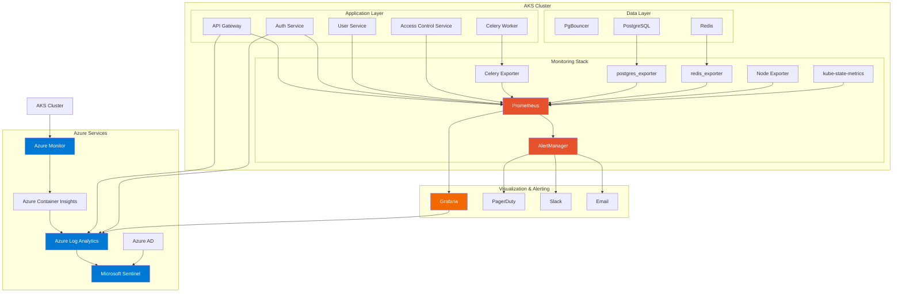
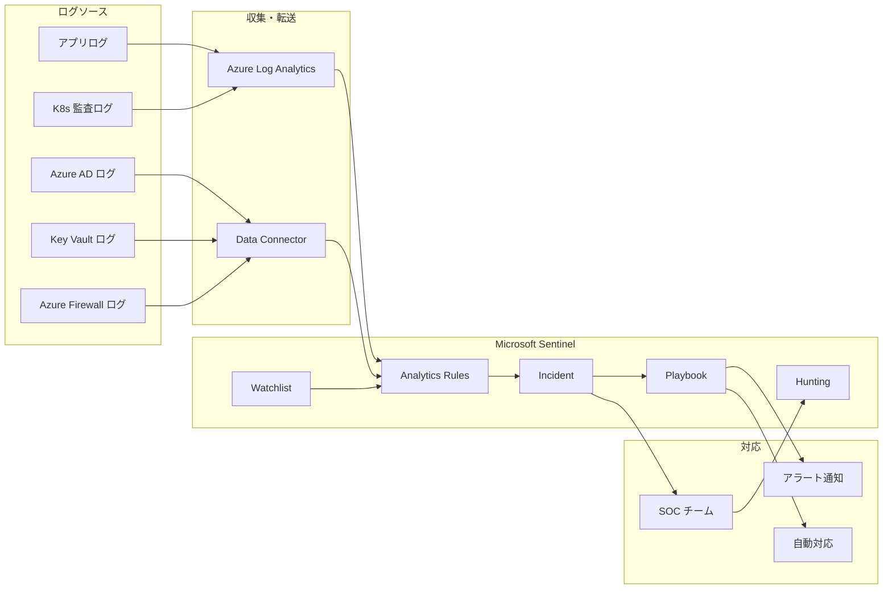

# 監視設計書

| 項目 | 内容 |
|------|------|
| 文書番号 | OPS-MON-001 |
| バージョン | 1.0.0 |
| 作成日 | 2026-03-25 |
| 作成者 | インフラチーム |
| 承認者 | CTO |
| 対象システム | ZeroTrust-ID-Governance（Azure AKS / Prometheus / Grafana / Azure Monitor / PgBouncer / Celery） |

---

## 目次

1. [概要](#概要)
2. [監視アーキテクチャ](#監視アーキテクチャ)
3. [監視項目一覧](#監視項目一覧)
4. [アラート閾値設定](#アラート閾値設定)
5. [Grafana ダッシュボード構成](#grafana-ダッシュボード構成)
6. [ログ収集設計](#ログ収集設計)
7. [SIEM 連携](#siem-連携)

---

## 概要

本書は ZeroTrust-ID-Governance システムの監視設計を定義します。
Prometheus + Grafana によるメトリクス収集・可視化、Azure Monitor による AKS クラスタ監視、および Azure Log Analytics を用いたログ集約を組み合わせた多層監視アーキテクチャを採用します。

### 監視の目的

- システムの可用性・パフォーマンスの継続的な把握
- 障害の早期検知と自動通知
- セキュリティインシデントの検知と証跡保全
- SLA 達成状況のトラッキング
- キャパシティプランニングのためのデータ収集

---

## 監視アーキテクチャ

### アーキテクチャ概要図



### コンポーネント役割

| コンポーネント | 役割 | 収集対象 |
|--------------|------|---------|
| Prometheus | メトリクス収集・保存・クエリエンジン | アプリ・インフラメトリクス |
| AlertManager | アラート管理・通知ルーティング | Prometheus アラートルール |
| Grafana | メトリクス可視化・ダッシュボード | Prometheus / Azure Monitor / Log Analytics |
| Azure Monitor | AKS クラスタ監視 | ノード・Pod・コンテナメトリクス |
| Azure Container Insights | コンテナ特化監視 | コンテナログ・メトリクス |
| Azure Log Analytics | ログ集約・クエリ | 全サービスの構造化ログ |
| Microsoft Sentinel | SIEM / セキュリティ分析 | セキュリティイベント・監査ログ |
| Node Exporter | Node メトリクス収集 | CPU・メモリ・ディスク・ネットワーク |
| kube-state-metrics | Kubernetes オブジェクト状態 | Pod・Deployment・HPA 状態 |
| postgres_exporter | PostgreSQL メトリクス | DB 接続数・クエリ時間・ロック |
| redis_exporter | Redis メトリクス | コマンド数・メモリ・接続数 |
| Celery Exporter | Celery メトリクス | タスク数・失敗率・キュー深度 |

---

## 監視項目一覧

### API パフォーマンス監視

| 監視項目 | メトリクス名 | Prometheus クエリ | 単位 |
|---------|------------|-----------------|------|
| リクエスト数 | `http_requests_total` | `rate(http_requests_total[5m])` | req/s |
| p50 レスポンスタイム | `http_request_duration_seconds` | `histogram_quantile(0.50, rate(http_request_duration_seconds_bucket[5m]))` | 秒 |
| p95 レスポンスタイム | `http_request_duration_seconds` | `histogram_quantile(0.95, rate(http_request_duration_seconds_bucket[5m]))` | 秒 |
| p99 レスポンスタイム | `http_request_duration_seconds` | `histogram_quantile(0.99, rate(http_request_duration_seconds_bucket[5m]))` | 秒 |
| 4xx エラーレート | `http_requests_total` | `rate(http_requests_total{status=~"4.."}[5m]) / rate(http_requests_total[5m])` | % |
| 5xx エラーレート | `http_requests_total` | `rate(http_requests_total{status=~"5.."}[5m]) / rate(http_requests_total[5m])` | % |
| 同時接続数 | `http_active_connections` | `http_active_connections` | 接続数 |

### インフラ監視

| 監視項目 | メトリクス名 | Prometheus クエリ | 単位 |
|---------|------------|-----------------|------|
| CPU 使用率 | `node_cpu_seconds_total` | `100 - (avg(rate(node_cpu_seconds_total{mode="idle"}[5m])) * 100)` | % |
| メモリ使用率 | `node_memory_*` | `(node_memory_MemTotal_bytes - node_memory_MemAvailable_bytes) / node_memory_MemTotal_bytes * 100` | % |
| ディスク使用率 | `node_filesystem_*` | `(node_filesystem_size_bytes - node_filesystem_avail_bytes) / node_filesystem_size_bytes * 100` | % |
| ディスク I/O | `node_disk_io_time_seconds_total` | `rate(node_disk_io_time_seconds_total[5m])` | s/s |
| ネットワーク受信 | `node_network_receive_bytes_total` | `rate(node_network_receive_bytes_total[5m])` | bytes/s |
| ネットワーク送信 | `node_network_transmit_bytes_total` | `rate(node_network_transmit_bytes_total[5m])` | bytes/s |

### Kubernetes 監視

| 監視項目 | メトリクス名 | Prometheus クエリ | 単位 |
|---------|------------|-----------------|------|
| Pod 再起動数 | `kube_pod_container_status_restarts_total` | `increase(kube_pod_container_status_restarts_total[1h])` | 回数 |
| Pod 稼働数 / 期待数 | `kube_deployment_status_replicas_*` | `kube_deployment_status_replicas_available / kube_deployment_spec_replicas` | 比率 |
| HPA スケーリング | `kube_horizontalpodautoscaler_status_current_replicas` | `kube_horizontalpodautoscaler_status_current_replicas` | Pod 数 |
| PVC 使用量 | `kubelet_volume_stats_used_bytes` | `kubelet_volume_stats_used_bytes / kubelet_volume_stats_capacity_bytes * 100` | % |

### データベース監視（PostgreSQL / PgBouncer）

| 監視項目 | メトリクス名 | 単位 |
|---------|------------|------|
| アクティブ接続数 | `pg_stat_activity_count` | 接続数 |
| 待機中接続数（PgBouncer） | `pgbouncer_pools_client_waiting` | 接続数 |
| クエリ実行時間（p95） | `pg_stat_statements_mean_time` | ms |
| デッドロック数 | `pg_stat_database_deadlocks` | 件数 |
| トランザクション数 | `pg_stat_database_xact_commit` + `pg_stat_database_xact_rollback` | TPS |
| テーブルサイズ | `pg_total_relation_size_bytes` | bytes |
| レプリケーション遅延 | `pg_replication_lag` | 秒 |
| バキューム最終実行時刻 | `pg_stat_user_tables_last_autovacuum` | timestamp |

### Redis 監視

| 監視項目 | メトリクス名 | 単位 |
|---------|------------|------|
| 接続クライアント数 | `redis_connected_clients` | 接続数 |
| メモリ使用量 | `redis_memory_used_bytes` | bytes |
| メモリ使用率 | `redis_memory_used_bytes / redis_memory_max_bytes` | % |
| キャッシュヒット率 | `redis_keyspace_hits / (redis_keyspace_hits + redis_keyspace_misses)` | % |
| コマンド実行数 | `rate(redis_commands_total[5m])` | cmd/s |
| キー数 | `redis_db_keys` | 件数 |
| 期限切れキー数 | `rate(redis_expired_keys_total[5m])` | 件数/s |

### セキュリティ監視

| 監視項目 | 収集元 | 確認頻度 |
|---------|--------|---------|
| 認証失敗数 | 認証サービスログ | リアルタイム |
| 不正アクセス試行 | API ゲートウェイログ | リアルタイム |
| 特権操作ログ | Kubernetes 監査ログ | リアルタイム |
| シークレットアクセスログ | Azure Key Vault 監査ログ | リアルタイム |
| RBAC 変更イベント | Kubernetes 監査ログ | リアルタイム |
| 証明書有効期限 | cert-manager メトリクス | 日次 |
| ネットワークポリシー違反 | Calico / Azure Policy | リアルタイム |

### Celery 監視

| 監視項目 | メトリクス名 | 単位 |
|---------|------------|------|
| キュー深度 | `celery_queue_length` | タスク数 |
| タスク成功数 | `rate(celery_tasks_total{state="SUCCESS"}[5m])` | tasks/s |
| タスク失敗数 | `rate(celery_tasks_total{state="FAILURE"}[5m])` | tasks/s |
| タスク失敗率 | `celery_tasks_total{state="FAILURE"} / celery_tasks_total` | % |
| タスク実行時間（p95） | `histogram_quantile(0.95, celery_task_runtime_seconds_bucket)` | 秒 |
| アクティブワーカー数 | `celery_workers` | ワーカー数 |
| 遅延タスク数 | `celery_tasks_total{state="RETRY"}` | タスク数 |

---

## アラート閾値設定

### AlertManager 設定ファイル例

```yaml
# alertmanager.yml
global:
  resolve_timeout: 5m
  slack_api_url: 'https://hooks.slack.com/services/XXXXXXXXX'
  pagerduty_url: 'https://events.pagerduty.com/v2/enqueue'

route:
  group_by: ['alertname', 'namespace', 'severity']
  group_wait: 30s
  group_interval: 5m
  repeat_interval: 12h
  receiver: 'slack-default'
  routes:
    - match:
        severity: critical
      receiver: 'pagerduty-critical'
      continue: true
    - match:
        severity: critical
      receiver: 'slack-critical'
    - match:
        severity: warning
      receiver: 'slack-warning'

receivers:
  - name: 'pagerduty-critical'
    pagerduty_configs:
      - routing_key: '<PAGERDUTY_ROUTING_KEY>'
        severity: critical

  - name: 'slack-critical'
    slack_configs:
      - channel: '#ops-alerts-critical'
        title: ':fire: CRITICAL Alert: {{ .GroupLabels.alertname }}'
        text: '{{ range .Alerts }}{{ .Annotations.description }}{{ end }}'

  - name: 'slack-warning'
    slack_configs:
      - channel: '#ops-alerts-warning'
        title: ':warning: WARNING Alert: {{ .GroupLabels.alertname }}'
        text: '{{ range .Alerts }}{{ .Annotations.description }}{{ end }}'

  - name: 'slack-default'
    slack_configs:
      - channel: '#ops-alerts'
        title: 'Alert: {{ .GroupLabels.alertname }}'
```

### Prometheus アラートルール

```yaml
# alerts.yml
groups:
  - name: api_performance
    rules:
      # p95 レスポンスタイム > 500ms
      - alert: APIHighLatency
        expr: histogram_quantile(0.95, rate(http_request_duration_seconds_bucket[5m])) > 0.5
        for: 5m
        labels:
          severity: warning
        annotations:
          summary: "API p95 レスポンスタイムが 500ms を超過"
          description: "サービス {{ $labels.service }} の p95 レスポンスタイムが {{ $value | humanizeDuration }} です。"

      # 5xx エラーレート > 1%
      - alert: APIHighErrorRate
        expr: rate(http_requests_total{status=~"5.."}[5m]) / rate(http_requests_total[5m]) > 0.01
        for: 5m
        labels:
          severity: critical
        annotations:
          summary: "5xx エラーレートが 1% を超過"
          description: "サービス {{ $labels.service }} の 5xx エラーレートが {{ $value | humanizePercentage }} です。"

  - name: infrastructure
    rules:
      # CPU 使用率 > 80%
      - alert: HighCPUUsage
        expr: 100 - (avg by(instance) (rate(node_cpu_seconds_total{mode="idle"}[5m])) * 100) > 80
        for: 10m
        labels:
          severity: warning
        annotations:
          summary: "CPU 使用率が 80% を超過"
          description: "ノード {{ $labels.instance }} の CPU 使用率が {{ $value | humanize }}% です。"

      - alert: CriticalCPUUsage
        expr: 100 - (avg by(instance) (rate(node_cpu_seconds_total{mode="idle"}[5m])) * 100) > 90
        for: 5m
        labels:
          severity: critical
        annotations:
          summary: "CPU 使用率が 90% を超過（Critical）"
          description: "ノード {{ $labels.instance }} の CPU 使用率が {{ $value | humanize }}% です。即時対応が必要です。"

      # メモリ使用率 > 85%
      - alert: HighMemoryUsage
        expr: (node_memory_MemTotal_bytes - node_memory_MemAvailable_bytes) / node_memory_MemTotal_bytes * 100 > 85
        for: 10m
        labels:
          severity: warning
        annotations:
          summary: "メモリ使用率が 85% を超過"
          description: "ノード {{ $labels.instance }} のメモリ使用率が {{ $value | humanize }}% です。"

  - name: kubernetes
    rules:
      # Pod 再起動数 > 5 回/時間
      - alert: PodRestartingTooOften
        expr: increase(kube_pod_container_status_restarts_total[1h]) > 5
        for: 0m
        labels:
          severity: warning
        annotations:
          summary: "Pod が頻繁に再起動しています"
          description: "Pod {{ $labels.namespace }}/{{ $labels.pod }} が過去 1 時間で {{ $value }} 回再起動しました。"

      # Deployment が期待レプリカ数を満たしていない
      - alert: DeploymentReplicasMismatch
        expr: kube_deployment_status_replicas_available < kube_deployment_spec_replicas
        for: 5m
        labels:
          severity: critical
        annotations:
          summary: "Deployment のレプリカ数が不足"
          description: "Deployment {{ $labels.namespace }}/{{ $labels.deployment }} のレプリカ数が期待値を下回っています。"

  - name: database
    rules:
      # DB 接続数が上限の 90% を超過
      - alert: PgBouncerHighConnections
        expr: pgbouncer_pools_client_active / pgbouncer_config_max_client_conn * 100 > 90
        for: 5m
        labels:
          severity: critical
        annotations:
          summary: "PgBouncer 接続数が上限の 90% を超過"
          description: "PgBouncer の接続使用率が {{ $value | humanize }}% です。"

      # レプリケーション遅延 > 30 秒
      - alert: PostgresReplicationLag
        expr: pg_replication_lag > 30
        for: 5m
        labels:
          severity: warning
        annotations:
          summary: "PostgreSQL レプリケーション遅延が 30 秒を超過"
          description: "レプリケーション遅延: {{ $value | humanizeDuration }}"

  - name: security
    rules:
      # 認証失敗数が急増
      - alert: HighAuthenticationFailureRate
        expr: rate(authentication_failures_total[5m]) > 10
        for: 5m
        labels:
          severity: critical
        annotations:
          summary: "認証失敗が急増しています（ブルートフォース攻撃の可能性）"
          description: "過去 5 分間の認証失敗レート: {{ $value | humanize }}/s"

      # SSL 証明書の有効期限が 30 日以内
      - alert: SSLCertificateExpiringSoon
        expr: (probe_ssl_earliest_cert_expiry - time()) / 86400 < 30
        for: 0m
        labels:
          severity: warning
        annotations:
          summary: "SSL 証明書の有効期限が近づいています"
          description: "{{ $labels.instance }} の証明書有効期限: {{ $value | humanize }} 日後"
```

### アラート閾値サマリー

| アラート名 | 警告閾値 | 危険閾値 | 評価期間 |
|----------|---------|---------|---------|
| API p95 レスポンスタイム | > 200ms | > 500ms | 5 分 |
| 5xx エラーレート | > 0.5% | > 1% | 5 分 |
| 4xx エラーレート | > 5% | > 10% | 5 分 |
| CPU 使用率 | > 80% | > 90% | 10 分 |
| メモリ使用率 | > 85% | > 95% | 10 分 |
| ディスク使用率 | > 80% | > 90% | 15 分 |
| PgBouncer 接続使用率 | > 80% | > 90% | 5 分 |
| Redis メモリ使用率 | > 80% | > 90% | 5 分 |
| Pod 再起動数 | > 5 回/時間 | > 10 回/時間 | 即時 |
| Celery キュー深度 | > 1000 | > 5000 | 5 分 |
| Celery タスク失敗率 | > 1% | > 5% | 5 分 |
| 認証失敗レート | > 5/s | > 10/s | 5 分 |
| SSL 証明書有効期限 | 30 日未満 | 7 日未満 | 即時 |
| レプリケーション遅延 | > 30 秒 | > 60 秒 | 5 分 |

---

## Grafana ダッシュボード構成

### ダッシュボード一覧

| ダッシュボード名 | ID | 用途 | 更新頻度 |
|--------------|-----|------|---------|
| System Overview | ztid-overview | システム全体の健全性サマリー | 30 秒 |
| API Performance | ztid-api | API レスポンスタイム・エラーレート | 10 秒 |
| Infrastructure | ztid-infra | CPU・メモリ・ディスク・ネットワーク | 30 秒 |
| Kubernetes Cluster | ztid-k8s | Pod・Deployment・HPA 状態 | 30 秒 |
| Database | ztid-db | PostgreSQL・PgBouncer メトリクス | 30 秒 |
| Redis | ztid-redis | Redis メトリクス | 30 秒 |
| Celery Tasks | ztid-celery | タスクキュー・ワーカー状態 | 10 秒 |
| Security | ztid-security | 認証・アクセスイベント | 30 秒 |
| SLA Dashboard | ztid-sla | 可用性・SLA 達成状況 | 5 分 |

### System Overview ダッシュボード構成

```
+----------------------------------+----------------------------------+
|  システム可用性 (30日)             |  現在のアクティブアラート          |
|  [99.99%]                        |  Critical: 0 / Warning: 2        |
+----------------------------------+----------------------------------+
|  API p95 レスポンスタイム          |  5xx エラーレート                  |
|  [時系列グラフ]                    |  [時系列グラフ]                    |
+----------------------------------+----------------------------------+
|  CPU 使用率（全ノード平均）          |  メモリ使用率（全ノード平均）         |
|  [ゲージ + 時系列]                  |  [ゲージ + 時系列]                  |
+----------------------------------+----------------------------------+
|  Pod 稼働状況（Namespace 別）       |  DB 接続数（PgBouncer）            |
|  [ステータスパネル]                  |  [時系列グラフ]                    |
+----------------------------------+----------------------------------+
```

### アラート通知チャンネル設定

| チャンネル | 種別 | 対象 |
|----------|------|------|
| #ops-alerts-critical | Slack | Critical アラート |
| #ops-alerts-warning | Slack | Warning アラート |
| ops-oncall | PagerDuty | Critical アラート（夜間含む） |
| ops-team@example.com | Email | 日次サマリー |

---

## ログ収集設計

### ログ収集アーキテクチャ

```
アプリケーション (structlog)
    │
    ├─ stdout/stderr (JSON 形式)
    │       │
    │       ▼
    │  Fluentd / Fluent Bit (DaemonSet)
    │       │
    │       ├─→ Azure Log Analytics Workspace
    │       │         │
    │       │         ├─→ Microsoft Sentinel (SIEM)
    │       │         └─→ Grafana (Log クエリ)
    │       │
    │       └─→ Azure Blob Storage (長期保存)
    │
    └─ Kubernetes 監査ログ
            │
            ▼
        Azure Monitor → Log Analytics
```

### structlog 設定（Python）

```python
# logging_config.py
import structlog
import logging

def configure_logging():
    structlog.configure(
        processors=[
            structlog.contextvars.merge_contextvars,
            structlog.stdlib.add_log_level,
            structlog.stdlib.add_logger_name,
            structlog.processors.TimeStamper(fmt="iso"),
            structlog.processors.StackInfoRenderer(),
            structlog.processors.format_exc_info,
            structlog.processors.UnicodeDecoder(),
            structlog.processors.JSONRenderer(),  # JSON 出力
        ],
        wrapper_class=structlog.make_filtering_bound_logger(logging.INFO),
        context_class=dict,
        logger_factory=structlog.PrintLoggerFactory(),
        cache_logger_on_first_use=True,
    )
```

### ログフォーマット仕様

```json
{
  "timestamp": "2026-03-25T09:00:00.000Z",
  "level": "info",
  "logger": "api.gateway",
  "event": "request_completed",
  "request_id": "req-uuid-1234",
  "user_id": "user-uuid-5678",
  "tenant_id": "tenant-uuid-9012",
  "method": "GET",
  "path": "/api/v1/users",
  "status_code": 200,
  "duration_ms": 45.2,
  "ip_address": "192.168.1.100",
  "user_agent": "Mozilla/5.0...",
  "trace_id": "trace-abc123",
  "span_id": "span-def456"
}
```

### ログ保存ポリシー

| ログ種別 | 保存先 | 保存期間 | 理由 |
|---------|--------|---------|------|
| アプリケーションログ | Azure Log Analytics | 90 日 | 運用・デバッグ |
| セキュリティ監査ログ | Azure Log Analytics + Sentinel | 1 年 | コンプライアンス |
| Kubernetes 監査ログ | Azure Log Analytics | 1 年 | コンプライアンス |
| アクセスログ | Azure Blob Storage | 2 年 | 法令要件 |
| エラーログ | Azure Log Analytics | 90 日 | 運用 |

### Azure Log Analytics クエリ例

```kusto
// 直近 1 時間のエラーログ集計
ContainerLog
| where TimeGenerated > ago(1h)
| where LogEntry contains '"level":"error"'
| extend parsed = parse_json(LogEntry)
| project TimeGenerated, Level=parsed.level, Event=parsed.event, Service=parsed.logger
| summarize ErrorCount = count() by Service, bin(TimeGenerated, 5m)
| order by TimeGenerated desc

// 認証失敗イベントの集計
ContainerLog
| where TimeGenerated > ago(24h)
| where LogEntry contains "authentication_failed"
| extend parsed = parse_json(LogEntry)
| project TimeGenerated, UserId=parsed.user_id, IpAddress=parsed.ip_address
| summarize FailureCount = count() by IpAddress
| order by FailureCount desc
| take 20
```

---

## SIEM 連携

### Microsoft Sentinel 連携設計



### セキュリティイベント定義

| イベント名 | 収集元 | 検知ロジック | 重大度 |
|----------|--------|-----------|--------|
| ブルートフォース攻撃 | 認証サービスログ | 5 分以内に同一 IP から 50 回以上の認証失敗 | High |
| 権限昇格の試み | K8s 監査ログ | ClusterRole 変更または特権 Pod 起動 | Critical |
| 異常なデータアクセス | アプリログ | 通常の 10 倍以上のデータ取得 | High |
| シークレットアクセス異常 | Key Vault ログ | 未承認エンティティからのアクセス | Critical |
| 不審なネットワーク通信 | Firewall ログ | 許可リスト外への通信 | Medium |
| 証明書エラー多発 | API ゲートウェイログ | TLS ハンドシェイク失敗が急増 | Medium |

### Sentinel 分析ルール例

```kusto
// ブルートフォース攻撃検知
let threshold = 50;
let timeRange = 5m;
ContainerLog
| where TimeGenerated > ago(timeRange)
| where LogEntry contains "authentication_failed"
| extend parsed = parse_json(LogEntry)
| extend IpAddress = tostring(parsed.ip_address)
| summarize FailureCount = count() by IpAddress, bin(TimeGenerated, timeRange)
| where FailureCount >= threshold
| extend
    AlertSeverity = "High",
    AlertName = "ブルートフォース攻撃の疑い",
    Description = strcat("IP ", IpAddress, " から ", FailureCount, " 回の認証失敗が検知されました")
```

---

*本文書の改訂履歴は Git コミット履歴で管理します。*
