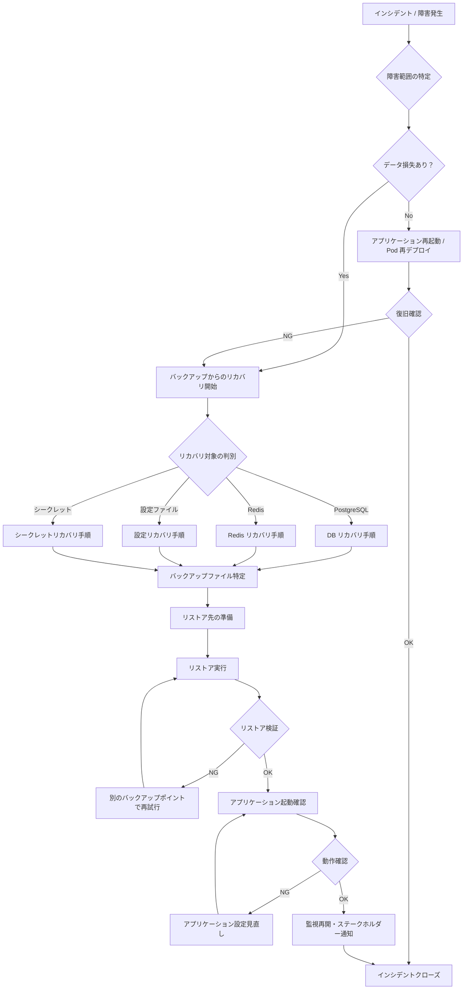

# バックアップ・リカバリ手順書

| 項目 | 内容 |
|------|------|
| 文書番号 | OPS-BCK-001 |
| バージョン | 1.0.0 |
| 作成日 | 2026-03-25 |
| 作成者 | インフラチーム |
| 承認者 | CTO |
| 対象システム | ZeroTrust-ID-Governance（Azure AKS / PostgreSQL / Redis / Azure Key Vault） |

---

## 目次

1. [概要](#概要)
2. [バックアップ対象一覧](#バックアップ対象一覧)
3. [バックアップスケジュール](#バックアップスケジュール)
4. [Azure Backup サービス設定](#azure-backup-サービス設定)
5. [RPO / RTO 目標値](#rpo--rto-目標値)
6. [リカバリ手順](#リカバリ手順)
7. [バックアップ検証手順](#バックアップ検証手順)

---

## 概要

本書は ZeroTrust-ID-Governance システムのバックアップ・リカバリ方針および手順を定義します。
データの保護と迅速なサービス復旧を実現するため、Azure Backup を中心とした自動バックアップ体制を構築します。

### バックアップ方針

- **自動化優先**: 手動オペレーションを最小化し、すべてのバックアップを自動化する
- **多重化**: プライマリバックアップに加え、地理冗長バックアップを別リージョンに保持する
- **定期検証**: 月次でリストア訓練を実施し、バックアップの有効性を確認する
- **暗号化**: すべてのバックアップデータを Azure Managed Keys で暗号化する
- **監査証跡**: すべてのバックアップ・リストア操作を Azure Monitor に記録する

---

## バックアップ対象一覧

| 対象 | 種別 | データ区分 | 重要度 |
|------|------|-----------|--------|
| PostgreSQL（プライマリ） | データベース | 機密 | 最重要 |
| PostgreSQL（レプリカ） | データベース | 機密 | 最重要 |
| Redis キャッシュ | KVS | 準機密 | 重要 |
| Kubernetes ConfigMap | 設定ファイル | 設定情報 | 重要 |
| Kubernetes Secret | シークレット | 機密 | 最重要 |
| Azure Key Vault シークレット | シークレット | 機密 | 最重要 |
| Azure Key Vault 証明書 | 証明書 | 機密 | 最重要 |
| Kubernetes マニフェスト（YAML） | 設定ファイル | 設定情報 | 重要 |
| Prometheus 時系列データ | メトリクス | 運用データ | 通常 |
| アプリケーションログ（長期） | ログ | 監査証跡 | 重要 |
| Grafana ダッシュボード定義 | 設定ファイル | 設定情報 | 通常 |

---

## バックアップスケジュール

### PostgreSQL バックアップ

| バックアップ種別 | スケジュール | 保存期間 | 保存先 |
|--------------|------------|---------|--------|
| フルバックアップ | 毎日 02:00 JST | 30 日間 | Azure Backup / GRS |
| 増分バックアップ | 6 時間毎（08:00, 14:00, 20:00, 02:00 JST） | 7 日間 | Azure Backup / LRS |
| WAL アーカイブ（継続） | リアルタイム | 7 日間 | Azure Blob Storage |
| 月次スナップショット | 毎月 1 日 01:00 JST | 12 ヶ月間 | Azure Backup / GRS |
| 年次アーカイブ | 毎年 1 月 1 日 00:00 JST | 7 年間 | Azure Blob Storage (Cold) |

```bash
# PostgreSQL フルバックアップスクリプト（Azure Blob Storage へのアップロード）
#!/bin/bash
set -e

TIMESTAMP=$(date +%Y%m%d_%H%M%S)
BACKUP_FILE="postgresql_full_${TIMESTAMP}.dump"
STORAGE_ACCOUNT="stztidprodbackup"
CONTAINER="postgresql-backups"
DB_HOST="postgresql-primary.ztid.svc.cluster.local"
DB_NAME="ztid_prod"
DB_USER="backup_user"

echo "=== PostgreSQL フルバックアップ開始: $TIMESTAMP ==="

# pg_dump でバックアップ取得
pg_dump \
  -h "$DB_HOST" \
  -U "$DB_USER" \
  -d "$DB_NAME" \
  -F c \
  -Z 9 \
  -f "/tmp/$BACKUP_FILE"

echo "バックアップファイル作成完了: $BACKUP_FILE"

# Azure Blob Storage へアップロード
az storage blob upload \
  --account-name "$STORAGE_ACCOUNT" \
  --container-name "$CONTAINER" \
  --name "$BACKUP_FILE" \
  --file "/tmp/$BACKUP_FILE" \
  --auth-mode login

echo "Azure Blob Storage へのアップロード完了"

# ローカルの一時ファイル削除
rm -f "/tmp/$BACKUP_FILE"

echo "=== バックアップ完了 ==="
```

### Redis バックアップ

| バックアップ種別 | スケジュール | 保存期間 | 保存先 |
|--------------|------------|---------|--------|
| RDB スナップショット（フル） | 毎日 03:00 JST | 14 日間 | Azure Cache for Redis 組み込み |
| 地理冗長バックアップ | フル取得後即時レプリケーション | 14 日間 | Azure Blob Storage (GRS) |

```bash
# Redis バックアップ確認・取得スクリプト
REDIS_HOST="redis-svc.ztid.svc.cluster.local"
REDIS_PORT="6379"

# BGSAVE コマンドでスナップショット取得
kubectl exec -n ztid deploy/redis -- redis-cli -h "$REDIS_HOST" BGSAVE
echo "Redis BGSAVE 開始"

# 完了確認
sleep 5
kubectl exec -n ztid deploy/redis -- redis-cli -h "$REDIS_HOST" LASTSAVE
```

### 設定ファイル・マニフェスト バックアップ

| バックアップ種別 | スケジュール | 保存期間 | 保存先 |
|--------------|------------|---------|--------|
| Kubernetes マニフェスト | Git リポジトリ（GitOps） | 無期限 | Azure DevOps / GitHub |
| ConfigMap スナップショット | 毎日 04:00 JST | 30 日間 | Azure Blob Storage |
| etcd バックアップ（AKS マネージド） | AKS マネージドサービスによる自動取得 | 3 日間 | AKS マネージド |

```bash
# Kubernetes ConfigMap / Secret のバックアップ
#!/bin/bash
NAMESPACE="ztid"
TIMESTAMP=$(date +%Y%m%d_%H%M%S)
BACKUP_DIR="/tmp/k8s_backup_${TIMESTAMP}"

mkdir -p "$BACKUP_DIR"

# ConfigMap バックアップ
kubectl get configmap -n "$NAMESPACE" -o yaml > "$BACKUP_DIR/configmaps.yaml"

# Secret バックアップ（暗号化してから保存）
kubectl get secret -n "$NAMESPACE" -o yaml > "$BACKUP_DIR/secrets.yaml"

# RBAC 設定バックアップ
kubectl get roles,rolebindings,clusterroles,clusterrolebindings -A -o yaml > "$BACKUP_DIR/rbac.yaml"

# tar.gz にまとめてアップロード
tar -czf "/tmp/k8s_config_${TIMESTAMP}.tar.gz" -C /tmp "k8s_backup_${TIMESTAMP}"

az storage blob upload \
  --account-name stztidprodbackup \
  --container-name k8s-config-backups \
  --name "k8s_config_${TIMESTAMP}.tar.gz" \
  --file "/tmp/k8s_config_${TIMESTAMP}.tar.gz" \
  --auth-mode login

rm -rf "$BACKUP_DIR" "/tmp/k8s_config_${TIMESTAMP}.tar.gz"
echo "Kubernetes 設定バックアップ完了"
```

### シークレット バックアップ

| バックアップ種別 | スケジュール | 保存期間 | 保存先 |
|--------------|------------|---------|--------|
| Azure Key Vault シークレット | Azure Key Vault ソフト削除（自動） | 90 日間 | Azure Key Vault |
| Azure Key Vault バックアップ | 毎日 05:00 JST | 90 日間 | Azure Blob Storage (GRS) |
| 証明書バックアップ | 証明書更新時 + 毎月 | 証明書有効期間 + 1 年 | Azure Blob Storage |

```bash
# Azure Key Vault シークレット一括バックアップ
VAULT_NAME="kv-ztid-prod"
STORAGE_ACCOUNT="stztidprodbackup"
TIMESTAMP=$(date +%Y%m%d_%H%M%S)

# 全シークレットのバックアップ
az keyvault secret list --vault-name "$VAULT_NAME" --query "[].name" -o tsv | while read SECRET_NAME; do
  az keyvault secret backup \
    --vault-name "$VAULT_NAME" \
    --name "$SECRET_NAME" \
    --file "/tmp/kv_secret_${SECRET_NAME}_${TIMESTAMP}.bak"
  echo "シークレットバックアップ完了: $SECRET_NAME"
done

# 証明書バックアップ
az keyvault certificate list --vault-name "$VAULT_NAME" --query "[].name" -o tsv | while read CERT_NAME; do
  az keyvault certificate backup \
    --vault-name "$VAULT_NAME" \
    --name "$CERT_NAME" \
    --file "/tmp/kv_cert_${CERT_NAME}_${TIMESTAMP}.bak"
  echo "証明書バックアップ完了: $CERT_NAME"
done
```

---

## Azure Backup サービス設定

### Recovery Services Vault 設定

| 設定項目 | 値 |
|---------|-----|
| Vault 名 | rsv-ztid-prod |
| リソースグループ | rg-ztid-prod |
| リージョン | Japan East |
| ストレージ冗長 | Geo-Redundant Storage (GRS) |
| ソフト削除 | 有効（保持期間: 14 日） |
| クロスリージョンリストア | 有効 |
| 暗号化 | Customer-Managed Key (CMK) |

### バックアップポリシー設定

```json
{
  "name": "ztid-postgresql-policy",
  "properties": {
    "backupManagementType": "AzureWorkload",
    "workLoadType": "SQLDataBase",
    "schedulePolicy": {
      "schedulePolicyType": "SimpleSchedulePolicy",
      "scheduleRunFrequency": "Daily",
      "scheduleRunTimes": ["2026-01-01T17:00:00Z"]
    },
    "retentionPolicy": {
      "retentionPolicyType": "LongTermRetentionPolicy",
      "dailySchedule": {
        "retentionTimes": ["2026-01-01T17:00:00Z"],
        "retentionDuration": { "count": 30, "durationType": "Days" }
      },
      "weeklySchedule": {
        "daysOfTheWeek": ["Sunday"],
        "retentionTimes": ["2026-01-01T17:00:00Z"],
        "retentionDuration": { "count": 12, "durationType": "Weeks" }
      },
      "monthlySchedule": {
        "retentionScheduleFormatType": "Weekly",
        "retentionTimes": ["2026-01-01T17:00:00Z"],
        "retentionDuration": { "count": 12, "durationType": "Months" }
      },
      "yearlySchedule": {
        "retentionScheduleFormatType": "Weekly",
        "retentionTimes": ["2026-01-01T17:00:00Z"],
        "retentionDuration": { "count": 7, "durationType": "Years" }
      }
    }
  }
}
```

---

## RPO / RTO 目標値

| システムコンポーネント | RPO（目標復旧時点） | RTO（目標復旧時間） | 優先度 |
|--------------------|-----------------|-----------------|--------|
| PostgreSQL（認証・ユーザーデータ） | 15 分 | 1 時間 | 最高 |
| PostgreSQL（監査ログ） | 1 時間 | 4 時間 | 高 |
| Redis（セッションキャッシュ） | 1 時間 ※ | 30 分 | 高 |
| Kubernetes 設定（ConfigMap / Secret） | 1 日 | 2 時間 | 高 |
| Azure Key Vault シークレット | 1 日 | 1 時間 | 最高 |
| アプリケーションコンテナ | N/A（イメージレジストリで管理） | 30 分 | 高 |
| Prometheus メトリクス | 6 時間 | 4 時間 | 中 |
| Grafana ダッシュボード | 1 日 | 2 時間 | 低 |

> ※ Redis はキャッシュとして機能するため、データ損失が発生しても DB からの再投入で復旧可能。RPO はセッション継続性の観点から設定。

---

## リカバリ手順

### リカバリフロー



### DB リカバリ手順

#### 1. 障害状況の確認

```bash
# PostgreSQL の状態確認
kubectl get pods -n ztid -l app=postgresql
kubectl describe pod -n ztid -l app=postgresql

# DB への接続テスト
kubectl exec -n ztid deploy/postgresql -- psql -U postgres -c "SELECT version();"
```

#### 2. バックアップポイントの選択

```bash
# Azure Backup のリストアポイント一覧確認
az backup recoverypoint list \
  --resource-group rg-ztid-prod \
  --vault-name rsv-ztid-prod \
  --backup-management-type AzureWorkload \
  --workload-type SQLDataBase \
  --item-name sqldb;ztid_prod \
  --output table
```

#### 3. リストア実行

```bash
# Azure Backup からのリストア（特定時点への復元）
az backup restore restore-azurewl \
  --resource-group rg-ztid-prod \
  --vault-name rsv-ztid-prod \
  --rp-name <RECOVERY_POINT_NAME> \
  --restore-config restore_config.json

# pg_restore を使ったカスタムリストア
pg_restore \
  -h postgresql-primary.ztid.svc.cluster.local \
  -U postgres \
  -d ztid_prod \
  -F c \
  -j 4 \
  --clean \
  /tmp/postgresql_full_YYYYMMDD_HHMMSS.dump
```

#### 4. リストア後検証

```bash
# テーブル数確認
kubectl exec -n ztid deploy/postgresql -- psql -U postgres -d ztid_prod -c "\dt" | wc -l

# 主要テーブルのレコード数確認
kubectl exec -n ztid deploy/postgresql -- psql -U postgres -d ztid_prod -c "
  SELECT
    schemaname,
    tablename,
    n_live_tup AS row_count
  FROM pg_stat_user_tables
  ORDER BY n_live_tup DESC
  LIMIT 20;
"

# 最新レコードの確認
kubectl exec -n ztid deploy/postgresql -- psql -U postgres -d ztid_prod -c "
  SELECT MAX(created_at) FROM users;
  SELECT MAX(created_at) FROM audit_logs;
"
```

### アプリケーションリカバリ手順

```bash
# 1. 影響を受けた Deployment の確認
kubectl get deployments -n ztid
kubectl get pods -n ztid

# 2. Pod の再デプロイ
kubectl rollout restart deployment/api-gateway -n ztid
kubectl rollout restart deployment/auth-service -n ztid
kubectl rollout restart deployment/user-service -n ztid
kubectl rollout restart deployment/access-control-service -n ztid
kubectl rollout restart deployment/celery-worker -n ztid

# 3. ロールアウト完了確認
kubectl rollout status deployment/api-gateway -n ztid
kubectl rollout status deployment/auth-service -n ztid

# 4. 特定バージョンへのロールバック（イメージ問題の場合）
kubectl set image deployment/api-gateway api-gateway=acr-ztid.azurecr.io/api-gateway:v1.2.3 -n ztid
```

### 設定リカバリ手順

```bash
# 1. バックアップファイルのダウンロード
az storage blob download \
  --account-name stztidprodbackup \
  --container-name k8s-config-backups \
  --name "k8s_config_YYYYMMDD_HHMMSS.tar.gz" \
  --file /tmp/k8s_config_restore.tar.gz

# 2. 解凍
tar -xzf /tmp/k8s_config_restore.tar.gz -C /tmp/

# 3. ConfigMap 復元
kubectl apply -f /tmp/k8s_backup_YYYYMMDD_HHMMSS/configmaps.yaml

# 4. Secret 復元
kubectl apply -f /tmp/k8s_backup_YYYYMMDD_HHMMSS/secrets.yaml

# 5. RBAC 復元
kubectl apply -f /tmp/k8s_backup_YYYYMMDD_HHMMSS/rbac.yaml

# 6. 適用確認
kubectl get configmap -n ztid
kubectl get secret -n ztid
```

### シークレットリカバリ手順

```bash
# Azure Key Vault シークレットのリストア
VAULT_NAME="kv-ztid-prod"

# シークレットのリストア
az keyvault secret restore \
  --vault-name "$VAULT_NAME" \
  --file "/tmp/kv_secret_<SECRET_NAME>_YYYYMMDD_HHMMSS.bak"

# 証明書のリストア
az keyvault certificate restore \
  --vault-name "$VAULT_NAME" \
  --file "/tmp/kv_cert_<CERT_NAME>_YYYYMMDD_HHMMSS.bak"

# Kubernetes Secret の同期（External Secrets Operator 使用の場合）
kubectl annotate externalsecret -n ztid <secret-name> \
  force-sync=$(date +%s) --overwrite
```

---

## バックアップ検証手順

### 月次バックアップ検証スケジュール

| 検証項目 | 実施タイミング | 担当 | 記録先 |
|---------|------------|------|--------|
| PostgreSQL リストア訓練 | 毎月第 2 日曜日 | インフラチーム | 検証レポート |
| Redis リカバリ確認 | 毎月第 2 日曜日 | インフラチーム | 検証レポート |
| 設定ファイルリストア確認 | 毎月第 2 日曜日 | インフラチーム | 検証レポート |
| Key Vault リストア確認 | 四半期毎 | セキュリティチーム | 検証レポート |
| 全システム DR 訓練 | 半年毎 | 全チーム | DR 訓練報告書 |

### PostgreSQL バックアップ検証手順

```bash
#!/bin/bash
# バックアップ検証スクリプト（テスト環境使用）
set -e

BACKUP_DATE=$(date -d 'yesterday' +%Y%m%d)
BACKUP_FILE="postgresql_full_${BACKUP_DATE}_020000.dump"
STORAGE_ACCOUNT="stztidprodbackup"
TEST_DB="ztid_restore_test"
DB_HOST="postgresql-test.ztid-test.svc.cluster.local"

echo "=== バックアップ検証開始: $BACKUP_FILE ==="

# 1. バックアップファイルのダウンロード
echo "[1] バックアップファイルダウンロード"
az storage blob download \
  --account-name "$STORAGE_ACCOUNT" \
  --container-name "postgresql-backups" \
  --name "$BACKUP_FILE" \
  --file "/tmp/$BACKUP_FILE"

# 2. ファイル整合性確認
echo "[2] ファイル整合性確認"
FILE_SIZE=$(stat -c%s "/tmp/$BACKUP_FILE")
if [ "$FILE_SIZE" -lt 1024 ]; then
  echo "ERROR: バックアップファイルが小さすぎます ($FILE_SIZE bytes)"
  exit 1
fi
echo "OK: ファイルサイズ = $FILE_SIZE bytes"

# 3. テスト DB へのリストア
echo "[3] テスト DB へのリストア"
createdb -h "$DB_HOST" -U postgres "$TEST_DB"
pg_restore \
  -h "$DB_HOST" \
  -U postgres \
  -d "$TEST_DB" \
  -F c \
  -j 4 \
  "/tmp/$BACKUP_FILE"

# 4. データ整合性確認
echo "[4] データ整合性確認"
TABLE_COUNT=$(psql -h "$DB_HOST" -U postgres -d "$TEST_DB" -t -c "SELECT COUNT(*) FROM information_schema.tables WHERE table_schema='public';")
echo "テーブル数: $TABLE_COUNT"

USER_COUNT=$(psql -h "$DB_HOST" -U postgres -d "$TEST_DB" -t -c "SELECT COUNT(*) FROM users;")
echo "ユーザー数: $USER_COUNT"

# 5. テスト DB の削除
echo "[5] クリーンアップ"
dropdb -h "$DB_HOST" -U postgres "$TEST_DB"
rm -f "/tmp/$BACKUP_FILE"

echo "=== バックアップ検証完了: OK ==="
```

### 検証結果レポートテンプレート

```
=== バックアップ検証レポート ===
実施日時   : YYYY-MM-DD HH:MM JST
実施担当者 : [氏名]
検証対象   : PostgreSQL フルバックアップ (YYYY-MM-DD 取得分)

■ 検証結果
バックアップファイル取得  : OK / NG
ファイル整合性確認        : OK / NG（ファイルサイズ: XX MB）
リストア実行              : OK / NG（所要時間: XX 分）
テーブル数確認            : OK / NG（取得値: XX / 期待値: XX）
主要テーブルレコード数確認 : OK / NG
アプリケーション起動確認  : OK / NG（テスト環境）

■ 判定
総合判定: OK / NG

■ 備考
（問題があった場合の詳細を記載）

■ 次回検証予定日
YYYY-MM-DD
```

---

*本文書の改訂履歴は Git コミット履歴で管理します。*
