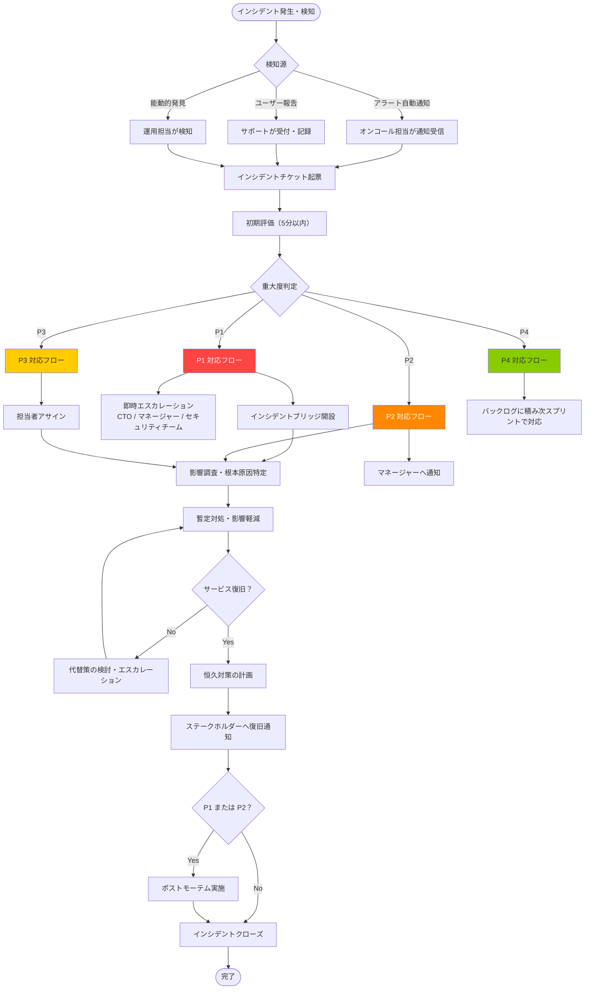
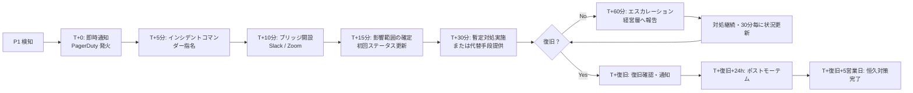
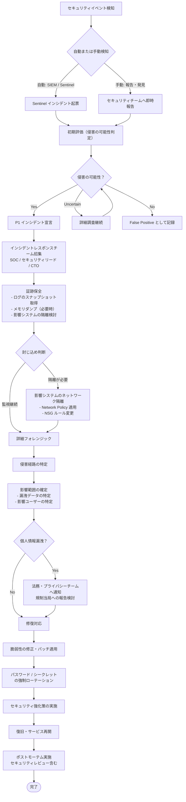

# インシデント対応手順書

| 項目 | 内容 |
|------|------|
| 文書番号 | OPS-INC-001 |
| バージョン | 1.0.0 |
| 作成日 | 2026-03-25 |
| 作成者 | 運用チーム |
| 承認者 | CTO |
| 対象システム | ZeroTrust-ID-Governance（Azure AKS / Prometheus / Grafana / Azure Monitor / PgBouncer / Celery） |

---

## 目次

1. [概要](#概要)
2. [インシデント定義と重大度分類](#インシデント定義と重大度分類)
3. [対応フロー](#対応フロー)
4. [エスカレーション先と連絡先](#エスカレーション先と連絡先)
5. [重大度別 SLA](#重大度別-sla)
6. [セキュリティインシデント対応](#セキュリティインシデント対応)
7. [ポストモーテム実施方法](#ポストモーテム実施方法)
8. [コミュニケーション手順](#コミュニケーション手順)

---

## 概要

本書は ZeroTrust-ID-Governance システムで発生したインシデントに対する対応手順を定義します。
インシデントを迅速かつ適切に対処し、サービスへの影響を最小化することを目的とします。

### 基本原則

- **迅速な初動**: 検知から 15 分以内に初期評価を完了する
- **コミュニケーション優先**: ステークホルダーへの情報共有を対応と並行して行う
- **エスカレーション判断**: 不明な場合は迷わずエスカレーションする
- **証跡保全**: セキュリティインシデントでは操作ログを必ず保全する
- **学習文化**: すべての P1/P2 インシデントでポストモーテムを実施する

---

## インシデント定義と重大度分類

### インシデントの定義

インシデントとは、以下のいずれかに該当するイベントを指します。

- システムの可用性・完全性・機密性に影響を与える事象
- SLA で定めた閾値を超える性能劣化
- セキュリティポリシーの違反または違反の疑い
- データ損失・漏洩・改ざんが発生または疑われる事象

### 重大度分類

| 重大度 | 定義 | 影響範囲の例 |
|--------|------|------------|
| **P1 - 致命的** | システム全体またはコアサービスが停止。多数のユーザーに影響。 | 全 API 停止 / 認証サービス停止 / データ損失 / セキュリティ侵害 |
| **P2 - 重大** | 主要機能が部分的に停止。一部ユーザーまたは機能に影響。 | 特定 API の障害 / パフォーマンス大幅劣化 / 一部テナント影響 |
| **P3 - 軽微** | 機能は動作するが品質が低下。回避策あり。 | レスポンス遅延 / UI の一部不具合 / 非重要バッチ失敗 |
| **P4 - 情報** | 即時対応不要だが追跡が必要な事象。 | 軽微なエラー増加 / パフォーマンス微小劣化 / 設定の軽微なずれ |

### 重大度判断マトリクス

| ユーザー影響 | データリスク | 可用性 | 推奨重大度 |
|------------|------------|--------|----------|
| 全ユーザー影響 | 損失・漏洩あり | 完全停止 | P1 |
| 全ユーザー影響 | なし | 完全停止 | P1 |
| 多数ユーザー影響 | 損失・漏洩あり | 部分停止 | P1 |
| 多数ユーザー影響 | なし | 部分停止 | P2 |
| 一部ユーザー影響 | 損失・漏洩あり | 部分停止 | P1 |
| 一部ユーザー影響 | なし | 部分停止 | P2 |
| 影響なし | なし | 性能低下 | P3 |
| 影響なし | なし | 正常 | P4 |

---

## 対応フロー

### 標準インシデント対応フロー



### P1 インシデント対応フロー（詳細）



---

## エスカレーション先と連絡先

### 連絡先一覧

> 以下はダミー情報です。実際の連絡先に置き換えてください。

| 役割 | 氏名 | メール | 電話（直通） | Slack |
|------|------|--------|------------|-------|
| CTO（最終決裁者） | 山田 太郎 | yamada.taro@example.com | 03-XXXX-0001 | @yamada_taro |
| 開発マネージャー | 鈴木 花子 | suzuki.hanako@example.com | 03-XXXX-0002 | @suzuki_hanako |
| インフラリード | 田中 一郎 | tanaka_ichiro@example.com | 03-XXXX-0003 | @tanaka_ichiro |
| セキュリティリード | 佐藤 次郎 | sato_jiro@example.com | 03-XXXX-0004 | @sato_jiro |
| DBA リード | 伊藤 三郎 | ito_saburo@example.com | 03-XXXX-0005 | @ito_saburo |
| オンコール（週次交代） | 当番参照 | oncall@example.com | PagerDuty | #ops-oncall |

### エスカレーションマトリクス

| 重大度 | 第一通知先 | 第二通知先（30分後も未解決） | 第三通知先（60分後も未解決） |
|--------|----------|--------------------------|--------------------------|
| P1 | オンコール担当 + インフラリード | 開発マネージャー + セキュリティリード | CTO |
| P2 | オンコール担当 | インフラリード + 開発マネージャー | - |
| P3 | 担当エンジニア | インフラリード | - |
| P4 | 担当エンジニア（翌営業日対応可） | - | - |

### 外部連絡先

| 組織 | 用途 | 連絡先 |
|------|------|--------|
| Microsoft Azure サポート | Azure プラットフォーム障害 | サポートポータル / ケース番号管理 |
| PagerDuty サポート | アラートシステム障害 | support@pagerduty.com |
| セキュリティ CSIRT | セキュリティインシデント | csirt@example.com |
| 法務チーム | データ漏洩・法令対応 | legal@example.com |

---

## 重大度別 SLA

### SLA 定義

| 重大度 | 初回応答時間 | 状況更新頻度 | 目標復旧時間 (RTO) | 対応時間帯 |
|--------|-----------|------------|-----------------|-----------|
| **P1** | **15 分以内** | 30 分毎 | **4 時間以内** | 24 時間 / 365 日 |
| **P2** | **1 時間以内** | 2 時間毎 | **8 時間以内** | 24 時間 / 365 日 |
| **P3** | **4 時間以内** | 翌営業日更新 | **3 営業日以内** | 営業時間内 |
| **P4** | **2 営業日以内** | 週次更新 | **2 週間以内** | 営業時間内 |

### SLA 計測基準

| 項目 | 計測開始点 | 計測終了点 |
|------|----------|----------|
| 初回応答時間 | インシデント検知時刻 | 担当者の最初のステータス更新時刻 |
| 復旧時間 | インシデント検知時刻 | サービス正常化の確認時刻 |

### 可用性 SLA

| サービス | 月次可用性目標 | 計画メンテナンス除外 |
|---------|------------|-----------------|
| API ゲートウェイ | 99.9%（月 43.8 分以内のダウンタイム） | あり |
| 認証サービス | 99.95%（月 21.9 分以内のダウンタイム） | あり |
| ユーザー管理サービス | 99.9% | あり |
| データベース（PostgreSQL） | 99.95% | あり |

---

## セキュリティインシデント対応

### セキュリティインシデント対応フロー



### 侵害検知時の初動手順

#### ステップ 1: 即時封じ込め

```bash
# 1. 影響 Pod の隔離（NetworkPolicy で通信遮断）
cat <<EOF | kubectl apply -f -
apiVersion: networking.k8s.io/v1
kind: NetworkPolicy
metadata:
  name: isolate-compromised-pod
  namespace: ztid
spec:
  podSelector:
    matchLabels:
      app: <compromised-app>
  policyTypes:
    - Ingress
    - Egress
  # Egress/Ingress を全て拒否（隔離）
EOF

# 2. 影響 Pod のスケールダウン（必要に応じて）
kubectl scale deployment/<compromised-deployment> -n ztid --replicas=0

# 3. ログのスナップショット取得（証跡保全）
TIMESTAMP=$(date +%Y%m%d_%H%M%S)
kubectl logs -n ztid <compromised-pod> --all-containers > /tmp/incident_logs_${TIMESTAMP}.txt
kubectl describe pod -n ztid <compromised-pod> >> /tmp/incident_logs_${TIMESTAMP}.txt
kubectl get events -n ztid >> /tmp/incident_logs_${TIMESTAMP}.txt

# 証跡を Azure Blob Storage に保全
az storage blob upload \
  --account-name stztidprodbackup \
  --container-name security-incident-evidence \
  --name "incident_${TIMESTAMP}.tar.gz" \
  --file /tmp/incident_logs_${TIMESTAMP}.txt
```

#### ステップ 2: 認証情報の無効化

```bash
# 侵害された可能性のあるサービスプリンシパルの無効化
az ad sp update --id <SP_OBJECT_ID> --set "accountEnabled=false"

# Azure Key Vault シークレットの無効化
az keyvault secret set-attributes \
  --vault-name kv-ztid-prod \
  --name <secret-name> \
  --enabled false

# Kubernetes Secret の更新（新しい認証情報に切り替え）
kubectl create secret generic <secret-name> \
  --from-literal=password=<NEW_STRONG_PASSWORD> \
  --namespace ztid \
  --dry-run=client -o yaml | kubectl apply -f -
```

#### ステップ 3: 影響調査

```kusto
// Azure Sentinel での侵害調査クエリ
// 侵害期間中の全アクセスログ
let compromisedPod = "<pod-name>";
let startTime = datetime("2026-03-25T00:00:00Z");
let endTime = datetime("2026-03-25T12:00:00Z");

ContainerLog
| where TimeGenerated between (startTime .. endTime)
| where ContainerID contains compromisedPod
| extend parsed = parse_json(LogEntry)
| project TimeGenerated, UserId=parsed.user_id, Action=parsed.event, IP=parsed.ip_address
| order by TimeGenerated asc
```

### 個人情報漏洩時の対応

| 漏洩規模 | 報告義務 | 報告期限 | 報告先 |
|---------|---------|---------|--------|
| 軽微（1〜49件） | 内部記録のみ | 発見後 72 時間以内に内部報告 | CISO |
| 中程度（50〜999件） | 規制当局への報告を検討 | 発見後 72 時間以内 | 個人情報保護委員会・CISO |
| 大規模（1000件以上） | 規制当局・本人への通知必須 | 発見後 72 時間以内 | 個人情報保護委員会・法務・PR |

---

## ポストモーテム実施方法

### 実施タイミング

| インシデント重大度 | 実施タイミング | 参加者 |
|-----------------|------------|--------|
| P1 | 復旧後 24 時間以内（最長 5 営業日以内に完了） | インシデント関与者全員 + マネージャー |
| P2 | 復旧後 5 営業日以内 | インシデント関与者 + チームリード |
| P3 | オプション（チームの判断） | 関与者のみ |

### ポストモーテムテンプレート

```markdown
# ポストモーテム報告書

## 基本情報
- インシデント ID: INC-YYYY-NNNN
- インシデント名: [簡潔なタイトル]
- 発生日時: YYYY-MM-DD HH:MM JST
- 復旧日時: YYYY-MM-DD HH:MM JST
- 総ダウンタイム: X 時間 Y 分
- 重大度: P1 / P2
- 作成者: [氏名]
- レビュー日: YYYY-MM-DD

## タイムライン
| 時刻 | イベント | 担当者 |
|------|---------|--------|
| HH:MM | 監視アラート発火 | 自動 |
| HH:MM | 担当者が検知・対応開始 | [氏名] |
| HH:MM | 根本原因を特定 | [氏名] |
| HH:MM | 暫定対処を実施 | [氏名] |
| HH:MM | サービス復旧確認 | [氏名] |

## 根本原因
[根本原因の詳細説明]

## 影響範囲
- 影響ユーザー数: X 名
- 影響サービス: [サービス名]
- データ影響: あり / なし

## 何が起きたか（技術的詳細）
[技術的な詳細説明]

## 何がうまくいったか
- [例] アラートが設定された閾値通りに発火した
- [例] 対応メンバーが迅速に集結できた

## 何がうまくいかなかったか
- [例] 根本原因の特定に時間がかかった
- [例] コミュニケーションのラグが発生した

## アクションアイテム
| # | アクション | 担当 | 期限 | 優先度 |
|---|-----------|------|------|--------|
| 1 | [具体的な改善策] | [担当者] | YYYY-MM-DD | High |
| 2 | [具体的な改善策] | [担当者] | YYYY-MM-DD | Medium |

## 検出の改善
[次回同様の事象をより早く検知するための改善案]

## 再発防止策
[恒久的な再発防止策の説明]
```

### ポストモーテム実施手順

1. **事実収集** (復旧後即日)
   - タイムラインの整理（ログ・チャットから時系列を再構築）
   - 影響範囲の定量化

2. **ポストモーテム会議** (復旧後 24〜48 時間以内)
   - 非難なし（Blameless）の原則で実施
   - 根本原因の深掘り（5 Why 分析）
   - アクションアイテムの決定

3. **報告書作成** (会議後 2 日以内)
   - 上記テンプレートに基づき作成
   - 関係者レビュー

4. **アクションアイテム管理** (翌スプリント以降)
   - GitHub Issues / Azure DevOps タスクとして管理
   - 完了確認

---

## コミュニケーション手順

### 内部コミュニケーション

| フェーズ | タイミング | チャンネル | 内容 |
|---------|-----------|----------|------|
| 初動通知 | 検知後 15 分以内 | #ops-incidents + PagerDuty | インシデント発生・重大度・影響範囲（速報） |
| 状況更新 | P1: 30 分毎 / P2: 2 時間毎 | #ops-incidents | 対応状況・推定復旧時刻 |
| 復旧通知 | 復旧確認後即時 | #ops-incidents + #general | 復旧完了・原因概要 |
| 完了報告 | ポストモーテム後 | #ops-incidents | ポストモーテム結果・再発防止策 |

### 外部コミュニケーション（顧客向け）

```
# ステータスページ更新テンプレート

【調査中】YYYY-MM-DD HH:MM JST
[サービス名] において、[現象の説明] が発生していることを確認しています。
影響範囲の調査中です。詳細が分かり次第、更新します。

---

【対応中】YYYY-MM-DD HH:MM JST
[サービス名] の [現象] について、根本原因を特定し対応中です。
推定復旧時刻: YYYY-MM-DD HH:MM JST（変更の可能性あり）
影響を受けているお客様にご不便をおかけしております。

---

【復旧済み】YYYY-MM-DD HH:MM JST
[サービス名] は復旧しました。
[HH:MM JST] から [HH:MM JST] の間、[現象] が発生し、ご不便をおかけしました。
詳細はポストモーテムレポートをご参照ください（公開予定: YYYY-MM-DD）。
```

### コミュニケーション責任分担

| 役割 | 責任 |
|------|------|
| インシデントコマンダー | 対応の指揮・意思決定・内部コミュニケーション全体統括 |
| 技術リード | 根本原因調査・技術対応の実行 |
| コミュニケーション担当 | ステータスページ更新・顧客向け文書作成 |
| マネージャー | 経営層への報告・エスカレーション判断 |

---

*本文書の改訂履歴は Git コミット履歴で管理します。*
