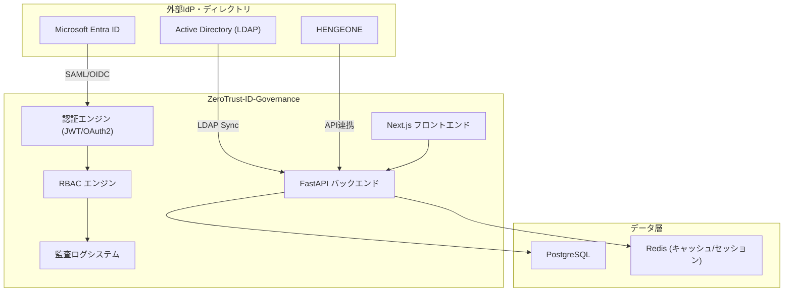
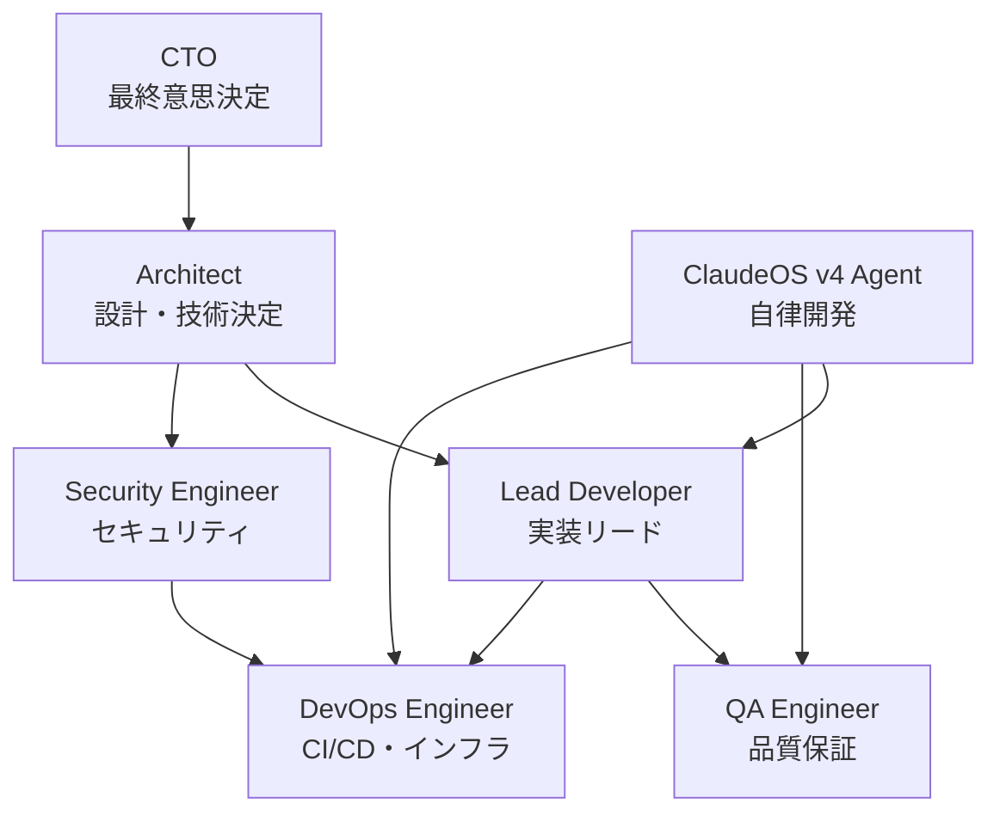
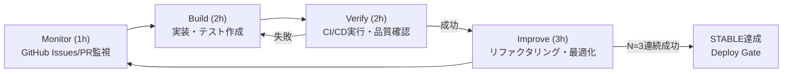

# プロジェクト計画（Project Plan）

| 項目 | 内容 |
|------|------|
| 文書番号 | PM-PLAN-001 |
| バージョン | 1.0.0 |
| 作成日 | 2026-03-25 |
| 最終更新日 | 2026-03-25 |
| 作成者 | CTO / Architect |
| ステータス | 承認済み |

---

## 1. プロジェクト概要

**プロジェクト名**: ZeroTrust-ID-Governance システム開発

本プロジェクトは、ゼロトラストセキュリティモデルに基づくアイデンティティガバナンスシステムを構築する。Microsoft Entra ID（旧 Azure AD）、オンプレミス Active Directory、および HENGEONE（クラウドアクセスプロキシ）を統合し、組織全体のアクセス制御・ID管理・監査証跡を一元管理する。

### システム概要図

---

## 2. プロジェクト目標と成功基準

### 2.1 プロジェクト目標

| # | 目標 | 優先度 |
|---|------|--------|
| 1 | ゼロトラスト原則に基づく ID・アクセス管理基盤の構築 | 最高 |
| 2 | Entra ID / AD / HENGEONE との完全な統合 | 最高 |
| 3 | ISO 27001 / NIST CSF / ISO 20000 準拠の実現 | 高 |
| 4 | 監査証跡の完全な記録と可視化 | 高 |
| 5 | 99.9% 以上のシステム可用性確保 | 高 |
| 6 | テストカバレッジ 95% 以上の維持 | 中 |

### 2.2 成功基準

| 基準 | 指標 | 目標値 |
|------|------|--------|
| 機能完成度 | Phase 1〜15 完了率 | 100% |
| テスト品質 | コードカバレッジ | ≥ 95% |
| セキュリティ | 重大脆弱性件数 | 0件 |
| パフォーマンス | API レスポンス (p95) | ≤ 200ms |
| 可用性 | システム稼働率 | ≥ 99.9% |
| CI/CD | ビルド成功率 | ≥ 99% |
| コンプライアンス | ISO 27001 管理策適合率 | ≥ 95% |

---

## 3. スコープ定義

### 3.1 対象システム

| システム | 役割 | 統合方式 |
|----------|------|----------|
| Microsoft Entra ID | クラウド IdP・MFA 基盤 | OIDC / SAML 2.0 |
| Active Directory | オンプレミスディレクトリ | LDAP / AD Sync |
| HENGEONE | クラウドアクセスプロキシ | REST API |
| PostgreSQL | 主データベース | ORM (SQLAlchemy) |
| Redis | セッション・キャッシュ | redis-py |
| Azure AKS | 本番環境 | Kubernetes / Helm |

### 3.2 スコープ内（In Scope）

- ユーザー認証・認可 API（FastAPI）
- フロントエンド管理画面（Next.js）
- RBAC（Role-Based Access Control）エンジン
- 監査ログ収集・可視化
- 外部 IdP 連携（Entra ID / AD / HENGEONE）
- CI/CD パイプライン（GitHub Actions）
- セキュリティスキャン（Trivy / Bandit / safety）
- コンプライアンス対応（ISO 27001 / NIST CSF / ISO 20000）
- E2E テスト（Playwright）

### 3.3 スコープ外（Out of Scope）

- ハードウェア調達・物理インフラ管理
- エンドユーザー向けトレーニング資料
- Entra ID テナント自体の構築・管理
- 外部 SOC 連携（将来フェーズ）

---

## 4. ステークホルダー一覧

| ロール | 責任 | 権限 |
|--------|------|------|
| CTO | プロジェクト最終判断・アーキテクチャ承認 | 全権限 |
| Architect | 設計決定・技術選定 | 設計変更権限 |
| Lead Developer | 実装リード・コードレビュー | 開発権限 |
| Security Engineer | セキュリティ設計・脆弱性対応 | セキュリティポリシー変更権限 |
| QA Engineer | テスト設計・品質管理 | テスト承認権限 |
| DevOps Engineer | CI/CD・インフラ管理 | インフラ変更権限 |
| ClaudeOS v4 Agent | 自律開発エージェント | PR作成・CI実行権限 |

---

## 5. 開発体制図

---

## 6. プロジェクトスケジュール概要

| Phase | 内容 | 期間（目安） | 状態 |
|-------|------|--------------|------|
| Phase 1 | プロジェクト初期設定 | 1週間 | 完了 |
| Phase 2 | DB モデル実装 | 1週間 | 完了 |
| Phase 3 | 認証 API 実装 | 2週間 | 完了 |
| Phase 4 | ユーザー管理 API | 1週間 | 完了 |
| Phase 5 | セキュリティ強化 | 1週間 | 完了 |
| Phase 6 | 監査ログミドルウェア | 1週間 | 完了 |
| Phase 7 | JWT 失効管理 | 1週間 | 完了 |
| Phase 8 | RBAC 細分化 | 1週間 | 完了 |
| Phase 9 | エンジンカバレッジ | 1週間 | 完了 |
| Phase 10 | フロントエンド基盤 | 2週間 | 完了 |
| Phase 11 | フロントエンド認証 UI | 1週間 | 完了 |
| Phase 12 | フロントエンド管理画面 | 2週間 | 完了 |
| Phase 13 | テストカバレッジ向上 | 1週間 | 完了 |
| Phase 14 | セキュリティミドルウェア | 1週間 | 完了 |
| Phase 15 | E2E テスト実装 | 2週間 | 完了 |
| Phase 16+ | 将来フェーズ（運用・拡張） | TBD | 計画中 |

---

## 7. ClaudeOS v4 による自律開発フロー

本プロジェクトでは ClaudeOS v4 自律開発エージェントを活用した継続的開発を実施する。

### 自律開発ルール

| ルール | 内容 |
|--------|------|
| ブランチ戦略 | main への直接 push 禁止 / PR 必須 |
| CI 確認 | 全 CI チェック通過必須 |
| STABLE 判定 | N=3 連続成功で STABLE 認定 |
| 最大実行時間 | 8時間（Loop Guard 発動で強制終了） |
| Projects 更新 | GitHub Projects ステータス自動更新必須 |

---

## 8. 前提条件・制約

| 項目 | 内容 |
|------|------|
| 開発言語 | Python 3.11 / TypeScript |
| フレームワーク | FastAPI / Next.js 14 |
| インフラ | Azure AKS / GitHub Actions |
| ソース管理 | GitHub (main ブランチ保護) |
| テストツール | pytest / Playwright |
| セキュリティ | Trivy / Bandit / safety / OWASP ZAP |

---

## 9. 改訂履歴

| バージョン | 日付 | 変更内容 | 変更者 |
|------------|------|----------|--------|
| 1.0.0 | 2026-03-25 | 初版作成 | Architect |
