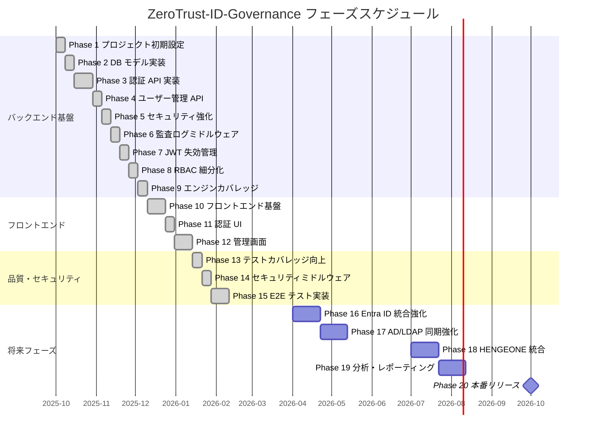
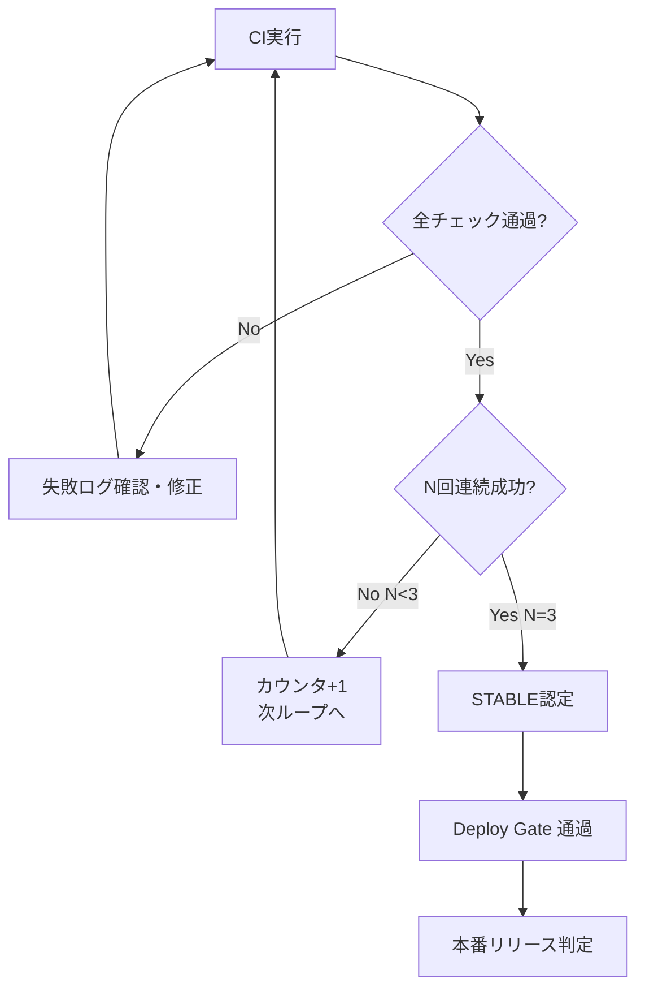

# フェーズ計画（Phase Plan）

| 項目 | 内容 |
|------|------|
| 文書番号 | PM-PHASE-001 |
| バージョン | 1.0.0 |
| 作成日 | 2026-03-25 |
| 最終更新日 | 2026-03-25 |
| 作成者 | Architect |
| ステータス | 承認済み |

---

## 1. フェーズ一覧

### Phase 1〜9: バックエンド基盤

| Phase | 名称 | 主な内容 | 完了基準 | 状態 |
|-------|------|----------|----------|------|
| Phase 1 | プロジェクト初期設定 | リポジトリ構成、CI/CD基盤、Docker環境、依存関係管理 | CI green / Docker build 成功 | 完了 |
| Phase 2 | DB モデル実装 | SQLAlchemy モデル定義、Alembic マイグレーション、PostgreSQL 接続設定 | マイグレーション成功 / カバレッジ ≥ 80% | 完了 |
| Phase 3 | 認証 API 実装 | JWT 発行・検証、OAuth2 フロー、ログイン/ログアウトエンドポイント | 認証テスト全通過 / カバレッジ ≥ 85% | 完了 |
| Phase 4 | ユーザー管理 API | ユーザー CRUD、プロファイル管理、パスワードポリシー | ユーザー API テスト全通過 | 完了 |
| Phase 5 | セキュリティ強化 | レート制限、CORS設定、セキュリティヘッダー、入力バリデーション | Bandit/safety スキャン通過 | 完了 |
| Phase 6 | 監査ログミドルウェア | 全リクエスト自動記録、監査ログ API、ログローテーション | 監査ログテスト全通過 | 完了 |
| Phase 7 | JWT 失効管理 | トークンブラックリスト (Redis)、リフレッシュトークン管理、セッション制御 | JWT 失効テスト全通過 | 完了 |
| Phase 8 | RBAC 細分化 | 権限粒度細分化、リソースレベル制御、権限継承モデル | RBAC テスト全通過 | 完了 |
| Phase 9 | エンジンカバレッジ | 認証・RBAC エンジン網羅テスト、エッジケース対応 | カバレッジ ≥ 90% | 完了 |

### Phase 10〜12: フロントエンド実装

| Phase | 名称 | 主な内容 | 完了基準 | 状態 |
|-------|------|----------|----------|------|
| Phase 10 | フロントエンド基盤 | Next.js 14 セットアップ、認証プロバイダー、APIクライアント、共通レイアウト | フロントエンドビルド成功 | 完了 |
| Phase 11 | フロントエンド認証 UI | ログイン画面、MFA 入力画面、パスワードリセット、セッション管理 UI | 認証フロー E2E テスト通過 | 完了 |
| Phase 12 | フロントエンド管理画面 | ユーザー管理・ロール管理・監査ログ閲覧・ダッシュボード画面 | 管理画面 E2E テスト通過 | 完了 |

### Phase 13〜15: 品質・セキュリティ・E2E

| Phase | 名称 | 主な内容 | 完了基準 | 状態 |
|-------|------|----------|----------|------|
| Phase 13 | テストカバレッジ向上 | 単体テスト追加、統合テスト拡充、カバレッジ目標達成 | カバレッジ ≥ 95% | 完了 |
| Phase 14 | セキュリティミドルウェア | WAF ルール、SQL インジェクション対策、XSS フィルタ、CSRF保護 | OWASP ZAP スキャン通過 | 完了 |
| Phase 15 | E2E テスト実装 | Playwright による全主要シナリオ E2E テスト | E2E テスト全通過 | 完了 |

### Phase 16+: 将来フェーズ

| Phase | 名称 | 主な内容 | 予定時期 |
|-------|------|----------|----------|
| Phase 16 | Entra ID 統合強化 | SAML/OIDC 完全統合、条件付きアクセスポリシー連携 | 2026 Q2 |
| Phase 17 | AD/LDAP 同期強化 | リアルタイム同期、差分更新、コンフリクト解決 | 2026 Q2 |
| Phase 18 | HENGEONE 統合 | プロキシ認証、アクセスポリシー連携 | 2026 Q3 |
| Phase 19 | 分析・レポーティング | BI ダッシュボード、コンプライアンスレポート自動生成 | 2026 Q3 |
| Phase 20 | 本番リリース (v1.0) | 本番環境デプロイ、運用開始 | 2026 Q4 |

---

## 2. フェーズスケジュール（Gantt）

---

## 3. 各フェーズの詳細目標

### Phase 1: プロジェクト初期設定

**目標**: 開発環境と CI/CD 基盤を確立する。

- Docker Compose によるローカル開発環境構築
- GitHub Actions ワークフロー（lint / test / security scan）
- pre-commit フック設定（black / isort / flake8）
- 依存関係管理（pyproject.toml / poetry）
- Alembic マイグレーション基盤

**完了基準**:
- [ ] `docker compose up` でサービス起動成功
- [ ] GitHub Actions CI green
- [ ] README にセットアップ手順記載済み

---

### Phase 3: 認証 API 実装

**目標**: JWT + OAuth2 による堅牢な認証基盤を実装する。

- `/api/v1/auth/login` — ログインエンドポイント
- `/api/v1/auth/logout` — ログアウトエンドポイント
- `/api/v1/auth/refresh` — トークンリフレッシュ
- `/api/v1/auth/me` — 認証済みユーザー情報取得

**完了基準**:
- [ ] 認証 API テスト全通過（正常系・異常系）
- [ ] JWT 有効期限・署名検証の動作確認
- [ ] Bandit セキュリティスキャン通過

---

### Phase 15: E2E テスト実装

**目標**: Playwright による全主要ユーザーシナリオの E2E テストを実装する。

| シナリオ | テスト内容 |
|----------|----------|
| ログイン | 正常ログイン / 異常系（パスワード誤り / MFA失敗） |
| ユーザー管理 | ユーザー作成・更新・削除・検索 |
| ロール管理 | ロール作成・権限付与・解除 |
| 監査ログ | ログ一覧・フィルタ・エクスポート |
| セキュリティ | CSRF / XSS 防御確認 |

---

## 4. STABLE 判定基準

STABLE は ClaudeOS v4 自律開発ループにおける品質ゲートである。

| 変更規模 | 必要連続成功数 (N) |
|----------|-------------------|
| small（バグ修正・軽微変更） | N = 2 |
| normal（機能追加・改善） | N = 3 |
| critical（セキュリティ修正・大規模変更） | N = 5 |

### CI チェック項目

| チェック | ツール | 合格基準 |
|----------|--------|----------|
| Lint | flake8 / ESLint | エラー 0件 |
| 型チェック | mypy / TypeScript | エラー 0件 |
| 単体テスト | pytest | 全テスト通過 |
| カバレッジ | pytest-cov / Codecov | ≥ 95% |
| セキュリティスキャン | Trivy / Bandit / safety | 重大脆弱性 0件 |
| E2E テスト | Playwright | 全シナリオ通過 |
| ビルド | Docker build | 成功 |

---

## 5. フェーズ完了レビュー

各フェーズ完了時に以下のレビューを実施する。

| レビュー項目 | 確認者 | 実施タイミング |
|-------------|--------|----------------|
| コードレビュー | Lead Developer / Architect | PR 作成時 |
| セキュリティレビュー | Security Engineer | フェーズ完了時 |
| QA レビュー | QA Engineer | テスト完了後 |
| アーキテクチャレビュー | Architect / CTO | 設計変更時 |

---

## 6. 改訂履歴

| バージョン | 日付 | 変更内容 | 変更者 |
|------------|------|----------|--------|
| 1.0.0 | 2026-03-25 | 初版作成（Phase 1〜15 完了記録） | Architect |
