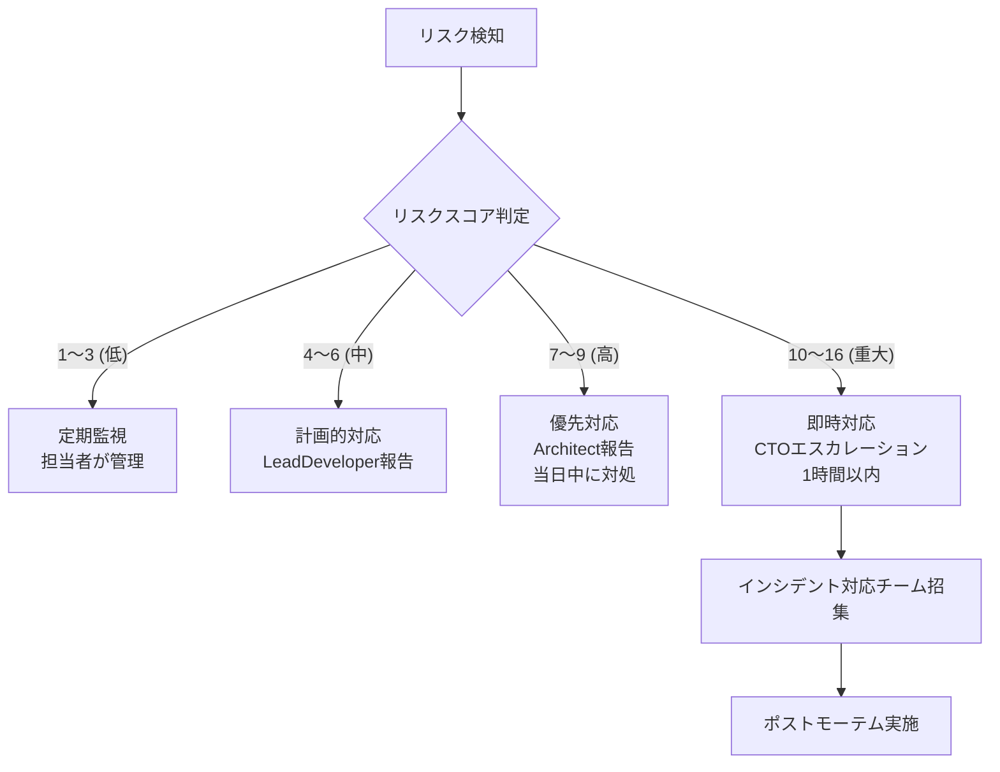

# リスク管理（Risk Management）

| 項目 | 内容 |
|------|------|
| 文書番号 | PM-RISK-001 |
| バージョン | 1.0.0 |
| 作成日 | 2026-03-25 |
| 最終更新日 | 2026-03-25 |
| 作成者 | CTO / Security Engineer |
| ステータス | 承認済み |

---

## 1. リスク管理方針

本プロジェクトでは、以下の方針でリスクを管理する。

- **継続的なリスク評価**: CI/CD 実行のたびにセキュリティスキャンを実施し、新規リスクを早期検出する。
- **優先度ベースの対応**: リスクスコア（影響度 × 発生確率）に基づいて対応優先度を決定する。
- **エスカレーション基準の明確化**: リスクスコアに応じたエスカレーション経路を定義する。
- **ClaudeOS v4 によるリスク自動検知**: セキュリティスキャン結果を自動解析し、重大リスクを即時報告する。

### リスクスコア計算式

```
リスクスコア = 影響度 × 発生確率

影響度: 1(低) / 2(中) / 3(高) / 4(重大)
発生確率: 1(低) / 2(中) / 3(高) / 4(非常に高い)
```

| スコア | レベル | 対応 |
|--------|--------|------|
| 1〜3 | 低 | 定期監視 |
| 4〜6 | 中 | 計画的対応 |
| 7〜9 | 高 | 優先対応 |
| 10〜16 | 重大 | 即時対応・エスカレーション |

---

## 2. リスク一覧

### 2.1 技術リスク

| リスクID | カテゴリ | リスク説明 | 影響度 | 発生確率 | スコア | 対応策 | 担当 |
|----------|----------|-----------|--------|----------|--------|--------|------|
| TECH-001 | 技術 | Entra ID API 仕様変更による連携障害 | 3(高) | 2(中) | 6 | SDK バージョン固定 / 変更通知監視 / フォールバック実装 | DevOps |
| TECH-002 | 技術 | AD/LDAP 同期遅延による権限不整合 | 3(高) | 2(中) | 6 | 同期間隔最適化 / キャッシュ管理 / 手動同期トリガー実装 | Developer |
| TECH-003 | 技術 | HENGEONE API 障害による認証不可 | 4(重大) | 2(中) | 8 | サーキットブレーカーパターン実装 / フェイルオーバー設計 | Architect |
| TECH-004 | 技術 | PostgreSQL パフォーマンス劣化 | 3(高) | 2(中) | 6 | インデックス最適化 / クエリチューニング / 接続プール管理 | Developer |
| TECH-005 | 技術 | Redis 障害によるセッション消失 | 3(高) | 2(中) | 6 | Redis Sentinel / AOF 永続化 / セッション再発行フロー | DevOps |
| TECH-006 | 技術 | Docker イメージのセキュリティ脆弱性 | 3(高) | 3(高) | 9 | Trivy による定期スキャン / ベースイメージ最新化 | DevOps |
| TECH-007 | 技術 | 依存ライブラリの脆弱性 | 3(高) | 3(高) | 9 | safety / Dependabot による自動チェック | Developer |

### 2.2 セキュリティリスク

| リスクID | カテゴリ | リスク説明 | 影響度 | 発生確率 | スコア | 対応策 | 担当 |
|----------|----------|-----------|--------|----------|--------|--------|------|
| SEC-001 | セキュリティ | JWT トークン盗用による不正アクセス | 4(重大) | 2(中) | 8 | 短い有効期限 / トークン失効管理 / 異常検知 | Security |
| SEC-002 | セキュリティ | SQL インジェクション攻撃 | 4(重大) | 1(低) | 4 | ORM 利用必須化 / パラメータ化クエリ / WAF | Security |
| SEC-003 | セキュリティ | ブルートフォース攻撃 | 3(高) | 3(高) | 9 | レート制限 / アカウントロック / CAPTCHA | Security |
| SEC-004 | セキュリティ | 管理者アカウントの不正利用 | 4(重大) | 2(中) | 8 | MFA 強制 / 特権アクセス管理 / 監査ログ | Security |
| SEC-005 | セキュリティ | 個人情報データ漏洩 | 4(重大) | 1(低) | 4 | 暗号化 / アクセス制御 / GDPR対応 | Security |
| SEC-006 | セキュリティ | XSS / CSRF 攻撃 | 3(高) | 2(中) | 6 | Content-Security-Policy / CSRF トークン / 入力サニタイズ | Security |
| SEC-007 | セキュリティ | 内部不正（内部脅威） | 4(重大) | 2(中) | 8 | 最小権限原則 / 監査ログ / 異常検知 | Security |

### 2.3 運用リスク

| リスクID | カテゴリ | リスク説明 | 影響度 | 発生確率 | スコア | 対応策 | 担当 |
|----------|----------|-----------|--------|----------|--------|--------|------|
| OPS-001 | 運用 | Azure AKS 障害によるサービス停止 | 4(重大) | 1(低) | 4 | 複数 AZ 構成 / 自動フェイルオーバー / SLA 確認 | DevOps |
| OPS-002 | 運用 | DB データ損失 | 4(重大) | 1(低) | 4 | 定期バックアップ / PITR / 地理冗長 | DevOps |
| OPS-003 | 運用 | デプロイ失敗による本番障害 | 3(高) | 2(中) | 6 | Blue-Green デプロイ / 自動ロールバック / 段階的リリース | DevOps |
| OPS-004 | 運用 | CI/CD パイプライン障害 | 2(中) | 2(中) | 4 | GitHub Actions 冗長化 / 手動デプロイ手順の整備 | DevOps |
| OPS-005 | 運用 | ログストレージ容量超過 | 2(中) | 3(高) | 6 | ログローテーション / 保持ポリシー定義 / アラート設定 | DevOps |

### 2.4 コンプライアンスリスク

| リスクID | カテゴリ | リスク説明 | 影響度 | 発生確率 | スコア | 対応策 | 担当 |
|----------|----------|-----------|--------|----------|--------|--------|------|
| COMP-001 | コンプライアンス | ISO 27001 監査不適合 | 3(高) | 2(中) | 6 | 定期内部監査 / GAP 分析 / 是正計画策定 | Security |
| COMP-002 | コンプライアンス | GDPR 違反による制裁金 | 4(重大) | 1(低) | 4 | プライバシーバイデザイン / DPA締結 / 同意管理 | Legal |
| COMP-003 | コンプライアンス | 個人情報保護法違反 | 4(重大) | 1(低) | 4 | 法令対応チェック / プライバシーポリシー整備 | Legal |

---

## 3. リスクマトリクス

```
影響度
  4(重大) |  4   |  8   | 12   | 16   |
         |      |      |      |      |
  3(高)  |  3   |  6   |  9   | 12   |
         |      |      |      |      |
  2(中)  |  2   |  4   |  6   |  8   |
         |      |      |      |      |
  1(低)  |  1   |  2   |  3   |  4   |
         +------+------+------+------+
          1(低)  2(中)  3(高) 4(非常)
                         発生確率
```

| ゾーン | スコア | 色 | 対応方針 |
|--------|--------|-----|----------|
| 緑ゾーン | 1〜3 | 低リスク | 定期監視のみ |
| 黄ゾーン | 4〜6 | 中リスク | 計画的対応・次スプリントで対処 |
| 橙ゾーン | 7〜9 | 高リスク | 優先対応・今週中に対処 |
| 赤ゾーン | 10〜16 | 重大リスク | 即時対応・CTO エスカレーション |

---

## 4. エスカレーション基準



### エスカレーション連絡先

| レベル | 連絡先 | 対応時間 |
|--------|--------|----------|
| Lv1 担当者 | Lead Developer | 営業時間内 |
| Lv2 リード | Architect | 4時間以内 |
| Lv3 管理職 | CTO | 1時間以内 |
| Lv4 緊急 | CTO + 全チーム召集 | 30分以内 |

---

## 5. リスク対応状況の追跡

| リスクID | 最終確認日 | 状態 | 残存リスク | 備考 |
|----------|------------|------|-----------|------|
| TECH-006 | 2026-03-25 | 対応中 | 中 | Trivy CI 組込済み / 週次スキャン実施中 |
| TECH-007 | 2026-03-25 | 対応中 | 中 | Dependabot 有効化済み |
| SEC-003 | 2026-03-25 | 対応済 | 低 | レート制限 Phase 5 で実装済み |
| SEC-001 | 2026-03-25 | 対応済 | 低 | JWT 失効管理 Phase 7 で実装済み |

---

## 6. 改訂履歴

| バージョン | 日付 | 変更内容 | 変更者 |
|------------|------|----------|--------|
| 1.0.0 | 2026-03-25 | 初版作成 | Security Engineer |
