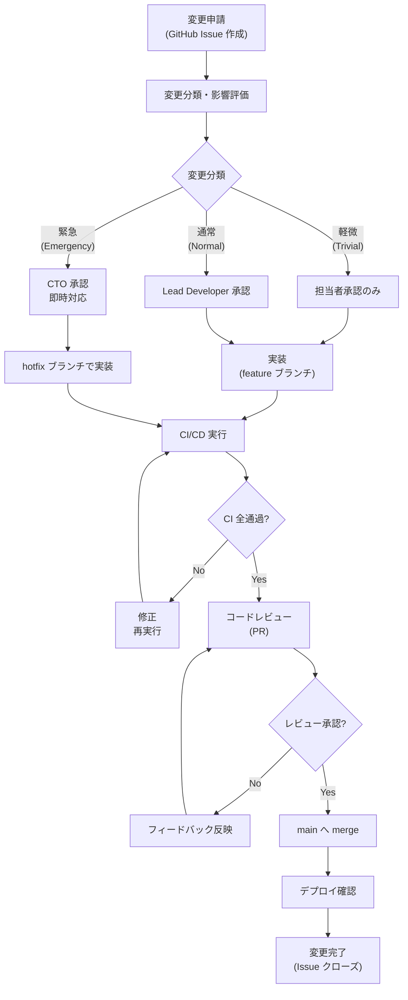
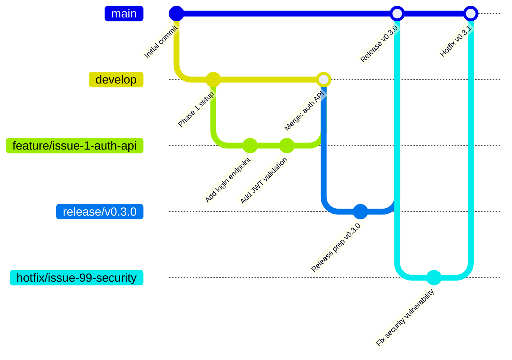
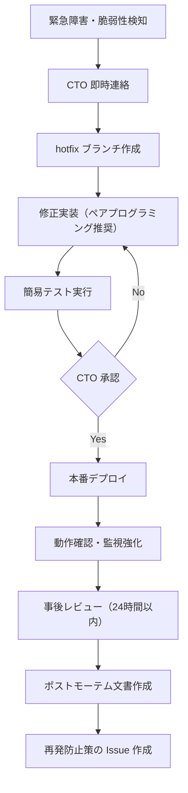

# 変更管理（Change Management）

| 項目 | 内容 |
|------|------|
| 文書番号 | PM-CHG-001 |
| バージョン | 1.0.0 |
| 作成日 | 2026-03-25 |
| 最終更新日 | 2026-03-25 |
| 作成者 | Architect / DevOps |
| ステータス | 承認済み |

---

## 1. 変更管理の目的

変更管理は、システムの安定性・セキュリティ・コンプライアンスを維持しながら、計画的かつ安全に変更を実施するための仕組みである。本プロジェクトでは GitHub Issues / PR をベースとした変更管理プロセスを採用し、ClaudeOS v4 自律エージェントとの統合により変更の追跡・承認・実施を自動化する。

---

## 2. 変更管理プロセス



---

## 3. 変更分類

### 3.1 変更分類定義

| 分類 | 説明 | 例 | 承認者 | 対応時間 |
|------|------|-----|--------|----------|
| 緊急 (Emergency) | セキュリティ脆弱性・サービス停止を伴う重大障害の修正 | 認証バイパス脆弱性修正 / 本番障害修正 | CTO | 4時間以内 |
| 通常 (Normal) | 新機能追加・既存機能改修・パフォーマンス改善 | 新 API エンドポイント追加 / UI 改善 | Lead Developer | 次スプリント |
| 軽微 (Trivial) | ドキュメント更新・設定微調整・コメント修正 | README 更新 / ログレベル変更 | 担当者 | 随時 |

### 3.2 変更分類フロー

変更申請時に以下の質問に答え、分類を決定する。

| 質問 | Yes の場合 | No の場合 |
|------|-----------|---------|
| セキュリティ脆弱性を修正するか？ | 緊急 | 次へ |
| 本番障害に関連するか？ | 緊急 | 次へ |
| コードに変更があるか？ | 通常 | 軽微 |
| 影響範囲が複数コンポーネントに及ぶか？ | 通常（要詳細評価） | 通常 |

---

## 4. GitHub Issues / PR による変更管理

### 4.1 Issue テンプレート

変更申請は以下のテンプレートを使用して GitHub Issue を作成する。

```markdown
## 変更概要
<!-- 変更内容を簡潔に説明 -->

## 変更分類
- [ ] 緊急 (Emergency)
- [ ] 通常 (Normal)
- [ ] 軽微 (Trivial)

## 変更理由
<!-- なぜこの変更が必要か -->

## 影響範囲
<!-- 影響を受けるコンポーネント・ユーザー -->

## テスト計画
<!-- どのようにテストするか -->

## ロールバック計画
<!-- 問題発生時のロールバック手順 -->
```

### 4.2 PR（Pull Request）ルール

| ルール | 内容 |
|--------|------|
| ブランチ名 | `feature/issue-番号-説明` / `hotfix/issue-番号-説明` / `release/v*` |
| PR タイトル | `[Phase N] 変更内容の簡潔な説明` |
| レビュワー | 最低 1名（緊急時は CTO が直接レビュー） |
| CI 必須 | 全 CI チェック通過なしで merge 不可 |
| Squash merge | feature ブランチは Squash merge を推奨 |
| Rebase | release ブランチは Rebase merge |

### 4.3 GitHub Projects との連携

| Projects ステータス | 説明 |
|--------------------|------|
| Inbox | 新規 Issue 作成時 |
| Backlog | 評価・優先度付け中 |
| Ready | 実装準備完了 |
| Development | 実装中 |
| Verify | レビュー・CI 確認中 |
| Deploy Gate | STABLE 判定・デプロイ承認待ち |
| Done | デプロイ完了・Issue クローズ |
| Blocked | ブロッカー発生（依存関係・外部要因） |

---

## 5. CLAUDE.md による変更ポリシー

ClaudeOS v4 自律エージェントが遵守する変更ポリシーを `CLAUDE.md` で管理する。

### 主要ポリシー

```markdown
## 変更ポリシー（ClaudeOS v4）

### 禁止事項
- main ブランチへの直接 push
- CI 未確認の merge
- セキュリティスキャン未通過のデプロイ
- テストなしの新機能実装
- --no-verify による pre-commit hook スキップ

### 必須事項
- 全変更に対する PR 作成
- GitHub Projects ステータス更新
- コミットメッセージに Issue 番号を含める
- STABLE N=3 達成後のみ Deploy Gate 通過
```

---

## 6. ブランチ戦略



### ブランチ命名規則

| ブランチ種別 | 命名規則 | 説明 |
|-------------|----------|------|
| feature | `feature/issue-{番号}-{説明}` | 新機能・改善 |
| hotfix | `hotfix/issue-{番号}-{説明}` | 緊急修正 |
| release | `release/v{MAJOR}.{MINOR}.{PATCH}` | リリース準備 |
| develop | `develop` | 開発統合ブランチ |
| main | `main` | 本番ブランチ（保護） |

---

## 7. デプロイ前・後レビューチェックリスト

### デプロイ前チェックリスト

```markdown
## デプロイ前確認（必須）

### コード品質
- [ ] 全 CI チェック green
- [ ] テストカバレッジ ≥ 95%
- [ ] コードレビュー承認済み（最低1名）
- [ ] Lint / 型チェックエラー 0件

### セキュリティ
- [ ] Trivy スキャン通過（重大脆弱性 0件）
- [ ] Bandit スキャン通過
- [ ] safety スキャン通過
- [ ] OWASP ZAP スキャン通過

### 機能確認
- [ ] STABLE N=3 達成
- [ ] E2E テスト全通過
- [ ] ステージング環境での動作確認

### インフラ・運用
- [ ] ロールバック手順の確認
- [ ] 監視アラートの設定確認
- [ ] DB マイグレーション確認（必要な場合）
- [ ] 設定値（環境変数）の確認
```

### デプロイ後チェックリスト

```markdown
## デプロイ後確認（必須）

### 動作確認
- [ ] ヘルスチェックエンドポイント正常応答
- [ ] 主要 API エンドポイントの疎通確認
- [ ] 認証フローの動作確認

### 監視確認
- [ ] エラーレートの上昇なし（5分間監視）
- [ ] レスポンスタイム正常範囲内
- [ ] ログに異常エラーなし

### セキュリティ
- [ ] 監査ログの正常記録確認
- [ ] 不審なアクセスパターンなし

### 完了処理
- [ ] GitHub Projects を "Done" に更新
- [ ] GitHub Releases にリリースノート作成
- [ ] Issue クローズ
```

---

## 8. 緊急変更（Emergency Change）プロセス

緊急変更は通常プロセスを短縮して実施するが、事後の記録と検証を必ず行う。



---

## 9. 変更記録

変更はすべて以下の形式で記録する。

| 変更ID | 日付 | 分類 | 概要 | Issue | PR | 実施者 |
|--------|------|------|------|-------|-----|--------|
| CHG-001 | 2026-03-25 | 軽微 | ドキュメント整備 | #100 | #101 | Architect |

---

## 10. 改訂履歴

| バージョン | 日付 | 変更内容 | 変更者 |
|------------|------|----------|--------|
| 1.0.0 | 2026-03-25 | 初版作成 | Architect |
