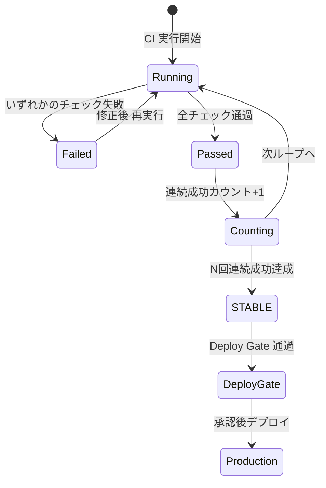

# 品質管理（Quality Management）

| 項目 | 内容 |
|------|------|
| 文書番号 | PM-QA-001 |
| バージョン | 1.0.0 |
| 作成日 | 2026-03-25 |
| 最終更新日 | 2026-03-25 |
| 作成者 | QA Engineer / Architect |
| ステータス | 承認済み |

---

## 1. 品質目標

本プロジェクトにおける品質目標を以下のとおり定義する。

| 品質指標 | 目標値 | 計測方法 | 計測頻度 |
|----------|--------|----------|----------|
| テストカバレッジ（ライン） | ≥ 95% | pytest-cov / Codecov | CI 実行毎 |
| テストカバレッジ（ブランチ） | ≥ 90% | pytest-cov / Codecov | CI 実行毎 |
| バグ密度 | ≤ 0.1件/KLOC | GitHub Issues 管理 | 週次 |
| 重大バグ件数（本番） | 0件 | インシデント管理 | リアルタイム |
| API レスポンスタイム (p95) | ≤ 200ms | APM / k6 | 継続監視 |
| API レスポンスタイム (p99) | ≤ 500ms | APM / k6 | 継続監視 |
| システム可用性 | ≥ 99.9% | Uptime 監視 | 継続監視 |
| CI 成功率 | ≥ 99% | GitHub Actions | 週次集計 |
| セキュリティ脆弱性（重大/高） | 0件 | Trivy / Bandit | CI 実行毎 |
| コード複雑度 (Cyclomatic) | ≤ 10 | radon | CI 実行毎 |
| 技術的負債 | ≤ 5% | SonarQube | 週次 |

---

## 2. CI/CD による品質ゲート

### 2.1 品質ゲート構成

```mermaid
flowchart LR
    Code["コードPush"] --> Gate1

    subgraph Gate1["Gate 1: 静的解析"]
        Lint["flake8 / ESLint\nLint チェック"]
        Type["mypy / TypeScript\n型チェック"]
        Complexity["radon\n複雑度チェック"]
    end

    Gate1 --> Gate2

    subgraph Gate2["Gate 2: テスト"]
        Unit["pytest\n単体テスト"]
        Integration["pytest\n統合テスト"]
        Coverage["pytest-cov\nカバレッジ ≥ 95%"]
    end

    Gate2 --> Gate3

    subgraph Gate3["Gate 3: セキュリティ"]
        Trivy["Trivy\nコンテナスキャン"]
        Bandit["Bandit\nPython コードスキャン"]
        Safety["safety\n依存ライブラリスキャン"]
    end

    Gate3 --> Gate4

    subgraph Gate4["Gate 4: E2E・パフォーマンス"]
        E2E["Playwright\nE2E テスト"]
        Perf["k6\n負荷テスト"]
    end

    Gate4 --> Merge{"全 Gate 通過?"}
    Merge -->|Yes| Deploy["Deploy"]
    Merge -->|No| Fail["失敗通知\n修正要求"]
```



### 2.2 GitHub Actions ワークフロー構成

| ワークフロー | トリガー | チェック内容 |
|-------------|----------|-------------|
| `ci.yml` | Push / PR | Lint / 型チェック / テスト / カバレッジ |
| `security.yml` | Push / 日次 | Trivy / Bandit / safety / OWASP ZAP |
| `e2e.yml` | PR (main向け) / 日次 | Playwright E2E テスト |
| `performance.yml` | リリース前 | k6 負荷テスト |
| `dependency-review.yml` | PR | Dependabot 依存関係レビュー |

### 2.3 品質ゲートの合否基準

| チェック項目 | ツール | 合格基準 | 失敗時の対応 |
|-------------|--------|----------|-------------|
| Lint | flake8 / ESLint | エラー 0件 | 自動修正（black / prettier）後再実行 |
| 型チェック | mypy / tsc | エラー 0件 | 型アノテーション追加 |
| 単体テスト | pytest | 全テスト通過 | 失敗テストの修正 |
| テストカバレッジ | pytest-cov | ≥ 95% | テスト追加 |
| 依存ライブラリ脆弱性 | safety | 重大 0件 | バージョンアップ |
| コンテナ脆弱性 | Trivy | 重大/高 0件 | ベースイメージ更新 |
| コード品質 | Bandit | 高リスク 0件 | コード修正 |
| E2E テスト | Playwright | 全シナリオ通過 | バグ修正 |

---

## 3. コードレビュー基準

### 3.1 レビュー対象

| 対象 | レビュー必須条件 |
|------|----------------|
| 機能実装 PR | 最低 1名の承認必須 |
| セキュリティ関連 PR | Security Engineer の承認必須 |
| DB マイグレーション PR | Architect の承認必須 |
| インフラ変更 PR | DevOps Engineer の承認必須 |
| 緊急 hotfix PR | CTO の承認必須 |

### 3.2 レビューチェックポイント

```markdown
## コードレビューチェックリスト

### 機能・ロジック
- [ ] 要件を正しく満たしているか
- [ ] エッジケースが考慮されているか
- [ ] エラーハンドリングが適切か
- [ ] パフォーマンスに問題はないか（N+1クエリ等）

### コード品質
- [ ] 命名が明確で一貫しているか
- [ ] 関数・クラスが単一責任を守っているか
- [ ] コードが DRY 原則に従っているか
- [ ] コメント・Docstring が適切か

### セキュリティ
- [ ] 入力バリデーションが実装されているか
- [ ] 認証・認可チェックが適切か
- [ ] シークレット情報がコードに含まれていないか
- [ ] SQL インジェクション対策が施されているか

### テスト
- [ ] 新機能に対するテストが追加されているか
- [ ] テストが意味のあるアサーションを含んでいるか
- [ ] カバレッジが要件を満たしているか

### ドキュメント
- [ ] API の変更が仕様書に反映されているか
- [ ] README やドキュメントが更新されているか
```

---

## 4. STABLE 判定フロー



| 段階 | 説明 |
|------|------|
| CI 実行 | Push / PR をトリガーに全チェック実行 |
| 結果判定 | 全チェック通過で「成功」、1つでも失敗で「失敗」 |
| 連続成功カウント | 失敗するとカウントリセット |
| STABLE 認定 | 変更規模に応じた N 回連続成功で STABLE |
| Deploy Gate | CTO / Architect による最終承認 |

---

## 5. 品質メトリクス収集

### 5.1 GitHub Actions との連携

```yaml
# .github/workflows/ci.yml（抜粋）
- name: Run tests with coverage
  run: |
    pytest --cov=app --cov-report=xml --cov-fail-under=95

- name: Upload coverage to Codecov
  uses: codecov/codecov-action@v4
  with:
    file: ./coverage.xml
    fail_ci_if_error: true
    flags: unittests
```

### 5.2 メトリクス収集ダッシュボード

| メトリクス | 収集ツール | ダッシュボード |
|-----------|-----------|--------------|
| テストカバレッジ | Codecov | codecov.io |
| CI 成功率・実行時間 | GitHub Actions | GitHub Insights |
| セキュリティスキャン結果 | Trivy / Bandit | GitHub Security タブ |
| コード品質スコア | SonarQube | SonarCloud |
| API パフォーマンス | k6 / Grafana | Grafana ダッシュボード |
| エラーレート | Sentry / Azure Monitor | Azure Portal |

### 5.3 週次品質レポート

毎週月曜日に以下の週次品質レポートを生成する。

| 報告項目 | 収集元 |
|----------|--------|
| 週間 CI 成功率 | GitHub Actions |
| カバレッジ推移 | Codecov |
| 新規バグ件数 | GitHub Issues |
| 解決バグ件数 | GitHub Issues |
| セキュリティアラート | GitHub Security Advisories |
| PRマージ数 / 平均レビュー時間 | GitHub Insights |

---

## 6. セキュリティ品質

### 6.1 セキュリティツール構成

| ツール | 対象 | 実行タイミング | 合格基準 |
|--------|------|----------------|----------|
| Trivy | Docker イメージ / OS パッケージ | CI 毎回 + 日次 | CRITICAL / HIGH 0件 |
| Bandit | Python ソースコード | CI 毎回 | HIGH リスク 0件 |
| safety | Python 依存ライブラリ | CI 毎回 | 既知脆弱性 0件 |
| OWASP ZAP | Web アプリケーション | リリース前 | HIGH リスク 0件 |
| Semgrep | ソースコード（SAST） | CI 毎回 | CRITICAL 0件 |
| Dependabot | 依存ライブラリ更新 | 週次自動 PR | PR レビュー必須 |

### 6.2 セキュリティ品質メトリクス

| 指標 | 目標 | 現状（2026-03-25） |
|------|------|-------------------|
| 重大脆弱性（CRITICAL） | 0件 | 0件 |
| 高脆弱性（HIGH） | 0件 | 0件 |
| 中脆弱性（MEDIUM） | ≤ 5件 | 確認中 |
| セキュリティホットスポット（Bandit） | 0件 (HIGH) | 0件 |
| 未更新依存ライブラリ | ≤ 10件 | 管理中 |

---

## 7. テスト戦略

### 7.1 テストピラミッド

```
        /\
       /E2E\        E2E テスト (Playwright)
      /------\      ← 全主要ユーザーシナリオ
     /統合テスト\    Integration Tests (pytest)
    /----------\    ← API / DB / 外部サービス統合
   /  単体テスト  \  Unit Tests (pytest)
  /--------------\  ← 関数・クラス・ロジック
```

| テスト種別 | ツール | 対象 | 目標割合 |
|-----------|--------|------|----------|
| 単体テスト | pytest | 関数・クラス | ~60% |
| 統合テスト | pytest | API / DB 統合 | ~30% |
| E2E テスト | Playwright | ユーザーシナリオ | ~10% |

### 7.2 モックポリシー

| 対象 | モック方針 |
|------|-----------|
| 外部 API（Entra ID / AD / HENGEONE） | 常にモック（CI 環境での実行のため） |
| データベース | 統合テストは実 DB（テスト用）/ 単体はモック |
| Redis | 単体テストはモック / 統合テストは実 Redis |
| メール送信 | 常にモック |
| 時刻依存処理 | `freezegun` で固定 |

---

## 8. 改訂履歴

| バージョン | 日付 | 変更内容 | 変更者 |
|------------|------|----------|--------|
| 1.0.0 | 2026-03-25 | 初版作成 | QA Engineer |
