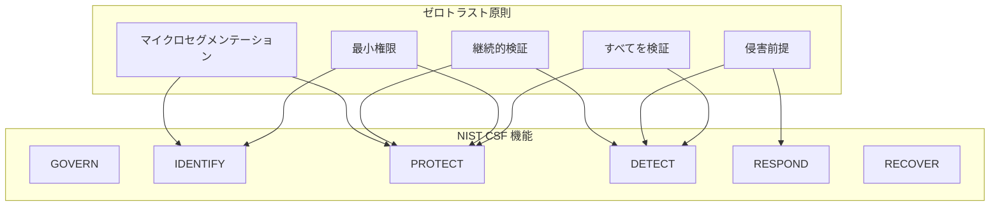

# NIST サイバーセキュリティフレームワーク準拠（NIST CSF Compliance）

| 項目 | 内容 |
|------|------|
| 文書番号 | COMP-NIST-001 |
| バージョン | 1.0.0 |
| 作成日 | 2026-03-25 |
| 最終更新日 | 2026-03-25 |
| 作成者 | Security Engineer |
| 参照規格 | NIST Cybersecurity Framework 2.0 |
| ステータス | 承認済み |

---

## 1. NIST CSF 準拠方針

**NIST Cybersecurity Framework (CSF) 2.0** は、米国国立標準技術研究所（NIST）が策定したサイバーセキュリティリスク管理のフレームワークである。ZeroTrust-ID-Governance システムは、以下の 6 つのコア機能（Function）に対して実装を行う。

| 機能 (Function) | 説明 | 本システムとの関連 |
|----------------|------|------------------|
| **GOVERN (GV)** | ガバナンス・戦略・リスク管理 | プロジェクト管理・リスク管理プロセス |
| **IDENTIFY (ID)** | 資産管理・リスク評価 | ユーザー・権限・資産の識別 |
| **PROTECT (PR)** | セキュリティ制御の実装 | 認証・アクセス制御・暗号化 |
| **DETECT (DE)** | 異常検知・イベント分析 | 監査ログ・監視システム |
| **RESPOND (RS)** | インシデント対応 | セキュリティインシデント対応手順 |
| **RECOVER (RC)** | 復旧・改善 | ロールバック・BCP |

---

## 2. PR.AA（アイデンティティ管理・認証・アクセス制御）対応表

PR.AA は本システムの中核となる管理カテゴリである。

| サブカテゴリ | 説明 | 実装状況 | 実装内容 |
|------------|------|---------|---------|
| PR.AA-01 | 人・デバイス・サービスの認証 | 実装済み | JWT + OAuth2 / MFA / サービスアカウント管理 |
| PR.AA-02 | アイデンティティと資格情報の管理 | 実装済み | bcrypt ハッシュ化 / パスワードポリシー / 有効期限管理 |
| PR.AA-03 | ユーザー・デバイスの認証 | 実装済み | MFA 強制（管理者）/ デバイス登録管理 |
| PR.AA-04 | アイデンティティプロバイダーとの統合 | 部分実装 | Entra ID (OIDC) / AD (LDAP) 統合 / HENGEONE 統合（計画中） |
| PR.AA-05 | アクセス権限の管理 | 実装済み | RBAC エンジン / 最小権限原則 / 権限の申請・承認ワークフロー |
| PR.AA-06 | 物理アクセスの管理 | 適用外 | クラウド環境（Azure の責任範囲） |

---

## 3. 各機能の実装状況

### 3.1 GOVERN（GV）— ガバナンス

| カテゴリ | サブカテゴリ | 実装状況 | 実装内容 |
|---------|------------|---------|---------|
| GV.OC (組織コンテキスト) | GV.OC-01 ミッション・目的の理解 | 実装済み | プロジェクト計画書 / スコープ定義 |
| GV.RM (リスク管理) | GV.RM-01 リスク管理戦略 | 実装済み | リスク管理文書 / リスクアセスメント |
| GV.PO (ポリシー) | GV.PO-01 セキュリティポリシー | 実装済み | CLAUDE.md / セキュリティ設計書 |
| GV.OV (監視) | GV.OV-01 成果の監視 | 部分実装 | GitHub Actions / 週次品質レポート |

### 3.2 IDENTIFY（ID）— 識別

| カテゴリ | サブカテゴリ | 実装状況 | 実装内容 |
|---------|------------|---------|---------|
| ID.AM (資産管理) | ID.AM-01 ソフトウェア資産の識別 | 実装済み | Dependabot / SBOM 管理 |
| ID.AM | ID.AM-02 ネットワーク資産の識別 | 実装済み | Kubernetes NetworkPolicy / インフラ設計書 |
| ID.RA (リスク評価) | ID.RA-01 脆弱性の識別 | 実装済み | Trivy / Bandit / safety / 定期スキャン |
| ID.RA | ID.RA-02 脅威インテリジェンス | 部分実装 | GitHub Security Advisories 監視 |
| ID.IM (改善) | ID.IM-01 改善の実施 | 実装済み | STABLE フロー / ポストモーテム実施 |

### 3.3 PROTECT（PR）— 保護

| カテゴリ | サブカテゴリ | 実装状況 | 実装内容 |
|---------|------------|---------|---------|
| PR.AA (ID・認証・アクセス制御) | PR.AA-01〜05 | 実装済み | 上記 PR.AA 対応表を参照 |
| PR.AT (意識向上・訓練) | PR.AT-01 | 部分実装 | 開発ガイド / セキュアコーディング標準 |
| PR.DS (データセキュリティ) | PR.DS-01 データ保護 | 実装済み | 暗号化転送（TLS 1.3）/ 暗号化保存 |
| PR.DS | PR.DS-02 機密性 | 実装済み | アクセス制御 / 最小権限 / 暗号化 |
| PR.DS | PR.DS-10 データ整合性 | 実装済み | DB トランザクション管理 / 整合性チェック |
| PR.IR (技術的インフラの強靭性) | PR.IR-01 ネットワーク整合性 | 実装済み | Kubernetes NetworkPolicy / WAF |
| PR.PS (プラットフォームセキュリティ) | PR.PS-01 設定管理 | 実装済み | IaC / 設定バージョン管理 |
| PR.PS | PR.PS-02 ソフトウェア管理 | 実装済み | Dependabot / 依存関係管理 |

### 3.4 DETECT（DE）— 検知

| カテゴリ | サブカテゴリ | 実装状況 | 実装内容 |
|---------|------------|---------|---------|
| DE.AE (異常イベント) | DE.AE-02 イベント分析 | 実装済み | 監査ログ / 異常アクセスパターン検知 |
| DE.AE | DE.AE-03 サイバーセキュリティイベント | 実装済み | Azure Monitor / Sentry アラート |
| DE.AE | DE.AE-06 インシデントの宣言 | 部分実装 | インシデント検知アラート / エスカレーション手順 |
| DE.CM (継続的監視) | DE.CM-01 ネットワーク監視 | 実装済み | Azure Monitor / ネットワークフロー監視 |
| DE.CM | DE.CM-03 人員活動の監視 | 実装済み | 監査ログ（全ユーザー操作記録） |
| DE.CM | DE.CM-09 テストの実施 | 実装済み | CI/CD セキュリティスキャン / ペネトレーションテスト |

### 3.5 RESPOND（RS）— 対応

| カテゴリ | サブカテゴリ | 実装状況 | 実装内容 |
|---------|------------|---------|---------|
| RS.MA (インシデント管理) | RS.MA-01 インシデント対応計画 | 部分実装 | インシデント対応手順書（作成中） |
| RS.AN (インシデント分析) | RS.AN-03 分析の実施 | 実装済み | ポストモーテムプロセス / ログ分析 |
| RS.CO (インシデント対応コミュニケーション) | RS.CO-02 報告 | 部分実装 | エスカレーション手順 / 連絡先一覧 |
| RS.MI (インシデント緩和) | RS.MI-01 被害抑止 | 実装済み | アカウントロック / セッション強制終了 / ロールバック |

### 3.6 RECOVER（RC）— 復旧

| カテゴリ | サブカテゴリ | 実装状況 | 実装内容 |
|---------|------------|---------|---------|
| RC.RP (復旧計画) | RC.RP-01 復旧計画実行 | 実装済み | ロールバック手順書 / Blue-Green 切戻し |
| RC.RP | RC.RP-03 バックアップからの復旧 | 実装済み | PostgreSQL バックアップ / PITR |
| RC.CO (復旧コミュニケーション) | RC.CO-03 ステークホルダーへの連絡 | 部分実装 | 復旧報告テンプレート（作成中） |
| RC.IM (復旧の改善) | RC.IM-01 ポストモーテム | 実装済み | ポストモーテム文書化プロセス |

---

## 4. ゼロトラストとの対応関係

ゼロトラストセキュリティモデルの原則と NIST CSF の対応を示す。

| ゼロトラスト原則 | NIST CSF カテゴリ | 本システムの実装 |
|----------------|-----------------|----------------|
| すべてを検証（Verify Explicitly） | PR.AA / DE.AE | JWT 検証・MFA・リクエスト毎の権限チェック |
| 最小権限（Least Privilege） | PR.AA-05 / ID.AM | RBAC 細分化・権限の限定付与 |
| 侵害前提（Assume Breach） | DE.CM / RS.MA | 監査ログ全記録・異常検知・インシデント対応 |
| 継続的検証（Continuous Verification） | DE.CM / PR.AA | トークン有効期限・セッション継続検証 |
| マイクロセグメンテーション | PR.IR / ID.AM | Kubernetes NetworkPolicy / RBAC リソース制限 |

---

## 5. 準拠状況サマリー

| 機能 | 実装済み | 部分実装 | 未実装 | 適用外 |
|------|---------|---------|--------|--------|
| GOVERN | 3 | 1 | 0 | 0 |
| IDENTIFY | 4 | 1 | 0 | 0 |
| PROTECT | 10 | 2 | 0 | 1 |
| DETECT | 5 | 1 | 0 | 0 |
| RESPOND | 2 | 2 | 0 | 0 |
| RECOVER | 3 | 1 | 0 | 0 |
| **合計** | **27** | **8** | **0** | **1** |
| **割合** | **75%** | **22%** | **0%** | **3%** |

---

## 6. 今後の対応計画

| サブカテゴリ | 残課題 | 対応フェーズ |
|------------|--------|------------|
| GV.OV-01 | ダッシュボードによる KPI 自動計測 | Phase 19 |
| PR.AA-04 | HENGEONE 完全統合 | Phase 18 |
| RS.MA-01 | インシデント対応計画書の完成 | Phase 16 |
| RS.CO-02 | ステークホルダー連絡テンプレート整備 | Phase 16 |
| RC.CO-03 | 復旧報告テンプレート整備 | Phase 16 |

---

## 7. 改訂履歴

| バージョン | 日付 | 変更内容 | 変更者 |
|------------|------|----------|--------|
| 1.0.0 | 2026-03-25 | 初版作成 | Security Engineer |
