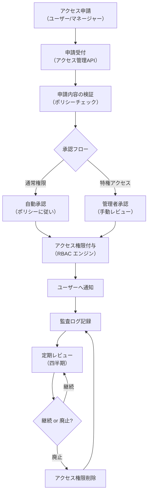
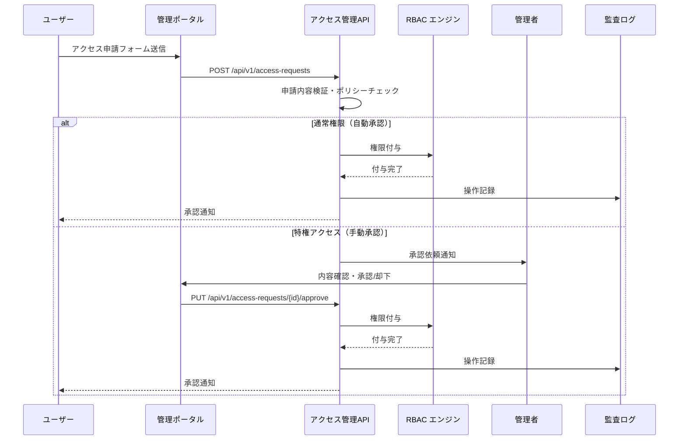
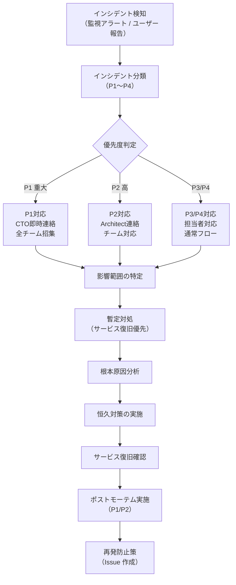

# ISO/IEC 20000 準拠（ISO20000 Compliance）

| 項目 | 内容 |
|------|------|
| 文書番号 | COMP-ISO20-001 |
| バージョン | 1.0.0 |
| 作成日 | 2026-03-25 |
| 最終更新日 | 2026-03-25 |
| 作成者 | Security Engineer / DevOps Engineer |
| 参照規格 | ISO/IEC 20000-1:2018 |
| ステータス | 承認済み |

---

## 1. ISO/IEC 20000 準拠方針

**ISO/IEC 20000-1:2018** は、IT サービスマネジメント（ITSM）の国際規格であり、IT サービスを計画・設計・実施・継続的改善するための要件を定める。ZeroTrust-ID-Governance システムは、アイデンティティガバナンスサービスとして以下のサービスマネジメントプロセスを整備する。

### 適用範囲

| 項目 | 内容 |
|------|------|
| サービス名 | ZeroTrust-ID-Governance アイデンティティ管理サービス |
| サービス対象 | 社内ユーザー / 管理者 / セキュリティ担当者 |
| サービス範囲 | ユーザー認証・認可・監査ログ・アクセス管理 |
| SLA 目標 | 可用性 99.9% / 認証レスポンス ≤ 200ms |

---

## 2. ISO/IEC 20000 主要条項と対応状況

| 条項番号 | 条項名 | 実装状況 | 実装内容 |
|----------|--------|---------|---------|
| 4 | 組織の状況 | 実装済み | プロジェクト計画書 / ステークホルダー分析 |
| 5 | リーダーシップ | 実装済み | CTO による方針決定 / 品質目標設定 |
| 6 | 計画 | 実装済み | フェーズ計画 / リスク管理 / 変更管理 |
| 7 | 支援 | 実装済み | GitHub Actions / 開発ツール / ドキュメント管理 |
| 8 | 運用 | 部分実装 | CI/CD / モニタリング / バックアップ（本番運用準備中） |
| 9 | パフォーマンス評価 | 実装済み | メトリクス収集 / 品質レポート / 内部監査 |
| 10 | 改善 | 実装済み | ポストモーテム / STABLE フロー / 継続的改善 |

---

## 3. アクセス管理プロセスとの対応

ISO/IEC 20000 のアクセス管理プロセスと本システムの対応を示す。

### 3.1 アクセス管理プロセス全体図

### 3.2 アクセス管理プロセス詳細

| プロセス | 担当 | ツール / API | SLA |
|---------|------|------------|-----|
| アクセス申請受付 | アクセス管理 API | `POST /api/v1/access-requests` | 即時受付 |
| 申請審査・承認 | 管理者 / 自動ポリシー | 管理画面 / RBAC エンジン | 通常権限: 4h以内 / 特権: 24h以内 |
| アクセス権限付与 | RBAC エンジン | `POST /api/v1/users/{id}/roles` | 即時付与 |
| 定期レビュー | Security Engineer | 管理画面 | 四半期 |
| アクセス権限削除 | 管理者 / 自動 | `DELETE /api/v1/users/{id}/roles` | 即時削除 |

---

## 4. サービス要求管理（アクセス申請ワークフロー）

### 4.1 サービス要求の分類

| 要求種別 | 説明 | 対応時間目標 | 例 |
|----------|------|------------|-----|
| SR1 通常アクセス申請 | 標準権限の申請 | 4時間以内 | 新入社員のシステムアクセス権付与 |
| SR2 特権アクセス申請 | 管理者権限・特権の申請 | 24時間以内 | 管理者ロール付与 |
| SR3 緊急アクセス申請 | 業務継続のための緊急権限付与 | 1時間以内 | インシデント対応のための緊急アクセス |
| SR4 アクセス変更申請 | 既存権限の変更・昇格 | 8時間以内 | 異動に伴う権限変更 |
| SR5 アクセス削除申請 | 権限の剥奪・無効化 | 即時〜4時間以内 | 退職・異動に伴うアクセス削除 |

### 4.2 サービス要求フロー

---

## 5. インシデント管理（障害対応手順との対応）

### 5.1 インシデント分類と対応時間

| 優先度 | 定義 | 例 | 対応開始時間 | 解決目標時間 |
|--------|------|-----|------------|------------|
| P1 重大 | サービス全停止 / セキュリティ侵害 | 認証サービス停止 / データ漏洩 | 15分以内 | 4時間以内 |
| P2 高 | 主要機能の重大障害 | 特定権限グループの認証不可 | 30分以内 | 8時間以内 |
| P3 中 | 一部機能の障害 / パフォーマンス低下 | 管理画面の表示遅延 | 2時間以内 | 24時間以内 |
| P4 低 | 軽微な問題 / ドキュメント誤り | ログの文言誤り | 翌営業日 | 72時間以内 |

### 5.2 インシデント対応フロー

### 5.3 インシデント記録項目

| 記録項目 | 内容 |
|----------|------|
| インシデント ID | INC-YYYY-MM-DD-NNN |
| 検知時刻 | 発生・検知のタイムスタンプ |
| 優先度 | P1〜P4 |
| 影響範囲 | 影響を受けたユーザー数・機能 |
| 根本原因 | 障害の根本原因 |
| 対応内容 | 実施した暫定・恒久対処 |
| 復旧時刻 | サービス復旧のタイムスタンプ |
| 対応者 | 対応したエンジニア |
| 再発防止策 | 策定した再発防止措置 |

---

## 6. 変更管理との対応

ISO/IEC 20000 の変更管理プロセスと本プロジェクトの変更管理（PM-CHG-001）の対応を示す。

| ISO 20000 変更管理要件 | 本プロジェクトでの実装 |
|----------------------|---------------------|
| 変更要求の記録 | GitHub Issues による変更申請 |
| 変更の分類・優先度付け | 変更分類（緊急/通常/軽微）の適用 |
| 変更の影響評価 | PR レビュー / セキュリティ評価 |
| 変更の承認 | GitHub PR 承認フロー |
| 変更の実施・テスト | CI/CD パイプライン / STABLE 判定 |
| 変更の記録・完了 | GitHub Issue クローズ / リリースノート |
| 緊急変更プロセス | hotfix ブランチ / CTO 即時承認フロー |

---

## 7. 構成管理

### 7.1 構成アイテム（CI）管理

| 構成アイテム | 管理方法 | 変更管理 |
|------------|---------|---------|
| アプリケーションソースコード | GitHub バージョン管理 | PR 必須 |
| Docker イメージ | GitHub Container Registry | Trivy スキャン後 push |
| Kubernetes マニフェスト | GitHub バージョン管理 | PR + Architect 承認 |
| DB スキーマ（Alembic） | GitHub バージョン管理 | PR + テスト必須 |
| 環境変数・設定 | Azure Key Vault / GitHub Secrets | 変更申請必須 |
| 依存ライブラリ | pyproject.toml / package.json | Dependabot 管理 |

---

## 8. サービスレベル管理

### 8.1 SLA 定義

| SLA 項目 | 目標値 | 計測方法 | 違反時対応 |
|----------|--------|---------|---------|
| サービス可用性 | ≥ 99.9% (月間) | Azure Monitor Uptime | P1 インシデント起票・CTO 報告 |
| 認証レスポンスタイム (p95) | ≤ 200ms | APM | パフォーマンスチューニング実施 |
| 認証レスポンスタイム (p99) | ≤ 500ms | APM | チューニング + P3 インシデント |
| アクセス申請処理時間（通常） | ≤ 4時間 | 申請ログ | プロセス見直し |
| アクセス申請処理時間（特権） | ≤ 24時間 | 申請ログ | 承認フロー改善 |
| インシデント初動対応（P1） | ≤ 15分 | インシデント記録 | エスカレーション手順見直し |

---

## 9. 継続的改善

| 改善プロセス | 実施頻度 | 担当者 |
|------------|---------|--------|
| STABLE フロー（自動改善ループ） | CI 実行毎 | ClaudeOS v4 Agent |
| 週次品質レポートレビュー | 週次 | QA Engineer |
| ポストモーテム実施（P1/P2） | インシデント毎 | 全チーム |
| サービスレビュー | 月次 | CTO + チーム |
| 年次 ISMS レビュー | 年次 | CTO + 外部監査員 |

---

## 10. 改訂履歴

| バージョン | 日付 | 変更内容 | 変更者 |
|------------|------|----------|--------|
| 1.0.0 | 2026-03-25 | 初版作成 | Security Engineer |
