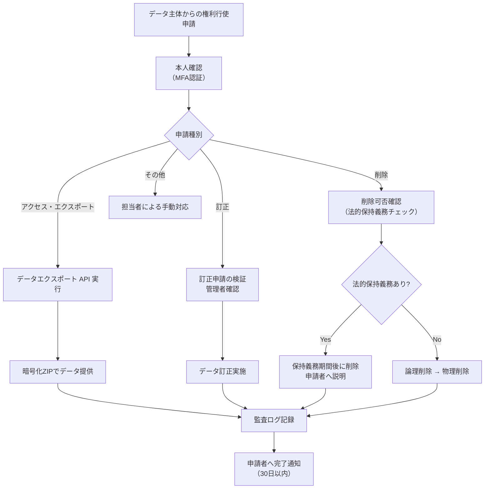
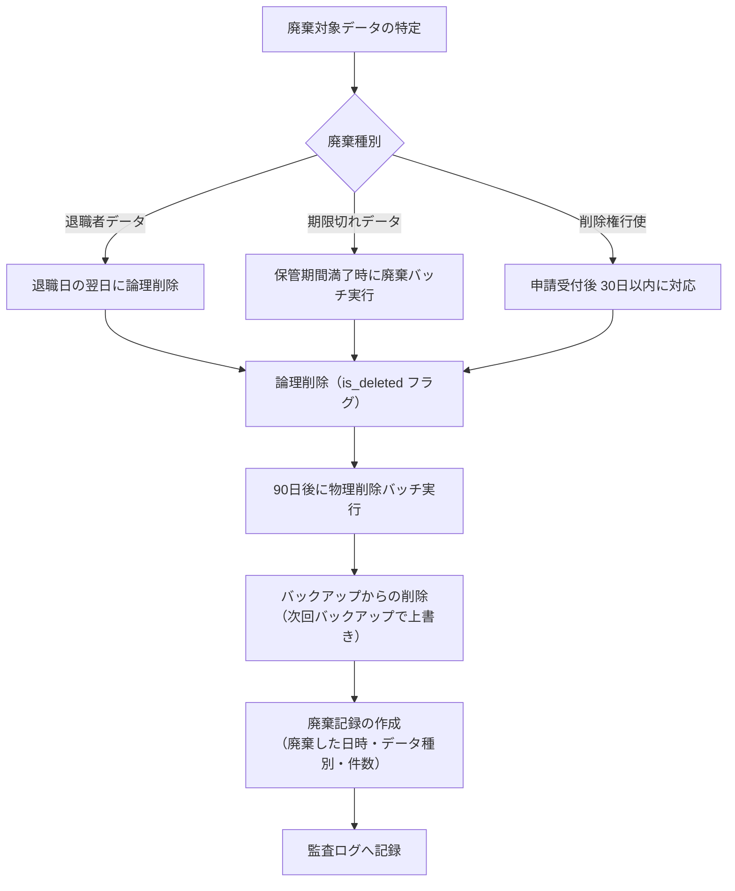

# 個人情報保護（Personal Data Protection）

| 項目 | 内容 |
|------|------|
| 文書番号 | COMP-PDP-001 |
| バージョン | 1.0.0 |
| 作成日 | 2026-03-25 |
| 最終更新日 | 2026-03-25 |
| 作成者 | Security Engineer / Legal |
| 参照規格 | 個人情報の保護に関する法律（日本）/ GDPR（EU）/ CCPA（カリフォルニア） |
| ステータス | 承認済み |

---

## 1. 個人情報保護方針

ZeroTrust-ID-Governance システムは、組織の従業員・関係者のアイデンティティ情報を取り扱う。本文書は、個人情報の適切な保護を確保するための方針・手順を定める。

### 準拠法令

| 法令 / 規制 | 適用範囲 | 対応優先度 |
|-----------|---------|---------|
| 個人情報の保護に関する法律（日本） | 国内業務全般 | 最高 |
| EU一般データ保護規則（GDPR） | EU 居住者のデータ処理 | 高 |
| カリフォルニア州消費者プライバシー法（CCPA） | カリフォルニア州居住者 | 中 |
| 不正競争防止法（営業秘密） | 企業秘密の保護 | 高 |

---

## 2. 取り扱う個人情報一覧

### 2.1 個人情報データカタログ

| データ項目 | 分類 | 取得目的 | 保管場所 | 保管期間 | 暗号化 | 要配慮情報 |
|-----------|------|----------|---------|---------|--------|---------|
| 氏名（漢字・カナ） | 基本情報 | 本人確認・ID管理 | PostgreSQL (users) | 在職期間 + 7年 | あり（TLS/保存暗号化） | なし |
| メールアドレス | 連絡先情報 | 認証・通知 | PostgreSQL (users) | 在職期間 + 7年 | あり | なし |
| 社員番号 | 識別情報 | ユーザー識別 | PostgreSQL (users) | 在職期間 + 7年 | あり | なし |
| 入社日 | 雇用情報 | アクセス権限管理 | PostgreSQL (users) | 在職期間 + 7年 | あり | なし |
| 所属部署・役職 | 組織情報 | RBAC・権限付与 | PostgreSQL (users) | 在職期間 + 7年 | あり | なし |
| パスワードハッシュ | 認証情報 | 認証 | PostgreSQL (users) | 退職後即時削除 | bcrypt ハッシュ | なし |
| MFA 設定情報 | 認証情報 | 多要素認証 | PostgreSQL (mfa_settings) | 無効化後即時削除 | あり | なし |
| アクセスログ | 操作履歴 | 監査・セキュリティ | PostgreSQL (audit_logs) | 7年 | あり | なし |
| IPアドレス | アクセス情報 | セキュリティ監視 | PostgreSQL (audit_logs) | 7年 | あり | なし |
| ユーザーエージェント | アクセス情報 | セキュリティ監視 | PostgreSQL (audit_logs) | 7年 | あり | なし |
| JWT トークン | 認証トークン | セッション管理 | Redis (一時保存) | トークン有効期限のみ | あり | なし |

### 2.2 特定個人情報（マイナンバー）

本システムでは **特定個人情報（マイナンバー）は取り扱わない**。

---

## 3. データ主体の権利

GDPR および個人情報保護法に基づく、データ主体（ユーザー）の権利と対応 API を示す。

### 3.1 権利一覧

| 権利 | 説明 | 対応 API | SLA |
|------|------|---------|-----|
| アクセス権（閲覧権） | 自身の個人情報の開示請求 | `GET /api/v1/users/me/data-export` | 30日以内 |
| 訂正権 | 不正確なデータの訂正請求 | `PUT /api/v1/users/me` | 30日以内 |
| 削除権（忘れられる権利） | データ削除の請求 | `DELETE /api/v1/users/me` | 30日以内 |
| 処理制限権 | データ処理の制限請求 | 管理者による手動対応 | 30日以内 |
| データポータビリティ権 | 機械可読形式でのデータ提供 | `GET /api/v1/users/me/data-export?format=json` | 30日以内 |
| 異議申立権 | データ処理への異議申立 | 管理者による手動対応 | 30日以内 |

### 3.2 データ主体の権利行使フロー



---

## 4. 個人情報の保管・廃棄ポリシー

### 4.1 保管ポリシー

| データ種別 | 保管場所 | 保管期間 | 根拠 |
|-----------|---------|---------|------|
| ユーザー基本情報 | PostgreSQL | 在職期間 + 7年 | 雇用関連記録保持要件 |
| 認証情報（パスワードハッシュ） | PostgreSQL | 退職後即時論理削除 / 90日後物理削除 | 最小保管原則 |
| MFA 設定 | PostgreSQL | 無効化後即時削除 | 最小保管原則 |
| 監査ログ | PostgreSQL / Azure Log Analytics | 7年 | 法的要件（IT 内部統制） |
| アクセスログ | PostgreSQL | 7年 | セキュリティ要件 |
| セッション情報（JWT） | Redis | トークン有効期限（15分〜24時間） | 最小保管原則 |
| バックアップデータ | Azure Blob Storage | 90日間 (日次) / 1年 (月次) | 事業継続要件 |

### 4.2 廃棄手順



### 4.3 データ廃棄記録

廃棄実施後は以下の記録を 5年間保管する。

| 記録項目 | 内容 |
|----------|------|
| 廃棄日時 | ISO 8601 形式のタイムスタンプ |
| 廃棄対象 | ユーザー ID / データ種別 |
| 廃棄方法 | 論理削除 / 物理削除 |
| 廃棄理由 | 退職 / 期限切れ / 権利行使 |
| 実施者 | システム自動 / 管理者名 |

---

## 5. プライバシーバイデザイン原則の実装

**Privacy by Design（PbD）** の 7原則に対する実装を示す。

| PbD 原則 | 原則の説明 | 実装内容 |
|---------|---------|---------|
| 1. プロアクティブ | 問題発生前に予防 | セキュリティ要件を設計段階から組み込み（Phase 1〜5） |
| 2. デフォルトでプライバシー | 初期設定が最高レベルのプライバシー | 最小権限がデフォルト / データ収集は必要最低限 |
| 3. 設計に組み込む | プライバシーをシステム設計の一部に | 暗号化・アクセス制御を API 設計段階から実装 |
| 4. 完全な機能 | プライバシーと機能のトレードオフなし | セキュリティ強化と利便性の両立（MFA の UX 設計） |
| 5. エンドツーエンドのセキュリティ | データライフサイクル全体の保護 | 取得→保存→処理→廃棄の全段階で暗号化・アクセス制御 |
| 6. 可視性と透明性 | オープンで説明責任 | 監査ログ / データカタログ / プライバシーポリシー公開 |
| 7. ユーザーのプライバシーを尊重 | ユーザー中心の設計 | データ主体の権利行使 API / 同意管理 |

---

## 6. 同意管理

### 6.1 同意の取得タイミング

| 処理目的 | 同意種別 | 取得タイミング |
|---------|---------|-------------|
| システム利用に必要な処理 | 契約の履行 / 正当な利益 | 雇用契約時（同意不要の場合あり） |
| 分析・改善目的のログ収集 | 同意 | 初回ログイン時 |
| マーケティング目的の処理 | 同意（オプトイン） | 機能利用時（本システムでは原則対象外） |
| 第三者提供 | 同意 | 提供前 |

### 6.2 同意の記録

| 項目 | 内容 |
|------|------|
| 同意取得 API | `POST /api/v1/users/me/consents` |
| 同意撤回 API | `DELETE /api/v1/users/me/consents/{consent_id}` |
| 同意状況確認 API | `GET /api/v1/users/me/consents` |
| 同意記録の保管 | PostgreSQL (user_consents テーブル) / 5年間保管 |
| 記録内容 | ユーザー ID / 同意種別 / 同意日時 / 同意バージョン / IPアドレス |

---

## 7. データ処理委託先管理

本システムが個人情報処理を委託する外部サービス。

| 委託先 | 処理内容 | 所在地 | DPA 締結 | SCCs |
|-------|---------|--------|---------|------|
| Microsoft Azure | インフラ・ログ保管 | 米国 / 日本 | 締結済み | あり |
| GitHub (Microsoft) | ソースコード管理 / CI/CD | 米国 | 締結済み | あり |
| Codecov | カバレッジ計測 | 米国 | 確認中 | 確認中 |

**DPA**: Data Processing Agreement（データ処理契約）
**SCCs**: Standard Contractual Clauses（標準契約条項）

---

## 8. 個人情報漏洩時の対応

### 8.1 報告義務

| 法令 | 報告義務 | 報告期限 | 報告先 |
|------|---------|---------|--------|
| 個人情報保護法（日本） | 漏洩等が発生した場合 | 速やかに（一定規模以上は個人情報保護委員会へ） | 個人情報保護委員会 / 本人 |
| GDPR | 高リスクの侵害の場合 | 72時間以内 | 監督機関（DPA） / 本人 |

### 8.2 漏洩対応フロー

```mermaid
flowchart TD
    A["漏洩の疑い検知\n（監視アラート / 通報）"] --> B["初動対応\n（影響範囲の確認）"]
    B --> C{"漏洩確定?"}
    C -->|No| D["誤検知記録\n監視継続"]
    C -->|Yes| E["CTO 即時報告\nインシデント P1 起票"]
    E --> F["漏洩データ・規模の特定"]
    F --> G["影響を受けた個人への通知準備"]
    G --> H{"報告義務あり?"}
    H -->|Yes (GDPR)| I["72時間以内に DPA へ報告"]
    H -->|Yes (個人情報保護法)| J["個人情報保護委員会へ報告"]
    H -->|No| K["内部記録のみ"]
    I --> L["影響を受けた個人へ通知"]
    J --> L
    L --> M["再発防止策の実施"]
    M --> N["ポストモーテム実施"]
```

---

## 9. プライバシー影響評価（PIA）

新機能開発やデータ処理変更の際に、プライバシー影響評価（Privacy Impact Assessment）を実施する。

| PIA 実施トリガー | 例 |
|---------------|-----|
| 新たな個人情報の収集 | 生体認証情報の追加 |
| 個人情報の処理目的変更 | 分析目的での利用開始 |
| 外部連携の追加 | 新たな第三者 IdP との統合 |
| 大規模なシステム変更 | 新データストア導入 |
| 国外へのデータ移転 | 海外リージョンへのレプリケーション |

---

## 10. 改訂履歴

| バージョン | 日付 | 変更内容 | 変更者 |
|------------|------|----------|--------|
| 1.0.0 | 2026-03-25 | 初版作成 | Security Engineer |
