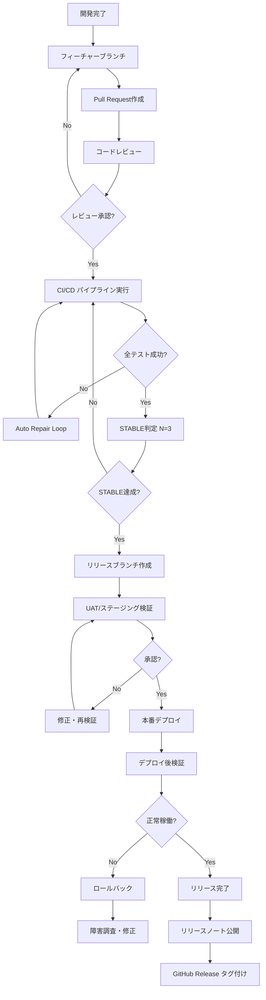
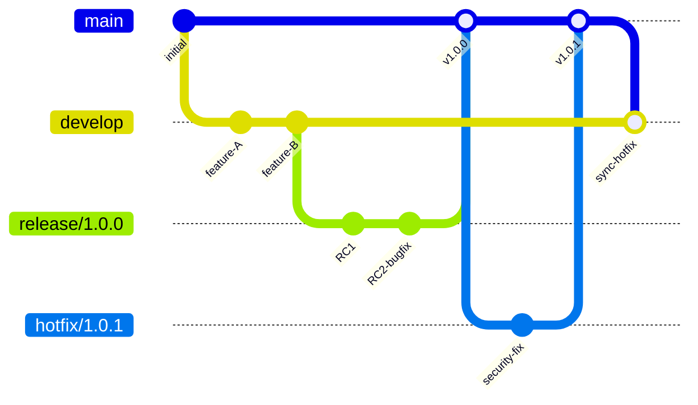
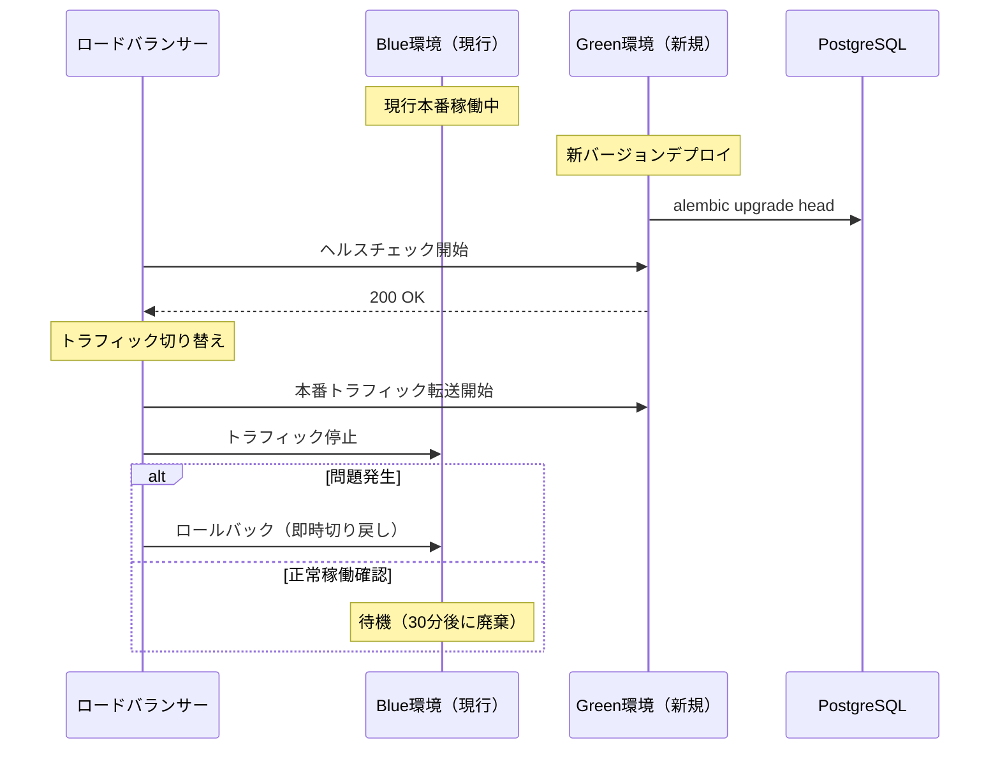
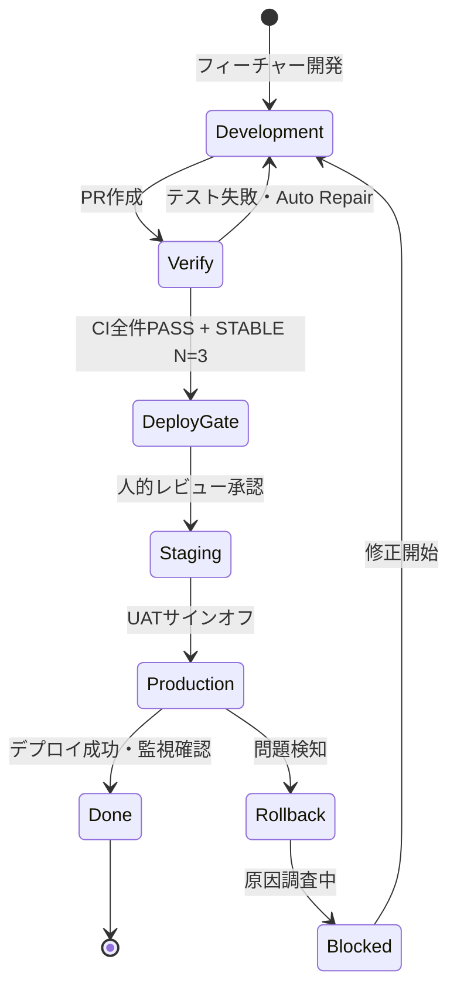

# リリースプロセス（Release Process）

| 項目 | 内容 |
|------|------|
| **文書番号** | REL-PROC-001 |
| **バージョン** | 1.0.0 |
| **作成日** | 2026-03-25 |

---

## 1. リリースプロセス概要



---

## 2. リリース種別

| 種別 | トリガー | 対象ブランチ | 承認者 | SLA |
|------|---------|------------|--------|-----|
| **Hotfix** | 本番障害・セキュリティ脆弱性 | hotfix/* | CTO + Security | 4時間以内 |
| **パッチリリース** | バグ修正・軽微な改善 | release/x.x.* | テックリード | 1営業日 |
| **マイナーリリース** | 機能追加・非破壊的変更 | release/x.*.0 | CTO + PM | 1週間 |
| **メジャーリリース** | 破壊的変更・アーキテクチャ変更 | release/*.0.0 | 取締役会 | 1ヶ月 |

---

## 3. リリースゲート

### 3.1 技術ゲート（自動）

| ゲート | 条件 | ツール |
|--------|------|--------|
| テストカバレッジ | ≥ 90% | pytest-cov |
| 単体テスト | 全件PASS | pytest |
| 統合テスト | 全件PASS | pytest |
| E2Eテスト | 全件PASS | Playwright / Newman |
| Lintチェック | エラー0件 | ruff + ESLint |
| 型チェック | エラー0件 | mypy + tsc |
| セキュリティスキャン | Criticalゼロ | Trivy + safety |
| パフォーマンステスト | p95 < 500ms | Locust |
| ビルド成功 | エラーなし | Docker build |

### 3.2 品質ゲート（人的確認）

| ゲート | 確認者 | チェックポイント |
|--------|--------|----------------|
| コードレビュー | テックリード | 設計・保守性・セキュリティ |
| セキュリティレビュー | セキュリティ担当 | OWASP Top10・脆弱性 |
| UATサインオフ | PM / QA | 機能要件充足確認 |
| インフラ確認 | DevOps | k8s設定・リソース計画 |
| ドキュメント確認 | テックライター | API仕様・手順書更新 |

---

## 4. ブランチ戦略



### 4.1 ブランチ命名規則

| ブランチ | 命名パターン | 例 |
|---------|------------|-----|
| フィーチャー | `feature/{issue-number}-{description}` | `feature/123-add-mfa` |
| バグ修正 | `fix/{issue-number}-{description}` | `fix/456-login-error` |
| リリース | `release/{version}` | `release/1.2.0` |
| ホットフィックス | `hotfix/{version}` | `hotfix/1.1.1` |

---

## 5. デプロイ方式

### 5.1 Blue-Green デプロイ



### 5.2 ロールバック手順

```bash
# 即時ロールバック（30秒以内）
kubectl rollout undo deployment/backend
kubectl rollout undo deployment/frontend

# DBマイグレーションロールバック
alembic downgrade -1

# ロールバック確認
kubectl rollout status deployment/backend
```

---

## 6. リリース前チェックリスト

### 6.1 デプロイ前

- [ ] 全CIジョブ GREEN
- [ ] STABLE N=3 達成
- [ ] セキュリティスキャン クリア
- [ ] ステージング環境での動作確認
- [ ] DBマイグレーション動作確認
- [ ] ロールバック計画策定
- [ ] オンコール担当者確認
- [ ] メンテナンス通知送信（必要な場合）

### 6.2 デプロイ後

- [ ] ヘルスチェックエンドポイント確認
- [ ] 主要機能の動作確認（スモークテスト）
- [ ] エラーレート監視（15分間）
- [ ] ログ確認（例外なし）
- [ ] パフォーマンス指標確認
- [ ] GitHub Release タグ作成
- [ ] リリースノート公開
- [ ] Slackへの完了通知

---

## 7. リリース判定フロー


