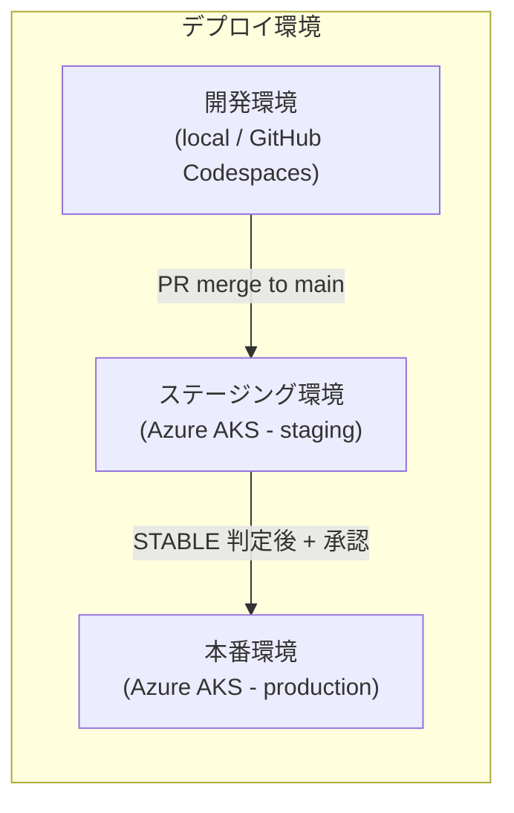
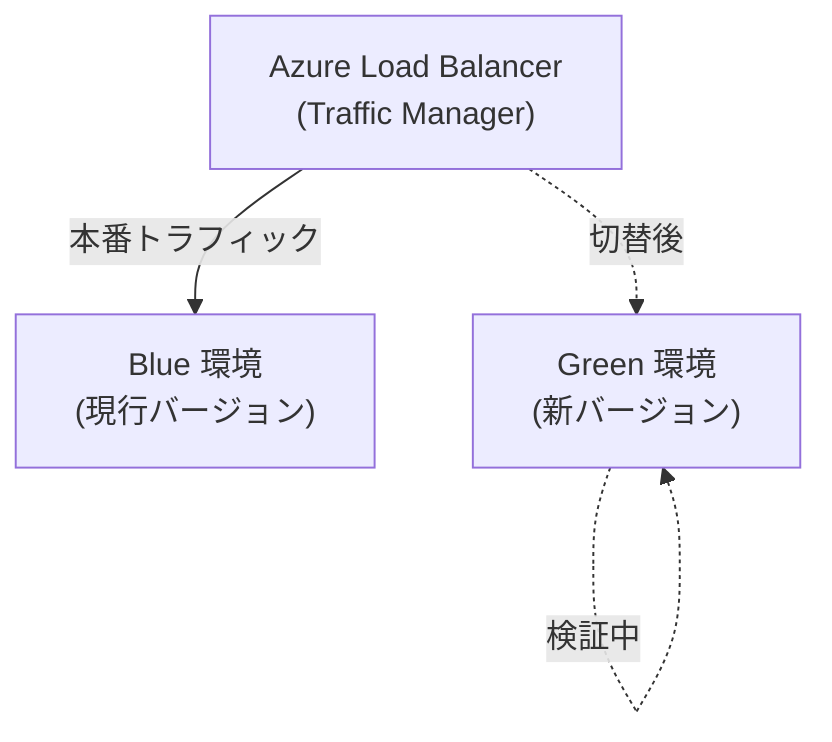
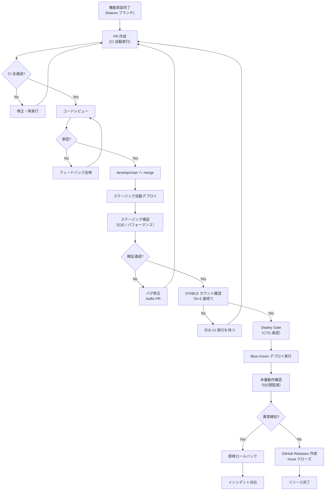

# リリース計画（Release Plan）

| 項目 | 内容 |
|------|------|
| 文書番号 | REL-PLAN-001 |
| バージョン | 1.0.0 |
| 作成日 | 2026-03-25 |
| 最終更新日 | 2026-03-25 |
| 作成者 | DevOps Engineer / Architect |
| ステータス | 承認済み |

---

## 1. リリース戦略

### 1.1 基本方針

ZeroTrust-ID-Governance システムのリリースは、以下の方針に従って実施する。

| 原則 | 内容 |
|------|------|
| 継続的デリバリー | main ブランチへの merge は常にデプロイ可能な状態を維持する |
| 段階的リリース | ステージング → 本番の段階的な検証を経てリリースする |
| Blue-Green デプロイ | ダウンタイムなしのリリースを実現する |
| STABLE 品質ゲート | N=3 連続成功なしに本番リリースは実施しない |
| ロールバック可能性 | すべてのリリースで即時ロールバックできる状態を維持する |

### 1.2 デプロイ方式



#### Blue-Green デプロイ構成



---

## 2. リリース判定基準

リリースを承認するには以下の全条件を満たす必要がある。

| 条件 | 内容 | 確認方法 |
|------|------|---------|
| STABLE N=3 | CI/CD が 3回連続成功 | GitHub Actions ログ |
| テストカバレッジ | ≥ 95% | Codecov レポート |
| Lint / 型チェック | エラー 0件 | CI ログ |
| セキュリティスキャン通過 | Trivy CRITICAL/HIGH 0件 / Bandit HIGH 0件 | GitHub Security タブ |
| E2E テスト全通過 | Playwright 全シナリオ 通過 | CI ログ |
| コードレビュー承認 | 最低 1名の承認 | GitHub PR |
| ステージング検証 | 主要シナリオの動作確認 | テスト記録 |
| パフォーマンステスト | p95 ≤ 200ms | k6 レポート |
| CTO / Architect 承認 | Deploy Gate 通過 | GitHub Projects |

---

## 3. リリースフロー



---

## 4. ステージング検証手順

ステージング環境でのデプロイ後、以下の検証を実施する。

### 4.1 自動検証（CI/CD）

```bash
# ステージングへのデプロイ後、自動実行
# 1. ヘルスチェック
curl -f https://staging.zerotrust-idg.example.com/health

# 2. E2E テスト（Playwright）
npx playwright test --config=playwright.staging.config.ts

# 3. パフォーマンステスト（k6）
k6 run --vus 50 --duration 5m load-test.js \
  --env BASE_URL=https://staging.zerotrust-idg.example.com
```

### 4.2 手動検証チェックリスト

```markdown
## ステージング手動検証チェックリスト

### 認証フロー
- [ ] 正常ログイン（ユーザー名 + パスワード）
- [ ] MFA 認証フロー
- [ ] ログアウト
- [ ] トークンリフレッシュ
- [ ] 不正パスワードによるログイン失敗
- [ ] アカウントロック動作

### ユーザー管理
- [ ] ユーザー作成
- [ ] ユーザー情報更新
- [ ] パスワードリセット
- [ ] ユーザー無効化

### 権限管理
- [ ] ロール付与
- [ ] ロール解除
- [ ] 権限チェック（アクセス制御の動作確認）

### 監査ログ
- [ ] ログイン操作のログ記録確認
- [ ] 管理操作のログ記録確認
- [ ] ログ検索・フィルタ動作確認

### セキュリティ
- [ ] 認証なしアクセスの拒否確認
- [ ] 権限外リソースへのアクセス拒否確認
- [ ] レート制限の動作確認
```

---

## 5. 本番リリース手順（Azure AKS）

### 5.1 事前準備

```bash
# 1. リリース番号の確認
export RELEASE_VERSION="v0.15.0"
export IMAGE_TAG="${RELEASE_VERSION}-$(git rev-parse --short HEAD)"

# 2. Docker イメージのビルド・プッシュ
docker build -t ghcr.io/org/zerotrust-idg-backend:${IMAGE_TAG} ./backend
docker push ghcr.io/org/zerotrust-idg-backend:${IMAGE_TAG}

docker build -t ghcr.io/org/zerotrust-idg-frontend:${IMAGE_TAG} ./frontend
docker push ghcr.io/org/zerotrust-idg-frontend:${IMAGE_TAG}

# 3. セキュリティスキャン
trivy image ghcr.io/org/zerotrust-idg-backend:${IMAGE_TAG}
trivy image ghcr.io/org/zerotrust-idg-frontend:${IMAGE_TAG}
```

### 5.2 Blue-Green デプロイ手順

```bash
# 1. Green 環境（新バージョン）へのデプロイ
kubectl set image deployment/zerotrust-idg-backend-green \
  backend=ghcr.io/org/zerotrust-idg-backend:${IMAGE_TAG} \
  --namespace=production

kubectl set image deployment/zerotrust-idg-frontend-green \
  frontend=ghcr.io/org/zerotrust-idg-frontend:${IMAGE_TAG} \
  --namespace=production

# 2. Green 環境のヘルスチェック待機
kubectl rollout status deployment/zerotrust-idg-backend-green \
  --namespace=production --timeout=5m

# 3. Green 環境の動作確認
kubectl run test-pod --image=curlimages/curl --restart=Never \
  --namespace=production -- \
  curl -f http://zerotrust-idg-backend-green/health

# 4. トラフィック切替（Blue → Green）
kubectl patch service zerotrust-idg-backend \
  --namespace=production \
  -p '{"spec":{"selector":{"slot":"green"}}}'

kubectl patch service zerotrust-idg-frontend \
  --namespace=production \
  -p '{"spec":{"selector":{"slot":"green"}}}'

# 5. 5分間の動作監視
echo "5分間の監視を開始..."
sleep 300
echo "監視完了。エラーレートを確認してください。"
```

### 5.3 DB マイグレーション手順

DB マイグレーションが含まれる場合は、以下の手順で実施する。

```bash
# 1. バックアップ取得（必須）
az postgres flexible-server backup create \
  --resource-group rg-zerotrust-idg \
  --name psql-zerotrust-idg \
  --backup-name "pre-release-${RELEASE_VERSION}-$(date +%Y%m%d)"

# 2. マイグレーション実行（アプリ起動前）
kubectl exec -it deploy/zerotrust-idg-backend-green \
  --namespace=production -- \
  alembic upgrade head

# 3. マイグレーション確認
kubectl exec -it deploy/zerotrust-idg-backend-green \
  --namespace=production -- \
  alembic current
```

---

## 6. リリース前チェックリスト

```markdown
## リリース前確認（Deploy Gate）

### 品質確認
- [ ] STABLE N=3 達成確認（GitHub Actions ログ参照）
- [ ] テストカバレッジ ≥ 95%（Codecov 確認）
- [ ] Lint / 型チェック エラー 0件
- [ ] E2E テスト全通過

### セキュリティ確認
- [ ] Trivy スキャン通過（CRITICAL/HIGH 0件）
- [ ] Bandit スキャン通過（HIGH 0件）
- [ ] safety スキャン通過
- [ ] OWASP ZAP スキャン通過（HIGH 0件）

### インフラ確認
- [ ] ステージング環境での全動作確認完了
- [ ] パフォーマンステスト通過（p95 ≤ 200ms）
- [ ] DB マイグレーション確認（必要な場合）
- [ ] バックアップ取得確認
- [ ] ロールバック手順の確認

### 承認
- [ ] CTO 承認
- [ ] Architect 承認
- [ ] GitHub Projects を "Deploy Gate" に更新
```

## 7. リリース後チェックリスト

```markdown
## リリース後確認

### 動作確認（デプロイ後 5分以内）
- [ ] ヘルスチェックエンドポイント正常応答
- [ ] 主要 API エンドポイントの疎通確認
- [ ] 認証フローの動作確認
- [ ] エラーレート正常（急増なし）
- [ ] レスポンスタイム正常（p95 ≤ 200ms）

### 監視確認（デプロイ後 30分以内）
- [ ] Azure Monitor でエラー急増なし
- [ ] Sentry でエラー急増なし
- [ ] 監査ログの正常記録確認

### 完了処理
- [ ] GitHub Releases にリリースノート作成
- [ ] GitHub Projects を "Done" に更新
- [ ] 関連 Issue のクローズ
- [ ] チームへのリリース完了通知
```

---

## 8. リリーススケジュール（予定）

| バージョン | 対象フェーズ | リリース予定日 | 状態 |
|-----------|-----------|--------------|------|
| v0.1.0 | Phase 1 | 2025-10-07 | リリース済み |
| v0.2.0 | Phase 2 | 2025-10-14 | リリース済み |
| v0.3.0 | Phase 3 | 2025-10-28 | リリース済み |
| v0.4.0 | Phase 4 | 2025-11-04 | リリース済み |
| v0.5.0 | Phase 5 | 2025-11-11 | リリース済み |
| v0.6.0 | Phase 6 | 2025-11-18 | リリース済み |
| v0.7.0 | Phase 7 | 2025-11-25 | リリース済み |
| v0.8.0 | Phase 8 | 2025-12-02 | リリース済み |
| v0.9.0 | Phase 9 | 2025-12-09 | リリース済み |
| v0.10.0 | Phase 10 | 2025-12-23 | リリース済み |
| v0.11.0 | Phase 11 | 2026-01-06 | リリース済み |
| v0.12.0 | Phase 12 | 2026-01-20 | リリース済み |
| v0.13.0 | Phase 13 | 2026-01-27 | リリース済み |
| v0.14.0 | Phase 14 | 2026-02-03 | リリース済み |
| v0.15.0 | Phase 15 | 2026-03-25 | リリース済み |
| v1.0.0 | Phase 20（本番 GA） | 2026-10-01 | 計画中 |

---

## 9. 改訂履歴

| バージョン | 日付 | 変更内容 | 変更者 |
|------------|------|----------|--------|
| 1.0.0 | 2026-03-25 | 初版作成 | DevOps Engineer |
