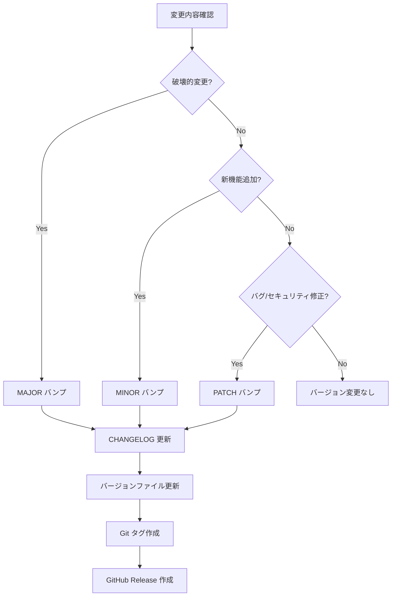
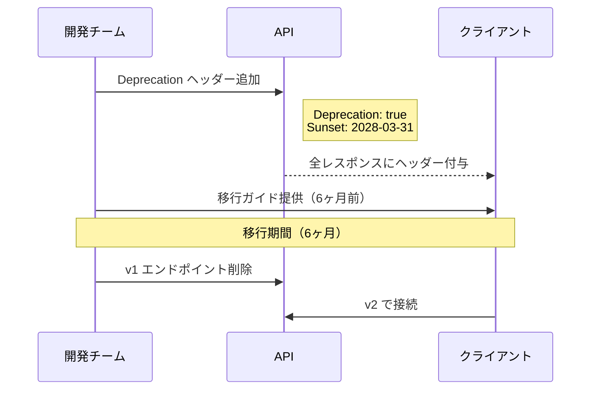

# バージョン管理戦略（Version Management Strategy）

| 項目 | 内容 |
|------|------|
| **文書番号** | REL-VER-001 |
| **バージョン** | 1.0.0 |
| **作成日** | 2026-03-25 |

---

## 1. バージョニング方針

本システムは **Semantic Versioning 2.0.0（SemVer）** を採用します。

### 1.1 バージョン形式

```
MAJOR.MINOR.PATCH[-PRERELEASE][+BUILD]

例：
  1.0.0            # 正式リリース
  1.1.0            # マイナーリリース（機能追加）
  1.1.1            # パッチリリース（バグ修正）
  2.0.0-rc.1       # リリース候補
  1.0.0-alpha.1    # アルファ版
  1.0.0-beta.2     # ベータ版
```

### 1.2 バージョン変更ルール

| バージョン | 変更条件 | 例 |
|----------|---------|-----|
| **MAJOR** | API破壊的変更、アーキテクチャ変更、セキュリティモデル変更 | 1.x.x → 2.0.0 |
| **MINOR** | 後方互換性のある機能追加、新エンドポイント追加 | 1.0.x → 1.1.0 |
| **PATCH** | バグ修正、セキュリティパッチ、パフォーマンス改善 | 1.0.0 → 1.0.1 |

---

## 2. バージョン変更フロー



---

## 3. バージョン管理対象ファイル

### 3.1 バックエンド

```python
# backend/core/config.py
class Settings(BaseSettings):
    APP_VERSION: str = "1.0.0"
    API_VERSION: str = "v1"
```

```toml
# pyproject.toml
[tool.poetry]
version = "1.0.0"
```

### 3.2 フロントエンド

```json
// frontend/package.json
{
  "version": "1.0.0"
}
```

### 3.3 インフラ

```yaml
# k8s/deployment.yaml
spec:
  containers:
  - name: backend
    image: zerotrust-backend:1.0.0
```

---

## 4. Git タグ管理

### 4.1 タグ命名規則

| タグ | 形式 | 例 |
|------|------|-----|
| 正式リリース | `v{MAJOR}.{MINOR}.{PATCH}` | `v1.0.0` |
| リリース候補 | `v{version}-rc.{N}` | `v1.0.0-rc.1` |
| ベータ版 | `v{version}-beta.{N}` | `v1.0.0-beta.2` |
| アルファ版 | `v{version}-alpha.{N}` | `v1.0.0-alpha.1` |

### 4.2 タグ作成手順

```bash
# アノテーションタグ作成（必須：リリースノート記載）
git tag -a v1.0.0 -m "Release v1.0.0 - ZeroTrust ID Governance GA"

# タグのプッシュ
git push origin v1.0.0

# 全タグのプッシュ（CI/CDで使用）
git push origin --tags
```

### 4.3 タグ保護ルール（GitHub Settings）

```yaml
# ブランチ保護ルール（GitHub）
protected_tag_patterns:
  - "v*"                # 全バージョンタグを保護
required_approvals: 1   # 1名以上の承認必須
```

---

## 5. API バージョニング戦略

### 5.1 URL パスバージョニング

```
https://api.zerotrust-id.mirai-kensetsu.co.jp/api/v1/users
https://api.zerotrust-id.mirai-kensetsu.co.jp/api/v2/users  # 将来の破壊的変更時
```

### 5.2 後方互換性の維持期間

| バージョン | サポート期間 | EOS通知 |
|----------|------------|---------|
| v1 (現行) | 2026-04 〜 2028-03 | 6ヶ月前 |
| v2 (予定) | 2028-04 〜 | - |

### 5.3 廃止予定（Deprecation）フロー



---

## 6. コンテナイメージ管理

### 6.1 タグ戦略

```
# Azure Container Registry
zerotrust.azurecr.io/backend:latest       # 最新main
zerotrust.azurecr.io/backend:1.0.0        # バージョンタグ（不変）
zerotrust.azurecr.io/backend:1.0          # マイナーバージョン
zerotrust.azurecr.io/backend:1            # メジャーバージョン
zerotrust.azurecr.io/backend:sha-abc1234  # コミットSHA（トレーサビリティ）
```

### 6.2 イメージ保持ポリシー

| タグ種別 | 保持数 | 保持期間 |
|---------|--------|---------|
| latest | 常に最新1件 | - |
| バージョンタグ | 全件 | 無期限 |
| SHAタグ | - | 90日 |
| PRブランチ | - | 7日 |

---

## 7. リリース履歴

| バージョン | リリース日 | 種別 | 主な変更 |
|----------|----------|------|---------|
| 1.0.0 | 2026-04-01（予定） | 正式リリース | 初回GA: ユーザー管理・RBAC・監査ログ・外部連携 |
| 0.15.0 | 2026-03-25 | 開発版 | Phase 15: E2Eテスト統合・CI完全自動化 |
| 0.14.0 | 2026-03-24 | 開発版 | Phase 14: セキュリティミドルウェア完全実装 |
| 0.10.0 | 2026-03-20 | 開発版 | Phase 10: ワークフロー・Celeryタスク実装 |
| 0.5.0 | 2026-03-15 | 開発版 | Phase 5: JWT認証・RBAC基盤実装 |
| 0.1.0 | 2026-03-10 | 開発版 | Phase 1: プロジェクト初期化 |
