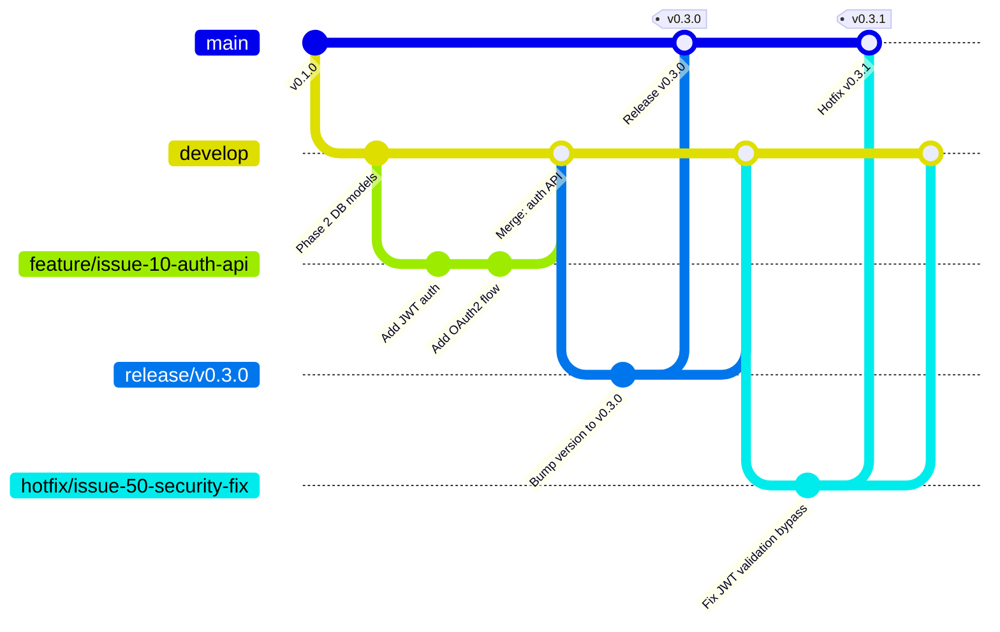

# バージョン管理（Version Management）

| 項目 | 内容 |
|------|------|
| 文書番号 | REL-VER-001 |
| バージョン | 1.0.0 |
| 作成日 | 2026-03-25 |
| 最終更新日 | 2026-03-25 |
| 作成者 | DevOps Engineer |
| ステータス | 承認済み |

---

## 1. セマンティックバージョニング

本プロジェクトは **Semantic Versioning 2.0.0 (SemVer)** に準拠したバージョン管理を採用する。

### 1.1 バージョン番号の構成

```
MAJOR.MINOR.PATCH[-PRERELEASE][+BUILD]

例:
  v1.0.0          — 正式リリース
  v1.2.3          — パッチリリース
  v2.0.0          — メジャーリリース（破壊的変更）
  v0.15.0-beta.1  — ベータ版
  v1.0.0-rc.1     — リリース候補
```

### 1.2 バージョン番号の変更ルール

| 種別 | バージョン変更 | 変更条件 | 例 |
|------|-------------|---------|-----|
| MAJOR | X.0.0 → (X+1).0.0 | 後方互換性のない破壊的変更（API 仕様変更、DB スキーマの非互換変更） | v1.0.0 → v2.0.0 |
| MINOR | X.Y.0 → X.(Y+1).0 | 後方互換性のある新機能追加 | v1.0.0 → v1.1.0 |
| PATCH | X.Y.Z → X.Y.(Z+1) | 後方互換性のあるバグ修正・セキュリティ修正 | v1.0.0 → v1.0.1 |
| PRE-RELEASE | X.Y.Z-alpha/beta/rc | 正式リリース前の検証版 | v1.0.0-rc.1 |

### 1.3 バージョン 0.x.y の扱い

`v0.x.y` は開発初期フェーズを示し、API は安定していないものとみなす。`v1.0.0` より正式な安定版となる。

| 範囲 | 意味 |
|------|------|
| v0.1.0 〜 v0.15.0 | 開発フェーズ（Phase 1〜15） |
| v1.0.0 | 初回正式リリース（Phase 20 予定） |

---

## 2. タグ命名規則

### 2.1 タグフォーマット

```
v{MAJOR}.{MINOR}.{PATCH}

例:
  v0.15.0   — 通常リリース
  v0.15.1   — パッチリリース（ホットフィックス）
  v1.0.0    — メジャーリリース
  v1.0.0-rc.1  — リリース候補
```

### 2.2 タグ作成コマンド

```bash
# 注釈付きタグの作成（推奨）
git tag -a v0.15.0 -m "Phase 15: E2E テスト実装完了"

# タグのプッシュ
git push origin v0.15.0

# 全タグのプッシュ
git push origin --tags
```

### 2.3 GitHub Releases との連携

GitHub のタグプッシュをトリガーに、GitHub Actions が自動的に GitHub Releases を作成する。

```yaml
# .github/workflows/release.yml（抜粋）
on:
  push:
    tags:
      - 'v[0-9]+.[0-9]+.[0-9]+'

jobs:
  release:
    runs-on: ubuntu-latest
    steps:
      - name: Create GitHub Release
        uses: softprops/action-gh-release@v2
        with:
          generate_release_notes: true
          draft: false
          prerelease: ${{ contains(github.ref, '-rc') || contains(github.ref, '-beta') }}
```

---

## 3. 現在のバージョン履歴

| バージョン | リリース日 | Phase | 主な変更 |
|-----------|-----------|-------|---------|
| v0.15.0 | 2026-03-25 | Phase 15 | E2E テスト実装（Playwright） |
| v0.14.0 | 2026-02-03 | Phase 14 | セキュリティミドルウェア強化 |
| v0.13.0 | 2026-01-27 | Phase 13 | テストカバレッジ ≥ 95% 達成 |
| v0.12.0 | 2026-01-20 | Phase 12 | フロントエンド管理画面実装 |
| v0.11.0 | 2026-01-06 | Phase 11 | フロントエンド認証 UI 実装 |
| v0.10.0 | 2025-12-23 | Phase 10 | Next.js フロントエンド基盤 |
| v0.9.0 | 2025-12-09 | Phase 9 | エンジンカバレッジ向上 |
| v0.8.0 | 2025-12-02 | Phase 8 | RBAC 細分化 |
| v0.7.0 | 2025-11-25 | Phase 7 | JWT 失効管理（Redis） |
| v0.6.0 | 2025-11-18 | Phase 6 | 監査ログミドルウェア |
| v0.5.0 | 2025-11-11 | Phase 5 | セキュリティ強化 |
| v0.4.0 | 2025-11-04 | Phase 4 | ユーザー管理 API |
| v0.3.0 | 2025-10-28 | Phase 3 | 認証 API（JWT / OAuth2） |
| v0.2.0 | 2025-10-14 | Phase 2 | DB モデル / Alembic マイグレーション |
| v0.1.0 | 2025-10-07 | Phase 1 | プロジェクト初期設定 |

---

## 4. ブランチ戦略

### 4.1 ブランチ構成



### 4.2 ブランチ詳細

| ブランチ | 命名規則 | 役割 | 保護設定 | マージ先 |
|---------|---------|------|---------|---------|
| `main` | `main` | 本番リリースブランチ | 保護（直接 push 禁止） | - |
| `develop` | `develop` | 開発統合ブランチ | 保護（PR 必須） | `main` (release 経由) |
| `feature/*` | `feature/issue-{N}-{説明}` | 新機能・改善 | なし | `develop` |
| `hotfix/*` | `hotfix/issue-{N}-{説明}` | 緊急修正 | なし | `main` + `develop` |
| `release/*` | `release/v{MAJOR}.{MINOR}.{PATCH}` | リリース準備 | なし | `main` + `develop` |

### 4.3 ブランチ保護設定

```yaml
# main ブランチ保護ルール（GitHub Branch Protection Rules）
main:
  required_status_checks:
    strict: true
    contexts:
      - "CI / lint"
      - "CI / typecheck"
      - "CI / test"
      - "CI / coverage"
      - "Security / trivy"
      - "Security / bandit"
      - "E2E / playwright"
  required_pull_request_reviews:
    required_approving_review_count: 1
    dismiss_stale_reviews: true
  restrictions:
    users: []  # 直接 push 禁止
  allow_force_pushes: false
  allow_deletions: false
```

---

## 5. GitHub Releases 管理

### 5.1 リリースノート形式

```markdown
## v0.15.0 — Phase 15: E2E テスト実装 (2026-03-25)

### 追加 (Added)
- Playwright を使用した E2E テストスイートの実装
- 全主要ユーザーシナリオのカバー（ログイン / ユーザー管理 / ロール管理 / 監査ログ）
- 認証フロー異常系の E2E テスト

### 変更 (Changed)
- CI ワークフローに E2E テストジョブを追加
- GitHub Actions のテスト並列実行設定を最適化

### 修正 (Fixed)
- [#XXX] フロントエンドのトークンリフレッシュ処理のバグ修正

### セキュリティ (Security)
- Playwright テストによる XSS / CSRF 防御の自動検証を追加

**フルチェンジログ**: v0.14.0...v0.15.0
```

### 5.2 リリースアセット

GitHub Releases に添付するアセット。

| アセット | 内容 | 生成方法 |
|---------|------|---------|
| `CHANGELOG.md` | 変更履歴 | 手動 / 自動生成 |
| `coverage-report.html` | テストカバレッジレポート | pytest-cov |
| `security-scan-report.json` | Trivy セキュリティスキャン結果 | Trivy |
| `sbom.json` | ソフトウェア部品表 (SBOM) | Trivy sbom / Syft |

---

## 6. Docker イメージタグ管理

### 6.1 イメージタグ命名規則

```
ghcr.io/{org}/{service}:{tag}

例:
  ghcr.io/org/zerotrust-idg-backend:v0.15.0           — リリースタグ
  ghcr.io/org/zerotrust-idg-backend:v0.15.0-abc1234   — リリース + コミットハッシュ
  ghcr.io/org/zerotrust-idg-backend:latest             — 最新本番版
  ghcr.io/org/zerotrust-idg-backend:staging            — ステージング版
  ghcr.io/org/zerotrust-idg-backend:main-abc1234       — main ブランチの最新
```

### 6.2 イメージタグポリシー

| タグ | 更新タイミング | 用途 |
|------|-------------|------|
| `v{MAJOR}.{MINOR}.{PATCH}` | リリース時（不変） | 本番 / ロールバック用 |
| `latest` | 本番リリース時 | 本番環境参照 |
| `staging` | ステージングデプロイ時 | ステージング環境参照 |
| `main-{sha}` | main merge 時 | 開発追跡 |

### 6.3 イメージの保持ポリシー

| タグ種別 | 保持期間 |
|---------|---------|
| リリースタグ (v*) | 永続 |
| `latest` / `staging` | 上書き（1世代のみ） |
| `main-{sha}` | 30日間 |
| PR テストイメージ | 7日間 |

---

## 7. 依存ライブラリバージョン管理

### 7.1 バックエンド（Python）

```toml
# pyproject.toml — バージョン固定方針
[tool.poetry.dependencies]
python = "^3.11"
fastapi = "^0.115.0"        # マイナーバージョン範囲で固定
sqlalchemy = "^2.0.0"
alembic = "^1.13.0"
pydantic = "^2.8.0"
```

### 7.2 フロントエンド（Node.js）

```json
// package.json — バージョン固定方針
{
  "dependencies": {
    "next": "14.2.x",
    "react": "^18.3.0",
    "typescript": "^5.5.0"
  }
}
```

### 7.3 Dependabot 設定

```yaml
# .github/dependabot.yml
version: 2
updates:
  - package-ecosystem: "pip"
    directory: "/backend"
    schedule:
      interval: "weekly"
    open-pull-requests-limit: 10
    labels:
      - "dependencies"
      - "python"

  - package-ecosystem: "npm"
    directory: "/frontend"
    schedule:
      interval: "weekly"
    open-pull-requests-limit: 10
    labels:
      - "dependencies"
      - "javascript"

  - package-ecosystem: "docker"
    directory: "/"
    schedule:
      interval: "weekly"
```

---

## 8. 改訂履歴

| バージョン | 日付 | 変更内容 | 変更者 |
|------------|------|----------|--------|
| 1.0.0 | 2026-03-25 | 初版作成 | DevOps Engineer |
