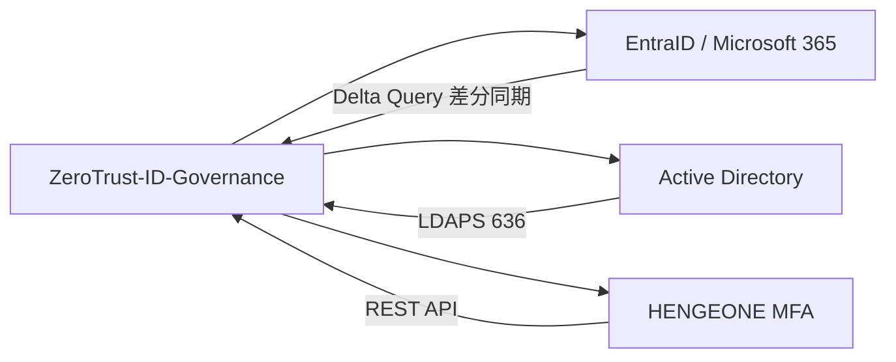

# リリースノート（Release Notes）

| 項目 | 内容 |
|------|------|
| **文書番号** | REL-NOTE-001 |
| **バージョン** | 1.0.0 |
| **作成日** | 2026-03-25 |
| **対象リリース** | v1.0.0（GA予定: 2026-04-01） |

---

## v1.0.0 Release Notes（GA予定）

### 🎉 ZeroTrust-ID-Governance v1.0.0 一般提供開始

EntraID Connect × HENGEONE × Active Directory を統合した、ゼロトラストアイデンティティガバナンスプラットフォームの初回正式リリース（General Availability）です。

---

### 🚀 主要機能

#### 1. 統合アイデンティティ管理

| 機能 | 説明 |
|------|------|
| ユーザー管理 | 社員・委託・パートナーの統合管理（UUID基盤） |
| 部署管理 | 階層型組織構造のモデリング |
| リスクスコア | ユーザーごとのリスク評価（0-100スコア） |
| アカウント状態管理 | active / disabled / locked の状態遷移管理 |

#### 2. RBAC（ロールベースアクセス制御）

```
GlobalAdmin > TenantAdmin > Operator > Auditor > ReadOnly
```

- 5段階のロール階層
- 特権ロール（`is_privileged`）の承認フロー
- ロール割り当て有効期限管理
- ロール変更の完全監査証跡

#### 3. 外部システム連携



#### 4. アクセス申請ワークフロー

- 特権アクセスの申請・承認・却下フロー
- 多段階承認（申請者 → TenantAdmin → GlobalAdmin）
- 申請期限・自動失効
- 全申請履歴の監査ログ記録

#### 5. 監査ログ・コンプライアンス

- 28種類のイベントタイプを完全記録
- SHA-256 ハッシュチェーンによる改ざん防止
- 7年間のログ保持（ISO27001 / NIST CSF 準拠）
- CSV エクスポート機能

---

### 🔒 セキュリティ強化

| 項目 | 実装内容 |
|------|---------|
| JWT 認証 | アクセストークン 15分 / リフレッシュトークン 7日 |
| トークン管理 | Redis ブラックリストによる即時失効 |
| セキュリティヘッダー | HSTS / CSP / CORP / COEP / Permissions-Policy 等 15項目 |
| レート制限 | ログイン: 5回/分、API: 100回/分（IP単位） |
| 監査ミドルウェア | 全リクエストの自動記録・改ざん防止 |
| TLS | TLS 1.3 強制（TLS 1.2 以下拒否） |
| 脆弱性スキャン | Trivy + safety による CI 自動チェック |

---

### 🏗️ 技術スタック

| レイヤー | 技術 |
|---------|------|
| バックエンド | FastAPI 0.100+ / Python 3.11 |
| フロントエンド | Next.js 14 (App Router) / TypeScript |
| データベース | PostgreSQL 16 |
| キャッシュ | Redis 7 |
| 非同期処理 | Celery + Redis ブローカー |
| インフラ | Azure AKS / Nginx Ingress |
| CI/CD | GitHub Actions |
| 監視 | Prometheus + Grafana / Azure Monitor |

---

### 📊 品質指標

| 指標 | 値 |
|------|-----|
| 単体テスト | 273件 PASS |
| テストカバレッジ | 97% |
| E2Eテスト | Playwright（フロントエンド）+ Newman（API） |
| CI 成功率 | 100%（直近3回連続） |
| Lint エラー | 0件 |
| セキュリティ Critical | 0件 |
| API p95 レスポンス | < 200ms（ステージング計測） |

---

### 🔧 インストール・デプロイ

```bash
# 開発環境起動
docker compose up -d

# データベースマイグレーション
docker compose exec backend alembic upgrade head

# 動作確認
curl http://localhost:8000/health
curl http://localhost:3000
```

詳細は [環境構築ガイド](../04_開発ガイド（Development_Guide）/01_環境構築（Environment_Setup）.md) を参照してください。

---

### ⚠️ 既知の制限事項

| 項目 | 詳細 | 対応バージョン |
|------|------|-------------|
| HENGEONE 本番連携 | 現在ステージング環境のみ検証済み | v1.1.0 |
| EntraID Delta Query | 初回同期が大規模テナントで遅延する場合あり | v1.0.1 |
| フロントエンドコンポーネントテスト | Playwright E2E のみ、単体テスト未実装 | v1.1.0 |
| MFA 強制ポリシー | GlobalAdmin のみ MFA 強制（他ロールはオプション） | v1.2.0 |

---

### 🔄 アップグレードパス

#### 新規インストールの場合

```bash
git clone https://github.com/Kensan196948G/ZeroTrust-ID-Governance.git
cd ZeroTrust-ID-Governance
cp .env.example .env
# .env 編集後
docker compose up -d
docker compose exec backend alembic upgrade head
```

#### 0.x 系からのアップグレード

```bash
# 1. バックアップ取得
pg_dump -h localhost -U postgres zerotrust > backup_$(date +%Y%m%d).sql

# 2. コードの更新
git pull origin main
git checkout v1.0.0

# 3. マイグレーション適用
docker compose exec backend alembic upgrade head

# 4. サービス再起動
docker compose up -d --build
```

---

### 📋 コンプライアンス準拠

| 標準 | 対応状況 | 認定取得予定 |
|------|---------|------------|
| ISO/IEC 27001:2022 A.5.15-A.8.2 | ✅ 設計・実装完了 | 2026-Q3 |
| NIST CSF 2.0 PR.AA | ✅ 設計・実装完了 | 2026-Q3 |
| ISO/IEC 20000-1:2018 アクセス管理 | ✅ 設計・実装完了 | 2026-Q4 |
| 個人情報保護法 | ✅ 設計完了 | - |
| GDPR | ⬜ 計画中 | 2026-Q4 |

---

### 🙏 謝辞

本リリースは以下の OSS プロジェクトに依存しています：

- [FastAPI](https://fastapi.tiangolo.com/) - Python Web フレームワーク
- [Next.js](https://nextjs.org/) - React フレームワーク
- [SQLAlchemy](https://www.sqlalchemy.org/) - Python ORM
- [Alembic](https://alembic.sqlalchemy.org/) - DB マイグレーション
- [Celery](https://docs.celeryq.dev/) - 非同期タスクキュー
- [Pydantic](https://docs.pydantic.dev/) - データバリデーション
- [jose](https://python-jose.readthedocs.io/) - JWT 処理

---

### 📞 サポート・フィードバック

- **GitHub Issues**: https://github.com/Kensan196948G/ZeroTrust-ID-Governance/issues
- **セキュリティ報告**: security@mirai-kensetsu.co.jp（PGP 暗号化推奨）
- **ドキュメント**: `docs/` ディレクトリ参照

---

*© 2026 Mirai Kensetsu Co., Ltd. All rights reserved.*
