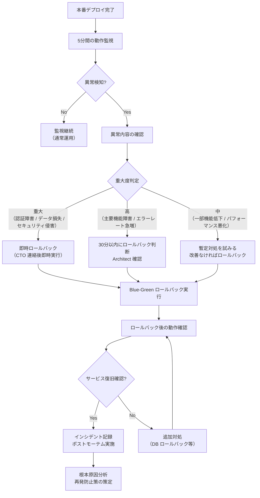

# ロールバック手順（Rollback Procedure）

| 項目 | 内容 |
|------|------|
| 文書番号 | REL-RB-001 |
| バージョン | 1.0.0 |
| 作成日 | 2026-03-25 |
| 最終更新日 | 2026-03-25 |
| 作成者 | DevOps Engineer / Architect |
| ステータス | 承認済み |

---

## 1. ロールバック判断基準

以下のいずれかの条件を満たした場合、即時ロールバックを実施する。

| 判断基準 | 閾値 / 条件 | 検知方法 |
|---------|------------|---------|
| エラーレート急上昇 | 5xx エラーレート ≥ 1% (5分間) | Azure Monitor アラート |
| 重大バグ検知 | 認証バイパス / データ損失 / 重大セキュリティ問題 | Sentry / 手動報告 |
| レスポンスタイム急増 | p95 レスポンスタイム ≥ 1000ms (5分間) | APM アラート |
| サービス停止 | ヘルスチェックエンドポイント失敗が 3回連続 | Azure Monitor |
| データ整合性エラー | DB 整合性チェックエラーの検知 | アプリケーションログ |
| セキュリティ侵害の確認 | 不正アクセスの確認 / 監査ログの異常 | セキュリティ監視 |

---

## 2. ロールバック判断フロー



---

## 3. Blue-Green ロールバック手順（Kubernetes）

### 3.1 ロールバック所要時間目標（RTO）

| 項目 | 目標時間 |
|------|---------|
| **Blue-Green 切戻し（アプリのみ）** | **5分以内** |
| **DB マイグレーションなし** | 5分以内 |
| **DB マイグレーションあり（alembic downgrade）** | 15〜30分以内 |
| **フルロールバック（アプリ + DB + キャッシュ）** | **30分以内** |

### 3.2 ロールバック手順

#### ステップ 1: ロールバック判断と通知

```bash
# 1. 現在の状態確認
kubectl get deployments --namespace=production
kubectl get pods --namespace=production

# 2. 現在稼働中のイメージタグ確認
kubectl get deployment zerotrust-idg-backend-green \
  --namespace=production \
  -o jsonpath='{.spec.template.spec.containers[0].image}'

# 3. 前バージョンのイメージタグ確認（例: v0.14.0）
export PREVIOUS_VERSION="v0.14.0"
export PREVIOUS_IMAGE="ghcr.io/org/zerotrust-idg-backend:${PREVIOUS_VERSION}"
```

#### ステップ 2: トラフィックを Blue（旧バージョン）に切り戻し

```bash
# Blue 環境（旧バージョン）へトラフィックを切り戻す
# 方法 A: ラベルセレクターの変更（推奨）
kubectl patch service zerotrust-idg-backend \
  --namespace=production \
  -p '{"spec":{"selector":{"slot":"blue"}}}'

kubectl patch service zerotrust-idg-frontend \
  --namespace=production \
  -p '{"spec":{"selector":{"slot":"blue"}}}'

# トラフィック切替の確認
kubectl get endpoints zerotrust-idg-backend --namespace=production
kubectl get endpoints zerotrust-idg-frontend --namespace=production

echo "トラフィックを Blue（旧バージョン）に切り戻しました"
```

#### ステップ 3: ヘルスチェック確認

```bash
# Blue 環境のヘルスチェック
curl -f https://prod.zerotrust-idg.example.com/health
echo "ヘルスチェック: $?"

# 主要 API エンドポイント確認
curl -f https://prod.zerotrust-idg.example.com/api/v1/auth/health
echo "認証 API: $?"

# エラーレートの確認（Azure Monitor / Sentry で確認）
echo "エラーレートを Azure Monitor で確認してください"
```

#### ステップ 4: Green 環境（失敗バージョン）の停止

```bash
# Green 環境をスケールダウン（削除はせず保持）
kubectl scale deployment zerotrust-idg-backend-green \
  --replicas=0 --namespace=production

kubectl scale deployment zerotrust-idg-frontend-green \
  --replicas=0 --namespace=production

echo "Green 環境をスケールダウンしました（ログ保全のため削除しない）"
```

#### ステップ 5: ロールバック完了の記録

```bash
# ロールバック完了をインシデントログに記録
echo "$(date -u +%Y-%m-%dT%H:%M:%SZ) ROLLBACK COMPLETED: ${PREVIOUS_VERSION}" >> /var/log/rollback.log

# GitHub Issues にインシデント記録
gh issue create \
  --title "[インシデント] $(date +%Y-%m-%d) 本番ロールバック実施" \
  --body "- ロールバック先: ${PREVIOUS_VERSION}\n- 実施者: ${USER}\n- 実施時刻: $(date -u)\n- 理由: [記載してください]" \
  --label "incident,rollback,P1"
```

---

## 4. DB マイグレーションのロールバック（Alembic）

DB マイグレーションを含むリリースのロールバックは、アプリケーションのロールバックと合わせて実施する。

### 4.1 マイグレーション状態確認

```bash
# 現在のマイグレーションバージョン確認
kubectl exec -it deploy/zerotrust-idg-backend-blue \
  --namespace=production -- \
  alembic current

# マイグレーション履歴確認
kubectl exec -it deploy/zerotrust-idg-backend-blue \
  --namespace=production -- \
  alembic history --verbose
```

### 4.2 Alembic ダウングレード手順

```bash
# 1. DB バックアップ取得（必須）
BACKUP_NAME="rollback-$(date +%Y%m%d-%H%M%S)"
az postgres flexible-server backup create \
  --resource-group rg-zerotrust-idg \
  --name psql-zerotrust-idg \
  --backup-name "${BACKUP_NAME}"

echo "バックアップ作成: ${BACKUP_NAME}"

# 2. アプリケーションを読み取り専用モードに切替（可能な場合）
# または一時的にサービスを停止

# 3. 1バージョン前にダウングレード
kubectl exec -it deploy/zerotrust-idg-backend-blue \
  --namespace=production -- \
  alembic downgrade -1

# 4. 特定のリビジョンにダウングレード（必要な場合）
# kubectl exec -it deploy/zerotrust-idg-backend-blue \
#   --namespace=production -- \
#   alembic downgrade <revision_id>

# 5. ダウングレード後のバージョン確認
kubectl exec -it deploy/zerotrust-idg-backend-blue \
  --namespace=production -- \
  alembic current
```

### 4.3 DB ロールバックの注意事項

| 注意事項 | 内容 |
|----------|------|
| バックアップ必須 | ダウングレード前に必ず DB バックアップを取得する |
| データ損失リスク | カラム削除を含むダウングレードはデータ損失の可能性あり |
| 依存関係の確認 | アプリケーションとDBスキーマのバージョン整合性を確認 |
| ダウングレード定義 | 各マイグレーションに `downgrade()` 関数を必ず実装する |
| テスト実施 | ステージング環境でダウングレードをテストしてから本番実施 |

---

## 5. Redis キャッシュのリセット

ロールバック時に Redis キャッシュの不整合が発生する場合は、以下の手順でリセットする。

```bash
# JWT ブラックリストとセッションキャッシュのリセット
kubectl exec -it deploy/redis --namespace=production -- \
  redis-cli FLUSHDB

# または特定のキーパターンのみ削除
kubectl exec -it deploy/redis --namespace=production -- \
  redis-cli --scan --pattern "session:*" | \
  xargs redis-cli DEL

echo "Redis キャッシュをリセットしました"
echo "ユーザーは再ログインが必要になります"
```

---

## 6. ロールバック後確認手順

ロールバック完了後、以下の確認を実施する。

### 6.1 サービス正常性確認

```markdown
## ロールバック後確認チェックリスト

### 即時確認（ロールバック完了後 5分以内）
- [ ] ヘルスチェックエンドポイント正常応答（HTTP 200）
- [ ] エラーレートが正常範囲に戻ったことを確認（Azure Monitor）
- [ ] レスポンスタイムが正常範囲に戻ったことを確認
- [ ] 認証フローの動作確認（テストアカウントでログイン）

### 機能確認（ロールバック完了後 30分以内）
- [ ] 主要 API エンドポイントの疎通確認
- [ ] ユーザー認証・認可の動作確認
- [ ] 監査ログの正常記録確認
- [ ] DB 接続の正常確認

### セキュリティ確認
- [ ] 不審なアクセスパターンがないことを確認
- [ ] 監査ログに異常記録がないことを確認

### 完了処理
- [ ] インシデントステータスを "解消" に更新
- [ ] チームへの復旧通知
- [ ] GitHub Projects のステータス更新
```

### 6.2 監視強化期間

ロールバック後は 24時間、以下の監視を強化する。

| 監視項目 | 通常閾値 | 強化期間閾値 |
|---------|---------|-----------|
| エラーレート (5xx) | ≥ 1% でアラート | ≥ 0.1% でアラート |
| レスポンスタイム (p95) | ≥ 1000ms でアラート | ≥ 500ms でアラート |
| 認証失敗率 | ≥ 10% でアラート | ≥ 5% でアラート |

---

## 7. ポストモーテム実施事項

ロールバック発生後、**48時間以内**にポストモーテムを実施する。

### 7.1 ポストモーテムテンプレート

```markdown
# ポストモーテム: [インシデント名] (YYYY-MM-DD)

## インシデント概要
- **発生日時**:
- **解消日時**:
- **影響時間**:
- **影響範囲**:
- **インシデントレベル**: P1 / P2 / P3

## タイムライン
| 時刻 | 発生事象 | 対応者 |
|------|---------|--------|
| HH:MM | ... | ... |

## 根本原因（Root Cause Analysis）
<!-- 5 Whys を活用して根本原因を特定 -->

Why 1: なぜ問題が発生したか？
Why 2: なぜ Why 1 が起きたか？
Why 3: なぜ Why 2 が起きたか？
Why 4: なぜ Why 3 が起きたか？
Why 5: なぜ Why 4 が起きたか？（根本原因）

## 影響
- 影響を受けたユーザー数:
- サービス停止時間:
- データ損失:

## 暫定対処
<!-- ロールバックなど即時実施した対処 -->

## 恒久対策
| アクションアイテム | 担当者 | 期限 | Issue |
|-----------------|--------|------|-------|
| ... | ... | ... | #... |

## 学習事項
<!-- 今回のインシデントから学んだこと -->

## 良かった点
<!-- インシデント対応で上手くいったこと -->
```

### 7.2 ポストモーテム実施チェックリスト

```markdown
## ポストモーテム実施チェックリスト

### 準備（インシデント解消後 24時間以内）
- [ ] ポストモーテム担当者の決定
- [ ] 関係者全員への参加招集
- [ ] インシデントログ・監視データの収集

### 実施（48時間以内）
- [ ] タイムラインの再構築
- [ ] 根本原因の特定（5 Whys）
- [ ] 影響範囲の確定
- [ ] 恒久対策の策定（GitHub Issues への登録）

### 完了（72時間以内）
- [ ] ポストモーテム文書の完成
- [ ] 文書をリポジトリに保存（`docs/incidents/`）
- [ ] 恒久対策の優先度付けと実装計画
- [ ] チーム全体への共有（Blame-free な文化）
```

---

## 8. 緊急連絡先

| ロール | 対応範囲 | 連絡優先度 |
|--------|---------|---------|
| DevOps Engineer | インフラ / K8s / デプロイ | 第1連絡先 |
| Lead Developer | アプリケーション / DB | 第2連絡先 |
| Architect | 設計判断 / 重大障害 | 第3連絡先 |
| CTO | 最終判断 / P1 インシデント | P1 発生時即時連絡 |
| Security Engineer | セキュリティ侵害 | セキュリティ関連のみ |

---

## 9. ロールバック演習

**四半期に1回**、以下のロールバック演習を実施する。

| 演習内容 | 実施環境 | 実施頻度 |
|---------|---------|---------|
| Blue-Green 切り替え演習 | ステージング | 四半期 |
| DB マイグレーションロールバック演習 | ステージング | 半期 |
| フルロールバック演習（アプリ + DB + Redis） | ステージング | 年次 |
| 障害シミュレーション（Chaos Engineering） | ステージング | 半期 |

---

## 10. 改訂履歴

| バージョン | 日付 | 変更内容 | 変更者 |
|------------|------|----------|--------|
| 1.0.0 | 2026-03-25 | 初版作成 | DevOps Engineer |
