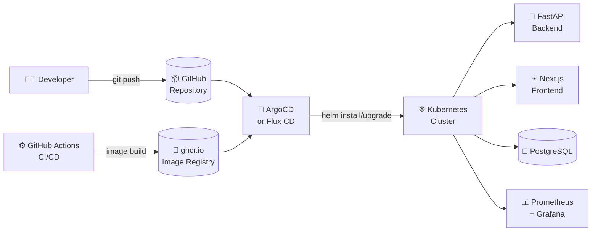

# 🔄 GitOps - ZeroTrust ID Governance

GitOps による自動デプロイ設定ファイル群。
[ArgoCD](https://argo-cd.readthedocs.io/) または [Flux CD](https://fluxcd.io/) を使用して
Git リポジトリを Single Source of Truth とした継続的デリバリーを実現します。

## 📁 ディレクトリ構成

```
gitops/
├── argocd/
│   ├── application.yaml          # 本番環境 ArgoCD Application（main ブランチ）
│   └── application-staging.yaml  # ステージング ArgoCD Application（develop ブランチ）
└── flux/
    └── helmrelease.yaml          # Flux CD GitRepository + HelmRelease
```

## 🚀 ArgoCD を使用する場合

### 1. ArgoCD インストール

```bash
kubectl create namespace argocd
kubectl apply -n argocd -f https://raw.githubusercontent.com/argoproj/argo-cd/stable/manifests/install.yaml
```

### 2. Application デプロイ

```bash
# 本番環境
kubectl apply -f gitops/argocd/application.yaml

# ステージング環境
kubectl apply -f gitops/argocd/application-staging.yaml
```

### 3. 同期確認

```bash
argocd app get zerotrust-id-governance
argocd app sync zerotrust-id-governance
```

## 🔄 Flux CD を使用する場合

### 1. Flux bootstrap（GitHub 連携）

```bash
flux bootstrap github \
  --owner=Kensan196948G \
  --repository=ZeroTrust-ID-Governance \
  --branch=main \
  --path=gitops/flux
```

### 2. HelmRelease 確認

```bash
flux get helmreleases -n zerotrust
flux logs --follow --level=error --namespace=flux-system
```

## 🏗 GitOps アーキテクチャ



## 🔐 Secrets 管理との連携

GitOps では Secrets を Git に含めません。
本プロジェクトでは **External Secrets Operator + Azure Key Vault** を使用します。

```bash
# 本番デプロイ時は externalSecrets を有効化
helm upgrade zerotrust-id-governance ./helm/zerotrust-id-governance \
  --set externalSecrets.enabled=true \
  --set externalSecrets.azureKeyVault.vaultUrl=https://your-vault.vault.azure.net/
```

## 🏢 マルチテナント対応

`global.namespaceOverride` パラメータで複数テナントへの分離デプロイが可能です。

```bash
# テナント A（独立 namespace）
helm install zerotrust-tenant-a ./helm/zerotrust-id-governance \
  --namespace tenant-a --create-namespace \
  --set global.namespaceOverride=tenant-a

# テナント B（独立 namespace）
helm install zerotrust-tenant-b ./helm/zerotrust-id-governance \
  --namespace tenant-b --create-namespace \
  --set global.namespaceOverride=tenant-b
```
